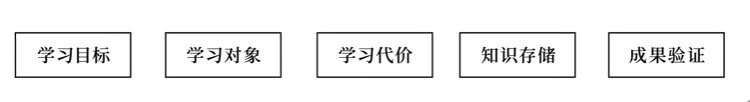

# 断墨寻径

## 目录

*   [Intro](#intro)

    *   *   [问自己几个问题：](#问自己几个问题)

        *   [系列目标：](#系列目标)

*   [01 记忆学习与目标学习](#01-记忆学习与目标学习)

*   [02 指令学习与归纳学习](#02-指令学习与归纳学习)

*   [03 欠拟合和过拟合](#03-欠拟合和过拟合)

    *   *   [拟合](#拟合)

        *   [欠拟合](#欠拟合)

        *   [过拟合](#过拟合)

        *   [双例比较法](#双例比较法)

    *   [04 可泛化性和有效范围](#04-可泛化性和有效范围)

    *   [05 有效实例和有效描述](#05-有效实例和有效描述)

        *   [完整实例和不完整实例](#完整实例和不完整实例)

        *   [描述性材料作为实例](#描述性材料作为实例)

    *   [06 材料瓶颈与模型瓶颈](#06-材料瓶颈与模型瓶颈)

        *   [1. 由材料带来的瓶颈](#1-由材料带来的瓶颈)

        *   [2. 瓶颈的另一成因：固守旧认识](#2-瓶颈的另一成因固守旧认识)

    *   [1-6 总结](#1-6-总结)

    *   [07 存储位置和存储过程](#07-存储位置和存储过程)

        *   [知识存储](#知识存储)

    *   [08 有效训练和精细加工](#08-有效训练和精细加工)

    *   [09 新例预测和表达转述](#09-新例预测和表达转述)

        *   [验证的作用](#验证的作用)

        *   [如何验证](#如何验证)

    *   [10 内容串讲和学习案例](#10-内容串讲和学习案例)

## Intro

#### 问自己几个问题：

*   一个学习方法高效，为什么高效？

*   学会了方法，该什么时候使用，失效的时候，又该怎样调整？

#### 系列目标：

*   学习是什么？

*   讲清楚学习行为的目标，让学生能根据目标设计符合自己的做题方式、学习方式、记笔记方式和听课方式等。

## 01 记忆学习与目标学习

*   **信息**：

    *   含义：描述一个情况

    *   e.g. 2 是偶数

    *   需要「记忆」，目标是「重现」

*   **知识**：

    *   含义：描述同一类问题的所有情况，包括从未提及的新情况

    *   e.g. 所有能被 2 整除的数都是偶数

    *   需要「学习」，目标是「生成」「泛化」

*   学习与记忆

    *   判断一个行为是学习还是记忆，看该行为是否能解决新情况

    *   并不是学习比记忆高级，而是二者有不同的目标

    *   小时候的学习通常需要记忆，但这种方式在后来的学习中不那么适用。高考实际上是一个在有限时间内，比拼泛化能力的游戏

*   **有意义学习**：学习材料 -> 泛化

    **机械记忆**： 学习材料 -> 背诵材料

    在学习范畴中，**机械记忆**指把本应用于泛化的材料记忆下来，使学习材料失去了其用有的意义的行为

## 02 指令学习与归纳学习

*   不同的建构方式（掌握规律的方式）

    #### 指令学习

    *   含义：通过概念、规律、共性的**语言**描述学习

    *   e.g. 看书，记笔记

    *   是学校里最常见的，常见得令人觉得除了这种方式都不叫学习。

    *   实际上，是人脑**最不擅长**的一种建构方式

    #### 归纳学习

    *   含义：通过观察多个实际案例，让大脑自动找到不同实例中的共性，用共性推测从未见过的情况怎么处理

    *   e.g. 如何学会使用遥控器，手机按键的作用

    *   出现的时间非常古老，是人和动物共有的学习方式。归纳学习不需要依赖语语言。

    *   归纳的过程是无意识的，自动的

    <!---->

    *   为什么人类非常擅长归纳学习，却还需要指令学习？

        *   人不可能见过所有情况，容易以偏概全

        *   指令学习更精准，全面，只是不容易理解

        *   指令学习能够 get rig of 直接经验， 能够学习间接知识

    *   指令学习和归纳学习**结合使用**

        *   「指令学习」大致确定规律

        *   「归纳学习」帮助大脑理解和建构规律

        *   对于较难的知识，以「归纳学习为主，指令学习为辅」

        *   指令学习就像绘画时底稿，防止大脑自动归纳的规律偏离客观规律太远；归纳学习就像填充和上色，有底稿会更轻松

        *   e.g. 应试教育，做题，理解定义，再做题，再理解定义，反反复复。而不是背定义，背题。

    *   什么是「**理解**」？

        *   To understand is to perceive patterns. ——Isaiah Berlin

        *   理解即是感知模式。——以赛亚·伯林

        *   模式：可重复的共性

## 03 欠拟合和过拟合

#### 拟合

*   「从旧情况建构一个规律，使这个规律能(尽可能地)符合所有旧情况」的过程叫\*\*「拟合」\*\*

*   旧情况(已见过的情况)也叫\*\*「经验」\*\*

*   拟合不等于学习，拟合可确保重现，不能确保泛化

#### 欠拟合

*   拟合出来的规律连旧情况都无法满足

*   解决方法：足够多的训练

#### 过拟合

*   拟合出来的规律可以满足旧情况，但无法预测新情况，仅仅是以偏概全的局部规律，损失了通用性

*   解决方式：1. 搜集更多经验；2. 增加规律的通用性（奥卡姆剃刀：如无必要，勿增实体），如果拟合出多个规律，选择最简单的规律，是最通用的

<!---->

*   例子：

    *   做题求快求多 -> 欠拟合

    *   做题求每题都牢 -> 过拟合

    *   合适的方法：做完题要总结

#### 双例比较法

*   1 选定知识

*   2 指令学习

*   3 做练习题

*   4 归纳比较：(key)做完两道题后，停下来比较两道题的中该知识点的共性和差异性，同时再去理解知识点的讲解

*   5 测试新题

*   重复 2-5

### 04 可泛化性和有效范围

*   问题：学了很多知识(道理)，却无法应用。（表现：说起来什么都懂，却光说不做）

*   **原因1：有些道理不是知识，知识必须具有可泛化性**

    *   知识付费的“套路”：

        

        *   因为规律是根据所讲故事总结的，所以必然完美拟合故事，听起来很有道理

*   **原因2：知识的可泛化范围是有限的**

    *   知识 $\neq$ 永恒真理，只能确保在特定条件下泛化

    *   e.g. 牛一的限定条件是「某物体所受外力为零」。（牛顿第一定律：任何物体都要保持匀速直线运动或静止状态，直到外力迫使它改变运动状态为止。）

    *   e.g. 经济学的基本假设：理性人假设和完全信息假设

    *   **知识有使用范围和限定条件**

### 05 有效实例和有效描述

*   问题：看不懂书/学习资料，是智商问题吗？

#### 完整实例和不完整实例

*   有因有果，有问有答，这叫完整实例

*   不完整的实例输入，比如，只做题不看答案，只听一段听不懂的听力，不去看意思

#### 描述性材料作为实例

*   要作为有效实例，就需要了解其中每个词的意思

*   如果描述性材料中的专有名词不理解，那这个材料就是无效的

*   中文的特性容易使人直接揣测词语的意思，形成似懂非懂的状态

*   **遇到专有名词，要追溯含义/遇到很多字母的公式，理解每个字母所指代的概念**

### 06 材料瓶颈与模型瓶颈

*   问题：明明都是有效材料，为什么学习却没有提升？

#### 1. 由材料带来的瓶颈

*   瓶颈的出现源于泛化的特性。泛化是通过已见情况预测未见情况。当遇见的材料多了，就更容易遇见重复材料。

*   就像抽卡，持有多了，就更容易抽出重复的。

*   边际效用递减

<!---->

*   学习的**实际案例**

    *   「广义上的学习」定义：学习是指由经验引起的个体知识或行为的相对持久的变化。——伍尔克福教育心理学（第12版）

    *   学习这一知识点，不是背诵下来，而是利用这句话建构一个映射，来判断某个情况是否属于广义上的学习

    

    *   图：绿色属于无意识不好的变化，根据新材料，仍会归为广义上的学习

    *   当一个材料不够时，就需要新的材料

#### 2. 瓶颈的另一成因：固守旧认识

*   对新材料的抗拒带来的瓶颈

*   人的生存依赖于已有的认识，所以必然会保护自己已建构的认识

*   《地穴寓言》，囚徒面对新认知就是愤怒的，认为玷污了现有的“世界”

*   让人接受新认识的解决思路：

    *   **用实例材料来让大脑意识到已有的认识是不足的，解除抗拒**

    *   相对来说，大脑对实例性材料没有描述性材料那么抵触。

    *   \[**苏格拉底式提问**]抛出新情况，让对方用现有认识预测，再展示他的预测不符合实际情况(辩论中常用)

    

### 1-6 总结

### 07 存储位置和存储过程

*   问题：如何顺应大脑的特性学习

#### 知识存储

*   学习与神经细胞间形成的突触有关，但不是突触越多越好

*   大脑建构的规律是由神经细胞所形成的网络实现，网络通过电信号的频率告诉身体怎么做，电信号的频率受神经细胞之间的突触结构所控制，如果突触结构不合适，就无法生成正确的电信号、**总结：在细胞层面，学习相当于让特定的神经细胞形成适合所学任务的正确结构。**

*   形成特定结构需要有效的训练

*   大脑大规模调整结构的时间段正是睡眠期间

*   对于复杂的知识，神经细胞也需要多次迭代来形成一个最合适的(普遍性)结构

### 08 有效训练和精细加工

*   问题：什么是(学习的)有效训练？如何刺激相关神经细胞群？

*   方法

    *   想象和观察：有效

    *   实际执行**并得到结果和反馈**：全面高效，最好的方式(反馈e.g. 对答案)

*   对实例性材料，实际执行并反馈是比较容易的

*   指令性材料: 精细加工

    *   对大脑结构的调整能力并没有实例性材料那么好

    *   尤其是大脑不理解时，遗忘速度非常快

    *   **需要自己扩充实例材料**，比如自己提问自己回答，最好能用来解释周围的现象

    *   「知识不是建立在名字上的」——费曼

    *   「先把书读厚，再把书读薄」——华罗庚

        *   读厚：扩充材料

        *   读薄：建构完成 (误区：读薄可不是说划重点，读薄不是行为，而是一种状态)

    *   (心理学) **精细加工 Elaboration**：举例，建立联系等做法

### 09 新例预测和表达转述

*   问题：经过了有效训练，保证了充足睡眠，学习过程就结束了吗？

*   学习的最后一步：**成果验证**

    

    *   验证的是自己的脑中建构的知识

    *   在细胞层面，「**验证**」相当于给大脑一个反馈信号，告诉大脑不需要再调整结构了

    

#### 验证的作用

*   给大脑反馈

*   确保建构知识是正确的

#### 如何验证

*   如果不能解决新问题，说明所建构的知识没有足够的泛化能力

*   1\. **新例预测**：用实例性材料验证（比较容易）（下图是“身边任意事物”）

    

    *   “做题保持手感”

*   2\. **转换表述**：指令性材料的验证方法

    *   同义转换：用自己的话说

        

    *   「以教促学」即是复习和巩固知识的方法

        *   教别人的时候，举个例子、换句话说，其实就是新例预测和转换表述

        *   这就是为什么教别人学得快

        *   以教促学能够

            *   确保成果正确

            *   给大脑发送信号，巩固知识存储

### 10 内容串讲和学习案例

*   断墨取自「断墨残楮」

*   在经验残缺不全，充满未知的条件下，寻找出通用的模式

*   学习即是对抗未知

