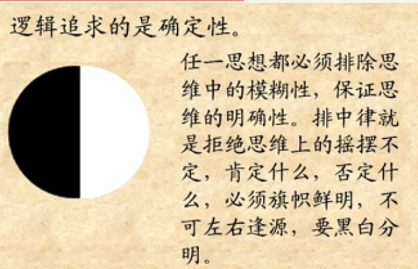
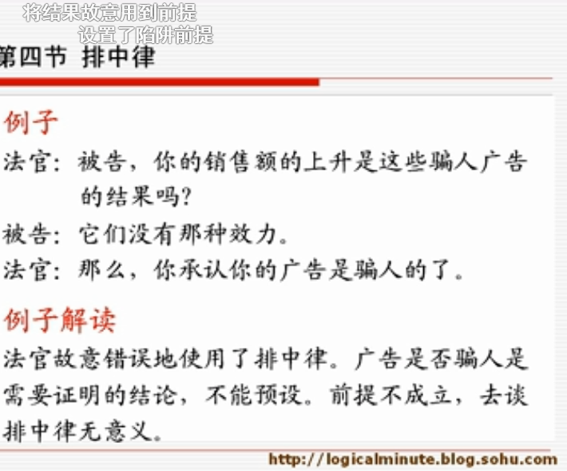
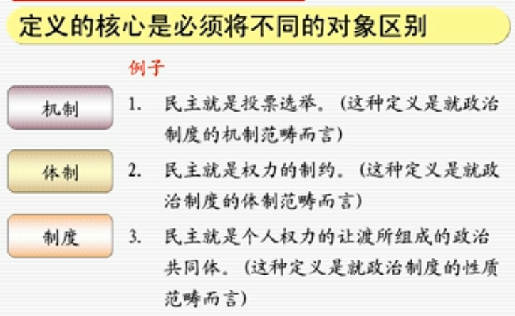

# 十五分钟逻辑学

## 目录

*   [第一章 入门](#第一章-入门)

    *   [什么是逻辑学](#什么是逻辑学)

    *   [什么是逻辑](#什么是逻辑)

        *   [逻辑是：](#逻辑是)

        *   [逻辑 =](#逻辑-)

    *   [什么是逻辑学](#什么是逻辑学-1)

        *   [逻辑学的分类](#逻辑学的分类)

    *   [什么是思维](#什么是思维)

        *   [思维是](#思维是)

        *   [思维的三种类型](#思维的三种类型)

        *   [思维的规律是](#思维的规律是)

        *   [如何理解思维的形式和内容](#如何理解思维的形式和内容)

    *   [如何学习逻辑学](#如何学习逻辑学)

        *   [1、用逻辑去怀疑一切，养成用逻辑思考的自觉意识](#1用逻辑去怀疑一切养成用逻辑思考的自觉意识)

        *   [2、始终记住逻辑追求的是确定性](#2始终记住逻辑追求的是确定性)

*   [第二章 逻辑思维基本规律](#第二章-逻辑思维基本规律)

    *   [概述](#概述)

    *   [同一律](#同一律)

    *   [什么是同一律](#什么是同一律)

    *   [违反同一律的情况：](#违反同一律的情况)

    *   [矛盾律](#矛盾律)

        *   [直接断定导致的矛盾](#直接断定导致的矛盾)

        *   [间接推论导致的矛盾/悖论](#间接推论导致的矛盾悖论)

        *   [辩证法？](#辩证法)

    *   [排中律](#排中律)

    *   [充足律](#充足律)

        *   [什么是充足律](#什么是充足律)

*   [第三章 概念](#第三章-概念)

    *   [概述](#概述-1)

        *   [什么是概念](#什么是概念)

        *   [概念和语词](#概念和语词)

        *   [概念的内涵和外延](#概念的内涵和外延)

    *   [概念间的关系](#概念间的关系)

    *   [明确概念的逻辑方法](#明确概念的逻辑方法)

        *   [明确概念就是明确其内涵和外延](#明确概念就是明确其内涵和外延)

        *   [定义](#定义)

        *   [概念的建立过程](#概念的建立过程)

        *   [划分](#划分)

        *   [限制和概括:明确内涵和外延之间的关系](#限制和概括明确内涵和外延之间的关系)

        *   [概念的种类](#概念的种类)

## 第一章 入门

### 什么是逻辑学

### 什么是逻辑

#### 逻辑是：

*   1\. 指客观事物的规律，如“大自然有其内在的逻辑”

*   2\. 特殊的理论， 如“侵略者奉行的是强盗逻辑”

*   3\. 指**思维的规律，规则**

*   4\. 指逻辑学这门科学

#### 逻辑 =

*   思维的规则、规律、形式、结构……

<!---->

*   \### 语言与逻辑的关系

    *   逻辑离不开语言，思考就如同自己说话。

    *   语言有区域性，但逻辑没有

    *   区分语法错误和逻辑错误

### 什么是逻辑学

*   逻辑学是**研究思维的规律的科学**

*   **目的**: 揭示人脑思维的规律

*   **对象**: 人脑的思维

*   **方法**: 通过研究人类的语言

*   我们在表述的时候可能会省略逻辑结构词（因为……所以，只要……就等），但思考的过程中不会省略

#### 逻辑学的分类

*   **形式逻辑学**

*   **辩证逻辑学**，基于形式逻辑学

### 什么是思维

#### 思维是

*   思维是**人的理性认识**

<!---->

*   理性认识与感性认识或情感体验不同：

    *   感性认识：感知觉、表象

    *   理性认识：概念，判断，推理

    *   情感体验：喜怒哀乐

#### 思维的三种类型

*   **概念**，有实际含义的

*   **判断**，对思维中的某个对象有所断定

*   **推理**，基于一个或一些判断为前提，作出另外的判断

#### 思维的规律是

*   人的大脑对事物的认识活动，是借助概念、判断和推理等思维的形式进行的。

*   **思维的过程**就是运用概念作判断和推理的过程

#### 如何理解思维的形式和内容

*   如果要用逻辑反驳一个观点，首先应该攻击大前提

### 如何学习逻辑学

#### 1、用逻辑去怀疑一切，养成用逻辑思考的自觉意识

*   广告词啊

#### 2、始终记住逻辑追求的是确定性

*   什么是逻辑追求的确定性

    

*   例子

    *   官话里的积极性，主动性，创造性，就没有明确的定义

*   避免**循环定义**，循环定义在逻辑学中是无效定义

*   **循环论证**是无效论

## 第二章 逻辑思维基本规律

### 概述

*   思维/逻辑的三种基本形式：概念、判断、推理

*   三种基本形式的共性，也称为逻辑思维的基本规律：

    *   同一律

    *   矛盾律

    *   排中律

### 同一律

*   原初的定律，另两条定律都是由它推出来的

*   违反同一律：歧义

    

### 什么是同一律

*   **在同一思维过程中，每一思想与其自身必须保持同一**

*   公式：A就是A; A=A

    *   A可以是概念，也可以是判断

*   不能把不同的东西当成同一个，也不能把同一个东西当成不同的

*   同一律保证了思维的确定性

### 违反同一律的情况：

*   转换论题（非故意），偷换论题（故意）

*   转换概念（非故意），偷换概念（故意）

*   把人的认识和物体本身混淆(主观和客观）

    *   错误：人看到颜色，所以物体存在颜色

    

### 矛盾律

*   公式： $A\neq 非A$

*   同一律 = 矛盾律

*   不能既表达肯定，又否定这种肯定

*   什么是**同一思维过程**或**同一确定的前提**

    

#### 直接断定导致的矛盾

*   这是苹果，又不是苹果

#### 间接推论导致的矛盾/悖论

*   上帝万能悖论。

*   **悖论**： 悖论是这样的一类判断，由这一判断的真可以得出它是假的，反之亦然。

#### 辩证法？

### 排中律

*   在两个矛盾的观点中，必有一个是成立的

*   公式： $A或者非A$

*   同一律=矛盾律=排中律，都在保证思维的确定性

*   注意：

    *   排中律针对两个互为矛盾的思想或观点而言

    *   排中律窑能都否定

    *   排中律要求必选其一

如果基于现有的确定前提不能得出相应的确定的结论，就直接说不清楚

排中律解逻辑题黑科技：互为矛盾必有一真

### 充足律

#### 什么是充足律

*   充足律也叫因果律。指**任何判断都必须有充足的理由**

*   充足律认为，任何事物的存在都有其充足根据，任何事物都不能自我解释，没有什么事物是其自身存在的鸢原因

*   语言上表现为：因为所以

<!---->

*   循环论证就是一种违反充足律的论证

## 第三章 概念

### 概述

#### 什么是概念

*   概念是**反映对象本质属性的思维方式**

    *   可以是真实存在的，也可以是想象的

    *   可以被什么思维所思考的对象

*   **本质属性**把一类对象与他类对象区别开来, 但思维中的本质属性不一定就正确反映了客观事物的本质属性

#### 概念和语词

*   概念存在于思维系统，有对应语词

*   语词存在于语言系统，不一定有对应概念

#### 概念的内涵和外延

*   **内涵**：反映概念中对象的本质属性，习惯上称为含义。“是什么含义?”

*   **外延**：具有概念所反映的本质属性的对象。“指的是什么?"

*   例：「人」

    *   内涵：能使用文字符号的动物 （这是人的一个定义）

    *   外延：世界上所有的人

*   \*\*「概念要明确」\*\*就是明确概念的内涵和外延

*   内涵决定外延

*   内涵不同的概念，外延却可能相同：等边三角形和等角三角形

*   只用**内涵和外延都相同**，两个概念才能算作同一个

### 概念间的关系

*   **全同关系**：两个概念的**外延**是全部重合的

*   **从属关系**：一个概念的**外延**包含另一个概念的外延。大的概念叫**属概念**，小的叫**种概念**

*   **交叉关系**：两个概念的**外延**部分重合

*   **全异关系**： 两个概念的**外延**没有任何重合。分为两种：

    *   **矛盾关系**：两个全异的概念的并集等于两者的属概念。

    *   **反对关系**：两个全异的概念的并集不等于两者的属概念。还有其他（中立）概念。

### 明确概念的逻辑方法

#### 明确概念就是明确其内涵和外延

*   三种方法:

    *   **定义**:明确内涵

    *   **划分**:明确外延

    *   **限制和概括**: 明确内涵和外延的关系

#### 定义

*   **定义**由三部分组成:

    *   被定义项(主语)

    *   定义联项(谓语)

    *   定义项(宾语)

*   被定义概念 = 种差+临近的属 (种差加属)

    *   1\. 首先确定被定义概念反映的对象属于哪一个**属**

    *   2\. 把被定义概念和属中的其他比较, 找出被定义概念所反映对象与其他对象之间的差别, 即**种差**. **种差即概念的本质属性**.

    

*   定义的**核心**是必须将不同的对象区别

    

*   定义的**规则**

    *   定义项与被定义项的外延必须相等(同一律)

    *   禁止循环定义

    *   一般用肯定的语句形式

        

    *   不得使用含混的言辞或比喻

#### 概念的建立过程

*   人对外部世界的认识过程，是先认识基本概念，再建立概念体系。基本概念的定义，不能使用其本身的概念，或者其上概念体系的概念，而只能用其外的概念定义，否则必然出现循环定义。

*   比如一个小孩，先认识铅笔，橡皮，再建立文具的概念。也就是从小概念到大概念。

*   比如数学本身的正确性交由**元数学**研究，就是用其体系外的概念。

#### 划分

*   如何得知一个概念的内涵是否被正确定义了？

    *   以此内涵为标准，看看满足此标准的对象是否正确（寻找是否有反例）。

    *   **什么是划分**

        *   把一个大类分为若干小类，小类概念都具有大类概念的属性

        *   划分的标准必须相同

        *   所有小类的外延是大类的外延的Partition(集合划分)

*   亚里士多德《四因说》对西方哲学的划分

    

    *   **唯心主义**主张，物质是源自于心灵，因此只有心灵是真实的。

        *   客观唯心和主观唯心的区别：客观不再强调自己内心就是法则，而是把法则归于自己身外的一个不存在的抽象物体，或者概念

    *   **物理主义**认为，心灵是一种物理现象，由身体组织的运作而产生，提出心身（mindbody）一体论。

#### 限制和概括:明确内涵和外延之间的关系

*   **限制**: 增加内涵则减少外延, 或减少外延则增加内涵, 的两者之间的关系

*   **概括**: 反之

*   外延越大, 内涵越小；外延越小, 内涵越大 (成反比)

*   这种关系叫**反变关系**

#### 概念的种类

*   老师说, 讲这一章, 只是因为所有的逻辑学课本上都会有这一章

*   \### 分类的一般性原则

    *   分类的目的仅仅是源于人的某种需求. 有了标准, 才有所谓的分类.

    *   分类的标准不是唯一的, 但在某一次分类中, 标准必须唯一

    *   不同的分类标准没有什么必然联系

*   \### 概念的种类概述

    *   根据**外延的数量**, 可分为:

        *   **单独概念**, 只有一个对象, 如「黄山」, 「杜甫」

        *   **普遍概念**, 不只一个对象, 如「国家」, 「城市」

    *   根据概念指的是**某类事物还是该类事物以外的事物**, 可分为:

        *   **正概念**, 如「金属」, 「有性繁殖」

        *   **负概念**, 如「非金属」, 「无性繁殖」
