# 南蛮DLC 地名

## 目录

*   [Table of Contents](#table-of-contents)

*   [武陵郡](#武陵郡)

*   [巴郡](#巴郡)

*   [涪陵郡](#涪陵郡)

*   [犍为郡 ](#犍为郡-)

*   [江阳郡](#江阳郡)

*   [南方诸郡](#南方诸郡)

*   [交趾郡](#交趾郡)

*   [九真郡、日南郡](#九真郡日南郡)

## Table of Contents

*   [武陵郡](https://www.wolai.com/nDSCUpQnfZUvEtbH5x13JT#5pac5RhRxsF3UQtcRmzVCx "武陵郡")

*   [巴郡、三巴地区](https://www.wolai.com/nDSCUpQnfZUvEtbH5x13JT#eiA4PL6t4uDqjCdwQEdENE "巴郡、三巴地区")

*   [涪陵郡](https://www.wolai.com/nDSCUpQnfZUvEtbH5x13JT#vVcqgFpzNJndcAyuit9eLL "涪陵郡")

*   [犍为郡](https://www.wolai.com/nDSCUpQnfZUvEtbH5x13JT#iaLwjDdUHvxCe5854yU1pq "犍为郡")

*   [江阳郡](https://www.wolai.com/nDSCUpQnfZUvEtbH5x13JT#sTxzRrC1BgQAaV81MwSBiM "江阳郡")

*   [南方诸郡](https://www.wolai.com/nDSCUpQnfZUvEtbH5x13JT#px3TAHqGiDfRbfxHDXE513 "南方诸郡")

*   [交趾郡](https://www.wolai.com/nDSCUpQnfZUvEtbH5x13JT#eBUDGQGKee4VTjMVhsBLqP "交趾郡")

*   [九真郡、日南郡](https://www.wolai.com/nDSCUpQnfZUvEtbH5x13JT#v7rxQRbYDtgszMiVBU7pKu "九真郡、日南郡")

## 武陵郡

*   治所**临沅**

*   武陵有个叫**汉寿**的县，在东汉相当长时间里是荆州刺史的治所，吴时改成吴寿，晋改回汉寿；（葭萌在蜀汉时期被改名汉寿，晋时改晋寿）

*   **迁陵**在湘西，现保靖东北。2002年保靖里耶镇出土过36000片秦简，里耶在秦朝属迁陵县。

*   **镡成**(xin2)是秦时平定岭南设的军事据点，现湖南靖县附近

*   **充县**，现湖南桑植，贺龙元帅故乡。&#x20;

    溇中澧中蛮指溇水澧水一带的蛮族。

*   **夷道**，现湖北宜都。

*   泰山太守应劭

*   交州刺史朱符

*   武陵蛮的传说里：

    高辛氏是帝喾

*   秦以二十两为镒

*   三代以前分土，自秦汉分人

*   周末始有将军官

*   吴姓自周命氏

## 巴郡

*   巴郡的变迁过程

*   献帝初赵韪提议（华阳国志）

    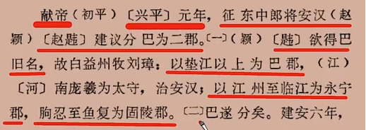

*   （朐忍chun2，意蚯蚓）

    

*   建安五年赵韪造反，刘璋斩之。六年，鱼复的蹇胤又提议改分

    

*   涪陵的谢本又请求划分新郡

    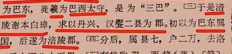

    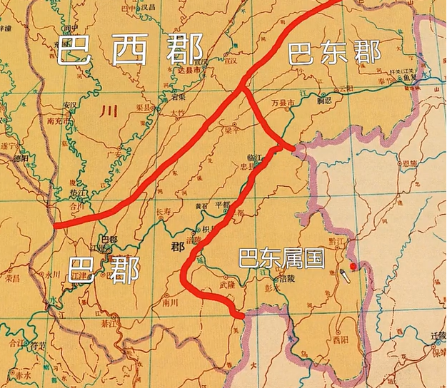

*   刘备入益州时将巴东改成江关都尉，后改固陵。然后又有人不满了要改回巴名。

    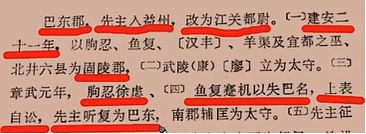

*   蜀汉时巴郡地图：

    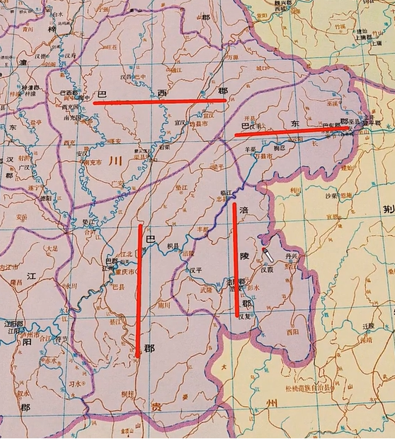

## 涪陵郡

*   据记载，涪陵没有产榨菜，而是产勇士。

## 犍为郡&#x20;

*   qian2

*   治所在现武阳**彭山**，离涪陵郡很远。

*   孝武帝时置犍为郡，时治鳖（现贵州遵义），昭帝时迁僰道（bo2,现四川宜宾），后迁武阳。

    

## 江阳郡

*   建安十八年刘璋置郡，本来是犍为郡的一部分。

*   可考证的县只有三个：**汉安**，**江阳**（现四川泸州），**符节**

    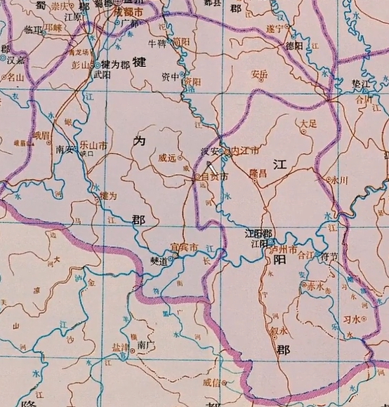

*   **朱提**(shi2,通匙)，前犍为属国的治所，后改朱提郡，今云南昭通

    朱提郡有个县叫堂琅，意为螳螂&#x20;

    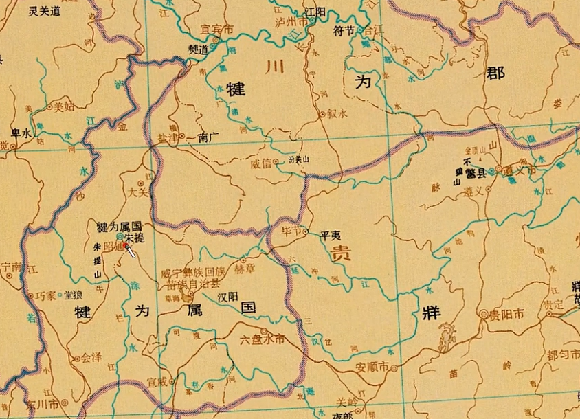

*   平夷，今贵州毕节一带，东汉时属牂牁郡。

## 南方诸郡

*   东汉时南方四郡（**牂牁**郡，**越嶲**xi1郡，**益州**郡，**永昌**郡）

    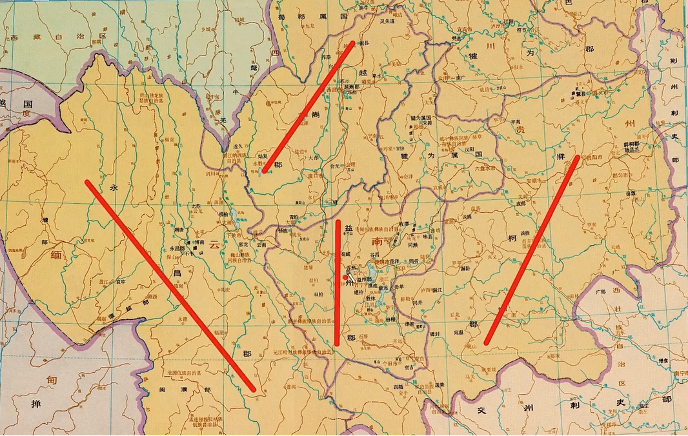

*   建兴三年，诸葛亮征四郡，四郡皆平。改益州郡为建宁郡，分建宁、永昌郡为云南郡，又分建宁，牂牁为兴古郡

    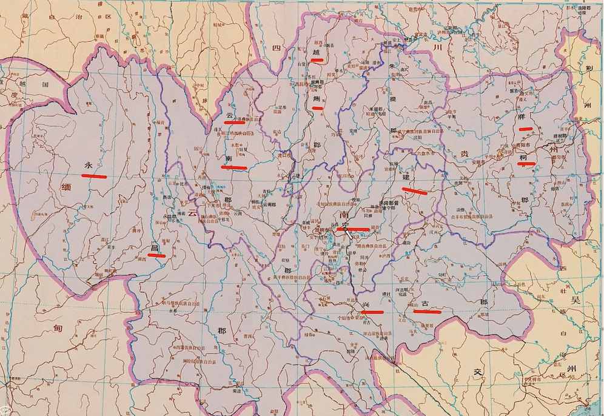

*   云南郡治所**梇栋**，现姚安

*   **青蛉**，现大姚，意为蜻蜓

*   越嶲郡治所**邛都**，现西昌。越嶲夷人数次造反，连杀两任太守，后来太守不敢到郡上上任，只敢住在八百里外的安上县，后来张嶷上任才控制住。

*   益州郡治所**滇池**，现云南晋宁东北边。汉武帝时攻打昆明国，因为滇池的存在，特意在长安挖了一个昆明池模拟水战环境。现在西安还有昆明池的遗址。

*   建宁治所**味县**mei4，今云南曲靖

*   建宁**修云**是三国时期新设的县，现大约在云南弥勒附近。

*   建宁**谈稿**，现云南盘县附近，三国时期撤县，西晋时才重新设立

*   牂牁治所**且兰**，且音沮，汉时叫故且兰，原来是一个叫且兰的部落的地方，大约在现贵州黄平附近

*   牂牁**夜郎**，旧部落名，现在大约在贵州关岭附近

*   牂牁**毋敛**，现在大约在贵州独山附近

*   永昌郡西汉时是没有的，东汉时才新开拓

*   永昌治所**不韦**，现云南保山附近

*   永昌**永寿**，三国或西晋新设

## 交趾郡

*   现越南北部

    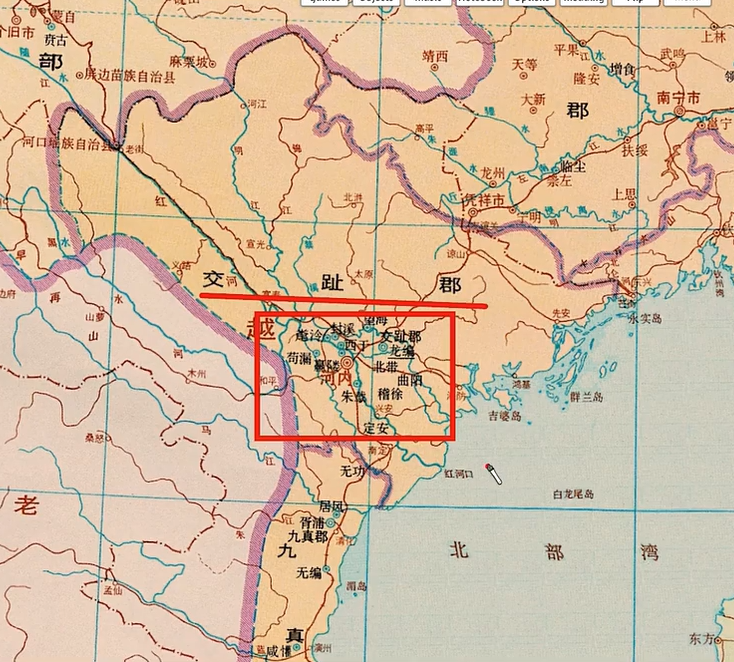

*   治所**龙编**，现河内附近

*   **临尘**，现广西崇左附近，三国时期应属郁林郡

*   **宛温**，宛音yuen1，三国时期应是兴古郡治所，现砚山附近，东晋改名宛暖，避权臣桓温讳。

*   **西随**，现云南金平附近，三国时期应属兴古郡

## 九真郡、日南郡

*   九真治所**胥浦**，现越南清化附近，曾经是越南西都

*   日南治所**西卷**，现越南广治附近

    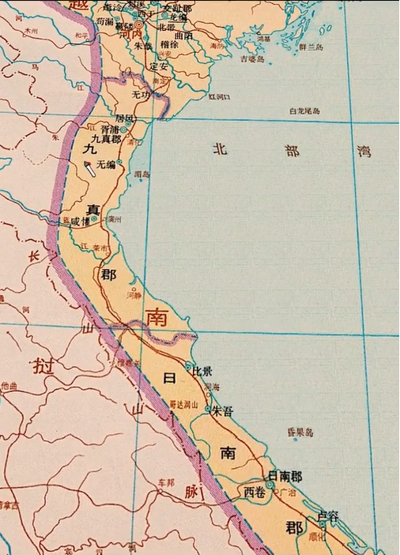
