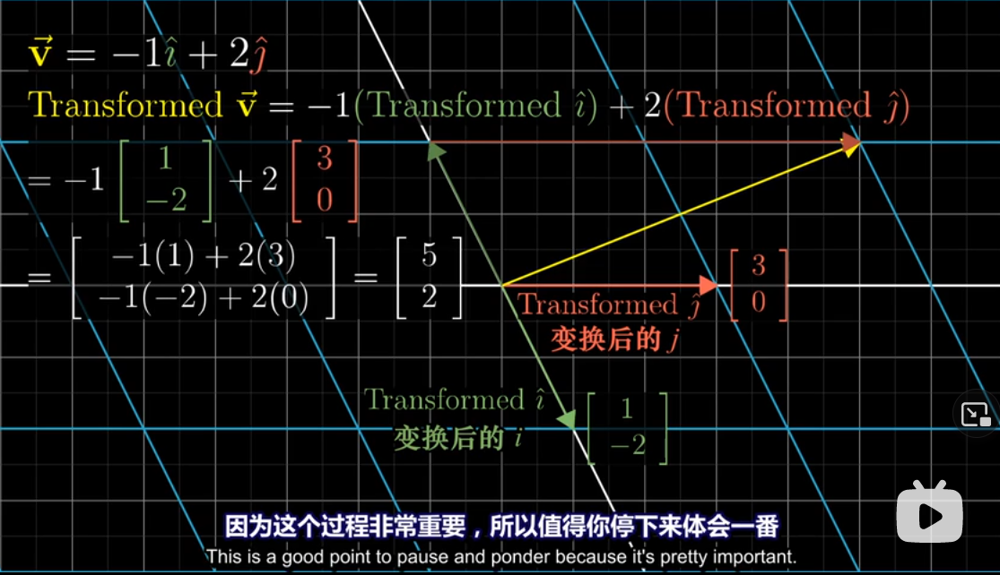
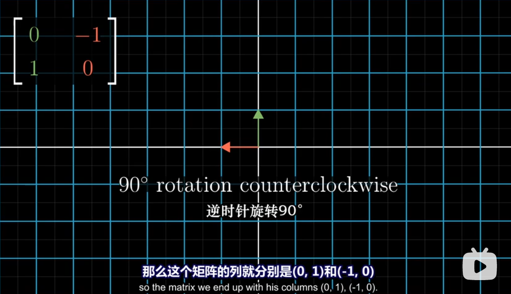
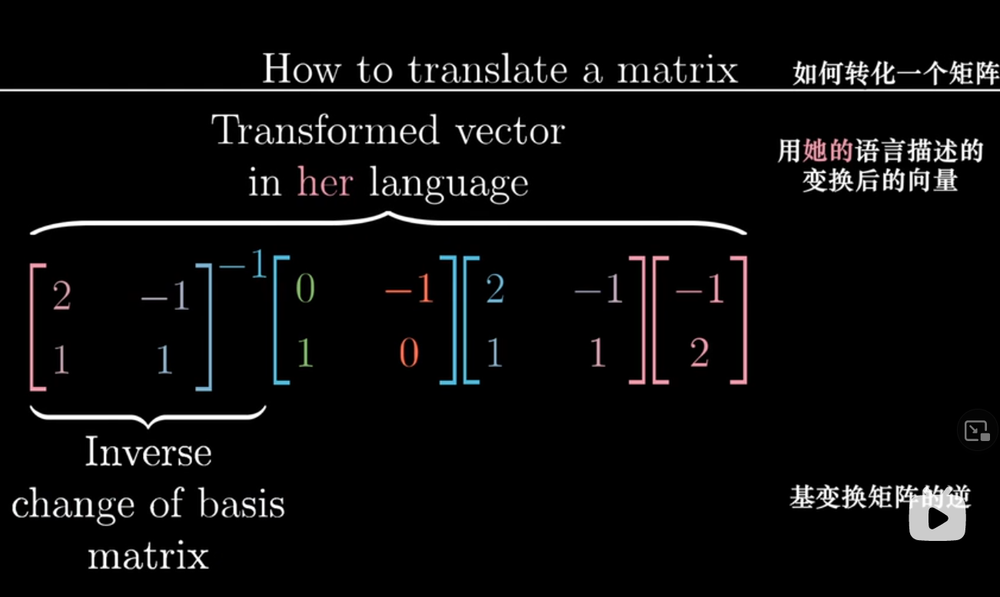

# 线性代数的本质

## 目录

*   [01 - 向量究竟是什么？What exactly a vector is](#01---向量究竟是什么what-exactly-a-vector-is)

*   [02 - 线性组合、张成的空间与基 Linear combinations, span, and bases](#02---线性组合张成的空间与基-linear-combinations-span-and-bases)

*   [03 矩阵如同线性变换 Matrices as Linear transformations](#03-矩阵如同线性变换-matrices-as-linear-transformations)

    *   [Linear transformation](#linear-transformation)

*   [04 矩阵乘法与线性变换复合 Matrix multiplication as composition](#04-矩阵乘法与线性变换复合-matrix-multiplication-as-composition)

*   [附注1 三维空间中的线性变换 Linear transformations in three dimensions](#附注1-三维空间中的线性变换-linear-transformations-in-three-dimensions)

*   [05 行列式 The determinant](#05-行列式-the-determinant)

*   [06 逆矩阵，列空间，秩与零空间 Inverse matrices, column space, rank and null space](#06-逆矩阵列空间秩与零空间-inverse-matrices-column-space-rank-and-null-space)

*   [附注2 非方阵 Nonsquare matrices](#附注2-非方阵-nonsquare-matrices)

*   [07 点积与对偶性 Dot products and duality](#07-点积与对偶性-dot-products-and-duality)

*   [08 以线性变换的眼光看叉积 Cross products in the light of linear transformations](#08-以线性变换的眼光看叉积-cross-products-in-the-light-of-linear-transformations)

*   [09 基变换 Change of basis](#09-基变换-change-of-basis)

*   [10 特征向量与特征值 Eigenvectors and eigenvalues](#10-特征向量与特征值-eigenvectors-and-eigenvalues)

*   [11 抽象向量空间 Abstract vector spaces](#11-抽象向量空间-abstract-vector-spaces)

## 01 - 向量究竟是什么？What exactly a vector is

*   （在坐标轴里，物理学角度），向量是沿着某个特定方向的运动。这就可以解释两个向量相加为什么是头尾相连。

*   向量数乘被称作 **scaling** 缩放，而用于缩放的数字称为 **scalars** 标量。

*   线性代数围绕两种基本运算：向量加法和向量数乘

## 02 - 线性组合、张成的空间与基 Linear combinations, span, and bases

*   另一个视角：把向量看成标量 $\hat{\imath}, \hat{\jmath}$ 的延伸（伸展）

    *   $\hat{\imath}$ 是\[1,0], $\hat{\jmath}$ 是 \[0,1]，两者是**基向量**, basis vectors

*   如果选择两个新的基向量（两个基向量要不在一条线是上）（也不能的是零向量）

*   给定向量的**张成空间span**, 即给定向量通过线性组合( $a\vec{v} + b\vec{w}$ )能形成的向量的集合

    *   换句话说，通过对给定向量的向量加法和向量数乘能得到的向量集合

*   三维空间中两个不共线的向量的张成空间是一个平面，而三个不共面的向量的张成空间整个三维空间

*   **线性相关(linear dependent)** 的向量指的就是二维共线或者三维共面的向量，他们不能张成更多的空间，是多余的

*   **线性无关(linear independent)** 的向量能够张成空间添加新的维度

*   向量空间的一组**基(basis)是**张成该空间的一个**线性无关**向量集

## 03 矩阵如同线性变换 Matrices as Linear transformations

### Linear transformation

*   **transformation** -> function

*   input-output relation

*   "transformation" for movement: move input vector to output vector

*   **linear**: line remains line, without curves; origin remains fixed. -> Grid lines remain parallel and evenly spaced(保持平行并等距分布)

*   线性变换实际上是改变基向量

<!---->

*   线性的(准确)定义

    

    

*   一个 2x2 矩阵实例

    *   已知 $\vec{v} = \left\[ \begin{array}{c} -1 \ 2 \end{array} \right]$ , 即 $\vec{v} = -1\hat{\imath} + 2\hat{\jmath}$

    *   应用线性变换 $\hat{\imath} = \left\[ \begin{array}{c} 1 \ -2 \end{array} \right], \hat{\jmath} = \left\[ \begin{array}{c} 0 \ 3 \end{array} \right]$

    *   则此时 $\vec{v} = -1\hat{\imath} + 2\hat{\jmath} = -1\left\[ \begin{array}{c} 1 \ -2 \end{array} \right] + 2\left\[ \begin{array}{c} 0 \ 3 \end{array} \right] = \left\[ \begin{array}{c} 5 \ 2 \end{array} \right]$

    *   写成矩阵计算就是 $\left\[ \begin{array}{cc} 1 & 3 \ -2 & 0 \end{array} \right] \ \left\[ \begin{array}{c} -1 \ 2 \end{array} \right] = \left\[ \begin{array}{c} 5 \ 2 \end{array} \right]$

    

    

*   所以你可以很容易地看出旋转

    

    

*   行和列的线性相关也很容易想象

    

## 04 矩阵乘法与线性变换复合 Matrix multiplication as composition

*   两个矩阵相乘可以看作两次连续的线性变换

    *   如果两个线性变换组合的效果和一个线性变换的效果相同

    *   那么这两个线性变换的矩阵相乘等与另一个线性变换的矩阵

    *   变换的顺序是从右往左

        

        

*   **矩阵乘法满足结合律**：线性变换的顺序不会影响结果

## 附注1 三维空间中的线性变换 Linear transformations in three dimensions

## 05 行列式 The determinant

*   线性变化后，某一特定区域的面积如何变化？

    *   行列式的值就是面积变化的倍数

    *   或者说，一个 m行n列的行列式，计算的是 n个m维向量围成的空间大小

*   想知道**行列式的值是否为0**，只要看是否线性相关（二维的时候面积为0，三维的时候体积为0）

*   如果行列式的值出现**负数**，说明整个空间被翻转过了(The Orientation has been reversed)

*   Parallelepiped 平行六面体

*   三维中的正方向需要用到右手定则：食指 $\hat{\imath}$ , 中指 $\hat{\jmath}$ , 拇指 $\hat{k}$

*   行列式计算公式**理解**

    *   如果 b, c 都为 0，放大的倍数就像计算正方形

        

    *   如果只有 b 为 0，平行四边形的计算公式还是一样的

        

    *   如果你想思考全不为0

        *   下面的行列式即是在计算黄色部分的面积

        

    *   平行六面体的体积

        

    *   行列式的**计算**

        

## 06 逆矩阵，列空间，秩与零空间 Inverse matrices, column space, rank and null space

*   高斯消元法 Gaussian elimination

*   行阶梯型 Row echelon form

*   **线性方程组** Linear system of equations

    *   $A\vec{x} = \vec{v}$ 的含义：寻找一个未知向量 $\vec{x}$ , 使得 向量 $\vec{x}$ 在经过矩阵 $A$ 的线性变换后，与向量 $\vec{v}$ 重合

    

    *   因此，如果矩阵的秩小于列数，或者行列式等于0（相当于线性变换会导致降维），这个线性方程组是无解的

    *   所以： $\det(A) \neq 0$ -> $A^{-1}\ exists$ , 没有逆矩阵的矩阵就是降维了

        *   但 $\det(A) = 0$ 时依然可能有解，这是因为向量 $\vec{v}$ 刚好就落在降维后的空间里

        

*   **逆矩阵**就是逆向的线性变换

    *   比如说顺时针旋转90度的逆矩阵就是逆时针旋转90度

*   **秩**

    *   秩：输出空间的维数。一个n维矩阵最大的秩是n，这时称这个矩阵满秩(full rank)

    *   rank 1 = line, rank 2 = plane, rank 3 = space

*   **列空间**

    *   列空间 Column space <=> 列张成的空间 span of columns

    *   秩更精确的定义是列空间的维数

    *   零向量一定在列空间中，因为原点fixed

*   零空间

    *   \= Null space = 核 Kernel

    *   变换后落在原点的向量集合，被称为矩阵的**零空间**或**核**

    *   $A\vec{x} = \vec{v}$ 中，如果 $\vec{v}$ 是零向量，那零空间就是 $\vec{x}$ 的所有解

## 附注2 非方阵 Nonsquare matrices

*   非方阵，比如3x2矩阵，就是把二维的两个基向量，转转两个三维基向量

## 07 点积与对偶性 Dot products and duality

*   几何解释

    *   将 $\vec{w}$ 投影在 $\vec{v}$ 所在的直线，将 $\vec{w}$ 的投影长度与 $\vec{v}$ 的长度相乘

    

    *   所以当两个向量垂直时，点积是0

*   Scaling 对点积的影响是线性的

*   矩阵向量乘积与点积的关系

    *   将二维向量投射到数轴上，数轴的基向量是 $\hat{u}$

    

    

*   **对偶性 Duality**

    *   super tricky to define

    *   自然而出乎意料的对应关系

    *   每当你看到一个（多维）空间到数轴的线性变换时，它都与那个空间的唯一的向量相关

## 08 以线性变换的眼光看叉积 Cross products in the light of linear transformations

*   正方向

    *   乘号右边的向量在左边的向量的逆时针方位时得到的面积为正

    

    *   这个式子计算出的面积也等同于将两个向量列成2x2矩阵，计算行列式得到的值

*   **真正的叉积**是通过两个三维向量生成一个新的三维向量

    

*   用行列式计算叉积

    

    

*   理解这个变换

    

    *   将第一个向量看成变量，得到一个**线性**函数

    

    *   找到一个 $\vec{p}$ , 使得

    

*   我们找到的这个 $\vec{p}$ , 在看起来是这样的，垂直于 $\vec{v}$ 和 $\vec{w}$ 形成的平面。将向量变量(白)投影到 $\vec{p}$ 所在的直线上，就能计算这个平行六面体的体积

## 09 基变换 Change of basis

*   如何转化两个基向量不同的坐标系统

    *   我们用了标准基向量，Jennifer: $\hat{\imath} =\left\[ \begin{array}{c} 2 \ 1 \end{array} \right], \hat{\jmath} = \left\[ \begin{array}{c} -1 \ 1 \end{array} \right]$

    

    *   向要反过来就求这个矩阵的逆矩阵

*   旋转90度如何转化给另一个坐标系统

    *   在自己的坐标上逆时针旋转90度，也就是乘上 $\left\[ \begin{array}{cc} 0&-1 \ 1&0 \end{array} \right]$

    *   需要

        *   用我们的语言描述对方的坐标系统

        *   应用变换矩阵

        *   用对方的语言描述这个结果

        

    *   前三个矩阵相乘，可以看做直接应用的函数/变换矩阵

*   表达式 $A^{-1}MA$ 按时了一种数学上的转移作用

    

## 10 特征向量与特征值 Eigenvectors and eigenvalues

*   要求基础知识牢固

*   向量在空间变换后通常会离开它原本张成的空间

*   特殊的向量不会离开，如 $\hat{\imath}$

*   矩阵的**特征向量**，就是这些特殊向量，在变换之后不离开原本张成的直线。特征向量不一定存在

*   **特征值**，就是特征向量在变换中拉伸或压缩比例的因子，可以为负

*   三维空间中，特征向量就是变换的旋转轴

    *   旋转的特征值必定为1

    *   说绕着某某向量旋转多少度，比给出一个旋转的变换矩阵，直观得多

*   求矩阵 $A$ 的特征向量和特征值

    *   即求解 $\lambda$ 和 $\vec{v}$ ,使下面这个等式成立

    

    

    

    *   $\vec{v}$ 非零，所以需要找一个特征值 $\lambda$ , 使行列式为0，也就是将空间降维

    

    

*   **特征基**，基向量也是特征向量，这时候计算很容易。因为都是缩放操作，变换矩阵是对角矩阵

## 11 抽象向量空间 Abstract vector spaces

函数也可以看作向量乘法 - 比如一个 xxx 的多项式，选定关于 xxx 的基函数为 b0(x)=1b\_0(x) = 1b0(x)=1, b1(x)=xb\_1(x) = xb1(x)=x, b2(x)=x2b\_2(x) = x^2b2(x)=x2, ... - 然后以系数为变量，基函数为基向量

函数的**空间性**: 比如上一个例子中，当前空间就是全体多项式

求导(derivative) 是线性运算

把求导运算转换成矩阵(线性变换)是这样的

*   **向量是什么**：如果要让已经建立和的理论和概念适用于一个向量空间，那么它必须满足八条公理

    

    问向量是什么就好像问数字3是什么一样
