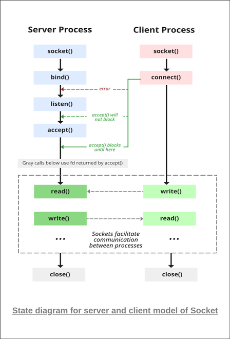

# sysprak 练习

## 目录

*   [getopt](#getopt)

*   [文件读写](#文件读写)

*   [fork 和 pipe](#fork-和-pipe)

*   [Shared Memory](#shared-memory)

*   [Semaphor](#semaphor)

*   [Signal](#signal)

*   [Socket](#socket)

    *   *   [建立 socket](#建立-socket)

        *   [bind](#bind)

        *   [listen](#listen)

        *   [accept](#accept)

        *   [connect](#connect)

        *   [send & recv](#send--recv)

*   [常见坑](#常见坑)

*   [综合练习](#综合练习)

## getopt

*   unistd.h, stdlib.h

*   char \*argv\[]

*   while((ret = getopt(argc, argv, "f:i:v:")) != -1)

*   optarg

```c
#include<stdio.h>
#include<stdlib.h>
#include<unistd.h>

int main(int argc, char* argv[]) {
    int ret;

    while((ret = getopt(argc, argv, "f:i:v:")) != -1) {
        switch (ret) {
            case 'f':
                printf("case f: %f\n", atof(optarg));
                break;
            case 'i':
                printf("case i: %d\n", atoi(optarg));
                break;
            case 'v':
                printf("case v: %s\n", optarg);
                break;
            default:
                fprintf(stderr, "Usage: %s [-f float] [-i integer] [-v string]\n", argv[0]);
                exit(EXIT_FAILURE);
        }
    }
    return 0;
}

```

## 文件读写

```c
FILE *fp = NULL;
if ((fp=fopen(filename,"r")) == NULL) { 
  printf("Error when reading file!\n");
}

char line[256];
  while(fgets(line, 256, fp) != NULL) {
  float temp;
  sscanf(line, "%f\n", &temp);
  // ...
}

fclode(fp);
```

// fgets如果这个函数在读取最后一个字符之前 遇到一个换行符 '\n' 或文件的末尾 EOF，则只会返回读取到的字符，包括换行符。

写入

```c
fprintf(fp, "This is testing for fprintf...\n");
fputs("This is testing for fputs...\n", fp); 

```

read-conf.c

```c
#include<stdio.h>
#include<stdlib.h>
#include<string.h>

void trim(char* s) {
    int n = strlen(s);
    int i = 0, j = 0;
    while (i < n) {
        if (s[i] != ' ' && s[i] != '\n') { // 记得换行符
            s[j] = s[i];
            j++;
        }
        i++;
    }
    s[j] = '\0';    // 记得最后的结束符
}

int locate_eq(char* s) {
    int n = strlen(s);
    int i = 0;
    while (i < n) {
        if (s[i] == '=') {
            return i;
        }
        i++;
    }
    return -1;
}

int main(void) {
    FILE* fp = NULL;
    if ((fp = fopen("a.conf", "r")) == NULL) {
        fprintf(stderr, "fopen");
    }

    char line[256];
    while (fgets(line, 256, fp) != NULL) {
        int pos = locate_eq(line);
        if (pos < 0) {
            continue;
        } else {
            char key[256] = "", val[256] = "";
            strncpy(key, line, pos);
            strncpy(val, line+pos+1, strlen(line)-pos-1);
            trim(key);
            trim(val);
            printf("%s = %s\n", key, val);
        }
    }
    return 0;
}

```

## fork 和 pipe

```c
int fd[2];
pipe(fd);
  
pid_t pid;
pid = fork(); // parent: pid=child的pid; child: pid=0

close(fd[0]); // 不用哪个关哪个

write(fd[1], "123", 3); // 返回值为成功写入的字符数 ssize_t
waitpid(pid, NULL, 0); // 错误时小于0

n = read(fd[0], string, 3);  // 返回成功读取的字符数

```

```c
#include<stdio.h>
#include<stdlib.h>
#include<sys/wait.h>
#include<unistd.h>

int main(void) {
    char origin[256] = "hello";

    int fd[2];
    pipe(fd);

    pid_t pid = fork();

    if (pid > 0) {
        // parent
        printf("parent: getpid(): %d\n", getpid());
        printf("parent: pid: %d\n", pid);

        close(fd[1]);
        waitpid(pid, NULL, 0);
        int n = read(fd[0], origin, 256);
        printf("parent: %d characters read.\n", n);
        printf("%s\n", origin);
    } else {
        // child
        printf("child: getpid(): %d\n", getpid());
        printf("child: pid: %d\n", pid);

        close(fd[0]);
        int n = write(fd[1], "world", 256);
        printf("child: %d characters written.\n", n);
    }
    return 0;
}

/*
parent: getpid(): 612
parent: pid: 613
child: getpid(): 613
child: pid: 0
child: 256 characters written.
parent: 256 characters read.
world
*/
```

*   可能出现的库

    \#include \<stdio.h>

    \#include \<stdlib.h>

    \#include \<stdbool.h>

    \#include \<unistd.h>

    \#include \<sys/wait.h>

    \#include \<sys/types.h>

    \#include \<fcntl.h>

    \#include \<stdlib.h>

    \#include \<limits.h>

    \#include \<math.h>

## Shared Memory

*   每个 shm 有一个shmid

*   man 2

```c
int shmget(key_t key, int size, int flag);
void *shmat(int shmid, const void *shmaddr, int shmflg);
int shmdt(const void *shmaddr);
int shmctl(int shmid, int kommando, struct shmid_ds *buf);

```

```c
if((shmid = shmget (IPC_PRIVATE, SHM_SIZE, 0644 | IPC_CREAT)) == -1) {
  perror("shmget");
}

ginfo = shmat(game_shmid, 0, 0);
if (ginfo == NULL) {
  perror("shmat ginfo: ");
}

shmdt(ginfo);
shmctl(game_shmid, IPC_RMID, 0);

```

下面是两个文件读取struct的实例

```c
/*
    shm-write.c
*/
#include<stdlib.h>
#include<sys/shm.h>
#include<sys/ipc.h>
#include<unistd.h>
#include<string.h>
#include<stdio.h>

struct shm_message {
    // 结构里的string用数组
    char message[256];
    int id;
};

int main(void) {

    char stra[100] = "hello";
    int shmid = shmget(IPC_PRIVATE, 256, 0644 | IPC_CREAT);

    // 保存结构体的时候，也可以直接在内存修改，也可以用一个非指针的结构体处理完后 指针复制一份保存
    // shmat() 返回 void*
    struct shm_message* written = shmat(shmid, 0, 0);
    memcpy(written->message, stra, strlen(stra));
    written->id = shmid;

    printf("shm written.\nmessage: %s, id: %d\n", written->message, written->id);
    
    shmdt(written);
    if (getchar() == '\n') {
        shmctl(shmid, IPC_RMID, 0);
    }
    return 0;
}
```

```c
/*
    shm-read.c
*/
#include<stdlib.h>
#include<sys/shm.h>
#include<sys/ipc.h>
#include<unistd.h>
#include<string.h>
#include<stdio.h>

struct shm_message {
    char message[256];
    int id;
};

int main(void) {
    int shmid = 10;

    struct shm_message* shm = shmat(shmid, 0, 0);
    if (read == NULL) {
        perror("shmat read");
    }

    // 读取的结构体指针有数组的话，新建一个结构体复制一个副本来读取会比较好
    struct shm_message read = *shm;
    printf("shm read.\nmessage: %s, id: %d\n", read.message, read.id);

    shmdt(shm);

    shmctl(shmid, IPC_RMID, 0);

    return 0;
}
```

## Semaphor

*   semget, semctl, semop

```c
struct sembuf {
  short sem_num;
  short sem_op;
  short sem_flg;
}

```

```c
#include<stdio.h>
#include<stdlib.h>
#include<unistd.h>
#include<sys/ipc.h>
#include<sys/sem.h>
#include<sys/types.h>

#define NSEMS 3

int main(void) {
  int id;
  id = semget(IPC_PRIVATE, NSEMS, 0770 | IPC_CREAT);
  
  // initiate
  unsigned short init[NSEMS];
  int i;
  for (i = 0; i < NSEMS; i++) init[i] = 1;
  semctl(id, NSEMS, SETALL, init);

  // read value
  unsigned short out[NSEMS];
  semctl(id, NSEMS, GETALL, out);
  printf("%i, %i\n", out[0], out[1]);

  // operate
  struct sembuf sops[2]; 
  sops[0].sem_num = 0;
  sops[0].sem_op = -1;
  sops[0].sem_flg = 0;
  sops[1].sem_num = 0;
  sops[1].sem_op = 1;
  sops[1].sem_flg = 0;
  semop(id, &sops[0], 1);  // id, 进行的操作， 操作有几个(不是数组填1)

  // read value
  semctl(id, NSEMS, GETALL, out);
  printf("%i, %i\n", out[0], out[1]);

  // release
  semctl(id, NSEMS, IPC_RMID, 0);
  return 0;
}

```

## Signal

<https://wangdoc.com/clang/lib/signal.h.html>

```c
// = void (*func)(int); 一个参数为int的函数指针
typedef void (*sighandler_t)(int);

sighandler_t signal(int signum, sighandler_t handler);
```

```c
int kill(pid_t, pid, int sig); // send signal to any process group
int raise(int sig); // 给正在运行的程序发出信号
// raise(signr); == kill(getpid(), signr);
```

```c
// sigaction - examine and change a signal action 
struct sigaction {
  void  (*sa_handler)();  // Handler的地址，SIG_IGN, SIG_DFL
  sigset_t sa_mask;
  int sa_flags;
};

int sigaction(
  int sig,
  const struct sigaction *restrict act,
  struct sigaction *restrict oact);

```

实例

```c
// THINKER SIDE
// changeSIGUSR1 - change the sighandler of SIGUSR1
int changeSIGUSR1(void (*sigHandler)) {
    struct sigaction act;
    act.sa_handler = sigHandler;
    sigemptyset(&act.sa_mask);
    act.sa_flags = 0;
    if ((sigaction(SIGUSR1, &act, NULL))  < 0) {
        perror("Error: ");
        return -1;
    }
    return 0;
}

void sigusr1Handler(void) {
    think();
}

// CONNECTOR SIDE
int sendSignalToThinker(pid_t thinker_pid) {
    return kill(thinker_pid, SIGUSR1);
}

```

## Socket

*   流程

    

*   例

    [https://www.cnblogs.com/wwha/p/5574535.html?ivk\_sa=1024320u](https://www.cnblogs.com/wwha/p/5574535.html?ivk_sa=1024320u "https://www.cnblogs.com/wwha/p/5574535.html?ivk_sa=1024320u")

*   坑

    `recv: Transport endpoint is not connected`  recv 的第一个参数是accept到的sock

    `recv: Socket operation on non-socket` accept函数的圆括号
    [https://blog.csdn.net/qq\_38211852/article/details/77163251](https://blog.csdn.net/qq_38211852/article/details/77163251 "https://blog.csdn.net/qq_38211852/article/details/77163251")

```c
#include <sys/socket.h>     // socket
#include <netdb.h>          // host
#include <arpa/inet.h>      // Port/addr
```

#### 建立 socket

```c
// 原型
int socket(int domain, int type, int protocol);
```

```c
int sock = socket(AF_INET, SOCK_STREAM, 0)
// SOCK_STREAM/SOCK_DGRAM 
// 似乎UDP通信要 SOCK_DGRAM 否则会出现 recv 时Transport endpoint not connected.
```

#### bind

`sin_addr.s_addr` = SERVER\_IP / INADDR\_ANY

`inet_addr(char* ip)`

`htons(int port)`

```c
// 结构原型
struct sockaddr_in {
  short sin_family;
  unsigned short sin_port;
  struct in_addr sin_addr;
  char sin_zero[8];  // bzero(&(serveraddr.sin_zero),8); 可不管
};
// 函数原型
int bind(int sockfd, const struct sockaddr *addr, socklen_t addrlen);
```

```c
struct sockaddr_in server;
server.sin_family = AF_INET;
server.sin_port = htons(port_num); // htons 改变字节方式 host to network short
server.sin_addr.s_addr = inet_addr(char_array_ip); // inet_addr(char* ip)

```

```c
// server端 接受任意地址
address.sin_family = AF_INET;
address.sin_addr.s_addr = INADDR_ANY;
address.sin_port = htons(PORT);
bind(sock, (struct sockaddr *) &server, sizeof(server));
```

#### listen

```c
// 函数原型
int listen(int sockfd, int backlog);
```

```c
listen(socket, 5);
```

#### accept

server使用，返回的是client的socket

```c
// 原型, 注意长度是要(int*)参数转(socklen_t*)
int accept(int sockfd, struct sockaddr *addr, socklen_t &addrlen);
```

```c
struct sockaddr_in client;
int fd, client_len;
client_len = sizeof(client);
fd = accept(sock, (struct sockaddr *) &client, (socklen_t*) &client_len);
```

#### connect

```c
// 0 success, -1 error
int connect(sock, (struct sockaddr *)&server , sizeof(server));

```

#### send & recv

server使用recv 要用accept 到的socket

```c
// 原型
ssize_t send(int sockfd, const void *buf, size_t len, int flags);
ssize_t recv(int sockfd, void *buf, size_t len, int flags);
// 返回成功的字节数，或者-1
```

```c
char send_buf[256] = "message";
send(socket, send_buffer, strlen(send_buffer), 0);
```

```c
char recv_buf[256] = "";
recv(socket, recv_buffer, RECV_WINDOW, 0);
```

## 常见坑

通用：

*   圆括号不对，尤其是if里面

*   字符串没有初始化导致有杂数据

*   要修改的字符串，用字符串数组，segmentation fault 常常是因为改写了字符串指针里的常量

*   结构体带struct

getopt:

*   `case '?'`  case 接char 单引号

file:

*   fopen的mode参数 双引

*   \[trim] 记得匹配换行符，记得最后加`\0`

shm: 我的习惯是 建一个相同的副本，而不是直接改shm

semaphor:

*   设置sem用的数组是unsigned short

*   sops.sem\_xx

signal:

*   signal不处理就不会进行下一个操作，所以自定义sig别忘了改handler

*   sigemptyset(\&act.sa\_mask);

*   act.sa\_xx

*   父程序给子程序发signal 自己也会收到/所以收到两次信号的话，看看是不是弄反了

socket:

*   recv 的第一个参数是accept到的sock

*   accept最后一个参数是 (socklen\_t \*)

*   struct sockaddr\_in server;

*   服务器收发消息函数用的是acc到的sock

## 综合练习

*   1\. rand, shm, pipe, fork, socket, signal

    ```c
    /**
     *      prac.c
     *      
     *      综合练习
     *      1. server 将随机生成的 magic number 保存到 shm, 用 pipe 将shmid 传递给 client. 
     *          完成后准备接受 client 的连接
     *      2. client 连接 server,将读取到的 magic number 通过 tcp 发送回服务器。
     *      3. server 收到后验证 magic number，等待 client 结束后结束程序。
     *
     */

    #include<stdio.h>
    #include<stdlib.h>
    #include<string.h>
    #include<netdb.h>
    #include<sys/ipc.h>
    #include<sys/wait.h>
    #include<sys/shm.h>
    #include<sys/socket.h>
    #include<arpa/inet.h>
    #include<unistd.h>
    #include<time.h>
    #include<sys/types.h>

    void sigusr1Handler(int n) {
        printf("[%d] signal handler chaned.\n", getpid());
    }

     int main() {
        
        /* 初始化pipe */
        int fd[2];
        if (pipe(fd) < 0) {
            perror("pipe");
        }

        /* 更改 SIGUSR1 的处理函数 */
        struct sigaction act;
        act.sa_handler = &sigusr1Handler;
        sigemptyset(&act.sa_mask);
        act.sa_flags = 0;
        if(sigaction(SIGUSR1, &act, NULL) == 0) {
            perror("sigaction");
        }
        
        /* fork */
        pid_t pid;
        if((pid = fork()) < 0) {
            perror("fork");
        }

        if (pid > 0) {
            /* parent process */
            printf("[%d] %d is parent process.\n", getpid(), getpid()); 
            
            /* 生成 0 到 100 间的 magic number */
            int magic;
            srand((unsigned) time(NULL));
            magic = rand() % 100;

            /* 准备socket */
            int sock;
            if ((sock = socket(AF_INET, SOCK_STREAM, 0)) < 0) {
                perror("socket");
            } else {
                printf("[%d]socket created.\n", getpid());
            }
            struct sockaddr_in client;
            client.sin_family = AF_INET;
            client.sin_addr.s_addr = INADDR_ANY;
            client.sin_port = htons(8082);
            if (bind(sock, (struct sockaddr*) &client, sizeof(client)) < 0) {
                perror("bind");
            } else {
                printf("[%d]bund.\n", getpid());
            }
            if (listen(sock, 5) < 0) {
                perror("listen");
            } else {
                printf("[%d]listening...\n", getpid());
            }

            /* 将 magic 保存在 shm */
            int shmid;
            if ((shmid = shmget(IPC_PRIVATE, 256, 0644 | IPC_CREAT)) < 0) {
                perror("shmget");
            }
            int* shm;
            if ((shm = shmat(shmid, NULL, 0)) == NULL) {
                perror("shmat");
            }
            *shm = magic;
            shmdt(shm);
            printf("[%d]magic number saved into shm.\n", getpid());

            /* 用 pipd 将 shmid 传递给子程序 */
            close(fd[0]);
            int ret;
            char buf[256];
             // itoa(shmid, buf, 256);
            sprintf(buf, "%d", shmid);
            if ((ret = write(fd[1], buf, strlen(buf))) < 0) {
                perror("write");
            } else {
                printf("[%d]shmid written into pipe: %s.\n", getpid(), buf);
            }

            /* 发出信号给子程序 */
            printf("[%d]tring to send signal...\n", getpid());
            kill(pid, SIGUSR1);
            printf("[%d]signal sent.\n", getpid());

            /* 等待子进程连接 */
            int acc;
            int client_len = (int) sizeof(client);
            if ((acc = accept(sock, (struct sockaddr*) &client, (socklen_t *) &client_len)) < 0) {
                perror("accept");
            } else {
                printf("[%d]accepted.\n", getpid());
            }

            /* 等待子进程结束 */
            waitpid(pid, NULL, 0);
            ret = recv(acc, buf, 256, 0);

            /* 验证 magic number */
            int recv_magic = atoi(buf);
            printf("[%d]receive msg: %d.\n", getpid(), recv_magic);
            if (magic == recv_magic) {
                puts("Sucessed.");
            } else {
                puts("Failed.");
            }
            
            return(EXIT_SUCCESS);

        } else {
            /* child process */
            printf("[%d] %d is child process.\n", getpid(), getpid()); 

            /* 读取 pipe 中的 shmid */
            char buf[256] = "";
            close(fd[1]);
            int ret;
            while(strlen(buf) == 0) {
                ret = read(fd[0], buf, 256);
                if (ret < 0) {
                    perror("[child]read");
                } else {
                    printf("[%d]read: %s,size=%ld\n", getpid(), buf, sizeof(buf));
                    break;
                }
            }
            printf("?");
            int shmid = atoi(buf);
            printf("[%d]read pipe: %s\n", getpid(), buf);

            /* 读取 shm 中的 magic number */
            int* shm = NULL;
            if ((shm = shmat(shmid, NULL, 0)) < 0) {
                perror("[child]shmat");
            }
            int magic = *shm;
            shmdt(shm);
            printf("[%d]get magic from shm: %d.\n", getpid(), magic);

            /* 连接服务器并发送信息 */
            int sock;
            if ((sock = socket(AF_INET, SOCK_STREAM, 0)) < 0) {
                perror("[child]socket");
            }
            struct sockaddr_in server;
            server.sin_family = AF_INET;
            server.sin_addr.s_addr = inet_addr("127.0.0.1");
            server.sin_port = htons(8082);
            if (connect(sock, (struct sockaddr *) &server, sizeof(server)) < 0) {
                perror("[child]connect");
            } else {
                printf("[%d]connected.\n", getpid());
            }
            char s_magic[256];
            // itoa(magic, s_magic, 256);
            sprintf(s_magic, "%d", magic);
            if (send(sock, s_magic, strlen(s_magic), 0) < 0) {
                perror("[child]send.");
            } else {
                printf("[%d]msg sent.\n", getpid());
            }

            /* 关闭shm */
            shmctl(shmid, IPC_RMID, 0);

            return 0;
        }
     }


    ```
