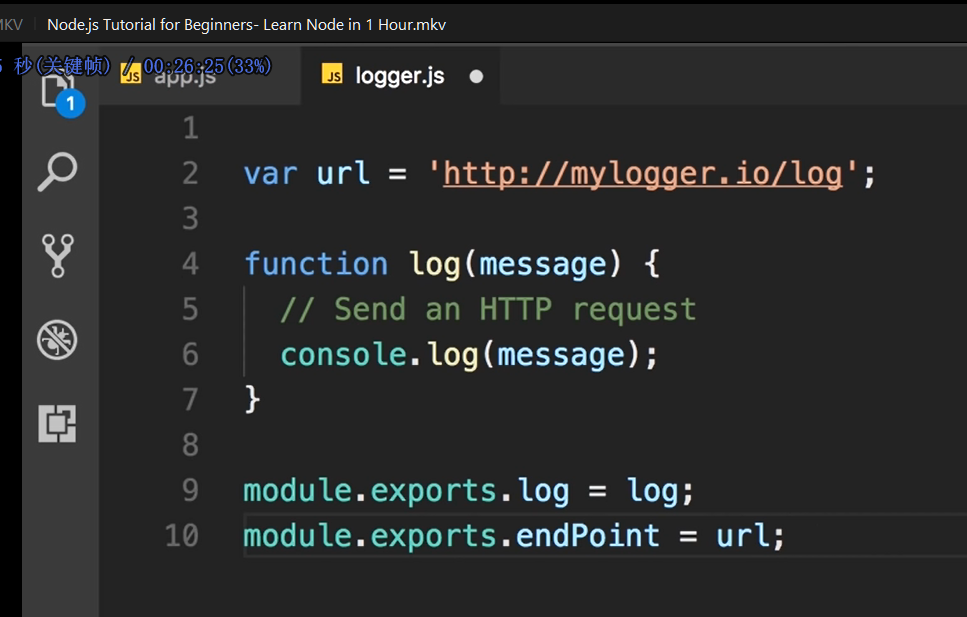
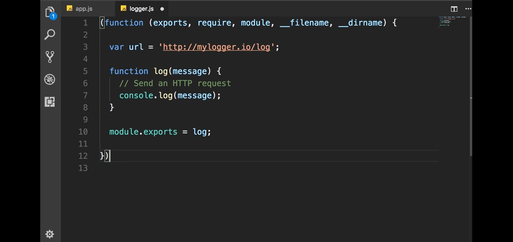
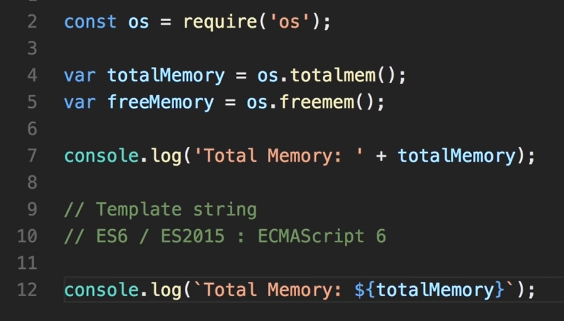

# Node.js

## 目录

Node不是编程语言，也不是framework, 而是runtime environment for executing JS code

*   Mosh 1 hour

    *   ref

        <https://www.youtube.com/watch?v=TlB_eWDSMt4&t=362s>

        <https://www.youtube.com/watch?v=TlB_eWDSMt4&t=362s>

    ### How it works

    *   asynchronous(non-blocking) by default ( e.g. ASP.NET not)

    *   event queue→ ideal for i/o, data intensive app (not good for CPU intensive)

    *   node 没有 JS的window 或者document，它有自己的系统

    ### 入门

    ### How to install

    检测版本

    > node —version

    website

    > nodejs.org

    ### Run first app in node

    1.  a new folder

    2.  with VS Code:&#x20;

        > code .

    3.  write some js code in `app.js`

    4.  terminal:

        > node app.js

    ### Node module system

    *   global functions

        `setTimeout()` call a function after a delay

        `clearTimeout()`&#x20;

        `setInterval()` call a function repetitively after a given delay

        `clearInterval()` cancal above

        通常，在js调用`setTimeout()` 会被自动解析为`window.setTimeout()`，而在node中要将`window`换成`global`

        node中最外层定义的变量不会自动归在`global`的作用域里

    *   module

        module相当于namespace. node不建议直接定义在global中。

        console.log(module) 会打印当前module的信息， 一个文件就是一个modulw

    *   access variables in another module

        *   被使用方：exports

            > module.exports.log = log;

            

            又或者只引一个：

            > module.exports = log;

        *   使用方

            > const logger = require(./logger);

            > logger.log('message');

    *   module wrapper function

        实际上导入的时候是这样子的

        

        exports实际上是个ref, 所以只能修改module.exports

        这些参数其实都是可以使用的，比如 log 出来

    *   standard api

        官方api文档：下面的LTS版

        <https://nodejs.org/en/docs/>

        path, os

    ### File system

    > const fs = require('fs');

    里面的函数分asyc 和sync版本。 避免用sync版本

    ### Event

    a signal that something is happened

    #### EventEmitter

    ```javascript
    // 类名大写驼峰
    const EventEmitter = require('event');
    const emitter = new EventEmitter();

    // Register a listener
    emitter.on('messageLogged', function(){
      // called when the event is raised
      console.log('Listener called');
    });

    // Raise an event
    emitter.emit('messageLogged'); 


    ```

    #### Event Argument

    ```javascript
    const EventEmitter = require('events');
    const emitter = new EventEmitter();

    emitter.on('messageLogged', (arg) => { // e, eventArg
      console.log('Listener called', arg);
    });

    emitter.emit('messageLogged', { id: 1, url: 'http://' }); 

    ```

    ### HTTP

    ```javascript
    /* HTTP */
    const http = require('http');

    const server = http.createServer((req, res) => {
        if (req.url === '/') {
            res.write('Hello world');
            res.end();
        }
        
        if (req.url === '/api/courses/') {
            res.write(JSON.stringify([1, 2, 3]));
            res.end();
        }
    });

    // 监听连接
    server.on('connection', () => {
       console.log('New connection.') 
    });

    server.listen(3000);

    console.log('Listening on port 3000...');
    ```

    *   字符串模板变量

        
