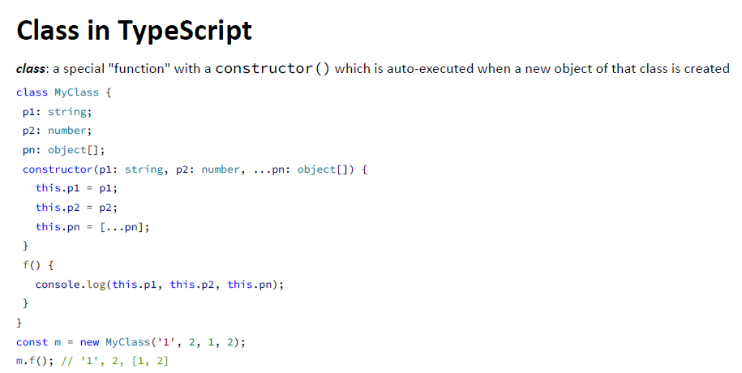
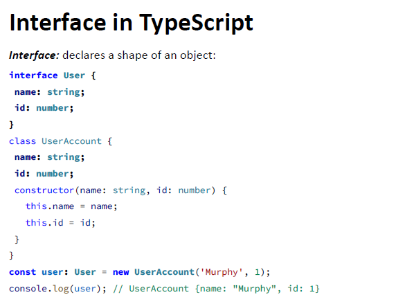

# TypeScript

## 目录

*   [目录](#目录-1)

*   [安装和使用流程](#安装和使用流程)

*   [核心特性](#核心特性)

*   [在JavaScript的基础上添加类型](#在javascript的基础上添加类型)

*   [Class](#class)

*   [Interface](#interface)

## 目录

安装和使用流程

核心特性

在JavaScript的基础上添加类型

Class

Interface

## 安装和使用流程

安装。 常用IDE 是VS Code,&#x20;

> npm install -g typescript

查看版本号

> tsc -v

查看帮助信息

> tsc --help

将ts代码转换成js

> tsc app.ts

运行js代码

> node app.js

## 核心特性

*   区分大小写

*

## 在JavaScript的基础上添加类型

*   常见类型

    | 任意类型                                | any     | 可以赋予任意类型的值                                  |
    | ----------------------------------- | ------- | ------------------------------------------- |
    | 数字类型                                | number  | 双精度64位浮点数                                   |
    | 字符串                                 | string  | 单引号双引号皆可                                    |
    | 布尔类型                                | boolean |                                             |
    | 数组                                  |         | let arr: number\[] = \[1, 2];               |
    | let arr: Array\<number> = \[1, 2];  |         |                                             |
    | 元组                                  |         | 元组类型用来表示已知元素数量和类型的数组，各元素的类型不必相同，对应位置的类型需要相同 |
    | let x: \[string, number];           |         |                                             |
    | x = \['Runoob', 1];    // 运行正常      |         |                                             |
    | x = \[1, 'Runoob'];    // 报错        |         |                                             |
    | console.log(x\[0]);    // 输出 Runoob |         |                                             |
    | 枚举                                  | enum    | enum Color {Red, Green, Blue};              |
    | let c: Color = Color.Blue;          |         |                                             |
    | void                                | void    | function hello(): void {                    |
    |     alert("Hello Runoob");          |         |                                             |
    | }                                   |         |                                             |
    | null                                | null    |                                             |
    |                                     |         |                                             |

声明时标注类型

var x: number;

## Class

## Interface

