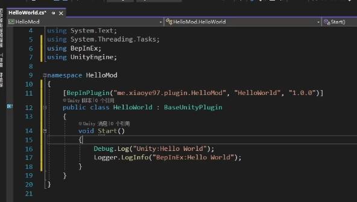

# Unity Mod 开发

## 目录

### BepInEx

Unity打包方式

*   Mono 常规显示

*   IL2CPP C#翻译成C++, 别人反编译看不到代码。用这种打包方式的游戏默认认为官方不允许Mod（但也能破）

    IL2CPP游戏文件夹会多一个GameAssembly.dll

BepInEx位

32位游戏用32位

&#x20;游戏文件夹里可能找到游戏是多少位的

Steam的一个机制

如果不是从steam点开始游戏，steam会把游戏强制处重启一次，而这个重启会导致mod失效

BepInEx框架放进游戏目录启动游戏

BIE控制台

框架内`config`文件夹 `.cfg` 文件，`Logging.console`  `Enable = true`

### UnityExplorer

官方下载，然后拖到BIE的`plugins`文件夹

### Mod Helloword

*   VS 新建项目&#x20;

    *   `类库(.NET Framework)` - `类库(.NET Framework)`

    *   框架选择。[Doc ](https://docs.bepinex.dev/articles/dev_guide/plugin_tutorial/2_plugin_start.html "Doc ")里有写什么情况应该选择什么版本

        if `<Game Name>_Data - Managed `文件夹, 有`netstandard2.0` → `net472`

        elif `mscorlib.dll` 文件版本大于4 → `net46`

        else → `net35`

*   &#x20;添加引用

    `引用` - `添加引用`

    `<Game Name>_Data - Managed` 文件夹

    Managed `UnityEngine.CoreModule.dll` , `UnityEnging.dll`

    BIE -Core `BepInEx.Core.dll`, `BepInEx.Unity.dll`

    全选引用下除分析器的所有引用，`复制本地=False`

*   代码框架

    `using BepInEx;` `using UnityEngine`

    基础类继承 `BaseUnityPlugin`

    Mod 信息 `[BepInPlugin(string GUID, string Name, string Version]`

    （F12单击类可以进入）

    一般用Bep的logger输出日志，因为会显示插件名字

    

*   生成并安装Mod

    右键项目生成，将生成的dll拖到BIE的`plugins`文件夹

    小技巧：右键项目，属性，生成，可以修改生成路径

### 游戏代码分析

准备

`Assembly-CSharp.dll` 拖进dnSpy. 大部分游戏的逻辑代码都在这，少部分游戏会把逻辑代码拆到几个dll

### 做MOD

引AC, 其他要什么引什么，比如键盘输入→`UnityEngine.InputLegacy..`
没有Legacy的是新版，但一般用老的

键盘输入

if(Input.GetKeyDown(KeyCode.F12))

`KeyCode.Alpha9` 数字键9

`KeyCode.Keypad9` 小键盘9

### BepInEx配置文件

这里用是ConfigEntry配置单项。更复杂的比如json

`using BepInEx.Configuration;`

声明

`ConfigEntry<KeyCode> hotkey;`

`ConfigEntry<int> configInt;`

泛型不能使用列表

使用

Start()

`hotkey = Config.Bind<KeyCode>("config", "hotkey", KeyCode.Alpha9, "快捷键");`

第一个参数是`.cfg`文件里\[]的名字

第二参数是一行的 xx=yy 中的xx

第三个是默认值

第四个是描述

Update()

`if (Input.GetKeyDown(hotkey.Value))`

会以GUID为名建一个配置文件

### Harmony基础

对游戏内方法进行补丁的库

方式：前置(Prefix), 后置(Postfix), ...

引用Bep 的`0Harmony.dll`

\*\* 后置补丁函数示例\*\*

必须是static

```c#
[HarmonyPostfix, HarmonyPatch(typeof(StaticData), "ShowJumpDamage")]
//后置补丁，（函数所在类，函数名）
public static void StaticData_ShowJumpDamage_PostPatch(StaticData __instance, int amout)
{
    Debug.Log($"造成了伤害: {amount}");    // 内插字符串
}
```

`StaticData __instance` 参数可以取到这个单例类的实例。在Doc的Patch - Injection

原函数是不止一个参数的，但这里只要取要用的

注意：静态方法不能直接使用Bep的`Logger`, 只能直接用Unity的`Debug.log`. 可以把Logger保存成静态

注入

start()

一般只要自动注入`Harmony.CreateAndPatchAll(typeof(HelloWorld));`

前置补丁

函数返回布尔类型，表示是否继续执行原函数

false拒绝后还可以执行后置补丁

### Harmony访问私有成员 Traverse

&#x20;根据类型查找类

```c#
var gameLevelHolder = GameObject.FindObjectOfType<GameLevelHolder>();
```

Traverse挖掘私有空间。 `.Field` 是字段，`.Property` 属性，`.Method`方法

```c#
var m_WaveSystem = Traverse.Create(GameManager.Instance).Field("m_WaveSystem").GetValue<WaveSystem>();
Debug.Log($"获取到私有字段m_WaveSystem:{m_WaveSystem.NextBossWave}");
```

对方法，`GetValue()` 无对应无输出，`GetValue<>()` 相应泛型返回值，如果方法本来有参数，在括号中可以带参

### Harmony 之 Patch属性，重载方法，ref关键字

讲的是详细匹配方法

*   比如Patch GameLevel的Setter方法 // 如果要构造器，`"GameLevel"` 去掉

    ```c#
    [HarmonyPostfix, HarmonyPatch(typeof(LevelManager), "GameLevel", Method.Setter)]
    public static void LevelManager_GameLevel_Set_PostPatch(ref int value)
    {

    }
    ```

当要Patch的方法参数带ref，或者有多个重载，Harmony可能找不到方法

这时需要加上Type和ArgumentType

```c#
[HarmonyPostfix, HarmonyPatch(typeof(Matf), "SmoothDamp", new Type[]{typeof(float), typeof(float), typeof(float), typeof(float), new ArgumentType[] {ArgumentType.Normal, ArgumentType.Normal, ArgumentType.Ref, ArgumentType.Normal})]
public static void Mathf_GameLevel_Set_PostPatch(float currentVelocity)
// 要改的 curretnVelocity 参数是 ref
{

}
```
