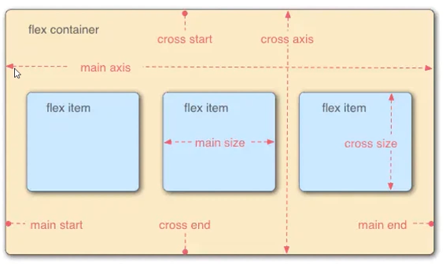
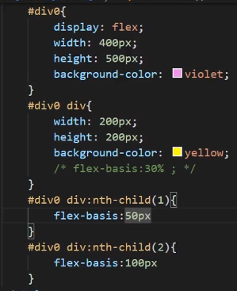
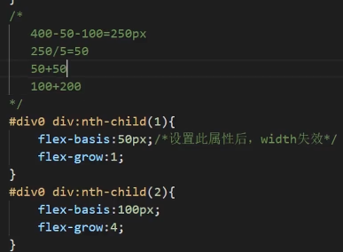
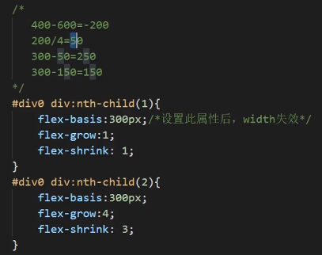
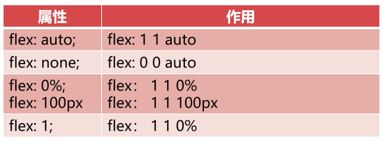

# 响应式设计

## 目录

*   [CSS3-Media Query CSS](#css3-media-query-css)

*   [Bootstrap](#bootstrap)

*   [Flex](#flex)

*   [使用rem字体自适应](#使用rem字体自适应)

    *   *   [也可以用媒体查询+rem](#也可以用媒体查询rem)

*   [自适应布局](#自适应布局)

*   [响应式布局的实现](#响应式布局的实现)

*   [rem弹性布局](#rem弹性布局)

    *   *   [rem](#rem)

## CSS3-Media Query CSS

*   常见属性

    *   `device-width`, `device-height` 屏幕宽高

    *   `width`, `height` 渲染窗口宽高

    *   `orientation` 设备方向

    *   `resolution` 设备分辨率

    *   （根据以上属性决定给用户呈现怎样的页面）

*   示例

    *   缩小到一定宽度后背景色从蓝色变成红色

    ```css
    // link.css
    body{background:red;}
    ```

    ```html
    <html>
    <head>
      <link type="text/css" rel="stylesheet" href="reacting.css" media="only screen and (max-width:600px)" />
        <style>
        @media screen and (min-width:600px){
            body{background:blue}
        }
        </style>
    </head>
    <body>
    </body>
    </html>
    ```

## Bootstrap

*   [https://getbootstrap.com/](https://getbootstrap.com/ "https://getbootstrap.com/")

*   对新手友好(?)，基本上去官网复制粘贴就好

*   前端工程师不太喜欢，因为命名混乱，有很多需要记忆的语法，如果对CSS熟悉，还不如手写CSS快

*   还剩最后一节实践没看，要上手的时候看

## Flex



*   div属性

*   在父容器中设置：`display:flex`;

*   对齐和排列属性

    *   `flex-direction`： 决定子元素的排列方式

        *   value: 默认`row`, `row-reverse`, `column`, `column-reverse`

        *   在父元素style设置`display:flex;` `flex-direction=value;`

        *   如果父元素主轴长度大于子元素的和：默认剩余的空间剩下，可以通过设置平均分配

        *   如果父元素主轴长度小于子元素的和：压缩，平均分配

    *   若想要换行：`flex-wrap`

        *   `nowrap` 默认，不换行不换列

        *   `wrap` 换

        *   `wrap-reverse` 以相反的方向换（123456789 -> 789456123)

    *   `flex-flow`：`flex-direction`和`flex-wrap`的简写

        *   `flex-flow: row wrap;`

    *   `justify-content`：存在剩余空间时，设置间距的方式

        *   `flex-start`: 元素往开头靠拢

        *   `flex-end`

        *   `center`

        *   `space-between`: 均分，两边不留空

        *   `space-around`: 均分，两边留(两两之间)一半的空

        *   子元素margin还是会生效的

    *   `align-items` ：cross axis的对齐方式

        *   `flex-start`

        *   `flex-end`

        *   `center`

    *   `align-content` ：与`align-items`相似，把多行子元素当一个整体

        *   `flex-start`

        *   `flex-end`

        *   `center`

        *   `space-between`

        *   `space-around`

*   伸缩比例属性：

    *   可以写在父元素同意设置，也可以对子元素分别设置

    *   `flex-basis`: 设置弹性盒伸缩基准值

        *   px, %, em

        *   设置后对应width,height失效

        *   逐个子元素设置的方法：

            

    *   `flex-grow`扩展比率

        *   当不足以填满时

        *   分别给子元素设置，值的单位是份

            

    *   `flex-shrink`缩小比率

        *   子元素太宽了……

        *   0是不允许缩小

        

*   `flex`: 简写

    *   `flex: grow shrink basis;`

    *   `flex: 4 3 300px;`

    *   特殊写法：

        

        *   1 1的情况下，第三个值就不重要了

## 使用rem字体自适应

*   [JavaScript](../JavaScript_1/JavaScript.md "JavaScript")实现

    *   script中：

    *   320是iPhone5的宽度

    ```javascript
    var c=()=>{
      // 获取设备宽度
      let base = 16;
      let w = document.documentElement.clientWidth;
      let n = (base*(w/320))>40?40+"px":(base*(w/320)+"px");  // base是基准大小
      document.documentElement.style.fontSize=n;
    }
    // 加载或改变尺寸时加载c
    window.addEventListener("load", c);
    window.addEventListener("resize", c);
    ```

#### 也可以用媒体查询+rem

## 自适应布局

*   一种方式：移动一个html, PC一个html

    *   跟上面响应式的实现方式类似

    *   已弃用

*   局部自适应

    *   css，使用flex布局，设置伸缩比例

    *   @meida媒体查询

## 响应式布局的实现

*   1\. 写多个css，根据情况不同引用

    *   见tls test layout1

*   2\. 写一个css

    *   用js

    *   用media

## rem弹性布局

加到响应式布局里了

#### rem

*   指相对于根元素的字体大小单位

*   根元素的字体大小只html标签的font-size

*   假如html标签的font-size为10px, 1rem=10px

*   em是相对于父一级，继承关系复杂
