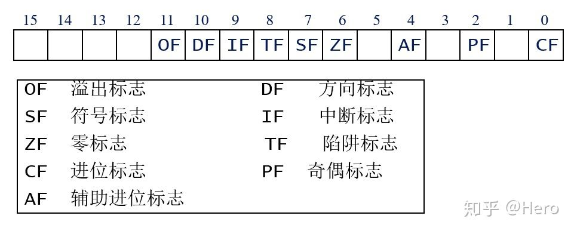
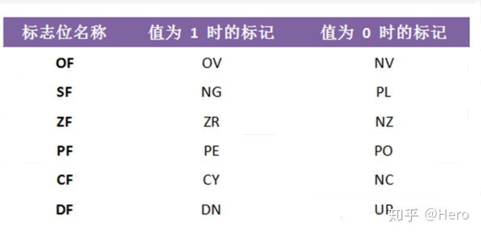

# 汇编

## 目录

### 寄存器

<https://zhuanlan.zhihu.com/p/115915986>

通用寄存器

| AX |   | 累加器 |
| -- | - | --- |
| BX |   | 基地址 |
| CX |   | 计数  |
| DX |   | 数据  |

指针寄存器

| SP |   | 堆指针 |
| -- | - | --- |
| BP |   | 基指针 |

变址寄存器

| SI |   | 源变址  |
| -- | - | ---- |
| DI |   | 目标变址 |

控制寄存器

| IP   |   | 指令指针 |
| ---- | - | ---- |
| FLAG |   | 标志位  |

段寄存器

| CS |   | 代码段 |
| -- | - | --- |
| DS |   | 数据段 |
| SS |   | 堆栈段 |
| ES |   | 附加段 |

### 标志位

| ZF | Zero Flag | 零标志  |
| -- | --------- | ---- |
| CF |           | 进位标志 |
| PF |           | 奇偶标志 |
| AF |           | 辅助进位 |
| OF |           | 溢出   |
| SF |           | 符号   |
| DF |           | 方向   |
| TF |           | 陷阱   |
| IF |           | 可中断  |
|    |           |      |

### 语句

*   比较语句

    *   `cmp a, b`

        无符号数：隐含a-b, 改变ZF和CF。相等时ZF=1, 结果为负（需借位）时CF=1

*   跳转语句

    `jmp addr` 无条件跳转

    `jnz addr`  ZF为0跳转
