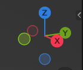
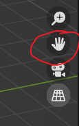
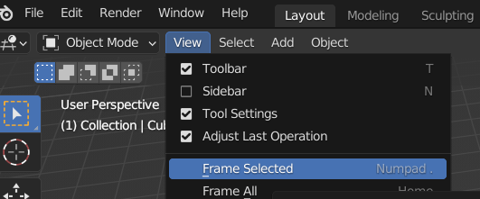

# Blender

## 目录

*   [基础操作](#基础操作)

## 基础操作

*   选择

    *   选中 `鼠标左键` &#x20;

    *   取消选中 `鼠标左键` 点击空白环境

    *   全选 `a`

    *   取消全选 `alt+A`

*   旋转

    *   `鼠标中键`

    *   点击，或拖拽方向球

        

*   移动物体

    `g`

*   拖拽场景

    *   `shift+鼠标中键`

    *   从这里拖拽

        

*   聚焦

    

*   界面操作/技巧

    *   下方工具提供了当前的鼠标操作用途

    *   右键boundary 可以分割视窗/合并视窗

    *   `ctrl+space` 最大化/还原当前视窗

    *   `ctrl+PgUp/PgDn` 切换预设模式(Layout, Modelling...)

*   快速工具栏

    *   `t` 展开/收起左侧工具栏
        `shift+space`的光标位置生成左侧工具栏

    *   `n` 展开/收起右侧快速设定栏

*   3D 光标

    *   快速设定栏里调

    *   `shift+鼠标右键`

    *   `shift+s` 快捷操作

*   属性编辑器

    *
