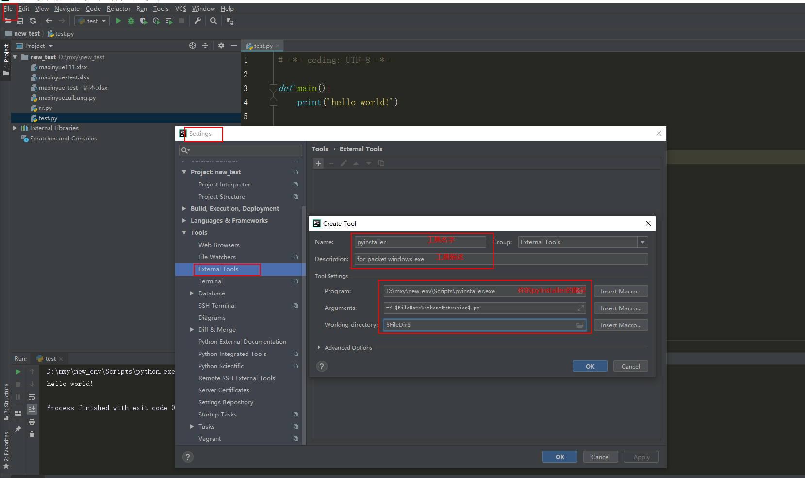
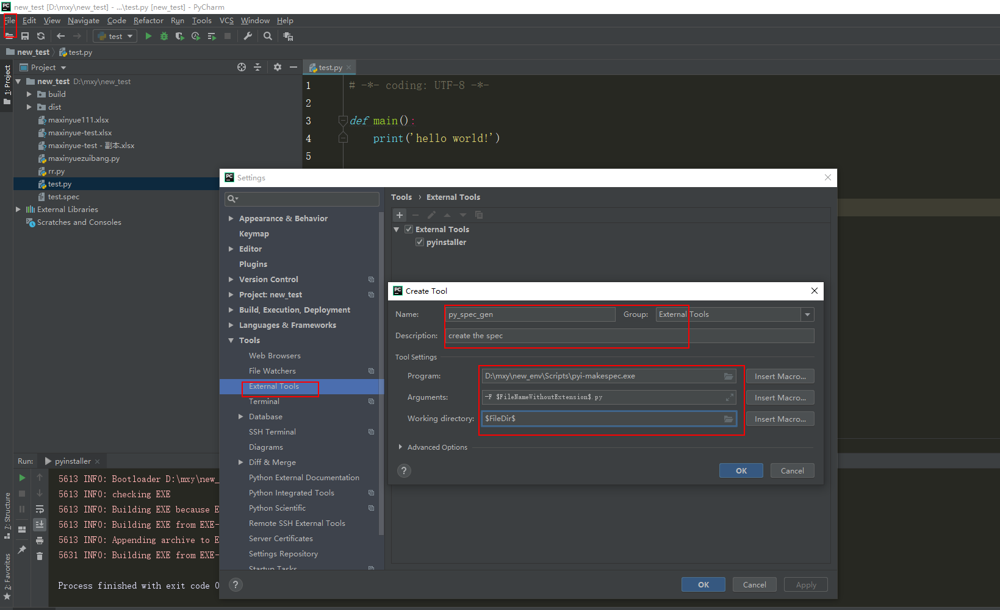
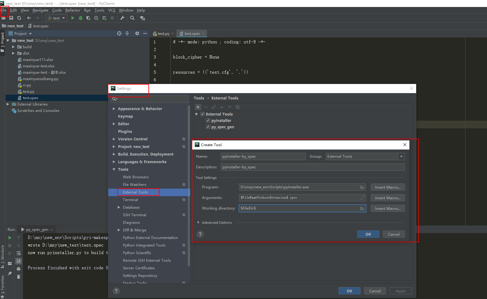
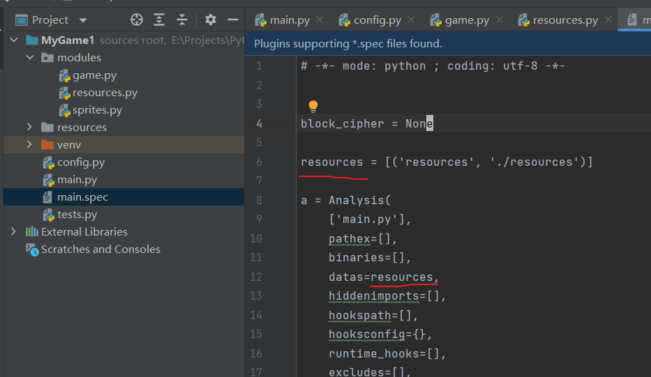

# Pycharm

## 目录

*   [快捷键](#快捷键)

*   [插件](#插件)

    *   [ideavim](#ideavim)

*   [Pycharm中的pyinstaller打包](#pycharm中的pyinstaller打包)

## 快捷键

*   ctrl+alt+L 格式化代码

## 插件

### ideavim

*   再在 `keymap`-`Plugins`- `IdeaVim` 给 `Vim Emulator`设个快捷键，正常模式和 Vim 模式无缝切换

## Pycharm中的pyinstaller打包

C:\Users\nuohe\AppData\Roaming\Python\Python310\Scripts\pyinstaller.exe

*   参考资料

    External tool 的使用方法

    <https://codeantenna.com/a/LLHG0aHpRD>

    spec文件配置

    <https://www.jianshu.com/p/b97241af2633>

*   无resources

    1.  project 加载pyinstaller包

    2.  同样是设置，`Tools - External Tools`, 创建一个pyinstaller外部工具

        可以设置参数，参数详见[Pyinstaller](../../Python/Pyinstaller/Pyinstaller.md "Pyinstaller")

        \-F $FileNameWithoutExtension$.py

        $FileDir$

        

    3.  然后在main代码里右键external tools

*   有resources

    1.  将生成spec的`pyi-makespec.exe` 生成external tool

        \-F $FileNameWithoutExtension$.py

        $FileDir$

        

    2.  添加使用指定spec的pyinstaller工具

        $FileNameWithoutExtension$.spec

        $FileDir$

        

    3.  修改spec文件，主要是改datas

        datas 是一个装着tuple的list, tuple里是资源文件，格式是 (项目中的路径，打包后的路径）

        

    4.  在main代码里先运行 `pyi-makespec` 再运行 `pyinstaller_by_spec`
