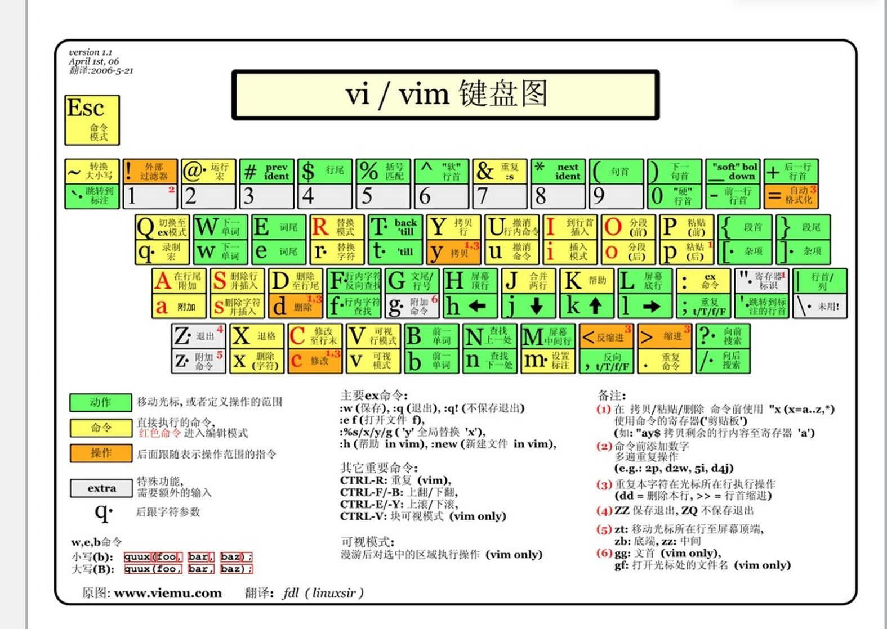

# VIM

## 目录

*   [键盘图](#键盘图)

*   [Vim 实用技巧（视频简略教程）](#vim-实用技巧视频简略教程)

*   [VIM配置](#vim配置)

    *   [手动安装配色](#手动安装配色)

    *   [缩进设置](#缩进设置)

## 键盘图



## Vim 实用技巧（视频简略教程）

*   \+ 寄存器是系统剪贴板

*   `ctrl + o` 插入正常模式，在插入模式下输入，正常模式一个命令就回插入模式

*   `ctrl + v` 选择多行（编辑）

*   选择的时候加`i` 比如 `iw` 是当前单词

*   可视模式下按 `o`切换光标位置（选择块前或者选择块后）

*   V 是整行选，v不是

*   视频

    <https://www.bilibili.com/video/BV1Wr4y1k733?p=1&spm_id_from=pageDriver>

*   `:noh` 取消高亮

## VIM配置

WSL2 Ubuntu本地配置位置 `/.vim/vimrc`

Windows `C:/Program Files/Vim/_vimrc`

### 手动安装配色

*   (1) 确认当前用户目录下存在\~/.vim/colors目录，没有则新建，安装的Vim配色方案对应.vim文件需放在该目录下

*   (2) 下载或编辑某个配色方案的.vim文件，保存到\~/.vim/colors目录下

*   (3) 修改Vim配置文件\~/.vimrc，增加配置项colorscheme molokai并保存 (假设下载了一个叫molokai的配色方案文件molokai.vim)

*   来源：[https://vimjc.com/vim-color-schemes.html](https://vimjc.com/vim-color-schemes.html "https://vimjc.com/vim-color-schemes.html")

*   然后 .vimrc: `colorscheme [name]`

    ```vim&#x20;script
    colorscheme gruvbox
    ```

### 缩进设置

shiftwidth reindent 操作（<<和>>）时缩进的列数（这里的一列相当于一个空格） &#x20;
tabstop 一个tab键所占的列数，linux 内核代码建议每个tab占用8列 &#x20;
softtabstop 敲入tab键时实际占有的列数。 &#x20;
expandtab 输入tab时自动将其转化为空格

自动缩进 &#x20;
:set autoindent 回车后自动缩进 &#x20;
通常Java的配置方式是： &#x20;
:set softtabstop=4 shiftwidth=4 expandtab &#x20;
Linux kernel的配置方式： &#x20;
:set tabstop=8 softtabstop=8 shiftwidth=8 noexpandtab

作者：Ailily &#x20;

链接：[https://www.jianshu.com/p/04c7ff0c745c](https://www.jianshu.com/p/04c7ff0c745c "https://www.jianshu.com/p/04c7ff0c745c") &#x20;

来源：简书 &#x20;

著作权归作者所有。商业转载请联系作者获得授权，非商业转载请注明出处。
