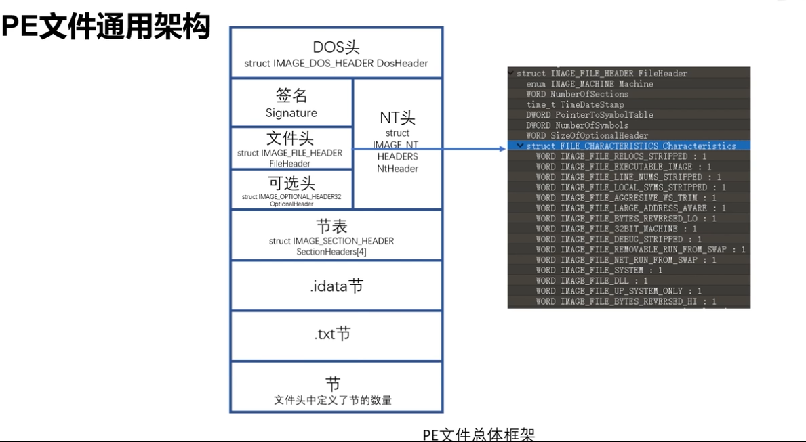
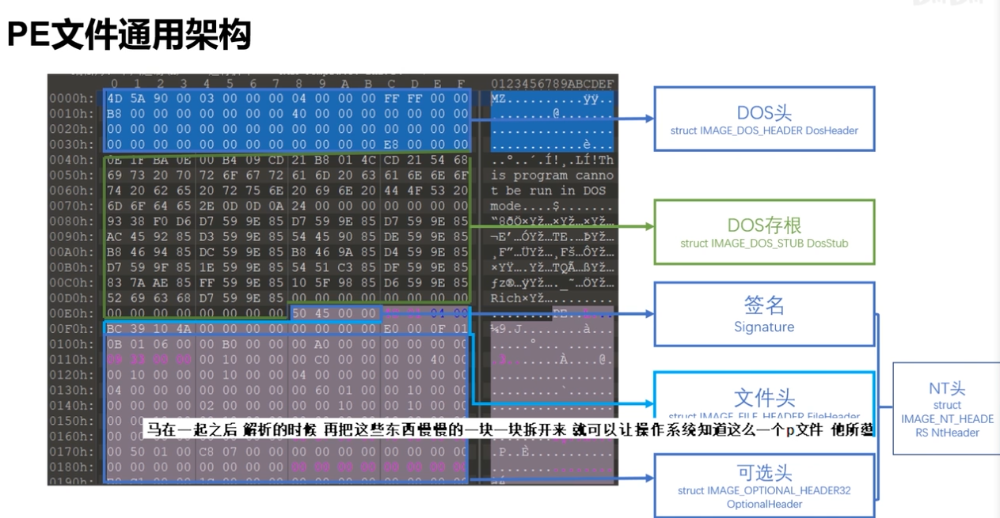
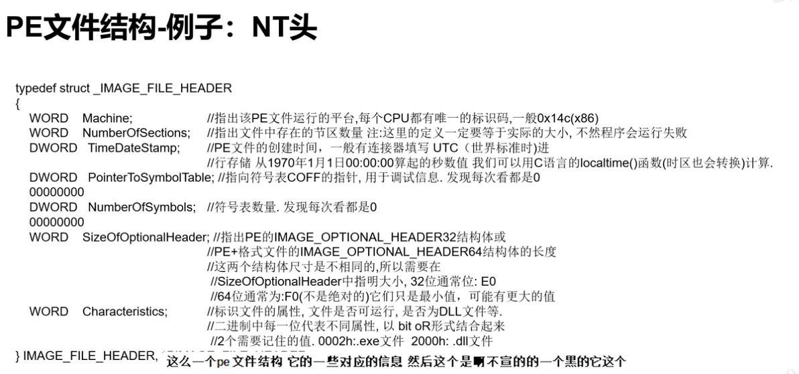
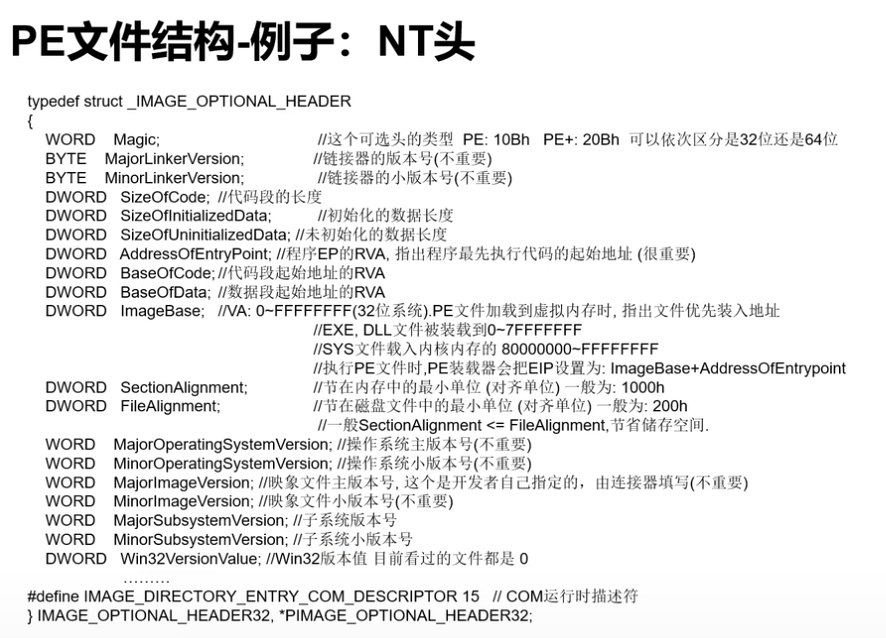
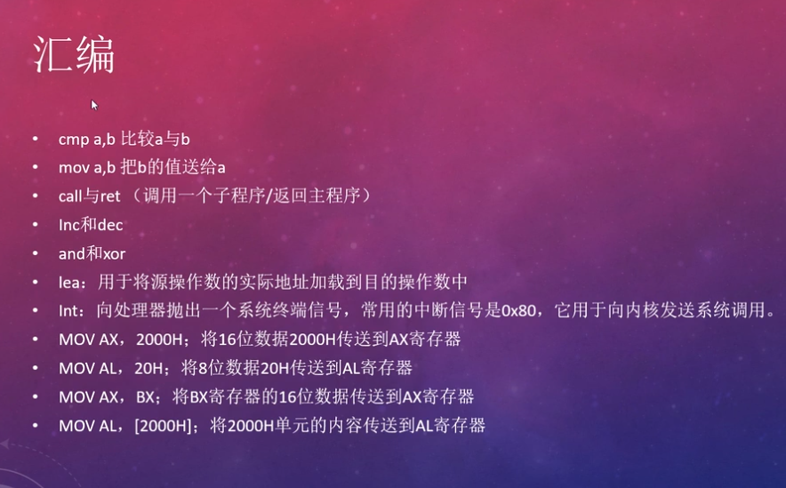
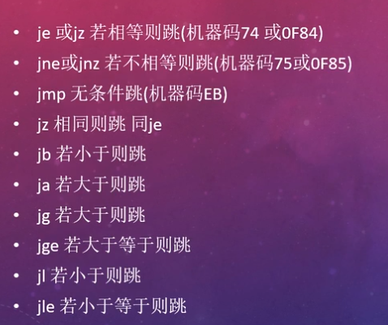
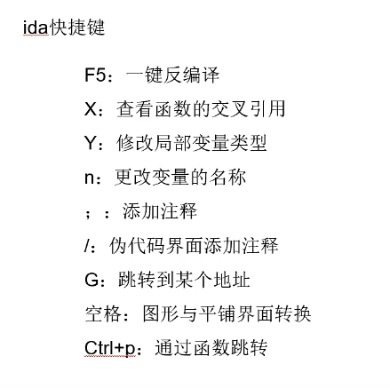
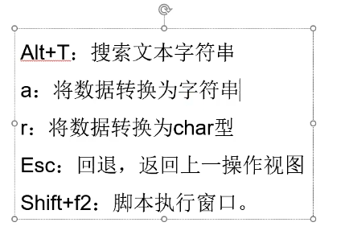

# 星盟Reverse

## 目录

*   [PE文件](#pe文件)

    *   [NT 头](#nt-头)

    *   [ELF 文件](#elf-文件)

*   [逆向语言基础](#逆向语言基础)

    *   *   [汇编](#汇编)

*   [静态分析](#静态分析)

    *   [IDA](#ida)

    *   [解题流程](#解题流程)

## PE文件

<https://www.bilibili.com/video/BV1aF411n7gH?spm_id_from=333.999.0.0>

### NT 头

*   DWORD Signature(size:4h); FileHeader(size:14h); OptionalHeader;

*   PE头的标志: 50 45 00 00 (即PE..)

*   FileHeader

    

*   OptionalHeader

    

*   官方文档

    <https://docs.microsoft.com/zh-cn/windows/win32/debug/pe-format>

*   06:39 还给了一篇详细介绍的博客链接

### ELF 文件

*   linux 下的可执行或可链接文件

*   &#x20;工具：`readelf -S 程序名` 查看该可执行文件中有哪些section

*   `.text` 代码节

*   `.rodata` 只读数据

*   `.plt` 过程链接表。动态链接器调用从共享库导入的函数需要的代码

*   `.data` 初始化的全局变量

*   `.bss` 未初始化的全局数据

*   ...

*   需要的时候查文档(14:15博客地址）

    <https://refspecs.linuxbase.org/elf/elf.pdf>

## 逆向语言基础

#### 汇编

*   栈

[C 语言](<../../C 语言/C 语言.md> "C 语言")

## 静态分析

<https://www.bilibili.com/video/BV1DY4y1s7Ki>

*   反编译两种形式

    *   线性扫描，简单顺序扫描(objdump)

    *   递归下降，根据call指令调用关系分析(IDA Pro)

### IDA

*   分析32位用ida，64用ida64

*   快捷操作

    *   `F5` 一键反编译

    *   `shift+f12` String window

    *   十六进制窗口

    *   主界面 右键`text view` 进汇编

*   快捷键集合

    

    `X`交叉引用：在函数名上X, 可以看到该函数被什么时候引用

    `Y`当我们认为这个变量不是ida认出的类型时，修改局部变量类型

    `n` 为了可读性

    `;` 汇编注释 `/` 伪代码注释

    `G` 配合动态分析用

    

    `a` 点一个数据，a, 转成string型ascii码

    `r` 数据转成char型

    `f6` 回到上一次操作的界面

*   花指令：干扰分析的代码

*   sub rbp是一个拉高栈的操作

### 解题流程

1.  查壳脱壳

2.  IDA加载

3.  (C)看main，shiftf12找关键字符串，双击进去

4.  搞懂逻辑后拿py写wp

*   其他工具

    apk: JEB, Android\_Killer, jadx

    .net: dnSpy
