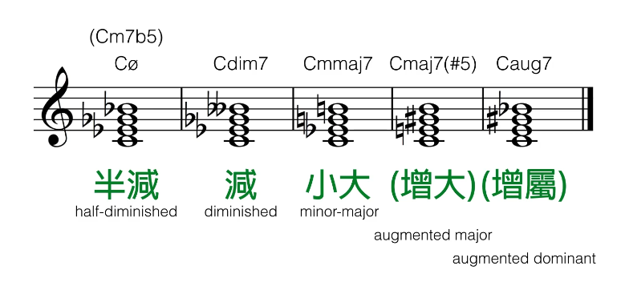
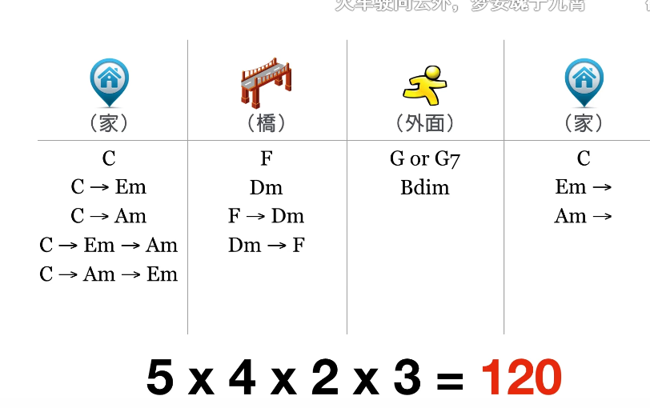

# 乐理

## 目录

*   [现代和弦符号](#现代和弦符号)

    *   [和弦的主调关系](#和弦的主调关系)

    *   [和弦的进行路径](#和弦的进行路径)

    *   [终止式](#终止式)

*   [七种调式](#七种调式)

## 现代和弦符号

*   和弦

    *   和弦 chord 三个音以上的三度堆叠组合

    *   三和弦 triad 三个音的和弦

    *   七和弦 seventh chord 三度三度堆到第七个音的和弦

    *   九和弦 九和弦 十一和弦 十三和弦同理

*   **和弦家族**

    *   大 major 大调音阶的1357

    *   小 minor 降37

    *   属 dominant 降7

    *   升到九以上：直接加大调音

*   **字母标**

    *   基础：

        *   \+maj 大调和弦

        *   \+m 小调和弦

        *   不加 属和弦

    *   变化：

        *   add 增加音

        *   sus 不要三度音 换成四或二度(默认四)

        *   omit 不要x度音

        *   ()  其他什么都可以写

    *   转位

        *   不是用原本的根音当最低音

        *   C/E 读作 C on E

        *   如果 on 本身不在和弦的音 直接在下方加

    *   其他家族

        

### 和弦的主调关系

*   C Dm Em F G/G7 Em Bdim C

### 和弦的进行路径

*   起/合: Ⅰ

*   半起/半合: Ⅲ, Ⅵ

*   承: Ⅳ, Ⅶ

### 终止式

*   正格终止: Ⅴ接Ⅰ

*   半终止: 停在Ⅴ

## 七种调式

*   我的霹雳猫阿洛

*   \### Ionian

    *   大调

    *   稳定，快乐

    *   全全半全全全半

    *   无升降

*   \### Dorian

    *   神秘 神圣 但不悲伤

    *   降37 特色音大六度

*   \### Aeolian

    *   悲伤 稍微恐怖悬疑

    *   降367 特色音小六度

    *   X档案

*   \### Phrygian

    *   西班牙感觉，西域风。尤其是围绕小二度弹。更常用的是还原三度音的Phrygian dominant, 更有西班牙感觉（西班牙的弗朗尼格

    *   降2367 特色小二度

*   \### Lydian

    *   英雄 宇宙浩瀚感/ 围绕升四音（#4+5）制造滑稽感

    *   升4

    *   辛普森一家

*   \### Mixolydian

    *   蓝调 爵士音乐 不稳定感

    *   降7 也是特色音

*   \### Locrian

    *   黑暗

    *   降23567

    *   Cdim
