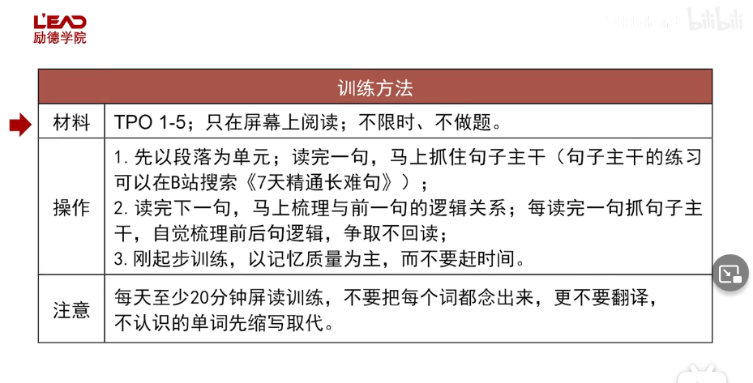
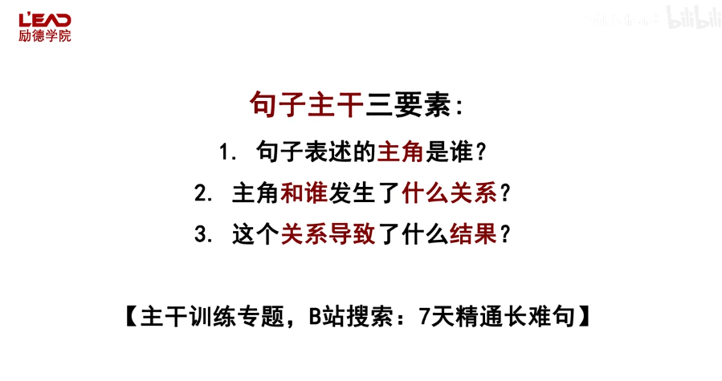
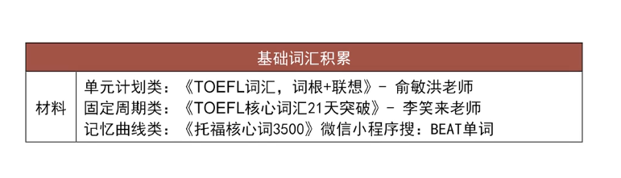
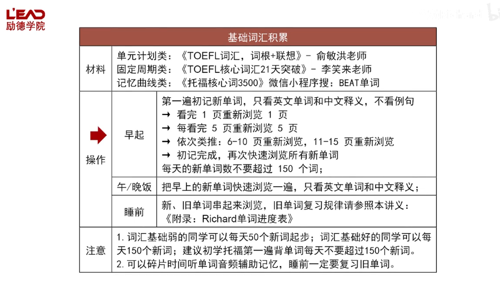
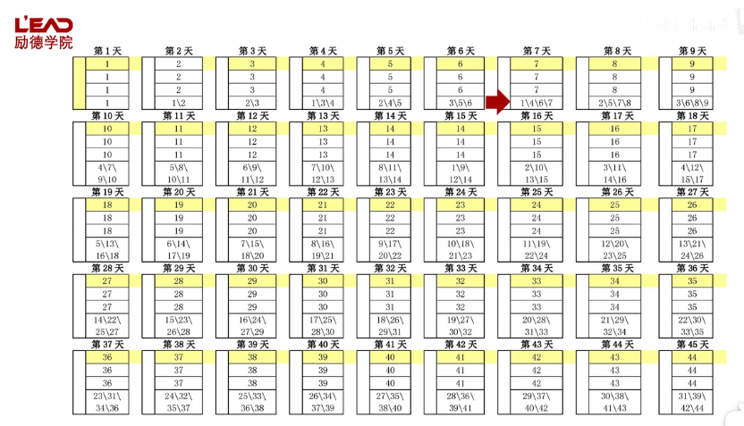

# 托福训练与备考

## 目录

*   [听力](#听力)

*   [阅读](#阅读)

    *   [屏读耐力](#屏读耐力)

    *   [基础词汇积累](#基础词汇积累)

*   [写作](#写作)

*   [口语](#口语)

## 听力

## 阅读

### 屏读耐力

再多读一句就不行了的时候：停下，说明现在记忆耐力只有那么多

### 基础词汇积累

词典推荐：[柯林斯在线词典](https://www.collinsdictionary.com/ "柯林斯在线词典")， [源词典etym](https://www.etymonline.com "源词典etym")

## 写作

## 口语
