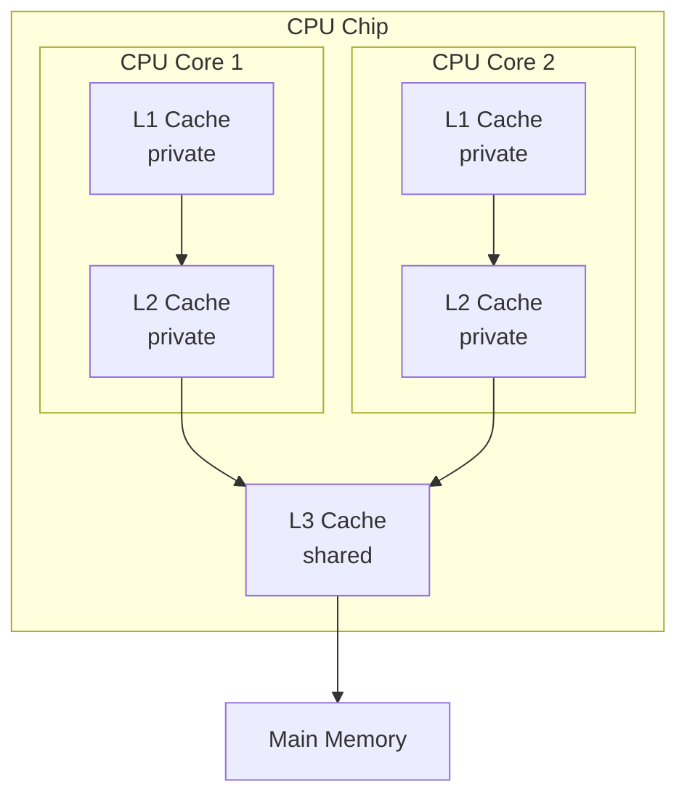

#### 2.1 Role of Caches in Modern Computer Architecture

- 为什么需要 cache
- 大概是怎么工作的
- 总结

Modern computer architectures are built based on the famous von Neumann structure, where the Central Processing Unit(CPU) is the core component to execute instructions and manipulate data. As the CPU clock speeds have increased exponentially over years, an instruction cycle is able to execute within 1 nanosecond. However, the main memory(DRAM) access latency has failed to keep pace with the execution speed. If data are retrieved from DRAM during each instruction cycle, the processor will waste tens to hundreds of nanoseconds waiting for the data to arrive.

This imbalance is mitigated by cache. Cache is a small amount of storage integrated into CPU, hierarchically positioned between CPU registers and memory{cite: Cache memory}. Instead of directly accessing data from the memory, the processor will firstly check if it is already existed in cache. It takes less time to fetch a word from the cache than from the memory. Based on the principle of data locality{Cite: Denning}, the cache retains hot data that is more likely to be used next and discards the data that is less likely to be used, thus saving the retrieving time in an instruction cycle. In practical cache behavior, whether data is retained or not is determined by the chosen replacement algorithm.

Although cache bridges the speed gap between processors and memory, which improves CPU utilization and overall system efficiency, poor data locality and limited memory bandwidth remain critical performance bottlenecks for many applications. Therefore, analyzing and studying cache behavior is extremely helpful in improving computer performance, especially for optimizing memory-bound workloads.

#### 2.2 Memory Hierarchy Model

Cache is organized in different levels, each level trades capacity for speed. A typical computer includes L1, L2 and L3 levels of cache, where L3 may not be present on certain computers. For a multi-core processor, the cache may be private or shared between several processors. (A figure of  example)



caption: A simple example of CPU cache memory hierarchy (L1, L2, L3) in a 2-core processor, illustrating the flow of data requests from the CPU core to main memory. L1 and L2 caches are private to each core and integrated within the core. The L3 cache is shared but remains located within the CPU chip.

Figure 2 illustrates the classic memory hierarchy and their typical sizes and speeds. The memory hierarchy model indicates the order in which the processor searches for data, from higher level to lower level. When a block of data is not found in the L1 cache, then the processor turns to the L2 cache. 

(a figure like this, in pyramid)(figure based on ...cite) The memory hierarchy in computer systems, organized as a pyramid from registers at the top to main memory at the base, with indicative latencies (left) and typical sizes (right). 
![[attachments/Pasted image 20250722161415.png]]

![[attachments/mermaid-diagram-2025-08-27-221849 1.svg]]


In the memory hierarchy model, there are two principles typically to be followed: 

- Inclusion: Upper levels are subsets of lower levels (e.g., L3 data includes all L2/L1 copies), though strict inclusion is not forced for performance.{cite book ch2}

- Coherence: Coherence ensures all processors observe a single logical view of shared data, which is realized by specific protocols (e.g., MESI){cite:sorin}.

 >  In most cases (but not all), the data contained in a lower level are a superset of the next higher level. This property, called the inclusion property, is always required for the lowest level of the hierarchy, which consists of main memory in the case of caches and disk memory in the case of virtual memory. (p72)

#### 2.3 Cache Miss types

Cache miss is a term related to cache hit. A cache miss represents that the instruction or data required by the processor were not found in cache, while a cache hit means the opposite. Hill has proposed the established 3C Model in 1987{cite} for classifiying types of misses, which was later extended with a forth category.

The 3C Model consists of Compulsory misses, Capacity misses and Conflict misses.

Compulsory misses (also called cold misses) occur when data is accessed for the first time. These errors are unavoidable; however, they can be mitigated by prefetching techniques{cite?}.

Capacity misses arise when a program's working set exceeds the cache size. These misses dominate in data-intensive applications such as sparse matrix operations, e.g., the capacity miss ratio in McKinley and Temam's research using spec95fc reaches the percentage of 68\%{cite}. Expanding cache capacity offers the most direct solution, though practical constraints often preclude this approach.

Conflict misses occur due to limitations in set-associative caches. When hash collision happens and the secific cache set is full, a memory block will be evicted although other cache set maintain vacuum. Increasing the cache associativicy reduces conflict misses, however, introduces circuit complexity and memory space redundance.

A fourth category emerges in modern multi-core processors: coherence misses. This type of misses stems from cache consistency protocols such as MESI, where one core invalidates another's cached copy during shared data modification. Coherence misses manifest exclusively in shared-memory concurrency scenarios.

#### 2.4 Cache associativity

Cache associativity addresses mapping schemes inside the cache, determining where incoming data may reside and how conflicts are resolved when multiple blocks compete for the same cache location. The cache associativity has been demonstrated to have a significant impact on cache performance and cost. It achieves this by balancing speed, hardware complexity, and efficiency to minimize cache misses.

Direct-mapped caches allocate each memory block to a single cache slot.  If the cache has 1024 lines, and main memory addresses A and B satisfy A mod 1024 = B mod 1024, then they will compete for the same cache line. This, in turn, will result in a conflict miss when the cache line is accessed in an alternating manner. Implementing a direct mapping has the lowest cost, accordingly a highest rate of conflict misses.

In set-associative caches, a set references to a group of slots into which memory blocks can be placed. A n-way set-associative cache is characterized by the presence of n positions within a single set. In the event that two addresses are assigned to the same set, which causes a conflict miss in direct-mapped caches, provided that there remains space in the set, they can be maintained in the same set in conjunction. An increase in the number of ways has been shown to result in a reduction of conflict misses; however, this increase has been accompanied by an increase in both spatial overheads and access latency. Modern CPUs employs 4-16 ways associativity to achieve an balance.

In the context of fully associative caches, the allocation of memory blocks to specific slots is not constrained; any memory block may be assigned to any slot. It can be consider as a specialized cache system characterized by the presence of a single set. This theoretically eliminates conflict misses. Nevertheless, the considerable expenses of searching across all slots and the intricate nature of hardware implementation restrict the viability of practical implementations to modest translation look-aside buffers (TLBs).

#### 2.5 Cache replacement policies

Cache replacement policies are the strategies to select a memory block to be replaced by cache miss occurs. The two simplest replacement methods are Random and First In, First Out(FIFO). These two algorithms are easy to implement in hardware, however, at the cost of poor performance. The Random policy selects a victim block at random, leading to potentially poor efficiency and unpredictable behavior. The FIFO policy replaces the block that has been in the cache longest, based on the order of insertion; it may also evict frequently accessed blocks that were loaded early.

One of the most common and efficient replacement algorithms is Least Recently Used(LRU). LRU replaces the block that has not been accessed for the longest period of time, operating under the principle that recently used data is likely to be used again in the near future. Although LRU generally yields good performance, its main drawback is the implementation overhead, as it requires tracking access history precisely, which can be expensive for highly associative caches.

To reduce the hardware cost of LRU, the Pseudo-LRU (PLRU) algorithm is often employed. PLRU approximates true LRU by maintaining less state information per set, using a tree structure or bits to track relative recency. While not always replacing the absolute least recently used block, it provides a good trade-off between implementation complexity and cache performance, making it practical for many real-world processors.

Other common cache replacement policies include Least Frequently Used (LFU), which evicts the block with the fewest accesses; more advanced adaptive policies such as Adaptive Replacement Cache (ARC) and Clock variants, which aim to balance between recency and frequency of use to accommodate diverse access patterns.

#### 2.6 Write Strategies

Write strategies, also referred to as write policies, determine how an updated data block in the cache is written back to the lower-level memory. When data in the cache is modified by the processor, it becomes inconsistent with the copy in the lower-level memory. The write strategies are policies that manage this inconsistency.

The two main write strategies are write-through and write-back. The *write through* strategy ensures data consistency by updating both the cache block and the corresponding lower-level memory location on every write operation. This approach simplifies cache coherence in cache hierarchy system; however, its major disadvantage is high write latency, as each write must wait for the slower lower-level memory access to complete, which can significantly degrade processor performance.

In contrast, the *write-back* policy mitigates write latency by deferring the memory update. When a write operation occurs, only the cache block is modified and marked by a dedicated *dirty bit*. The updated data is written back to lower-level memory only when the dirty block is evicted from the cache during a replacement. This approach minimizeds bus traffic and reduces write latency, as multiple writes to the same block require only one final memory update. Nevertheless, write-back introduces greater complexity in maintaining cache coherence, as the lower-level memory can hold stale data, requiring special protocols to ensure correctness, especially in systems with multiple processors.

The choice of write policy is often coupled with a decision on *write allocation*. On a write miss, a *write-allocate* policy will load the missed block into the cache from memory and then perform the write operation on the cached copy. This policy is typically used with write-back caches. Conversely, a *no-write-allocate* policy bypasses the cache and writes directly to lower-level memory, making it more suitable for write-through caches. Modern systems predominantly employ a write-back policy with write allocation to optimize for the common case of localized write patterns.

#### 2 intro
This paper focuses entirely on the cache system of modern computers. To better understand the paper, this chapter introduces basic cache knowledge, emphasizing content relevant to this research and briefly introducing related technologies not used.

#### 3 intro
As established in Section 2.1, the growing performance gap between processor and memory speeds has made the memory subsystem a critical bottleneck in modern computing systems. Caches serve as a fundamental technique to mitigate this gap by storing frequently accessed data close to the processor. Consequently, improving cache utilization efficiency is directly linked to enhancing overall system performance. To achieve this, a deeper understanding of cache access patterns is essential. This necessity motivates the field of cache behavior prediction, which aims to anticipate future data accesses and manage cache resources more intelligently.

This chapter explores methods for predicting cache behavior to inform and optimize replacement decisions. Section 3.1 begins by reviewing and summarizing the replacement operations within a cache system upon a miss, building upon the foundational knowledge from the previous chapter. Section 3.2 introduces reuse distance, a critical metric for predicting cache behavior, and discusses the specific extensions with set-associativity to this metric proposed in our study. Following this, Section 3.3 surveys existing cache simulation approaches commonly employed in prior research to evaluate replacement policies and predictive models. Finally, Section 3.4 analyzes the potential sources of error between predictions and actual outcomes, providing a discussion on the limitations and realism of our approach.

#### 3.1 Objectives of Cache Behavior Prediction

Prediction aims to proactively guide cache decisions, optimizing performance across diverse workloads. Consequently, cache behavior prediction primarily focuses on two interrelated aspects: the cache miss rate and the cache misses types.

The miss rate is a direct measure of cache performance; a lower miss rate signifies higher efficiency and lower average memory access time. Prediction algorithms aim to achieve this by accurately forecasting which cached data will be reused in the near future.

Although the aggregate miss rate is important, understanding the composition of misses provides deeper insight for optimization. For instance, Capacity misses indicate that the working set exceeds the cache size; a high number of conflict misses suggests inefficiencies in the mapping and replacement logic.

The reuse distance metric, which will be introduced in the next section, serves as an effective tool for characterizing these aspects, enabling a more accurate evaluation of cache performance and informing strategies to improve efficiency.

(A cache miss triggers a series of operations that ultimately require the cache to select a victim block for replacement. Upon a cache miss, the request is propagated down the memory hierarchy until the data is located.)
#### 3.2 reuse

Reuse Distance, also known as Stack Distance under the Least Recently Used(LRU) replacement model, is a fundamental metric used in computer architecture to analyze the locality of reference in a program's memory access pattern. The stack distance of a memory address is defined as the number of unique memory addresses accessed between a given access to a memory location and the previous access to that same location. If an address has never been referenced before, the stack distance is infinity.

Under the assumption of an optimal Least Recently Used (LRU) cache replacement policy, a memory access will result in a hit if the Reuse Distance is smaller than the cache size; otherwise, a miss occurs. (Figure shows an example of stack distance calculation)


(讲拓展到 set)


#### 3.3 approaches

Evaluating the effectiveness of cache behavior prediction requires a robust methodology for cache system stimulation. Simulators operate at two primary levels: application-level and full-system. Application-level simulators execute only user-level code and are unaware of system calls or privileged instructions, making them simpler, faster, and suitable for user-mode dominanted workloads. In contrast, full-system simulators run entire operating systems, capturing all executed instructions including kernel behavior, thereby offering higher accuracy at the cost of complexity.

Simulators are categorized into three main modes: execution-driven, which runs programs natively on the host for low overhead but requires application binary interface (ABI) compatibility; emulation-driven, which virtualizes the execution environment to support different ABIs and full-system behavior at higher computational cost; and trace-driven, which uses pre-recorded address or instruction traces for deterministic and reproducible simulations, though it cannot capture runtime non-determinism. Each mode offers distinct trade-offs between accuracy, overhead, and flexibility in evaluating cache systems.

In theoretical research, however, simulation is often conducted under idealized assumptions due to constraints in computational cost or implementation complexity. For example, many studies simulate cache behavior using a fully associative cache model or assume an exact LRU replacement policy rather than its hardware-efficient approximation like Pseudo-LRU. While such simplifications facilitate clearer algorithmic analysis and reduce simulation time, they may lead to an overestimation of performance potential and introduce a gap between simulation results and real-world hardware behavior. Additional factors contributing to this deviation will be further discussed in Section 3.4.

In this study, a trace-driven, application-level simulator was employed to specifically evaluate the cache performance of sparse matrix-vector multiplication. Further implementation details will be elaborated in Chapter 4.
#### 3.4 Causes of Prediction Accuracy Gap

The cache behavior prediction models developed and evaluated within simulation environments inherently simplify or deviate from real hardware characteristics. This divergence introduces a prediction accuracy gap, where the performance estimated by the simulation does not align with actual hardware behavior. This section outlines the primary causes of this gap.

Cold Start Effect

In simulation, a cache is typically modeled as starting from an empty state. This results in the recording of compulsory misses (cold misses) that would not occur in reality on a continuously running system, where the cache is rarely fully flushed. This effect can be  mitigated by warming up the simulator program before starting the simulation recording.

Hardware Prefetching

In real hardware, aggressive prefetchers proactively pull data into the cache before the CPU requests it. Consequently, a predictor that is unaware of prefetching behavior will make decisions based on an incomplete picture of the cache state, resulting in a accuracy gap.

Imperfect Modeling of Conflict Misses

While reuse distance is highly effective for predicting capacity misses, accurately modeling conflict misses is challenging. If simulation assumes a fully associative cache to simplify analysis, conflict misses will be entirely omitted.

Idealized vs. Actual Replacement Policy

Least Recently Used (LRU) is considered as a baseline or assumption for prediction models. However, real hardware almost exclusively employs approximations, for example tree-based or bit-based Pseudo-LRU(PLRU), in order to reduce circuit complexity and power consumption. In the PLRU algorithms, the goal is not to find the strictly least recently used block, but rather to approximate the relatively recently used block using a few bits of state information. The divergence in replacement decisions between ideal LRU and practical algorithms causes the actual eviction order to differ from the simulated one, directly leading to a gap between predicted and actual cache behavior.

Write Strategy Implications

The choice of write strategy (**write-through** vs. **write-back**) influences cache performance and replacement behavior. Simulations might simplify this by assuming one strategy or ignoring the latency and bus traffic effects of writing dirty data back to memory. In reality, the write strategy can affect the priority for eviction.

Virtual-to-Physical Address Mapping

In simulation environments, cache behavior prediction is often performed using virtual addresses for simplicity. However, real hardware caches typically use physical addresses for indexing and tagging. The translation from virtual to physical addresses might map two virtually contiguous addresses to non-contiguous physical addresses, potentially causing different collision patterns in the cache sets than those predicted by virtual-address-based models.

Multi-threading and Inter-core Interference

In real multi-core processors, shared cache contention from other threads significantly perturbs the access pattern and eviction flow, an effect rarely captured in simulation, leading to overly optimistic predictions.


#### 4 intro

This chapter will detail the experimental design of this study. 
#### 4.1 Experimental Procedure

#### 4.2 Tools and Experimental Platform

#### OpenMP

OpenMP is the de facto standard API for developing shared-memory parallel applications in C, C++, and Fortran.

#### Sparse Matrix-Vector multiplication
This study investigated the cache behavior while simulating a Sparse Matrix-Vector multiplication program. Sparse Matrix-Vector multiplication (SpMV), denoted operation of multiplying a sparse matrix and a vector. Wilkinson stated his definition of sparse matrix in [Wilkinson 12]:

> The matrix may be sparse, either with the nonzero elements concentrated
on a narrow band centered on the diagonal or alternatively they may be
distributed in a less systematic manner.

Sparse Matrix-Vector multiplication is a fundamental kernel routine in numerical linear algebra and computational mathematics, usually expressed in the format `y = A * x`. In this operation, `A` represents a sparse matrix, while `x` and `y` are dense vectors. 


The principal challenge and design focus of efficient SpMV implementations stem from the matrix's sparsity. SpMV algorithms strategically avoid unnecessary arithmetic on zero operands. Specifically, they ensure that each element of the matrix is accessed only once during computation. However, the irregular and data-dependent access pattern to the vector `x` often results in poor cache utilization, presenting a significant performance bottleneck.

Different sparse matrix storage formats also affect cache access patterns. In this study, the CSR format is employed. The CSR format stores a matrix using three arrays: `var[]` stores all nonzeros, `col_idx[]` stores the column index of each nonzero element, and `row_ptr[]` stores the starting index of each new row in `val[]`. Listing aa shows the pseudocode for performing SpMV operations using the CSR format. In the study, this operation is not actually executed; instead, simulated cache accesses to matrices and vectors are performed.

Listing aa
```pseudo
do i = 1, Nr
    do j = row_ptr(i), row_ptr(i+1) - 1
        y(i) = y(i) + val(j) * A(col_idx(j))
    enddo
enddo
```
#### Sparse Matrix-Vector Dataset

The SuiteSparse Matrix Collection from the University of Florida[] is a widely recognized repository of sparse matrices derived from a wide spectrum of domains. It serves as a standard benchmark in evaluating the performance of sparse matrix algorithms. In this study, the dataset was used as the workload for SpMV. 

The matrices within the collection span a broad range of application domains, including both geometric (such as 2D/3D models) and non-geometric problems. Furthermore, the dataset includes matrices of varying scales, ranging from small to medium and large dimensions, making it suitable for computational experiments. By providing a diverse set of realistically occurring matrices, the collection supports robust and reproducible experimental comparisons.

About页面有关于特征的论文

#### 5. Implementation

The cache simulator is built upon an existing fully associative cache implementation that uses the stack distance algorithm [Kim et al., 1991] and is modified based on the implementation in [Breiter et al., 2023]. 
#### 5.1 Cache Simulator Architecture

Listing 5.1 illustrates the data structure of the `Cache` class. This class can be used independently as a cache simulator to emulate the behavior of a cache at a specific level, such as an L1 cache. Within this structure, `stack_` is implemented as a doubly linked list that stores the cache blocks. The most recently accessed block is located at the top of the stack (the head of the linked list), whereas the least recently accessed block resides at the bottom. To enable fast lookups, `refmap_` is provided as a `unordered_map` container where each index corresponds to a cache line address, and each value is an iterator pointing to the corresponding block within `stack_`. The `buckets_` variable is a vector used to track cache hits and misses.

Listing 5.1
```cpp
class Cache {
    std::list<MemoryBlock> stack_{};
    std::unordered_map<Addr, StackIterator> refmap_{};
    std::vector<Bucket> buckets_{};
};
```


`MemoryBlock` is a custom data structure that models a cache block. `StackIterator`, defined as an alias for `std::list<MemoryBlock>::iterator`, represents an iterator used to traverse and manipulate elements within the `stack_` container. `Addr` is an integer type alias specifically designated for representing virtual address line numbers. `Bucket` is another custom structure designed for collecting and categorizing cache hit statistics.

#### 5.2 Bucket System for Reuse Distance Tracking

这一段可能要移到第四章, 用来描述统计方法. 又或者在这里加上具体的 miss 统计公式

The concept of employing a bucket system to track and analyze reuse distance was proposed by [Kim et al. (1991)]. In Listing 5.1, the `buckets_` variable is implemented as a vector consisting of multiple buckets. Each bucket contains a parameter named `mindist`, denoting the minimal distance.

Consider a processor configuration with a 32 KiB L1 cache, a 512 KiB L2 cache, no L3 cache, and a cache line size of 64 bytes. In this bucket system, the `buckets` vector comprises four buckets with `mindist` values of 0, 512, 8192, and INF. These four buckets correspond to the L1 cache range, the L2 cache range, cache misses, and an infinite distance category. The minimal distances for the second and third buckets are derived from the L1 capacity divided by the cache line size and the L2 capacity divided by the cache line size, respectively.

图?

 If a cache block is assigned to a particular bucket, it indicates that the block’s stack distance is greater than or equal to the current bucket’s `mindist` and less than the `mindist` of the next bucket. For example, if a cache block exhibits a stack distance of 512, the count in the third bucket—the bucket with a `mindist` of 8192—is incremented. This implies that, under the fully associative cache assumption, the access occurred within the L2 cache range, thereby imcreasing an L2 hit.


#### 5.3 Address Mapping

This cache simulator did not employ actual SpMV computations, instead, utilizes the virtual address mapping solution designed for SpMV cache partitioning in [Brei20]. The SpMV workload are systemetically allocated to distinct regions of the virtual cache line space. The vector x, which contains the input values, is mapped to cache lines starting from zero. The row pointer array, which stores the starting indices for each row in the sparse matrix, follows immediately after the vector x. The output vector y and the matrix values array are then mapped to subsequent cache line regions. Finally, the column index array, which stores the column positions of non-zero elements, occupies the highest cache line numbers in our virtual address space.

[Figure cite]

The `cline()` function serves as the convertor of the address mapping system. This function calculates the required offset by locating the first set bit in the cache line size divided by the data type size, then shifts the memory index right by that number of bits to obtain the cache line number. 

Listing 5.2
```cpp
template <typename T, size_t CLSIZE>
Addr cline(uint64_t idx)
{
    int x = CLSIZE / sizeof(T);
    
    int n = 0;
    while ((x & 1) == 0) {
        x >>= 1;
        n++;
    }

    static auto first_bit_set = n;
    return static_cast<Addr>(idx >> first_bit_set);
}
```

Listing 5.2 demonstrates the code principles of `cline()` function. In the actual program, constant expression grammar is employed to prevent redundant computations. The template parameter T represents the data type of values within the matrix, while CLSIZE denotes the cache line size. The function returns a virtual line address, which can be utilized for subsequent cache access simulation.

#### 5.4 LRU Replacement Policy

This cache simulator employs the most common LRU algorithm. In addition to moving the newest memory block to the top of the `stack_` during each cache access, the simulator also performs additional adjustments based on the bucket system.

As mentioned in Listing 5.1, the `stack_` member variable is a list container holding `MemoryBlock` structures, with each `MemoryBlock` simulating a cache block. Within this structure, a `bucket_idx` integer variable records the bucket index where the cache block should reside. The `handle_cline()` function is an entry of address handling. When the cache simulator attempts to access a cache block at address x, it first uses `refmap_.find(x)` to obtain the iterator for that cache block within `stack_`. It then processes the block using two functions: `on_block_seen()` for blocks already present in the cache history, and `on_block_new()` for blocks that have never entered the cache.

加一个 handle_cline()

Listing 5.3
```pseudo
function on_block_seen(iterator it):
    
    // Record current bucket index
    bucket = it->bucket_idx
    result = {bucket}
    
    // Move all bucket markers below current block's bucket
    move_markers(bucket)
    
    stack.splice(stack.begin(), stack, it)  
    it->bucket_idx = 0
    
    return result  // Return bucket index for statistics
```

For cache blocks that have been previously encountered, the `on_block_seen()` function takes a stack iterator as input and returns the bucket index for statistical analysis. This function first retrieves the current bucket index of the accessed cache block, then invokes `move_markers()` to adjust the bucket indices of other cache blocks in the stack accordingly. Subsequently, it resets the bucket index of the accessed block to 0, signifying that this block now belongs to the topmost bucket in `buckets_`. Following standard LRU replacement policy, the cache block is relocated to the top of the stack using the `splice` operation. The function's return value indicates which bucket's access counter should be incremented in the cache simulator. Listing 5.3 presents the pseudocode for the `on_block_seen()` function.

Listing 5.4 presents the pseudocode for the `on_block_new()` function. In contrast to `on_block_seen()`, this function constantly processes newly instantiated blocks, which are initialized with a bucket index of 0. After inserting a new block onto the stack, the function evaluates whether to activate the next bucket based on the current stack size and predefined distance thresholds. The function returns an iterator pointing to the newly inserted block. Following the execution of this function, the bucket corresponding to cache misses (infinite reuse distance) is incremented accordingly.

Listing 5.4
```pseudo
function on_block_new(memory_block mb):
    stack.push_front(mb)
    
    // Move all active bucket markers upward
    move_markers(next_bucket - 1)
    
    // Check if next bucket should be activated
    if stack.size > min_distance[next_bucket]:
        activate_next_bucket()
    
    return stack.begin()  // Return iterator to new block
```
#### 5.5 Multi-Threading Support

In this cache simulator, the `SharedCache` class, which inherits from the `Cache` base class, manages caches shared across multiple threads. To support parallel execution of SpMV, the simulator employs the Mellor-Crummey and Scott (MCS) Lock technology and OpenMP framework.
#### 5.5.1 Mellor-Crummey and Scott Lock

The Mellor-Crummey and Scott(MCS) lock[cite] is a variant of the spin lock specifically designed to minimize cache coherence traffic in high-contention scenarios. Unlike traditional spin locks, which notify all waiting threads when the lock is released—thereby triggering the Thundering Herd effect—the MCS lock maintains a FIFO queue and only notifies the next thread in line. Furthermore, each thread spins only on its own locally allocated variable, significantly reducing unnecessary cache coherence overhead.

The `SharedCache` class contains an `mcslock_` member variable, implemented as an MCS lock class that leverages the C++ atomic library for all synchronization operations. As demonstrated in Listing 5.5, this code example allows concurrent access to multiple cache addresses and effectively prevents resource contention.

Listing 5.5 Using MCS Lock to handle three cache accesses together
```cpp
MCSLock mcslock_;

void handle_clines_shared(int tid, Addr a0, Addr a1, Addr a2)
{
    mcslock_.lock(tid);
    handle_cline(a0);
    handle_cline(a1);
    handle_cline(a2);
    mcslock_.unlock(tid);
}

```

#### 5.5.2 OpenMP

The OpenMP parallel programming framework is integrated into this cache simulator through the inclusion of the `omp.h` header file, which provides access to OpenMP's thread management functions.

The implementation employs several key OpenMP constructs: `#pragma omp parallel` creates parallel regions where each thread simulates independent cache behavior using private cache instances. The `#pragma omp for schedule(static)` directive distributes matrix rows evenly among threads, mimicking typical SpMV parallelization strategies. Synchronization is achieved through `#pragma omp barrier` to coordinate timing measurements and `#pragma omp single` to ensure single-threaded execution of critical sections like time recording. Thread-safe cache access is managed through `#pragma omp critical` sections when writing simulation results to CSV files. 

To support shared cache simulation across multiple threads, an array of SharedCache class instances is created that represents all shared cache instances available on the target CPU architecture. Each thread is assigned to a specific shared cache instance based on its thread ID, ensuring that multiple threads can share the same cache while maintaining thread-safe access through appropriate synchronization mechanisms. The `omp_get_thread_num()` function returns the unique identifier of the currently executing thread within the parallel region. The allocation of threads to shared caches is implemented using a simple mapping function that divides the thread ID by the number of threads per shared cache, as illustrated in Listing 5.6.

Listing 5.6
```cpp
#include <omp.h>

std::array<SharedCache, num_shared_caches> shared_caches{};

#pragma omp parallel
    {
        int tid = omp_get_thread_num();
        SharedCache &sc = shared_caches[tid / threads_per_shared_cache];
        
        #pragma omp for schedule(static)
        for (/* condition */) {
        
            /* ... distributed work ... */
            
        }
    }
```
cap: In this project, the distributed work is the cache access handling.

#### 5.6 Cache Simulator Extended with Set-associativity

A key contribution of this research is the enhancement of the reuse distance-based cache simulator. Originally designed to measure cache misses in fully associative cache systems, the simulator was extended to support set-associative cache systems. This enhancement was achieved through three main objectives: (1) the implementation of a set-associative cache structure to simulate real-world n-way caches, (2) the modification of the original bucket system to enable counting of conflict misses, and (3) the development of a processing mechanism that handles cache accesses in the original program while simultaneously simulating their behavior within the set-associative cache structure.

#### 5.6.1 Set-associative Cache Structure

The set-associative cache structure is implemented using arrays of PrivateCache instances to simulate individual cache sets. The number of cache sets for each cache level is calculated based on the cache capacity, associativity, and cache line size. The calculation follows the standard cache design formula where the number of sets equals the cache capacity divided by the product of associativity and cache line size.

For private caches, the implementation creates separate arrays where each element represents a single cache set. The implementation is shown in Listing 5.7, assuming L1 and L2 caches are private:

Listing 5.7
```cpp
// Calculate number of cache sets
#define L1_NSETS (L1_CAPACITY / (L1_WAYS * CACHE_LINE_SIZE))
#define L2_NSETS (L2_CAPACITY / (L2_WAYS * CACHE_LINE_SIZE))

#pragma omp parallel
{
    // Create arrays of cache with cache sets for each thread
    auto l1_cache = std::vector<PrivateCache>(L1_NSETS);
    auto l2_cache = std::vector<PrivateCache>(L2_NSETS);
}
```

For shared caches, the method for calculating the number of cache sets remains the same. Assuming that in a certain processor, the L3 cache is shared, with a total of `num_shared_caches` shared cache blocks, and every `threads_per_shared_cache` threads share one shared cache block, then the L3 cache can be implemented and allocated using the code in Listing 5.8:

```cpp
#define L3_NSETS (L3_CAPACITY / (L3_WAYS * CACHE_LINE_SIZE))

// Create arrays of shared cache with cache sets
std::array<std::vector<SharedCache>, num_shared_caches> l3_shared_caches{};
for (int i = 0; i < num_shared_caches; i++) {
    l3_shared_caches[i] = std::vector<SharedCache>(L3_NSETS);
}

#pragma omp parallel
{
    // Acquire current thread number
    int tid = omp_get_thread_num();
    
    // Allocate shared caches for each thread
    auto& l3c = l3_shared_caches[tid / threads_per_shared_cache];
}
```


调整后的结构 uml 示意图

#### 5.6.2 Modification of Bucket system

As introduced in Section 5.2, the original bucket system assigns each bucket a `min_dist` attribute, which denotes the minimum reuse distance of cache blocks within that bucket, while also serving as a statistical container.

To adapt this system to a set-associative cache, specifically, to track and quantify conflict misses under set-associative mappings, the `min_dist` values must be replaced with the number of ways at each cache level. For instance, consider an L1 cache with 4-way associativity, an L2 cache with 4-way associativity, and an L3 cache with 8-way associativity. In this case, the corresponding `min_dist` values for the buckets would be 0, 4, 8, and ∞. The L1 and L2 caches share the same number of ways, however, duplicate buckets are unnecessary.

#### 5.6.3 Cache Access Handling in Sets

The allocation of a memory address to a specific cache set is determined through a modulo operation, where the address is divided by the number of cache sets. The resulting remainder identifies the set responsible for handling the access. For each cache level, the set index is computed as follows:

$$ set\ index = address\ \mod\ number\ of\ sets\ in\ cache$$

Listing demonstrated the code used in the project, assuming private L1 and a shared L2 cache. In the base program, each location `handle_cline()` is invoked to process a cache access, `handle_cline_in_set()` is invoked for set-specific handling.

Listing x
```cpp
void handle_cline_in_set(int tid, Addr addr, 
    std::vector<PrivateCache> &l1c, std::vector<SharedCache> &l2c)
{
    int l1_set_index = addr % L1_NSETS;
    int l2_set_index = addr % L2_NSETS;
    
    l1c[l1_set_index].handle_cline(addr);
    l2c[l2_set_index].handle_cline_shared(tid, addr);
}

```

#### 5.6.4 Parallel handling

As outlined in Section 5.5.1, the program initially intended to use MCS Lock to process multiple cache accesses simultaneously within a critical section. However, due to structural constraints in the program design, this approach was abandoned. Instead, the implemented version processes only one cache access at a time within the shared cache.

The function responsible for handling an access within a cache set is named `handle_cline_in_set()`. For every cache access processed in the original program via `handle_cline()` or `handle_cline_shared()`, the modified implementation now invokes `handle_cline_in_set()` once. This ensures that the frequency of cache access processing remains consistent with the original program, thereby minimizing potential cache inconsistencies introduced by multi-threaded handling. Given that our research does not focus on the efficiency of the cache simulator, the additional computational overhead is considered acceptable.

Listing x shows the source code of the `handle_cline_in_set()` function, while Listing y illustrates the handling of a specific cache access, including the calculation of the virtual address and the subsequent function calls. The method for determining the virtual address has been described previously in Section 5.3.

Listing y
```cpp
    auto cl_row = cl_row_start + cline<rowptr_t, MEMBLOCKLEN>(first_row);
    pc.handle_cline(cl_row);
    sc.handle_cline_shared(tid, cl_row);
    handle_cline_in_set(tid, cl_row, l1c, l2c);
```


#### 5.6.5 Statistics Collection

Since a `std::vector<Cache>` is used to model a cache with multiple sets, the counts of non-conflicted cache hits are distributed across the individual elements of the vector. To aggregate these statistics, a new function named `print_set_assoc_statistics()` was implemented.

This function first calculates the `working_set_size`, defined as the total number of unique cache lines across all sets, which is used for validation purposes. It then employs a two-level nested loop to accumulate the counts from each cache set, producing aggregated memory access statistics per reuse distance bucket. Finally, the results are printed using a single loop. The source code of this function is provided in Listing z.

```cpp
void print_set_assoc_statistics(FILE *file, const auto& matrix, std::vector<Cache>& cache_sets, const char* level, int id, double time, int shared) {
    
    size_t bucket_size = Bucket::min_dists.size();
    
    unsigned long working_set_size = 0;
    std::vector<unsigned long> counts(bucket_size, 0);
    
    for (size_t i = 0; i < cache_sets.size(); i++) {
        working_set_size += cache_sets[i].get_stack_size();
        for (size_t j = 0; j < bucket_size; j++) {
            counts[j] += cache_sets[i].get_buckets()[j].access_counts.count;
        }
    }
    
    for (size_t i = 0; i < bucket_size; i++) {
        /* ... print results to a csv file ... */
    }
}
```

#### python analysis