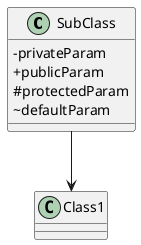
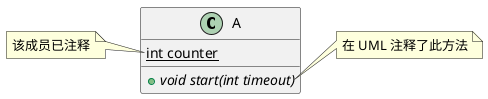
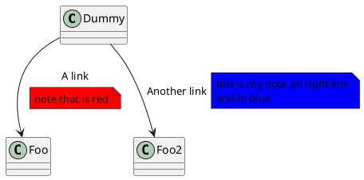

[使用简单的文字描述画UML图的开源工具。](https://plantuml.com/zh/)

## Class Diagram


框架. 使用 +-#~ 而不是几何
```
@startuml
skinparam classAttributeIconSize 0
@enduml
```

![[attachments/Pasted image 20240105160936.png]]





