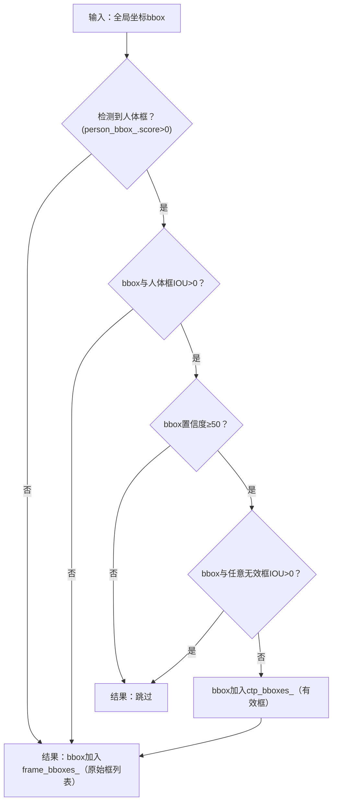

## 2026-03-17

#### vscode 环境配置

在 colcon 的配置中出现坑
解决：source /opt/ros/humble/setup.zsh
原因是 未加载 ROS2 基础环境
实际上这个问题在 文档`zsh 配置`， .zshrc `source install/setup.zsh` 这行中处理过

// 1. 定义回调函数（自己写的逻辑）
```cpp
void print_result(int result) {
    std::cout << "计算结果：" << result << std::endl;
}
```

// 2. 调度者函数（接收回调函数指针）
```cpp
void calculate(int a, int b, void (*callback)(int)) {
    int res = a + b;
    // 满足条件时，调用回调函数（反向调用）
    callback(res); 
}
```


#todo 
 
wait_for 的 p 本质是「带超时的条件检查器」，它的执行逻辑比普通 wait 多了 “超时判断”：
调用 wait_for 时，先加锁执行 p()：
如果 p() 返回 true：直接返回 std::cv_status::no_timeout，不进入等待；
如果 p() 返回 false：解锁互斥锁，进入等待状态。
等待过程中，触发以下任一条件会唤醒并重新加锁：
其他线程调用 notify_one()/notify_all()（被唤醒）；
等待时间达到 rel_time（超时）。
唤醒 / 超时后，再次执行 p()：
如果 p() 返回 true：返回 std::cv_status::no_timeout，继续执行后续逻辑；
如果 p() 返回 false：
若因「超时」唤醒：返回 std::cv_status::timeout；
若因「notify」唤醒（虚假唤醒）：重新解锁等待，直到超时或 p() 为 true。
一句话总结：wait_for(lock, time, p) 等价于while (!p()) { if (wait_for(lock, time) == timeout) break; }

```cpp
{
    std::unique_lock<std::mutex> lock(ball_det_info->frame_mtx_); // 自动上锁
    ball_det_info->frame_cv_.wait_for( lock, std::chrono::milliseconds(10), [&ball_det_info, stoken]() {
        return !rclcpp::ok() || !ball_det_info->img_msg_list_.empty() || stoken.stop_requested();
    });
    
    if (ball_det_info->img_msg_list_.empty())
    {
        lock.unlock();
        continue;
    }
    else if (!rclcpp::ok() || stoken.stop_requested())
    {
        break;
    }
    
    // 获取图像队列
    nv12_data_info = std::move(ball_det_info->img_msg_list_.front());
    ball_det_info->img_msg_list_.pop_front();
}
```
这段代码是 ROS2 环境下线程安全的图像数据消费逻辑，核心结合了「条件变量超时等待」「互斥锁」「停止令牌」来控制线程的 “等待” 和 “工作” 时机。我会逐行拆解，明确告诉你：什么时候本线程进入等待，什么时候退出等待开始工作。
先明确核心背景
这段代码运行在一个消费线程中（比如你之前提到的 exec_detect_loopPub 循环里）：
ball_det_info：包含图像队列（img_msg_list_）、互斥锁（frame_mtx_）、条件变量（frame_cv_）的结构体 / 类对象；
img_msg_list_：生产者线程（比如图像订阅线程）往这个队列里放图像数据，当前线程（消费者）从队列取数据；
stoken：std::stop_token（C++20），用于优雅停止线程；
rclcpp::ok()：ROS2 节点是否正常运行的标志。
逐段解析：等待 vs 工作的时机
1. 加锁 + 条件变量超时等待（核心等待逻辑）
```cpp
std::unique_lock<std::mutex> lock(ball_det_info->frame_mtx_); // 自动上锁
ball_det_info->frame_cv_.wait_for( 
    lock, 
    std::chrono::milliseconds(10),  // 最多等10ms
    [&ball_det_info, stoken]() {    // 谓词p：唤醒条件
        return !rclcpp::ok() || !ball_det_info->img_msg_list_.empty() || stoken.stop_requested();
    }
);
```
✅ 「本线程进入等待」的时机
当调用 wait_for 时，谓词 p 返回 false（即以下条件全不满足）：
rclcpp::ok() 为 true（ROS2 节点正常运行）；
ball_det_info->img_msg_list_.empty() 为 true（图像队列为空，没有数据可消费）；
stoken.stop_requested() 为 false（没有收到停止线程的请求）。
此时本线程会：
自动解锁 frame_mtx_（避免阻塞生产者往队列放数据）；
进入休眠等待状态，让出 CPU 给其他线程（比如生产者线程）；
等待最多 10ms，或被以下事件唤醒：
生产者往 img_msg_list_ 放了数据，调用 frame_cv_.notify_one()/notify_all()；
线程收到停止请求（stoken.stop_requested() 变为 true）；
ROS2 节点退出（rclcpp::ok() 变为 false）；
等待满 10ms（超时）。
✅ 「本线程退出等待」的时机
满足以下任一条件，线程会被唤醒并重新加锁 frame_mtx_，退出等待：
队列有数据：img_msg_list_ 非空（核心工作条件）；
线程需要停止：stoken.stop_requested() 为 true 或 ROS2 节点退出（!rclcpp::ok()）；
等待超时：哪怕以上条件都不满足，等满 10ms 也会退出等待（避免线程永久休眠）。
2. 退出等待后的分支判断（决定继续等 / 停止 / 开始工作）
```cpp
// 分支1：队列仍为空 → 继续等待
if (ball_det_info->img_msg_list_.empty())
{
    lock.unlock(); // 手动解锁（可选，unique_lock析构也会解）
    continue;      // 回到循环开头，重新进入wait_for等待
}
// 分支2：需要停止线程 → 退出循环
else if (!rclcpp::ok() || stoken.stop_requested())
{
    break; // 退出整个循环，本线程结束工作
}

// 分支3：队列有数据（以上分支都不满足）→ 本线程开始工作
nv12_data_info = std::move(ball_det_info->img_msg_list_.front()); // 取队列首元素
ball_det_info->img_msg_list_.pop_front(); // 从队列移除已消费的元素
```

各分支的 “等待 / 工作” 逻辑：
表格
分支	触发条件	线程行为
分支 1（continue）	退出等待后队列仍为空（比如超时唤醒）	解锁 → 回到循环开头 → 重新等待
分支 2（break）	需要停止线程（停止请求 / 节点退出）	退出循环 → 本线程停止工作
分支 3（取数据）	队列有数据，且线程无需停止	取出队列数据 → 本线程开始处理数据（工作）


```cpp
template<typename ParameterT>
auto
LifecycleNode::declare_parameter(
  const std::string & name,
  const ParameterT & default_value,
  const rcl_interfaces::msg::ParameterDescriptor & parameter_descriptor,
  bool ignore_override)
{
  return this->declare_parameter(
    name,
    rclcpp::ParameterValue(default_value),
    parameter_descriptor,
    ignore_override
  ).get<ParameterT>();
}
```


关键细节补充
为什么要加 10ms 超时？避免线程因 “虚假唤醒” 或 “生产者忘记 notify” 而永久休眠 —— 哪怕没有任何事件，每 10ms 线程会主动醒来检查一次队列，保证逻辑不卡死。
为什么谓词要包含 !rclcpp::ok() 和 stoken？保证线程能 “及时响应停止请求”：哪怕队列为空，只要收到停止信号或节点退出，线程会立即退出等待，而不是等满 10ms，实现优雅停止。
std::move 的作用？避免图像数据的拷贝（图像数据量大），提升性能 —— 将队列首元素的所有权转移给 nv12_data_info，而非复制，是高性能消费的最佳实践。
总结
这段代码的 “等待 / 工作” 核心规则：
等待时机：队列空、线程无需停止 → 解锁休眠，最多等 10ms，让生产者线程有时间放数据；
退出等待时机：队列有数据 / 线程需停止 / 等待超时；
工作时机：退出等待后队列非空、线程无需停止 → 取出队列数据，本线程开始处理；
停止时机：收到停止请求或 ROS2 节点退出 → 立即结束线程。
简单来说：本线程 “等” 的是生产者放数据，“工作” 的是消费数据，“停” 的是收到停止信号，全程通过互斥锁保证队列的线程安全，通过条件变量和超时避免卡死。


非极大值抑制，全称 Non-Maximum Suppression，简称 NMS
一句话概括：在一堆重叠的候选框里，只保留得分最高、最准确的那个框，删掉其他重复多余的框。

- [x] 初步了解opencv 库 ✅ 2026-03-19

## 2026-03-18

hierarchy 变量最常见的场景是在 OpenCV 查找轮廓的函数（如 `cv::findContours`）中，用于存储轮廓的**层级关系**：

- `cv::Vec4i` 的 4 个整数分别对应：
    1. 同一层级下的下一个轮廓索引
    2. 同一层级下的上一个轮廓索引
    3. 子轮廓的索引
    4. 父轮廓的索引


`cv::Moments` 是 OpenCV 中用于**存储图像几何矩（几何特征）** 的**结构体（struct）**，而非基础数据类型（如 int/float）或类（class）。它封装了图像的零阶矩、一阶矩、二阶矩、三阶矩等所有矩信息，是分析图像轮廓 / 区域形状特征（如质心、面积、方向、椭圆拟合等）的核心数据结构

空间矩 spatial moments $m_{ji}$
中心矩 central moments $mu_{ji}$
归一化中心矩 normalized central moments $nu_{ji}$


```cpp
bool is_coming_update = false;
bool is_coming_matched = false;

if (this->court_mode_index_ == CourtIndex::POSE)
{
    Ball2D new_coming_ball2d;
    is_coming_matched = get_ball_pt(new_coming_ball2d, trajectory_coming_,
                                    pre_img_time_, pre_frame_index_, false);
    pre_coming_ball2d_ = coming_ball2d_;
    coming_ball2d_ = new_coming_ball2d;
    is_coming_update = update_trajectory(trajectory_coming_, coming_ball2d_,
                                         pre_coming_ball2d_, false);
}
if (!is_coming_update && !is_coming_matched) {...} // 这一段是回球
```

通常来说两个 flag 的值应该是相同的, 但是为了处理 *大模型的误检*:
- 当出现误检时, 会有 matched = true 但 没有新球心的值的情况
- 此时在 update_trajectory() 的流程中, 会因为检测的没有新球心(还是默认值) 而提前退出返回 false(不更新误检的球心, 而是跳过)
- 误检时 计算得到的 置信度为特殊值 999.0


int5, x1, y1 左下, x2, y2 右下, score. 适配 opencv 的框

- [x] default ctor 的行为 ✅ 2026-03-18
- [ ] 正态分布
- [x] using typedef ✅ 2026-03-18
- [ ] 贪心
 - [ ] cond v, mutex
 - [x] jthread: msg_process_thread2_ = std::make_shared<std::jthread>([this]() {this->exec_detect_loopPub(ball_det_info2_, stop_source_.get_token());}); ✅ 2026-03-19

## 2026-03-19
- [x] Point2d3d ✅ 2026-03-19

ParamsAdapter 是一个检测 contour 时用到的参数设置器, 视情况快速(动态?)调整参数大小
```cpp
// 在成功匹配 best球心目标框后会调用 update_params 更新所有参数
if (best_match_id != -1 
    && static_cast<size_t>(best_match_id) < match_ball_contours_.size() 
    && !match_ball_contours_[best_match_id].empty())
{
    cparams_adapter_->update_params(match_ball_contours_[best_match_id],
        node_info_->img_width, node_info_->img_height);
}
```

```cpp
// mean
param.mean = (1 - param.alpha) * param.mean + param.alpha * value;
// 方差
param.var = (1 - param.alpha) * param.var  + param.alpha * (value - old_mean) * (value - param.mean);
// 标准差
double std_var = std::sqrt(param.var);
std_var < param.mean * 0.5 ? std_var = param.mean * 0.5 : std_var; // 标准差小于均值的1/2时，取0.5倍均值
```

- 每个参数都有个指数衰减系数 $\alpha$, α 通常取 0.01~0.3 之间（比如 0.1），α 越小，均值 / 方差越平滑（对突发值不敏感）；α 越大，越贴近当前值（对突发值敏感）
- 基础方差递推公式：$$ \sigma_{n+1}^2 = \left(1 - \frac{1}{n+1}\right)\sigma_n^2 + \frac{1}{n+1}(x_{n+1} - \mu_n)(x_{n+1} - \mu_{n+1}) $$
- 方差用到了[方差递推公式](https://liuyvjin.github.io/%E5%9D%87%E5%80%BC-%E6%96%B9%E5%B7%AE%E9%80%92%E6%8E%A8%E5%85%AC%E5%BC%8F/), 代码中的公式是基础递推公式的**指数移动平均（EMA）变种**, 将权重 $\frac{1}{n+1}$ 换成衰减系数
- 直接用 `(value - 新均值)²` 递推会有误差，因此优化为 `(value - 旧均值) × (value - 新均值)`（数学上等价于偏差平方的近似，且计算更高效）
- 强制0.5: 避免标准差过小（比如趋近于 0）导致后续依赖标准差的计算（如归一化、阈值判断）出现异常

- [ ] casting
- [ ] 模板特化
- [ ] 笔记库: 均值, 方差, 标准差
- [x] 匿名函数 ✅ 2026-03-19

- [x] `auto dfs = [&](this auto&& dfs, int a) {...}` 这里的 `this` 是 lambda 自引用 ✅ 2026-03-19

`std::stop_token` 是 C++20 引入的 “停止令牌”，配合 `std::stop_source`（停止源）使用：
- `std::stop_source` 负责**发起停止请求**（调用 `request_stop()`）；
- `std::stop_token` 是 `stop_source` 的 “只读视图”，通过 `stop_requested()` 可以**查询是否收到停止请求**；

- [ ] std::map
- [x] jthread ✅ 2026-03-19
- [x] unique_lock, lock_guard ✅ 2026-03-19

```cpp
msg_process_thread1_ = std::make_shared<std::jthread>([this]() {this->exec_detect_loopPub(ball_det_info1_, stop_source_.get_token());});
``` 
- `make_shared<std::jthread>` 高效创建并自动管理线程内存
- 括号内的 `[...]()` 是线程的**入口可调用对象**（Lambda 表达式）——`std::jthread` 构造时会立即启动线程，执行 Lambda 内的逻辑。


测试: 2026-03-19 16:54 周四

if (零拷贝 && 真实相机发送) { 球的轨迹检测不到 }

在相机数据发送到处理程序的过程中有两次拷贝, 一次是在地平线的api 中, 第二次是我们自己的算法中, 推测问题出现在第二次. 

- [ ] static_pointer_cast

## 2026-03-20

#### ball_detection 流程

单帧处理核心函数入口: main -> BallDetectNode ctor -> handle_activate() -> 线程构造时的**入口可调用对象** exec_detect_loopPub() -> image_process() -> process_ball()

`init_algorithm()`
- 重置各 api 执行用时记录
- 设置相机编号和场地编号
- 初始化 Tracker, BgIterator, crop_info_
    - `init_crop_area()` 根据相机确定不同的crop_info_(裁剪区域)

`get_person_bbox(frame_index)`
- 根据帧号, 从 pose_detect_node 获取对应的人体目标框帧
- 如果没有对应的这一帧(ball_detect节点跑得更快), 就获取目前的最新帧
- 用到的及之前的 人体目标框帧会从队列中移除(不再会用到, 减小开支)

`update_trajectory_state()`
- 更新一些布尔值成员变量(是否已有回球, 球心是否接近/进入人体目标框)

`bg_iterator_->image_process(nv12_data, crop_info_);` 找到运动的目标框
- 图片转为灰度图 (减小开支)
- 三帧差
    - 使用 crop_info_ 裁剪本帧, 前一帧, 前两帧的灰度图
    - crop 后通过 .clone, 返回重排后内存连续的图像拷贝
    - (0, -1), (-2, -1) 帧生成差值图像, 取其中小的高斯模糊
    - 按预设的阈值转为二值图, 返回二值图
- `get_contours(cv: :Mat& fg_img, const CropInfo& crop_info)`
    - 用 findContours 寻找上一步二值图所有的最外层轮廓
    - 根据 crop_info_ 还原在全图的坐标

`filter_contours(index_, bg_iterator_->frame_contours_);` 过滤得到像球的轮廓
- 一共会有两次 match_contour 的调用
    - 第一次是以上次确定的参数
    - 如果没有成功匹配, 第二次以默认参数值再次匹配
- `match_contour` 
    - 获取轮廓的 moments(几何特征)
    - 根据面积, 轮廓密度, 外接矩型宽高比, 圆形度找出像网球的轮廓
    - 如果没匹配到则会放宽参数
- `filter_contours_by_area` 使用预测球心过滤轮廓
    - 回球
        - 方向不一致的直接跳过
        - 在前一帧或前两帧的预测框(is_in_rectangle)内则加入结果列表
    - 来球
        - 如果接近人体目标框 bbox, 则保留所有轮廓
        - 方向不一致或进入 bbox 跳过
        - 在前一帧或前两帧的预测框(is_in_rectangle)内则加入结果列表
    - else 保留所有 (表示是轨迹初始状态)
- 结果保存: `filtered_contours_`

`greed_get_roi`
- 加入每个 contour 自己的 roi
- 对每个 contour, 如果能与剩下所有 contour 在一个 roi, 加入此 roi
- 网球可能在的 roi 结果保存: `rois_`

`detect_roi`
- `detect_roi_by_model` 用指定模型检测单帧的所有 roi


文件名改了之后 pull 了一下, 要 sh cross_colcon.sh 重新编译. 以后记得用 fetch

- [x] 深入了解三帧差 ✅ 2026-03-20
- [ ] htop 红中断 绿调用 橙预留 中断高

1帧2帧 diff 得到 1球2球
2帧3帧 diff 得到 2球3球
两个 diff 取 min, 相当于取交集, 得到 2 球, 也就是目标球
高斯模糊去噪

```cpp
// detect_roi_by_model
for (int i = 0; i < roi_num; ++i)
{ // 使用图片生成pym, NV12PyramidInput为DNNInput的子类
    std::shared_ptr<hobot::dnn_node::NV12PyramidInput> pyramid = nullptr;
    uint32_t out_img_width = roi_imgs[i].cols;
    uint32_t out_img_height = roi_imgs[i].rows * 2 / 3;
    pyramid = hobot::dnn_node::ImageProc::GetNV12PyramidFromNV12Img(
        reinterpret_cast<const char *>(roi_imgs[i].data),
        out_img_height,
        out_img_width,
        rois_[i].height,
        rois_[i].width);
    if (!pyramid)
    {
        RCLCPP_ERROR(rclcpp::get_logger("ball_detection"), "Getting nv12 pyramid failed!");
        return;
    }

    struct timespec time_start = {0, 0};
    clock_gettime(CLOCK_REALTIME, &time_start);
    auto time_stamp = ConvertToRosTime(time_start);
    long ts_us = time_start.tv_sec * 1000000 + time_start.tv_nsec;
    roi_xys[ts_us] = std::make_pair(rois_[i].x, rois_[i].y);

    // 使用pyramid创建DNNInput对象inputs
    auto inputs = std::vector<std::shared_ptr<DNNInput>>{pyramid};
    auto dnn_output = std::make_shared<DnnExampleOutput>();
    dnn_output->msg_header = std::make_shared<std_msgs::msg::Header>();
    dnn_output->msg_header->set__frame_id(std::to_string(index_));
    dnn_output->msg_header->set__stamp(time_stamp);
    // 开始预测
    uint32_t ret = dnn_node->Run(inputs, dnn_output, nullptr, false);
    // 处理预测结果, 如渲染到图片或者发布预测结果
    if (ret != 0)
    {
        RCLCPP_ERROR(rclcpp::get_logger("ball_detection"), "Run predict failed!");
        return;
    }
}

```
`NV12PyramidInput` 是 `DNNInput` 的子类，说明这是为 DNN 推理准备的输入数据格式（NV12 是图像的 YUV 格式，Pyramid 表示金字塔 / 多尺度，适合多尺度检测

`GetNV12PyramidFromNV12Img` 是厂商（如地平线 hobot）提供的图像处理工具函数，作用是将原始 NV12 格式的 ROI 图像**转换为 DNN 推理需要的「NV12 金字塔」格式**（多尺度图像，适合检测不同大小的目标）得到  `std::shared_ptr<hobot::dnn_node::NV12PyramidInput>`
```cpp
std::shared_ptr<hobot::dnn_node::NV12PyramidInput> pyramid = nullptr;
pyramid = hobot::dnn_node::ImageProc::GetNV12PyramidFromNV12Img()
```


测试 x2
## 2026-03-23

潜在问题
- `ts_us` 计算错误：`time_start.tv_nsec` 是纳秒，直接相加会导致数值溢出，正确应为 `time_start.tv_sec * 1000000 + time_start.tv_nsec / 1000`；
- `return` 过于激进：单个 ROI 推理失败就退出整个循环，可改为跳过当前 ROI 继续处理下一个（根据业务需求调整）；

核心预测代码:
```cpp
// 开始预测
uint32_t ret = dnn_node->Run(inputs, dnn_output, nullptr, false);
```

图像金字塔是一种**多尺度图像表示方法**，核心是把同一张图像按不同分辨率（尺寸）生成一组图像，形状像「金字塔」—— 底部是原始高分辨率图像，往上每层图像的宽高都按固定比例（通常是 1/2）缩小，分辨率逐级降低。

```
直观例子（3 层金字塔）：
原始图像（第0层）：800×600 → 第1层：400×300 → 第2层：200×150
```

每层图像都是上一层的「下采样」（缩小）结果，所有层合起来就是「图像金字塔」。


在 AI/DNN 推理场景中，金字塔主要分两种

| 类型                 | 核心特点                               | 典型用途           |
| ------------------ | ---------------------------------- | -------------- |
| 高斯金字塔（Gaussian）    | 对图像逐层高斯模糊 + 下采样（缩小），每层都是模糊后的低分辨率版本 | 多尺度目标检测、图像融合   |
| 拉普拉斯金字塔（Laplacian） | 基于高斯金字塔的「残差图像」（存储高斯金字塔层间的细节差异）     | 图像重建、超分辨率、边缘检测 |

代码中的「NV12Pyramid」
- `NV12`：是图像的色彩格式（YUV420SP），嵌入式 AI 芯片（如地平线、海思）的主流输入格式；
- `NV12Pyramid`：本质是**NV12 格式的高斯金字塔**，即把 NV12 图像按不同分辨率生成多尺度版本，打包成 DNN 可直接读取的格式；
- 为什么不用 RGB？嵌入式 AI 芯片对 NV12 的处理效率远高于 RGB，且 NV12 占用内存更小（仅为 RGB 的 1/2）。
- 金字塔的层数：通常由 DNN 模型决定（比如球类检测模型配置 3 层：640×480、320×240、160×120）

cv:Rect 的 x, y 是 top-left

`roi_xys`中取出该时间戳对应的 ROI 在图像中的**左上角全局坐标**

[C++设计模式--PIMPL - 平凡人 - 博客园](https://www.cnblogs.com/jiaping/p/19498619)

`detect_roi` 在 roi 中检测网球目标框
- `detect_roi_by_model` 用指定模型检测单帧的所有 roi
    - 输入: nv12_data, 输出: {time_stamp: 单帧所有roi}
        - 将 nv12_data 转换为 cv:Mat 格式 
        - 使用 `GetNV12PyramidFromNV12Img` 将 cv:Mat 转为大模型需要的 `NV12PyramidInput` 格式. 
        - 重置和设置 dnn_node (使用的大模型) 参数
        - 执行 dnn 推理, 保存单帧**目标框**到 `dnn_node->ts_det_rois_`
    - 再次过滤目标框
        - 坐标映射：相对坐标 → 全局坐标
            - DNN 检测的是 ROI 内的目标，坐标是「ROI 内的相对值」，需要加上 ROI 在图像中的全局坐标（roi_x/roi_y），才能得到「图像全局坐标」
        - 筛选掉(与人框重叠&&(目标框置信度<50 || 与无效框重叠) 的框
            - [[#detect_roi_by_model 后半段流程]]
        - nms (非极大值抑制) 去除重复目标框, 只保留分数高的


`match_bbox()` 用轮廓匹配目标框
- 过滤与无效框(invalid_bbox) 重叠的框
- 通过「轮廓几何匹配（IOU / 面积 / 中心距离）」筛选与网球轮廓匹配的框；
    - `cv::minAreaRect` 取得轮廓的最小旋转矩形
- 对轮廓匹配失败的框，进一步通过「轨迹预测（直线距离 / 垂直距离）」补充匹配
##### detect_roi_by_model 后半段流程



## 2026-03-24