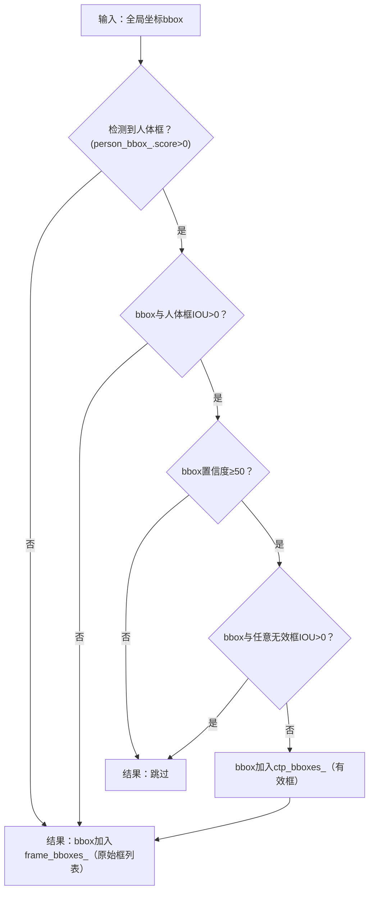

```dataview
task from "logging"
```

nas 密码: 713027
## week 1

docker 权限问题, /var/run/docker.sock 拥有者应为 root, 组 docker (一开始没走 sop 导致的)

docker exec -it tennis /bin/zsh

 - [x] gpasswd -a $USER docker ✅ 2026-03-25

`gpasswd` Linux 管理**用户组**的命令，专门用来给用户添加(-a) / 删除组权限

#### vscode 环境配置

在 colcon 的配置中出现坑
解决：source /opt/ros/humble/setup.zsh
原因是 未加载 ROS2 基础环境
实际上这个问题在 文档`zsh 配置`， .zshrc `source install/setup.zsh` 这行中处理过

// 1. 定义回调函数（自己写的逻辑）
```cpp
void print_result(int result) {
    std::cout << "计算结果：" << result << std::endl;
}
```

// 2. 调度者函数（接收回调函数指针）
```cpp
void calculate(int a, int b, void (*callback)(int)) {
    int res = a + b;
    // 满足条件时，调用回调函数（反向调用）
    callback(res); 
}
```


#todo 
 
wait_for 的 p 本质是「带超时的条件检查器」，它的执行逻辑比普通 wait 多了 “超时判断”：
调用 wait_for 时，先加锁执行 p()：
如果 p() 返回 true：直接返回 std::cv_status::no_timeout，不进入等待；
如果 p() 返回 false：解锁互斥锁，进入等待状态。
等待过程中，触发以下任一条件会唤醒并重新加锁：
其他线程调用 notify_one()/notify_all()（被唤醒）；
等待时间达到 rel_time（超时）。
唤醒 / 超时后，再次执行 p()：
如果 p() 返回 true：返回 std::cv_status::no_timeout，继续执行后续逻辑；
如果 p() 返回 false：
若因「超时」唤醒：返回 std::cv_status::timeout；
若因「notify」唤醒（虚假唤醒）：重新解锁等待，直到超时或 p() 为 true。
一句话总结：wait_for(lock, time, p) 等价于while (!p()) { if (wait_for(lock, time) == timeout) break; }

```cpp
{
    std::unique_lock<std::mutex> lock(ball_det_info->frame_mtx_); // 自动上锁
    ball_det_info->frame_cv_.wait_for( lock, std::chrono::milliseconds(10), [&ball_det_info, stoken]() {
        return !rclcpp::ok() || !ball_det_info->img_msg_list_.empty() || stoken.stop_requested();
    });
    
    if (ball_det_info->img_msg_list_.empty())
    {
        lock.unlock();
        continue;
    }
    else if (!rclcpp::ok() || stoken.stop_requested())
    {
        break;
    }
    
    // 获取图像队列
    nv12_data_info = std::move(ball_det_info->img_msg_list_.front());
    ball_det_info->img_msg_list_.pop_front();
}
```
这段代码是 ROS2 环境下线程安全的图像数据消费逻辑，核心结合了「条件变量超时等待」「互斥锁」「停止令牌」来控制线程的 “等待” 和 “工作” 时机。我会逐行拆解，明确告诉你：什么时候本线程进入等待，什么时候退出等待开始工作。
先明确核心背景
这段代码运行在一个消费线程中（比如你之前提到的 exec_detect_loopPub 循环里）：
ball_det_info：包含图像队列（img_msg_list_）、互斥锁（frame_mtx_）、条件变量（frame_cv_）的结构体 / 类对象；
img_msg_list_：生产者线程（比如图像订阅线程）往这个队列里放图像数据，当前线程（消费者）从队列取数据；
stoken：std::stop_token（C++20），用于优雅停止线程；
rclcpp::ok()：ROS2 节点是否正常运行的标志。
逐段解析：等待 vs 工作的时机
1. 加锁 + 条件变量超时等待（核心等待逻辑）
```cpp
std::unique_lock<std::mutex> lock(ball_det_info->frame_mtx_); // 自动上锁
ball_det_info->frame_cv_.wait_for( 
    lock, 
    std::chrono::milliseconds(10),  // 最多等10ms
    [&ball_det_info, stoken]() {    // 谓词p：唤醒条件
        return !rclcpp::ok() || !ball_det_info->img_msg_list_.empty() || stoken.stop_requested();
    }
);
```
✅ 「本线程进入等待」的时机
当调用 wait_for 时，谓词 p 返回 false（即以下条件全不满足）：
rclcpp::ok() 为 true（ROS2 节点正常运行）；
ball_det_info->img_msg_list_.empty() 为 true（图像队列为空，没有数据可消费）；
stoken.stop_requested() 为 false（没有收到停止线程的请求）。
此时本线程会：
自动解锁 frame_mtx_（避免阻塞生产者往队列放数据）；
进入休眠等待状态，让出 CPU 给其他线程（比如生产者线程）；
等待最多 10ms，或被以下事件唤醒：
生产者往 img_msg_list_ 放了数据，调用 frame_cv_.notify_one()/notify_all()；
线程收到停止请求（stoken.stop_requested() 变为 true）；
ROS2 节点退出（rclcpp::ok() 变为 false）；
等待满 10ms（超时）。
✅ 「本线程退出等待」的时机
满足以下任一条件，线程会被唤醒并重新加锁 frame_mtx_，退出等待：
队列有数据：img_msg_list_ 非空（核心工作条件）；
线程需要停止：stoken.stop_requested() 为 true 或 ROS2 节点退出（!rclcpp::ok()）；
等待超时：哪怕以上条件都不满足，等满 10ms 也会退出等待（避免线程永久休眠）。
2. 退出等待后的分支判断（决定继续等 / 停止 / 开始工作）
```cpp
// 分支1：队列仍为空 → 继续等待
if (ball_det_info->img_msg_list_.empty())
{
    lock.unlock(); // 手动解锁（可选，unique_lock析构也会解）
    continue;      // 回到循环开头，重新进入wait_for等待
}
// 分支2：需要停止线程 → 退出循环
else if (!rclcpp::ok() || stoken.stop_requested())
{
    break; // 退出整个循环，本线程结束工作
}

// 分支3：队列有数据（以上分支都不满足）→ 本线程开始工作
nv12_data_info = std::move(ball_det_info->img_msg_list_.front()); // 取队列首元素
ball_det_info->img_msg_list_.pop_front(); // 从队列移除已消费的元素
```

各分支的 “等待 / 工作” 逻辑：
表格
分支	触发条件	线程行为
分支 1（continue）	退出等待后队列仍为空（比如超时唤醒）	解锁 → 回到循环开头 → 重新等待
分支 2（break）	需要停止线程（停止请求 / 节点退出）	退出循环 → 本线程停止工作
分支 3（取数据）	队列有数据，且线程无需停止	取出队列数据 → 本线程开始处理数据（工作）


```cpp
template<typename ParameterT>
auto
LifecycleNode::declare_parameter(
  const std::string & name,
  const ParameterT & default_value,
  const rcl_interfaces::msg::ParameterDescriptor & parameter_descriptor,
  bool ignore_override)
{
  return this->declare_parameter(
    name,
    rclcpp::ParameterValue(default_value),
    parameter_descriptor,
    ignore_override
  ).get<ParameterT>();
}
```


关键细节补充
为什么要加 10ms 超时？避免线程因 “虚假唤醒” 或 “生产者忘记 notify” 而永久休眠 —— 哪怕没有任何事件，每 10ms 线程会主动醒来检查一次队列，保证逻辑不卡死。
为什么谓词要包含 !rclcpp::ok() 和 stoken？保证线程能 “及时响应停止请求”：哪怕队列为空，只要收到停止信号或节点退出，线程会立即退出等待，而不是等满 10ms，实现优雅停止。
std::move 的作用？避免图像数据的拷贝（图像数据量大），提升性能 —— 将队列首元素的所有权转移给 nv12_data_info，而非复制，是高性能消费的最佳实践。
总结
这段代码的 “等待 / 工作” 核心规则：
等待时机：队列空、线程无需停止 → 解锁休眠，最多等 10ms，让生产者线程有时间放数据；
退出等待时机：队列有数据 / 线程需停止 / 等待超时；
工作时机：退出等待后队列非空、线程无需停止 → 取出队列数据，本线程开始处理；
停止时机：收到停止请求或 ROS2 节点退出 → 立即结束线程。
简单来说：本线程 “等” 的是生产者放数据，“工作” 的是消费数据，“停” 的是收到停止信号，全程通过互斥锁保证队列的线程安全，通过条件变量和超时避免卡死。


非极大值抑制，全称 Non-Maximum Suppression，简称 NMS
一句话概括：在一堆重叠的候选框里，只保留得分最高、最准确的那个框，删掉其他重复多余的框。

- [x] 初步了解opencv 库 ✅ 2026-03-19


hierarchy 变量最常见的场景是在 OpenCV 查找轮廓的函数（如 `cv::findContours`）中，用于存储轮廓的**层级关系**：

- `cv::Vec4i` 的 4 个整数分别对应：
    1. 同一层级下的下一个轮廓索引
    2. 同一层级下的上一个轮廓索引
    3. 子轮廓的索引
    4. 父轮廓的索引


`cv::Moments` 是 OpenCV 中用于**存储图像几何矩（几何特征）** 的**结构体（struct）**，而非基础数据类型（如 int/float）或类（class）。它封装了图像的零阶矩、一阶矩、二阶矩、三阶矩等所有矩信息，是分析图像轮廓 / 区域形状特征（如质心、面积、方向、椭圆拟合等）的核心数据结构

空间矩 spatial moments $m_{ji}$
中心矩 central moments $mu_{ji}$
归一化中心矩 normalized central moments $nu_{ji}$


```cpp
bool is_coming_update = false;
bool is_coming_matched = false;

if (this->court_mode_index_ == CourtIndex: :POSE)
{
    Ball2D new_coming_ball2d;
    is_coming_matched = get_ball_pt(new_coming_ball2d, trajectory_coming_,
                                    pre_img_time_, pre_frame_index_, false);
    pre_coming_ball2d_ = coming_ball2d_;
    coming_ball2d_ = new_coming_ball2d;
    is_coming_update = update_trajectory(trajectory_coming_, coming_ball2d_,
                                         pre_coming_ball2d_, false);
}
if (!is_coming_update && !is_coming_matched) {...} // 这一段是回球
```

通常来说两个 flag 的值应该是相同的, 但是为了处理 *大模型的误检*:
- 当出现误检时, 会有 matched = true 但 没有新球心的值的情况
- 此时在 update_trajectory() 的流程中, 会因为检测的没有新球心(还是默认值) 而提前退出返回 false(不更新误检的球心, 而是跳过)
- 误检时 计算得到的 置信度为特殊值 999.0


int5, x1, y1 左下, x2, y2 右下, score. 适配 opencv 的框

- [x] default ctor 的行为 ✅ 2026-03-18
- [x] 正态分布 ✅ 2026-03-23
- [x] using typedef ✅ 2026-03-18
- [ ] 贪心
- [ ] cond v, mutex
- [x] jthread: `msg_process_thread2_ = std::make_shared<std::jthread>([this]() {this->exec_detect_loopPub(ball_det_info2_, stop_source_.get_token());});` ✅ 2026-03-19

- [x] Point2d3d ✅ 2026-03-19

ParamsAdapter 是一个检测 contour 时用到的参数设置器, 视情况快速(动态?)调整参数大小
```cpp
// 在成功匹配 best球心目标框后会调用 update_params 更新所有参数
if (best_match_id != -1 
    && static_cast<size_t>(best_match_id) < match_ball_contours_.size() 
    && !match_ball_contours_[best_match_id].empty())
{
    cparams_adapter_->update_params(match_ball_contours_[best_match_id],
        node_info_->img_width, node_info_->img_height);
}
```

```cpp
// mean
param.mean = (1 - param.alpha) * param.mean + param.alpha * value;
// 方差
param.var = (1 - param.alpha) * param.var  + param.alpha * (value - old_mean) * (value - param.mean);
// 标准差
double std_var = std::sqrt(param.var);
std_var < param.mean * 0.5 ? std_var = param.mean * 0.5 : std_var; // 标准差小于均值的1/2时，取0.5倍均值
```

- 每个参数都有指数衰减系数 $\alpha$, α 通常取 0.01~0.3 之间（比如 0.1），α 越小，均值 / 方差越平滑（对突发值不敏感）；α 越大，越贴近当前值（对突发值敏感）
- 基础方差递推公式：$$ \sigma_{n+1}^2 = \left(1 - \frac{1}{n+1}\right)\sigma_n^2 + \frac{1}{n+1}(x_{n+1} - \mu_n)(x_{n+1} - \mu_{n+1}) $$
- 方差用到了[方差递推公式](https://liuyvjin.github.io/%E5%9D%87%E5%80%BC-%E6%96%B9%E5%B7%AE%E9%80%92%E6%8E%A8%E5%85%AC%E5%BC%8F/), 代码中的公式是基础递推公式的**指数移动平均（EMA）变种**, 将权重 $\frac{1}{n+1}$ 换成衰减系数
- 直接用 `(value - 新均值)²` 递推会有误差，因此优化为 `(value - 旧均值) × (value - 新均值)`（数学上等价于偏差平方的近似，且计算更高效）
- 强制0.5: 避免标准差过小（比如趋近于 0）导致后续依赖标准差的计算（如归一化、阈值判断）出现异常

- [x] casting
- [ ] 模板特化
- [x] 笔记库: 均值, 方差, 标准差
- [x] 匿名函数 ✅ 2026-03-19

- [x] `auto dfs = [&](this auto&& dfs, int a) {...}` 这里的 `this` 是 lambda 自引用 ✅ 2026-03-19

`std::stop_token` 是 C++20 引入的 “停止令牌”，配合 `std::stop_source`（停止源）使用：
- `std::stop_source` 负责**发起停止请求**（调用 `request_stop()`）；
- `std::stop_token` 是 `stop_source` 的 “只读视图”，通过 `stop_requested()` 可以**查询是否收到停止请求**；

- [ ] std::map
- [x] jthread ✅ 2026-03-19
- [x] unique_lock, lock_guard ✅ 2026-03-19

```cpp
msg_process_thread1_ = std::make_shared<std::jthread>([this]() {this->exec_detect_loopPub(ball_det_info1_, stop_source_.get_token());});
``` 
- `make_shared<std::jthread>` 高效创建并自动管理线程内存
- 括号内的 `[...]()` 是线程的**入口可调用对象**（Lambda 表达式）——`std::jthread` 构造时会立即启动线程，执行 Lambda 内的逻辑。


测试: 2026-03-19 16:54 周四

if (零拷贝 && 真实相机发送) { 球的轨迹检测不到 }

在相机数据发送到处理程序的过程中有两次拷贝, 一次是在地平线的api 中, 第二次是我们自己的算法中, 推测问题出现在第二次. 

- [ ] static_pointer_cast


#### ball_detection 流程

单帧处理核心函数入口: main -> BallDetectNode ctor -> handle_activate() -> 线程构造时的**入口可调用对象** exec_detect_loopPub() -> image_process() -> process_ball()

`init_algorithm()`
- 重置各 api 执行用时记录
- 设置相机编号和场地编号
- 初始化 Tracker, BgIterator, crop_info_
    - `init_crop_area()` 根据相机确定不同的crop_info_(裁剪区域)

`get_person_bbox(frame_index)`
- 根据帧号, 从 pose_detect_node 获取对应的人体目标框帧
- 如果没有对应的这一帧(ball_detect节点跑得更快), 就获取目前的最新帧
- 用到的及之前的 人体目标框帧会从队列中移除(不再会用到, 减小开支)

`update_trajectory_state()`
- 更新一些布尔值成员变量(是否已有回球, 球心是否接近/进入人体目标框)

`bg_iterator_->image_process(nv12_data, crop_info_);` 找到运动的目标框
- 图片转为灰度图 (减小开支)
- 三帧差
    - 使用 crop_info_ 裁剪本帧, 前一帧, 前两帧的灰度图
    - crop 后通过 .clone, 返回重排后内存连续的图像拷贝
    - (0, -1), (-2, -1) 帧生成差值图像, 取其中小的高斯模糊
    - 按预设的阈值转为二值图, 返回二值图
- `get_contours(cv: :Mat& fg_img, const CropInfo& crop_info)`
    - 用 findContours 寻找上一步二值图所有的最外层轮廓
    - 根据 crop_info_ 还原在全图的坐标

`filter_contours(index_, bg_iterator_->frame_contours_);` 过滤得到像球的轮廓
- 一共会有两次 match_contour 的调用
    - 第一次是以上次确定的参数
    - 如果没有成功匹配, 第二次以默认参数值再次匹配
- `match_contour` 
    - 获取轮廓的 moments(几何特征)
    - 根据面积, 轮廓密度, 外接矩型宽高比, 圆形度找出像网球的轮廓
    - 如果没匹配到则会放宽参数
- `filter_contours_by_area` 使用预测球心过滤轮廓
    - 回球
        - 方向不一致的直接跳过
        - 在前一帧或前两帧的预测框(is_in_rectangle)内则加入结果列表
    - 来球
        - 如果接近人体目标框 bbox, 则保留所有轮廓
        - 方向不一致或进入 bbox 跳过
        - 在前一帧或前两帧的预测框(is_in_rectangle)内则加入结果列表
    - else 保留所有 (表示是轨迹初始状态)
- 结果保存: `filtered_contours_`

`greed_get_roi`
- 加入每个 contour 自己的 roi
- 对每个 contour, 如果能与剩下所有 contour 在一个 roi, 加入此 roi
- 网球可能在的 roi 结果保存: `rois_`

`detect_roi`
- `detect_roi_by_model` 用指定模型检测单帧的所有 roi


文件名改了之后 pull 了一下, 要 sh cross_colcon.sh 重新编译. 以后记得用 fetch

- [x] 深入了解三帧差 ✅ 2026-03-20
- [ ] htop 红中断 绿调用 橙预留 中断高

1帧2帧 diff 得到 1球2球
2帧3帧 diff 得到 2球3球
两个 diff 取 min, 相当于取交集, 得到 2 球, 也就是目标球
高斯模糊去噪

```cpp
// detect_roi_by_model
for (int i = 0; i < roi_num; ++i)
{ // 使用图片生成pym, NV12PyramidInput为DNNInput的子类
    std::shared_ptr<hobot::dnn_node::NV12PyramidInput> pyramid = nullptr;
    uint32_t out_img_width = roi_imgs[i].cols;
    uint32_t out_img_height = roi_imgs[i].rows * 2 / 3;
    pyramid = hobot::dnn_node::ImageProc::GetNV12PyramidFromNV12Img(
        reinterpret_cast<const char *>(roi_imgs[i].data),
        out_img_height,
        out_img_width,
        rois_[i].height,
        rois_[i].width);
    if (!pyramid)
    {
        RCLCPP_ERROR(rclcpp::get_logger("ball_detection"), "Getting nv12 pyramid failed!");
        return;
    }

    struct timespec time_start = {0, 0};
    clock_gettime(CLOCK_REALTIME, &time_start);
    auto time_stamp = ConvertToRosTime(time_start);
    long ts_us = time_start.tv_sec * 1000000 + time_start.tv_nsec;
    roi_xys[ts_us] = std::make_pair(rois_[i].x, rois_[i].y);

    // 使用pyramid创建DNNInput对象inputs
    auto inputs = std::vector<std::shared_ptr<DNNInput>>{pyramid};
    auto dnn_output = std::make_shared<DnnExampleOutput>();
    dnn_output->msg_header = std::make_shared<std_msgs::msg::Header>();
    dnn_output->msg_header->set__frame_id(std::to_string(index_));
    dnn_output->msg_header->set__stamp(time_stamp);
    // 开始预测
    uint32_t ret = dnn_node->Run(inputs, dnn_output, nullptr, false);
    // 处理预测结果, 如渲染到图片或者发布预测结果
    if (ret != 0)
    {
        RCLCPP_ERROR(rclcpp::get_logger("ball_detection"), "Run predict failed!");
        return;
    }
}

```
`NV12PyramidInput` 是 `DNNInput` 的子类，说明这是为 DNN 推理准备的输入数据格式（NV12 是图像的 YUV 格式，Pyramid 表示金字塔 / 多尺度，适合多尺度检测

`GetNV12PyramidFromNV12Img` 是厂商（如地平线 hobot）提供的图像处理工具函数，作用是将原始 NV12 格式的 ROI 图像**转换为 DNN 推理需要的「NV12 金字塔」格式**（多尺度图像，适合检测不同大小的目标）得到  `std::shared_ptr<hobot::dnn_node::NV12PyramidInput>`
```cpp
std::shared_ptr<hobot::dnn_node::NV12PyramidInput> pyramid = nullptr;
pyramid = hobot::dnn_node::ImageProc::GetNV12PyramidFromNV12Img()
```


测试 x2 2026-03-20 周五
## week 2

潜在问题
- `ts_us` 计算错误：`time_start.tv_nsec` 是纳秒，直接相加会导致数值溢出，正确应为 `time_start.tv_sec * 1000000 + time_start.tv_nsec / 1000`；
- `return` 过于激进：单个 ROI 推理失败就退出整个循环，可改为跳过当前 ROI 继续处理下一个（根据业务需求调整）；

核心预测代码:
```cpp
// 开始预测
uint32_t ret = dnn_node->Run(inputs, dnn_output, nullptr, false);
```

图像金字塔是一种**多尺度图像表示方法**，核心是把同一张图像按不同分辨率（尺寸）生成一组图像，形状像「金字塔」—— 底部是原始高分辨率图像，往上每层图像的宽高都按固定比例（通常是 1/2）缩小，分辨率逐级降低。

```
直观例子（3 层金字塔）：
原始图像（第0层）：800×600 → 第1层：400×300 → 第2层：200×150
```

每层图像都是上一层的「下采样」（缩小）结果，所有层合起来就是「图像金字塔」。


在 AI/DNN 推理场景中，金字塔主要分两种

| 类型                 | 核心特点                               | 典型用途           |
| ------------------ | ---------------------------------- | -------------- |
| 高斯金字塔（Gaussian）    | 对图像逐层高斯模糊 + 下采样（缩小），每层都是模糊后的低分辨率版本 | 多尺度目标检测、图像融合   |
| 拉普拉斯金字塔（Laplacian） | 基于高斯金字塔的「残差图像」（存储高斯金字塔层间的细节差异）     | 图像重建、超分辨率、边缘检测 |

代码中的「NV12Pyramid」
- `NV12`：是图像的色彩格式（YUV420SP），嵌入式 AI 芯片（如地平线、海思）的主流输入格式；
- `NV12Pyramid`：本质是**NV12 格式的高斯金字塔**，即把 NV12 图像按不同分辨率生成多尺度版本，打包成 DNN 可直接读取的格式；
- 为什么不用 RGB？嵌入式 AI 芯片对 NV12 的处理效率远高于 RGB，且 NV12 占用内存更小（仅为 RGB 的 1/2）。
- 金字塔的层数：通常由 DNN 模型决定（比如球类检测模型配置 3 层：640×480、320×240、160×120）

cv:Rect 的 x, y 是 top-left

`roi_xys`中取出该时间戳对应的 ROI 在图像中的**左上角全局坐标**

- [ ] [C++设计模式--PIMPL - 平凡人 - 博客园](https://www.cnblogs.com/jiaping/p/19498619)

`detect_roi` 在 roi 中检测网球目标框
- `detect_roi_by_model` 用指定模型检测单帧的所有 roi
    - 输入: nv12_data, 输出: {time_stamp: 单帧所有roi}
        - 将 nv12_data 转换为 cv:Mat 格式 
        - 使用 `GetNV12PyramidFromNV12Img` 将 cv:Mat 转为大模型需要的 `NV12PyramidInput` 格式. 
        - 重置和设置 dnn_node (使用的大模型) 参数
        - 执行 dnn 推理, 保存单帧**目标框**到 `dnn_node->ts_det_rois_`
    - 再次过滤目标框
        - 坐标映射：相对坐标 → 全局坐标
            - DNN 检测的是 ROI 内的目标，坐标是「ROI 内的相对值」，需要加上 ROI 在图像中的全局坐标（roi_x/roi_y），才能得到「图像全局坐标」
        - 筛选掉(与人框重叠&&(目标框置信度<50 || 与无效框重叠) 的框
            - [[#detect_roi_by_model 后半段流程]]
        - nms (非极大值抑制) 去除重复目标框, 只保留分数高的

`match_bbox()` 用轮廓匹配目标框
- 过滤与无效框(invalid_bbox) 重叠的框
- 通过「轮廓几何匹配（IOU / 面积 / 中心距离）」筛选与网球轮廓匹配的框；
    - `cv::minAreaRect` 取得轮廓的最小旋转矩形
- 对轮廓匹配失败的框，进一步通过「轨迹预测（直线距离 / 垂直距离）」补充匹配
- 结果保存到 `match_indices_`, 保存 index, 使用时为 `frame_bboxes_[id]`

`get_ball_pt()` 获取球心位置
- `calculate_pt_score` 计算每个可能的球心的分数
    - 方向与前两球方向不一致: 0
    - 与上一帧重合超过 0.2: 大模型误判, 标记为 999
    - 根据(点到前点距离)和(点到直线距离)计算一个分数
    - 多于三个点时, 用倒数第二个和第三个, 不要倒数第一个(防大模型?)
    - 当之前的轨迹只有一个球时:
        - 方向不对: 0
        - 仅根据到前点距离计算分数
- 如果空轨迹(第一个球), 直接使用第一个
- 找到分值最大的设为新球心

`update_trajectory()` 是否将新球心加入轨迹并更新轨迹状态
- `count_down_trajectory()` 匹配球心失败时的处理
    - 一般来说, 连续 2 * `wait_time_` 匹配失败算作丢失, 重置轨迹
    - 人端来球做了一个特殊判断
    - 返回 true = 轨迹丢失
- `sort_ambiguous_pts()` 回球球心（通常为第一个检测到的）有时会被算法归入来球轨迹，需要处理此类歧义点
    - 如果来球最后一球 距离发球机 比 来球最后一球 更近, 则不可能是歧义 
    - 需要处理的歧义点: (来球.back() - 来球\[n-2]) > 5 * (回球.front() - 来球.back())
    - 处理: 把来球最后一球放进回球
- `is_cut_premature()` 是否提前截断
    - 只有回球的时候需要提前截断
    - 球端 落地点 == 2 -> true
    - 球下一帧可能会出画面 -> true
    - 处理: 轨迹.is_over = true;
- 如果球心与无效目标框重叠, 清空球心和 pre球心, 重置轨迹
- 如果当前帧匹配到球心, 取轨迹最后一个点为 pre球心, 停止轨迹丢失倒计时
- 更新轨迹: push 球心
- `ball_tracker_->check_trajectory_jump(TInfo)` 通过跳变修正轨迹
    - `update_ball_vector()` 与轨迹方向不同即为跳变. dx=0为跳变, dy=0 不一定
    - 如果有落地点,
- // 球速过慢，有可能在地面滚动，重置轨迹

`std::ranges::reverse_view(ball_pts)`：C++20 新增的反向视图

`fit_ball_pts` 拟合曲线
- n == 2: 一次函数
- n <= 5: 二次函数
- n >= 12 && 轨迹超过画幅 0.4倍宽: 分段椭圆
- else: 椭圆

`error_check()` 检查均方和最大残差是否符合要求
- MSE < 50, max_error <15


定义每个点的**残差**： $e_i​=y_i​−f(x_i​)$
最小二乘法：让残差平方和 $e_i^2$ 的总和最小

具体拟合过程跳过

- [x] 最小二乘法 ✅ 2026-03-23
- [x] check_trajectory_jump 再想想 ✅ 2026-03-24
##### detect_roi_by_model 后半段流程



`get_ball_dpt()` 
- 没有球心/球端有2落地点/人端有1落地点 -> return
- speed_y > 0 -> 下落过程
- 如果此帧下落 // 没有连续上升3帧就下落，判断落点为误检, 放弃上个 dpt
- 如果此帧上升
    - `trajectory_have_descend` 直接比较两个连续点 或许能只更新最新的点
    - 没到三帧连续上升就有下降了(212), 取 size-2 为 dpt
- 落点判定逻辑
    - `atan2(y, x)`：计算向量与 X 轴的夹角(弧度), 角度越大 → 运动越垂直
    - -2-3 比 -3-4 垂直 -> -2-3 还在落 -> -2  是落点
    - 角度突变(20°) -> -2-3 是反弹轨迹 -> -3 是落点
    - 否则交给 ball_tracker_ 检测
        - 把疑似落地点 -2 排除 用剩下的轨迹点重新拟合抛物线 预测这个疑似点应该在什么 Y 坐标 -> 不是 -2 就是 -3

`ball_polynormal_fit()` 球端拟合
- 预处理: 轨迹未更新或者点太少直接返回
- 根据第一落点切成两段拟合
- 第二段拟合失败则删除最后一个点重新拟合
- 都拟合失败则返回
- 保存轨迹片段和拟合后的落点(与人端逻辑相似)

`human_polynormal_fit()` 人端拟合
- 三段: 0, 1, 2
- 预处理: 轨迹未更新或者点太少直接返回, 清空旧数据
- 拟合
    - 来球切为两段分别拟合, 回球再一段拟合
    - 特殊情况：检测出轨迹1, 3, 轨迹2完全没有点, 将轨迹2当作一次函数进行拟合
- 保存
    - 0 || 1 拟合成功
        - 0 保存到 ball_fit_pts
        - 0 && 1: 用 ball_fit_pts 更新拟合的第一落点
        - 保存 1
    - 都不成功: 重置轨迹片段和系数
- 处理击球点
    - 没有检测到 1: 2 第一点为击球点
    - 否则击球点为 1, 2 延长交点

`update_bboxes()` 更新历史目标框, 无效目标框
- **无效框** = 重复出现、位置不动、干扰物
- **历史框** = 保存最近 10 帧所有非球、非人体框
- `frame_bbox`: 新检测的可能是目标框的 **其中一个框**
- 无效框
    - 跟踪无效框变化: 如果 frame_bbox 与无效框重叠, 将重叠的那个无效框更新为 frame_bbox 的坐标
    - 筛选新无效框: frame_bbox 与历史框重叠 -> 静止/误检
    - 无效框只保留 10 个
- 历史框
    - 除了真球心 和 人体目标框中的网球目标框, 其他全部加入
    - 保留最近 10 帧的历史框

`check_trajectory_error()`
- 按 2/1/0 的顺序选择 check 对象 (我们要 check 的是最新的轨迹)
- 0 段可能受到落地球干扰, 检测 2 帧, 其余 1 帧
- 无异常则直接 return false (不需要修正)
- 反向复制 pts 中的点, 直到遇到  dpt
- 遍历尝试删除每一个点, 计算删除后的误差. 找到造成最大误差的点, 删除它

`get_final_pts()` 用**拟合后的平滑轨迹**替换原始轨迹，判断轨迹是否完成，并根据场景（BALL/POSE）生成**关键点位（落地点 / 击球点）**，用于后续分割和显示
- ![[attachments/Pasted image 20260324144008.png]]

`update_crop_area()` -> `predict_crop_area()`
- 三帧差固定裁切大小 1200x600
- 球端 offset_x 一直为 200, 方向按实际情况确定
- 人端, 根据是否 进入/靠近人框 和 是否回球 确定 offset_x

我们的代码里有很多检索操作是通过遍历完成的, 比如比对当前目标框和无效框是否一样. 理论上说, 可以通过哈希加速, 但是这个属于空间换时间的操作

<<<<<<< HEAD
什么流程比较费时? dnn 推理
=======
什么过程比较费时? dnn 推理

- [x] cmath.atan2() ✅ 2026-03-24

```cpp
#include <cmath>
// 计算与 x 轴夹角, 注意 (y, x), Y 轴向上, 逆时针为正角度
double angle = std::atan2(y, x);
// radian 转为 degree
double degree = angle * 180 / M_PI;
```
#### rclcpp 消息相关

`MutuallyExclusive` = 互斥执行, 意思是: 同一个这个回调组里的所有回调函数, 永远不会同时执行, 必须一个一个排队执行.
另一种是 `Reentrant`, 可以并行, 但必须自己处理线程安全

```cpp
{
    // 1. 自动给 param_mutex_ 上锁，保证线程安全
    std::unique_lock<std::mutex> param_lock(param_mutex_);

    // 2. 等待 3 秒，直到：
    //    - 参数获取成功（is_getparam_ = true）
    //    或者
    //    - ROS 已经关闭（rclcpp::ok() = false）
    param_cv_.wait_for(
        param_lock, 
        std::chrono::seconds(3), 
        [this]() {
            return is_getparam_ || !rclcpp::ok();
        }
    );

    // 3. 等待结束后，判断是否成功
    if (!is_getparam_ || !rclcpp::ok())
    {
        // 没拿到参数 → 打警告
        RCLCPP_WARN(this->get_logger(), "is_getparam is false");

        // 重新发起一次参数请求
        pc1_socket_client_param_->get_parameters(
            {"newFolder_train", "newFolder_phone_data", ...},
            std::bind(&IssueDetectNode::param_callback, this, std::placeholders::_1));

        // 返回失败
        return -1;
    }
}
```

- is_get_ballmsg_ 在 msg_server_callback()
- is_get_pose_msg_ <- msg_server_callback()
- is_get_param_ <- param_callback()

#### issue detect
- func_xxx 是 问题函数
- level 是关卡
- 每个关卡会关联 7 个阶段中可能的问题函数
- BallTrackID 对象保存轨迹相关数据
- BallTrack 是一段轨迹 (0/1/2/3/4)
- BallID 是一个球
- 网高度 914
- court1_activate: 球端?
- 网球半径 30?
- z 是高度

![[attachments/Pasted image 20260324181936.png]]

你以后写代码的时候麻烦把变量名统一!

hypot() 给出 x, y 向量 计算向量长度 hypotenuse(斜边)

`get_ball_data()` 由文件路径读取数据给 `vector<BallTrackID>`
- 分析 json 文件并加载

`ball_detect()` 
- `judge_net_height()` 检测过网高度, 顺便预测一下落点
    - 如果 段2 为空, 有 3 取 3 的第一球高度
    - 用过网高度预测落点, 把落点加入 段2 轨迹


win+r shell:startup 就可以打开开机启动文件夹耶

`ball_detect()` 
- `judge_net_height()`
- `tennis_speed()` 回击球?落地前的平均球速
    - 对于所有轨迹, 有段3用3, 没有用段2, 都没有就直接 continue
    - pt_index 最后一个有效点
    - 球速原来是按直线算的吗 km/h
- `select_ball_droppt()`
    - 依然有3用3 没3用2
    - 拿到最后一个点的坐标, 序号和时间(之前: 若3空把预测落点加入2)

`get_cut_time()`
- 看起来第一小关有特殊处理
- 请求 machine 获取时间戳 msg, `machine_msd_process()`
    - 最后一段：**+5 秒**
    - 间隔＜10 秒：**切到下一个点前 200ms** (防止重叠)
    - 间隔＞10 秒：**切 9 秒** (避免太长)
- 得到每次发球的片段开始、结束时间

`issue_detect()`
- 除了先前读取的 cut_time 和 balls 和 human_pts, 其他参数一开始都是空的
- `extract_data()`
    - array 首先是发球序列i, 然后是帧数j. 只做分割用的点?
    - 球轨迹提取: 筛选掉无效点, 存入 Ball 类
    - KeyBall: 关键点(发球, 过网, 人端落地, 击球, 回球过网结束点)
    - Human 单帧的关节点. human_array 是某一发球过程的所有帧数

gitlen 查看这行代码什么时候写的
commit message editor 格式化 commit

**yaw** 偏航角 绕 Z 轴旋转，表示左右转向，是向量在水平面（XY 平面） 上与某一轴（通常 Y 轴）的夹角
**pitch** 俯仰角 绕 X 轴旋转，表示抬头 / 低头，是向量与水平面（XY 平面） 的夹角
**roll** 横滚角 绕 Y 轴旋转
右手坐标系: x 右 y 前 z 上

七个阶段 state
- 0 准备 PREPARE: 对方发球前
- 1 引拍 RACKET: 发球后到球拍最靠后
- 2 挥拍 SWING: 拍向前到击球
- 3 击球 HIT
- 4 随挥 FOLLOW
- 5 结束 END
- 6 回位 BACK

`ParamExtractor`
- 根据 `extract_data()` 中拿到的 关键帧球数据, 人数据, 计算问题检测时需要的中间参数

`split_human_state()` 人体数据分割成 7 个阶段
- 首先通过 hit_ball_frame 的人时间戳, 将整体数据分为击球帧, 击球前和击球后
- 分割的同时记录 Human 结构中的状态
- `split_human_pre_hit()`
    - 准备: human 数据中时间戳早于 发球时间点
    - 找到 x 最大值, 这是引拍最远点, 此前为引拍, 此后为挥拍
- `split_human_after_hit()`
    - 手的关节点和左肩 Y 轴最近的时刻为分割点, 该点为结束点
    - 结束点前为随挥, 后为回位

`detect_state()` 检测某一阶段的问题
- 取出这一 state 的函数表, 把参数传进去

![[attachments/Pasted image 20260325163546.png]]
ros 程序的起点
```cpp
#include "ballpt_synth/tool_ballpoint_synth.h"

int main(int argc, char **argv)
{
    rclcpp::init(argc, argv);

    auto node_synth = std::make_shared<BallptSynth>("pc1_main_ballpt_synth");
    rclcpp::executors::MultiThreadedExecutor exec;
    exec.add_node(node_synth->get_node_base_interface());
    exec.spin();
	rclcpp::shutdown();
	return 0;
}
```

- [x] 编译器的优化选项 ✅ 2026-03-26
- [x] volatile


Eigen 是 C++ 里专门做【线性代数】的开源头文件库，用来做矩阵、向量、旋转、投影、3D 几何计算。OpenCV 写起来麻烦，Eigen 写起来简洁、速度快、精度高

`inverse_projection()` 输入 2d 点和相机参数, 得到相机中心及其指向 2d 点的单位向量
- 相机内参矩阵 `K` 会把 3D 方向 “压缩扭曲” 成像素坐标 (x,y) 
- 旋转矩阵有一个数学特性： 逆矩阵 = 转置矩阵, 而 transpose 矩阵总是计算更稳定

```cpp
// 相机参数矩阵 K, 旋转矩阵 R, 平移矩阵 t
// 还原旋转和平移
Eigen::Vector3d camera_center = -1 * R.transpose() * t; 
//给 2D 点(x,y)补一个1，变成齐次坐标
Eigen::Vector3d pt(pt_2d[0], pt_2d[1], 1); 
//把像素点还原成相机坐标系里的方向向量
Eigen::Vector3d pt_normalized = K.inverse() * pt; 
// 相机坐标系 -> 世界坐标系
Eigen::Vector3d ray_vector = R.transpose() * pt_normalized;
ray_vector.normalize();
```

(deprecated)
`get_ray_instance()` 双目相机 3D 重建 (射线交汇) 的标准算法
- omiga 相机中心的向量差
- 两条线上距离最近的两个点, 连接他们的线段必须同时垂直于两条射线. 垂直 -> 点积=0
- 设交点分别为 P, Q, 则 $PQ \cdot \vec{r} = 0$ && $PQ \cdot \vec{l} = 0$ . s, t 为要解的系数
- $PQ=(O_l​+td_l​)−(O_r​+sd_r​)$, 
- ![[attachments/Pasted image 20260326110105.png]]
- 解出来之后取线段的 Y 轴中点, 返回这个点到射线的距离

**相机畸变系数（Distortion Coefficients）**
- 简单说：就是用来描述相机镜头 “拍歪、拍鼓、拍弯” 程度的一组数字，在相机标定后得到，用来做去畸变（undistort），把歪图修正成直线。
- 数值越大，畸变越严重
- 一般5/8 个 k1, k2, p1, p2, k3
- k = 径向畸变系数(6)
- p = 切向畸变系数(2)

(deprecated)
`get_ball_3dpt()` 将双目相机的 2D 点列表还原成 3D 轨迹
- 用了看似 $O(n^2)$ 实际应该能到 $O(n)$ 的遍历, 对每个右点匹配一个左点
- 每次匹配后会将左指针移到匹配后的点
- 返回一个 3d 点 vector

`get_intersect_pt()`  求 3D 射线 与 竖直平面 y = kx + m 的交点

`trigulate()`
- 双目相机三角化（Triangulation）：输入左右相机对应的 2D 点 + 投影矩阵 → 输出 3D 空间点
- 投影矩阵 **P** 已经包含：内参 K、旋转 R、平移 t
- 调用 `cv::triangulatePoints` 使用 openCV 的三角化函数. 相当于直接构建射线和求交点, 输出齐次坐标 4D 点 (x, y, z, w). w 是用来描述透视远近的
- 用透视除法得到 (x/w, y/w, z/w), 这是正确的 3D 坐标点

- [x] 节点通信 ✅ 2026-03-27
- [x] 相机的参数怎么来的 ✅ 2026-03-27
/install/shared_tools/lib/shared_tools/config 中的 .yml 文件
至于这些 .yml 怎么来的, 怀疑是 camera_capture 包
- [x] 外部输出平面修正 ✅ 2026-03-27
- 修正是指 OpenCV 的三角化是只能知道方向而不知道距离的. 使用 PnP 方法可以得到距离, 从而得到更精确的 3d 点.
- 外部输出平面来球合成时已经结合了这个过程, 因此在后面的 PnP 中跳过了


核心函数: `data_process()`

`get_ball_data()`
- i pc编号, j 是 0右/1左视角. 00看球端
- 从 json 中读取 n 条完整轨迹
- single_trajectory 是一条分段轨迹的 2d 点
- complete_trajectory 是 pair(段号, single)
- 结果保存在 `pc_trajectory_court1/2_list_`, pair 分为左右视角, 其中是 n 个 complete.

`process_2D_data()`
- j 左视角序号
- k 是轨迹片段段数 segment
- `ball_centerpt_syth()` 处理的是一个分段的轨迹
    - 只有 人端 && 外部输入平面 && 0/1段 时, 只使用 `get_ball_3dpt_ray()` 射线交平面
        - 对左, 右两轨迹分别计算, 时间似乎是没有匹配的
        - 按照 x 轴降序排序
    - 其他情况
        - `process_ball_2Dpt()` 根据时间戳对左右 pc 的球进行匹配
        - 然后 `get_ball_3Dpt() -> trigulate()` 三角化
    - `process_ball_3Dpt()` 处理 3d 点中的异常数据
        - 去除场地外的数据
        - 使用 PnP 方法修正球网附近的点 的 Y 轴

PnP 全称 **Perspective-n-Point**，是计算机视觉里**最核心的位姿求解算法**，专门解决一个问题：

> 已知世界坐标系中的 3D 点
> 已知图像上对应的 2D 像素点
> 求相机在 3D 空间中的位姿（旋转 R + 平移 t）


- [ ] 多线程示例
```cpp
void Stereo::pnp_multi(const std::vector<std::vector<cv::Point2f>>& pts_2d_list,
                       const std::vector<std::vector<cv::Point3f>>& pts_3d_list,
                       const cv::Mat& camera_matrix,
                       const cv::Mat& camera_dist_coeff,
                       std::vector<cv::Mat>& rvec_list,
                       std::vector<cv::Mat>& tvec_list,
                       std::vector<cv::Mat>& rmat_list,
                       std::vector<cv::Mat>& pmat_list)
{
    if (pts_2d_list.size() != pts_3d_list.size())
    {
        return;
    }

    int thread_num = pts_2d_list.size();
    std::vector<std::thread> threads;
    std::vector<std::tuple<cv::Mat, cv::Mat, cv::Mat, cv::Mat>> results(thread_num); // 结果容器
    
    for (int i = 0; i < thread_num; i++)
    {
        threads.emplace_back([i,
                                pts_2d = pts_2d_list[i], 
                                pts_3d = pts_3d_list[i],
                                camera_matrix, 
                                camera_dist_coeff,
                                &results]() {
            cv::Mat rvec, tvec, rmat, pmat;
            pnp_single(pts_2d, pts_3d,
                       camera_matrix, camera_dist_coeff,
                       rvec, tvec, rmat, pmat);
            // 将结果存储到指定索引
            results[i] = std::make_tuple(rvec, tvec, rmat, pmat);
        });
    }
    // 等待所有线程完成
    for (auto& thread : threads)
    {
        if (thread.joinable())
        {
            thread.join();
        }
    }
    // 按顺序复制结果到容器
    for (const auto& result : results)
    {
        rvec_list.push_back(std::get<0>(result));
        tvec_list.push_back(std::get<1>(result));
        rmat_list.push_back(std::get<2>(result));
        pmat_list.push_back(std::get<3>(result));
    }
}

```


`fix_pt_PnP()` 利用网球是圆形 + 已知直径，通过 PnP 精确计算网球到相机的距离，再结合射线反投影，修正网球的 3D 坐标
- 调用 cv::solvePnP
    - 输入： - 3D 点（真实物理位置） - 2D 点（图像像素） - 相机内参
    - 输出： - 相机 → 球心的 **旋转 R** - 相机 → 球心的 **平移 T**
- 根据 T, 算出相机到网球的距离
- 然后调用 `inverse_projection()` 算出投影方向, 方向 \* 距离得到修正后的 3d 点
- 普通三角化 / 射线交会： - 只能知道**方向** - 不知道**距离**

调整了 `.zshrc`, 配置了正确的项目地址

---
发现 ball_synth 漏了

`detect_ball_message()`
- `BallptProcess::process_ball_3Dpt()` 异常值筛选, 删掉突然反向、跳变、不合理的 3D 点
    - 检测 0 点(计算失败), 检测跳变点, 删除
- `msg_type_conversion()` 将一边场地的 vector 套 vector 的结构转成 `vector<BallTrackID>`
- `merge_ball_track()` 将两边场地的轨迹融合
    - 如果场地 1 为空, 插入 3 个空轨迹片段, return
    - 记录一下两个场地的球点数
    - 将两个场地的轨迹合并
- `synthesis_3D_pt()` 3D 点后处理 
    - `fix_hit_ball()` 通过结合两个轨迹片段的点 修正击球点的 Y 坐标 
    - `get_plane()` 用来计算来球和回球轨迹所在平面, 返回法向量和平面参数d
    - `trajectory_fit_come()` 
        - `trajectory_part_reconstruct()` 根据平面矫正轨迹的 Y 点
        - `polynomial_fit_curve()` 
            - 构建拟合矩阵
            - SVD 求解多项式系数
            - 用拟合好的曲线, 重新计算每个点的 Z 坐标
            - 然后找一下落地点 drop_pt
    - 回球同理, 只不过要合并一下 2, 3

- [ ] shell 的 短命令, conda, venv

## week 3

配环境, 处理数据, 跑模型 

AlphaPose -> 2d json


换用自己的电脑跑通了 MotionBert, zn通了 AlphaPose.


自己跑通 AlphaPose

评估模型
- 加计时
- 打印视频长度和像素数

好 全通了

train 用的是 pkl 文件


- [x] easydict ✅ 2026-04-01
```python
from easydict import EasyDict as edict # 这是真实来源 
config = edict({'name': 'test', 'lr': 0.001}) 
print(config.lr) # 用 . 点访问 
config.lr = 0.01 # 直接赋值修改
```


- [x] torch ✅ 2026-04-02

一个最小的 PyTorch 训练通常只需要下面这些步骤（顺序可以微调，但逻辑要齐）：

1. 准备数据与设备
- 把数据变成 Tensor 或 Dataset + DataLoader（最小可手写两个张量当 x、y）。
- device = torch.device("cuda" if torch.cuda.is_available() else "cpu")，把模型和张量 .to(device)。

2. 定义模型
- 继承 nn.Module，在 forward 里写前向；或最小情况用一个 nn.Linear 当模型。

3. 选损失与优化器
- criterion = nn.MSELoss() / CrossEntropyLoss() 等（要和任务、输出维度匹配）。
- optimizer = torch.optim.SGD(model.parameters(), lr=...)（或 Adam 等）。

4. 训练循环（核心四步，每个 batch 重复）
    1. optimizer.zero_grad() — 清梯度
    2. output = model(input) — 前向
    3. loss = criterion(output, target) — 算损失
    4. loss.backward() + optimizer.step() — 反传与更新

5. （可选但常见）model.train() / model.eval()
- 有 Dropout、BatchNorm 时要区分训练/评估；最小线性回归可以省略。

6.  (可选）保存/加载
- torch.save(model.state_dict(), ...) — 最小训练可以不要。

一句话：数据进设备 → 定义 nn.Module → 损失 + 优化器 → 循环里 zero_grad → forward → loss → backward → step。


- [x] 寻找只用2d点自监督训练的方法 ✅ 2026-04-02
答案是没有

自己的数据打包成 对应 .pkl 格式 

**MotionDataset3D** 每条样本是：
- 输入：2D 姿态 motion_2d，形状 (T, 17, 3)（T 帧、17 个关节、xy + 置信度等）
- 标签：3D 姿态 motion_3d，形状 (T, 17, 3)

**batch**
- batch_input：本步的 N 个 clip 的 2D 输入，形状 (N, T, 17, 3)（和代码里注释的 3D 预测维度一致：model_pos(batch_input) → (N, T, 17, 3)）。
 - batch = 同一时刻一起送进网络、一起算 loss、一起 backward/step 的那 N 个 (2D 序列 → 3D 序列) 训练对

Mocap 数据集(AMASS) 通常不提供原视频

整理一下文档, 继续看项目代码

给自己的电脑也配上 docker 开发环境 

再次 配 clangd, apt-get update 然后装的是 23, settings.json 记得改

source /opt/ros/humble/setup.zsh
sudo apt install -y build-essential libssl-dev libspdlog-dev cmake python3-colcon-common-extensions


新工作本配置

小鹤
ubuntu2204
vscode
clash
trae
utools
explorer patcher
obsidian
git
neovim
改键盘映射
ahkscript
vsc 插件
字体
wsl zsh 用的国内镜像
```bash
sh -c "$(curl -fsSL https://gitee.com/mirrors/ohmyzsh/raw/master/tools/install.sh)"
```
docker
docker zsh
ob 搬迁
vscode 项目开发环境, clangd-23 + 下面这行 + 安装 aptitude
```bash
sudo apt install -y build-essential libssl-dev libspdlog-dev cmake python3-colcon-common-extensions 
sudo apt install libopencv-dev python3-opencv
sudo apt install python3-dev python3-numpy libpython3-dev -y
```
然后用的 sh cross_colcon.sh
- [ ] 更改 ob 的 git 根目录

snipaste
7zip

## week  4

pose_detection

<section style="display: flex; flex-direction: row; align-items: center;"><span style="color: rgb(116, 104, 212); display: flex; flex-direction: row; align-items: center; padding: 0px 0.5em; font-size: 0.824em; border-radius: 0.428em; line-height: 2.306em; background-color: rgba(116, 104, 212, 0.15);"><span style="margin-right: 0.2em; display: flex; flex-direction: row; align-items: center; justify-content: center;"><svg xmlns="http://www.w3.org/2000/svg" version="1.1" viewBox="0 0 24 24" width="1.9988577955454025em" height="1.9988577955454025em" stroke="currentColor" aria-hidden="true" class=""><path d="m12.006 2.4861c8.295-0.034635 12.587 10.042 6.9396 15.995 0.302-0.0792 0.5884 0.106 0.8099 0.2931 0.1763 0.1517 0.337 0.3223 0.4938 0.4938 0.1806 0.1987 0.3602 0.3999 0.5393 0.6 0.158 0.1775 0.3162 0.3571 0.4573 0.5485 0.0932 0.127 0.1803 0.2635 0.2402 0.4098 0.0591 0.1432 0.0867 0.3066 0.0463 0.4586l-0.0182 0.058c-0.0546 0.1443-0.1606 0.2646-0.2695 0.3712-0.0972 0.0941-0.2013 0.1853-0.3018 0.2759-0.1104 0.0982-0.2212 0.201-0.3417 0.287-0.1188 0.0852-0.2583 0.1531-0.4066 0.159-0.2688 9e-3 -0.5043-0.1558-0.7006-0.3227-0.1407-0.1218-0.2719-0.2564-0.3983-0.3929-0.2101-0.2279-0.4164-0.4606-0.6233-0.6914-0.1578-0.1777-0.3167-0.3566-0.4572-0.5485-0.0869-0.1186-0.1682-0.2449-0.2272-0.3799-0.06-0.136-0.0946-0.2901-0.0688-0.4385l0.0117-0.0521 0.0161-0.0498c-1.7182 1.3134-3.966 2.0444-6.2474 1.9119-12.23-1.0527-11.717-18.608 0.50643-18.986zm-6.8e-4 2c-3.9794 3.5e-4 -7.2654 3.1166-7.4809 7.0946-0.30103 4.0208 3.0533 7.76 7.0834 7.8947 4.1153 0.2383 7.6845-2.9602 7.8946-7.0833 0.319-4.1746-3.3113-8.0014-7.4964-7.9059" fill="currentColor"></path><path d="m8.2769 7.8469c0.29326 0.69532 0.64074 1.1934 1.5 1.3397 0.4567-0.53241 1.0671-0.92645 1.7212-0.97652 0.65414-0.05007 1.1756 0.26304 1.2305 0.98096 0.10016 1.3082-2.47 2.532-1.899 4.9596 0.64656 0.38624 1.7475 0.36741 2.2073 0.03029-0.36861-2.09 2.575-3.1725 2.4052-5.3901-0.16975-2.2175-1.7734-3.0416-3.7676-2.8889-1.4358 0.10991-2.597 0.87279-3.3975 1.945z" fill="currentColor"></path><path d="m12.01 14.568c-0.99198 0-1.696 0.76802-1.696 1.7601 0 0.992 0.70406 1.776 1.696 1.776 0.97603 0 1.696-0.78404 1.696-1.776 0-0.99204-0.72002-1.7601-1.696-1.7601z" fill="currentColor"></path></svg></span>`is_managed_` 与「谁负责切生命周期」</span></section>

`PoseDetectNode` 的基类 `LifecycleTool` 继承的是 `rclcpp_lifecycle::LifecycleNode`（见 [lifecycle_tool.h](vscode-file://vscode-app/home/sunrise/camera-lfs/src/shared_tool/include/shared_tool/lifecycle_tool.h)）。标准路径是：

|生命周期过渡|基类回调|进而调用|
|---|---|---|
|configure|`on_configure`|`handle_configured()`|
|activate|`on_activate`（先调 `LifecycleNode::on_activate`）|`handle_activate()`|
|deactivate|`on_deactivate`|`handle_deactivate()`|
|cleanup|`on_cleanup`|`handle_cleanup()`|
|shutdown|`on_shutdown`|`handle_poweroff()`|

谁触发这些过渡？  
凡是能通过 Lifecycle 接口 给该节点发状态迁移请求的都可以，常见包括：

- 命令行：`ros2 lifecycle set /节点名 configure` / `activate` 等；
- launch + `lifecycle_launch` 或 `ros2 launch` 里配置的生命周期；
- 专门的 lifecycle_manager 类节点（按配置自动 configure/activate 一组节点）。

`is_managed_` 在本包里的含义（结合 [pose_detect_node.cpp 第 49–54 行](vscode-file://vscode-app/home/sunrise/camera-lfs/src/pose_detection/src/pose_detect_node.cpp)）：

- `is_managed_ == false`（非托管）：构造里直接调用 `handle_configured()` 和 `handle_activate()`，相当于不等你从外部走一遍 lifecycle，先把 Publisher/Subscription 和处理线程拉起来。此时节点在 ROS 生命周期语义上是否已 `active`，取决于 `LifecycleNode` 的初始状态与后续是否还有人去调 transition（容易和「手动调用了 handle_*」形成双路径，部署时要和 launch 约定一致）。
- `is_managed_ == true`（托管）：构造里不调用上述两个 `handle_*`，则必须由外部按 lifecycle 把节点 configure / activate 起来，才会进到 `LifecycleTool::on_configure` / `on_activate`，从而间接执行你在 `PoseDetectNode` 里重写的 `handle_configured` / `handle_activate`。

另外，基类 `on_activate` 里在 `handle_activate()` 之后还有 `sleep(2)`（[lifecycle_tool.cpp 第 33 行](vscode-file://vscode-app/home/sunrise/camera-lfs/src/shared_tool/src/shared_lifecycle_tool/lifecycle_tool.cpp)），这是全局行为，和 `is_managed_` 无关，但会影响「activate 完成」的体感延迟。

---

<section style="display: flex; flex-direction: row; align-items: center;"><span style="color: rgb(75, 153, 211); display: flex; flex-direction: row; align-items: center; padding: 0px 0.5em; font-size: 0.824em; border-radius: 0.428em; line-height: 2.306em; background-color: rgba(75, 153, 211, 0.15);"><span style="margin-right: 0.2em; display: flex; flex-direction: row; align-items: center; justify-content: center;"><svg xmlns="http://www.w3.org/2000/svg" version="1.1" viewBox="0 0 24 24" width="1.9988577955454025em" height="1.9988577955454025em" stroke="currentColor" aria-hidden="true" class=""><path d="m21.15 6.85c0-2.2056-1.7944-4-4-4-4.1765-0.01989-5.4993 5.7322-1.8147 7.5629-0.263 0.63631-0.4627 1.4421-0.6559 2.2215-0.1397 0.56337-0.2841 1.1459-0.4405 1.6084-0.0728 0.2155-0.1286 0.4813-0.1891 0.4813-0.5072-0.7362-0.8126-2.2507-1.0979-3.3161-0.47879-1.5358-0.72936-4.4237-2.8018-4.558-0.77422 7e-5 -1.3844 0.52253-1.8138 1.553-0.55019 1.254-0.75064 3.2421-1.3784 4.4472-0.39648 3e-4 -0.79576 0.0045-1.1877 0.0703-0.67978 0.1073-1.3339 0.4195-1.798 0.9347-0.39707 0.4315-0.6427 0.9874-0.74275 1.5623-0.063545 0.351-0.07691 0.7094-0.07883 1.0654 0.001935 0.4718-0.01324 0.9457 0.027745 1.4163 0.09435 1.151 0.65732 2.1308 1.7281 2.6237 0.43467 0.1975 0.91053 0.2877 1.3854 0.3129 0.40096 0.0215 0.80345 0.0129 1.2048 0.0139 0.6491 2e-4 1.2891-0.0515 1.888-0.3229 0.90042-0.4067 1.4845-1.2039 1.6712-2.1666 0.0761-0.3779 0.09179-0.7654 0.09344-1.15 7.7e-4 -0.2699 0.00148-0.5413-7.8e-4 -0.8111-0.00379-0.4854-0.04143-0.9771-0.19121-1.4414-0.28748-0.9172-0.98053-1.616-1.8964-1.909 0.43984-1.1576 0.66815-2.7594 1.1268-3.8895 0.3537 0.72804 0.57113 1.7669 0.82283 2.7298 0.26567 1.0724 0.5404 2.1814 0.90896 3.0557 0.87204 2.2985 3.1124 2.7586 4.0452 0.392 0.5508-1.2642 0.7508-3.279 1.3828-4.4916 2.1142-0.10339 3.8024-1.8557 3.8024-3.995zm-12.073 8.8023c0.05605 0.2275 0.06623 0.465 0.07092 0.6983 0.00363 0.2444 0.00195 0.4906 0.00214 0.735-0.0063 0.408 0.01486 0.882-0.18359 1.2496-0.24573 0.4539-0.8026 0.501-1.2651 0.5114-0.33714 0.0058-0.67525 0.0041-1.0124 0.0018-0.46455-0.0092-1.0361-0.0245-1.3192-0.4545-0.16612-0.2552-0.19733-0.5702-0.21202-0.8673-0.01004-0.2443-0.00683-0.4906-0.0075-0.735 5.9e-4 -0.2322-0.00201-0.4664 0.01171-0.6983 0.01886-0.2936 0.06332-0.6069 0.24969-0.8453 0.34185-0.4331 1.0226-0.3889 1.5228-0.3979 0.38828 0.0035 0.77905-0.0131 1.1658 0.0285 0.49865 0.0566 0.85211 0.2621 0.97684 0.7737zm8.0732-6.8023c-2.6379-0.06696-2.6373-3.9334 0-4 2.6378 0.06697 2.6373 3.9334 0 4z" fill="currentColor"></path></svg></span>QoS</span></section>

QoS（Quality of Service） 是发布者和订阅者之间关于「消息怎么送、送多少、旧消息怎么办」的一份约定，由 `rclcpp::QoS`（或 `SensorDataQoS()` 等预设）描述。双方 profile 要匹配得上（或由中间件做兼容），通信才能按预期工作。

常见维度包括：

- Reliability：Reliable（尽量都送到，类似 TCP） vs Best effort（尽力而为，可丢包，类似 UDP）。图像流常用 best effort。
- History + depth：KEEP_LAST 时 depth 表示本地为这条链路最多缓存几条待发/未取走的消息；满了之后旧消息可能被丢掉。你看到的 `create_publisher(..., 10)` 里的 10 就是这类 history depth。
- Durability：订阅者晚上线时，能不能拿到历史数据（对实时相机一般多为 volatile，不保留给未来订阅者）。
- Deadline / Lifespan 等：多久算超时、消息有效多久等（本包这段代码里没显式配这些）。

所以：QoS 不是「网络带宽」本身，而是匹配双方期望的传输语义；和你在 `pose_detect_node` 里自己维护的 `img_msg_list`（20 帧）是两套不同的缓冲。

---

<section style="display: flex; flex-direction: row; align-items: center;"><span style="color: rgb(116, 104, 212); display: flex; flex-direction: row; align-items: center; padding: 0px 0.5em; font-size: 0.824em; border-radius: 0.428em; line-height: 2.306em; background-color: rgba(116, 104, 212, 0.15);"><span style="margin-right: 0.2em; display: flex; flex-direction: row; align-items: center; justify-content: center;"><svg xmlns="http://www.w3.org/2000/svg" version="1.1" viewBox="0 0 24 24" width="1.9988577955454025em" height="1.9988577955454025em" stroke="currentColor" aria-hidden="true" class=""><path d="m12.006 2.4861c8.295-0.034635 12.587 10.042 6.9396 15.995 0.302-0.0792 0.5884 0.106 0.8099 0.2931 0.1763 0.1517 0.337 0.3223 0.4938 0.4938 0.1806 0.1987 0.3602 0.3999 0.5393 0.6 0.158 0.1775 0.3162 0.3571 0.4573 0.5485 0.0932 0.127 0.1803 0.2635 0.2402 0.4098 0.0591 0.1432 0.0867 0.3066 0.0463 0.4586l-0.0182 0.058c-0.0546 0.1443-0.1606 0.2646-0.2695 0.3712-0.0972 0.0941-0.2013 0.1853-0.3018 0.2759-0.1104 0.0982-0.2212 0.201-0.3417 0.287-0.1188 0.0852-0.2583 0.1531-0.4066 0.159-0.2688 9e-3 -0.5043-0.1558-0.7006-0.3227-0.1407-0.1218-0.2719-0.2564-0.3983-0.3929-0.2101-0.2279-0.4164-0.4606-0.6233-0.6914-0.1578-0.1777-0.3167-0.3566-0.4572-0.5485-0.0869-0.1186-0.1682-0.2449-0.2272-0.3799-0.06-0.136-0.0946-0.2901-0.0688-0.4385l0.0117-0.0521 0.0161-0.0498c-1.7182 1.3134-3.966 2.0444-6.2474 1.9119-12.23-1.0527-11.717-18.608 0.50643-18.986zm-6.8e-4 2c-3.9794 3.5e-4 -7.2654 3.1166-7.4809 7.0946-0.30103 4.0208 3.0533 7.76 7.0834 7.8947 4.1153 0.2383 7.6845-2.9602 7.8946-7.0833 0.319-4.1746-3.3113-8.0014-7.4964-7.9059" fill="currentColor"></path><path d="m8.2769 7.8469c0.29326 0.69532 0.64074 1.1934 1.5 1.3397 0.4567-0.53241 1.0671-0.92645 1.7212-0.97652 0.65414-0.05007 1.1756 0.26304 1.2305 0.98096 0.10016 1.3082-2.47 2.532-1.899 4.9596 0.64656 0.38624 1.7475 0.36741 2.2073 0.03029-0.36861-2.09 2.575-3.1725 2.4052-5.3901-0.16975-2.2175-1.7734-3.0416-3.7676-2.8889-1.4358 0.10991-2.597 0.87279-3.3975 1.945z" fill="currentColor"></path><path d="m12.01 14.568c-0.99198 0-1.696 0.76802-1.696 1.7601 0 0.992 0.70406 1.776 1.696 1.776 0.97603 0 1.696-0.78404 1.696-1.776 0-0.99204-0.72002-1.7601-1.696-1.7601z" fill="currentColor"></path></svg></span>线程相关</span></section>

对一个 `condition_variable` 调用 `notify_all()` 时，会唤醒当时正阻塞在该对象上的 `wait` / `wait_for` / `wait_until` 的所有线程（不是别的 `condition_variable`，也不是「曾经 wait 过、现在已经返回」的线程）。

生产者(回调函数)和消费者(miniImgProcess)是不同线程

在 `main` 里创建 `MultiThreadedExecutor`，随后 `exec.spin()`。  
这一步本身不显式 `new std::thread`，但 executor 会管理回调执行线程。

```cpp
// Sharedimage_callback
// (5) 入队（受 frame_mtx 保护），然后 notify 消费者
auto item = std::make_tuple(data_copy, frame_time, img_msg->index);
if (pose_det_info->img_msg_list.size() < MAX_FRAME_NUM) {
std::unique_lock<std::mutex> lock(pose_det_info->frame_mtx);
pose_det_info->img_msg_list.push_back(item);
pose_det_info->frame_cv.notify_all();
```

[[logging/线程相关|线程相关]]


pose_synth 看完, 有些奇怪的小问题

不过人端目前还是追求接入新模型, 人端优化可以先不管


回灌时 is_managed = false
视频文件的 pc 指 视角

配置文件在 demo_lauch

稳定复现: 重启板子连不上, 电脑重连 wifi 就连上了
160 这个 ip 有问题 

sudo dhclient -r wlan0; sudo dhclient wlan0

rsync -avrhP install root@192.168.88.167:/ravvo/tennis_demo_ws/

test 是 submsg

launch.py 中会有 日志等级设置

![[attachments/Pasted image 20260410174804.png]]

![[attachments/Pasted image 20260410175204.png]]

## week 5

pose_detect 跑着跑着把内存爆了
和 submsg 无关, 关了 submsg 也一样
偶尔不炸

![[attachments/Pasted image 20260413093320.png]]

![[attachments/Pasted image 20260413095920.png]]

roi 强行拉回就行了

下一个问题: 多人选中错误
- [x] 首先需要信息, 确定出问题的 index_, roi 参数, 可能通过 output 的文件名序号确定 ✅ 2026-04-13
- 可能的解决方法: 计算与上一个的重叠?
- [x] 如果锁定的人框离中心太远, 每隔一段时间重新检测离中心最近的人框 ✅ 2026-04-14
- 人框出现跳转时, select_bbox 里的 入参 bboxes, 两个 box 是一样的

```
detect_bboxes {ts_us: vector<int5>}
detect_bboxe vector<int5>
```


最常用、最稳定、实现最简单的是：**射线法（奇偶规则法）**。

1. 从待测点**向右水平发射一条无限长的射线**
2. 统计这条射线与五边形**边的交点数量**
3. 判断规则：
    - **交点数为奇数** → 点在**内部**
    - **交点数为偶数** → 点在**外部**
4. 特殊情况：点在五边形的**顶点 / 边上**，直接判定为在内部。

- [x] 标定数据保存 ✅ 2026-04-15
    - [x] 保存函数 筛选无效点, 计算四个点, 路径处理 ✅ 2026-04-14
    - [x] 样本数控制 ✅ 2026-04-15
    - [x] 如果文件夹不存在, 自行创建 ✅ 2026-04-15
    - [x] 保存路径前半段目前是硬编码 ✅ 2026-04-15
    - [x] 保存路径改成 pc2_cam2.json 的形式 node_info_->court_name_ ✅ 2026-04-15
    - [x] FileProcess 写入 json 的函数 ✅ 2026-04-14
- [x] 标定数据读取 ✅ 2026-04-15
    - [x] json 读取 ✅ 2026-04-15
    - [x] 分视角的读取 det_->pc_cam_name ✅ 2026-04-15
    - [x] 场地信息应该只加载一次, 计算一次, 然后存在成员变量里 ✅ 2026-04-15
- [x] 点在多边形内判定函数 ✅ 2026-04-14
- [x] REDETECT 也许不应该完全跟着 LOST 走 ✅ 2026-04-15
- [x] 人有时候也会走到场地外接球 ✅ 2026-04-15

mnt 路径
/userdata/detect_data/debug/

测标定的时候需要放 纯场地视频, 跑 debug_video, calibrate, court_detect

Debug 文件夹放的是我们自己看的东西, 真正流程中用到的是在其他地方 test/ 新加的 calibrate


其实有两种改法, 
一种是增加 locking 状态, 另一种是直接改变 INIT->TRACKING/LOST->INIT 的判定条件
最后选择了第三种, 直接加个 unlock count, 作为tracking 的子状态

- [x] nms 去重 ✅ 2026-04-16
- [x] LOST ---在场内&离中心最近---> INIT ✅ 2026-04-17
- [x] 原本的选择逻辑中增加 nms 去重, 球场内判定 ✅ 2026-04-17
- [x] TRACKING ---出了场外---> UNLOCKING, 及相反 ✅ 2026-04-17
- [x] UNLOCK 定时检查 ✅ 2026-04-20

在未锁定的状态, 每一帧都应该是整图检测, 输出所有检测 roi & 人体框,关键点可以按需


2026-04-17 本周死机三次, 掉网卡两次

## week 6

pose_detect yaml 渲染全过程要开才有框

motionbert 的 3d 数据, 两边 frame_num 并不能作为对齐的依据

- 优化可能: 球端目前不需要场地数据, 但保存了 json
- 优化可能: 为什么要打开 20次文件啊

all node 检测不到人, 单跑正常

sim3::EstimateSim3Robust

```cpp
#include "sim3_estimator_pseudo.hpp"

// 1) 准备点对（同一关节、同一时间）
std::vector<sim3::Corr3D> corrs;
// corrs.push_back({x_llm, y_target, joint_id, frame_id});

// 2) 参数
sim3::RobustOptions opt;
opt.ransac_max_iters = 1500;
opt.ransac_min_sample = 4;
opt.inlier_thresh = 80.0;      // mm
opt.min_inliers_to_accept = 20;
opt.huber_delta = 50.0;

// 3) 求解
sim3::RobustResult res = sim3::EstimateSim3Robust(corrs, opt, 1234);

if (res.ok) {
    // 4) 应用变换
    // X_world = s * R * X_llm + t
    auto M = res.model;
    // ...
}
```

![[attachments/Pasted image 20260422160739.png|569]]

凑一批, 比如 100 个 sample, 计算一次转换模型 然后后面不再计算
- [x] 一次性 ✅ 2026-04-23
- [x] 应用转换的函数 ✅ 2026-04-23
- [x] 测试转换是否成功, 流程能跑就行 ✅ 2026-04-23
- [x] 转换模型应该是所有点共用一个: 单模型版本 ✅ 2026-04-24
	
- [x] 两套路径改, 测试 ✅ 2026-04-23
- [x] 根据左右确定交哪根线, 测试 ✅ 2026-04-23
- [x] 手点一套默认坐标, 上传 ✅ 2026-04-23

- [x] 学习使用 vscode snippets ✅ 2026-04-23


增加新文件后:

强制重新配置再编译，让 GLOB 重新跑一遍，例如：
cd <你的工作区根>
rm -rf build/pose_synth install/pose_synth
colcon build --packages-select pose_synth
或至少对 `pose_synth` 触发一次 重新 configure（例如删该包的 build 目录，或 `touch pose_synth/CMakeLists.txt` 后再 `colcon build`）。
为什么有效：重新 configure 时，`file(GLOB ...)` 会再次执行，`sim3_estimator.cpp` 会进入源列表。

## week 7

改批次

发现距离问题对模型的影响

2d 点加 rc 滤波确实可以稳定 2d 数据

motionbert 不到 243 的部分填充 0 会跳变
- 尝试填充最后一帧(还是会跳的)

- [x] 目前假定 pcr 和 pcl 的时间戳相同 ✅ 2026-04-28

查看 h36m 转换

做重叠
![[attachments/Pasted image 20260429171524.png]]

## week 8
2026-05-06

调整 sim3 权重, 尝试更多地保留骨骼位置关系

- [x] 验收指标 ✅ 2026-05-06
- [x] ransac 失败时降级拟合(只用 高 fit_prior_weights 的点)/放宽成功门槛(降低 min_inliers_to_accept/增大 inlier_thresh, 重跑, EstimateSim3Robust) ✅ 2026-05-07
- [x] 骨长限制 s ✅ 2026-05-06


加权质心
- 等权时，加权质心 = 普通几何中心（所有点一样重要）。
- 躯干权大、末端权小时，中心会更靠近躯干点，末端对中心位置影响变小。

参数 
- 我们 RANSAC 的 inlier / outlier 单位就是一条 `Corr3D`：一对已对齐的 `(src, dst)` 3D 点（同一关节、同一帧/同一下标序列里的一对）
- inlier_thresh 是距离门槛(比如 80mm)
- min_inliers_to_accept 是点的对数

- [x] 分批还要考虑 motionbert 最大限制 ✅ 2026-05-06
- [x] 还是做一个聚类吧 ✅ 2026-05-07
- [x] 再走一遍 sim3 流程, 下午推个 refactor ✅ 2026-05-07
- [x] 连贯动作分批 ✅ 2026-05-07

#### 自动分批

这里并不是对帧做任意聚类（例如 K-means 在特征空间里随便分簇），而是在时间必须连续的前提下，用动态规划决定切分点：只能得到形如 `[0,a),[a,b),[b,n)[0,a),[a,b),[b,n)` 的半开区间，不会出现「奇数帧一簇、偶数帧一簇」这种乱序分组。

**每帧先抽什么特征**

对每一帧里所有有效 2D 点（约定：`x,y != -1`）计算：

- 重心 (cx,cy)(cx​,cy​)：点在画面里的平均位置，反映「整体偏左/偏右、偏上/偏下」一类信息。
- 轴对齐包围盒：w=max⁡x−min⁡xw=maxx−minx，h=max⁡y−min⁡yh=maxy−miny，反映「点在画面里占多大一块」。

若某帧没有有效点，该帧先用上一有效帧的 (cx,cy,w,h)(cx​,cy​,w,h) 前向填充，再参与后续计算，避免时间断档。

**“像一批”在目标函数里是什么**

1. 先对 w,hw,h 乘上由 `bbox_size_weight` 导出的权重（实现里对两维乘同一个 bbox_size_weightbbox_size_weight​），再对四维做整条序列上的逐维归一化（见下一节「二」）。
2. 对任意候选连续段 `[j,i)[j,i)`，代价为该段内四维归一化特征相对段内均值的离差平方和（SSE）（四维 SSE 相加；用前缀和在 O(1)O(1) 算）。
3. 总目标 = 各段 SSE 之和 + `lambda_batch_opening` × 批次数（多开一批要付固定代价，避免无意义地「一帧一批」）。

因此：同一批里的帧，在归一化后的意义上，重心位置和画面占位（宽高）要比较接近；这与「位置相似、max−min 相似」的直观需求一致。

**硬约束（不是相似度本身）**

每批长度必须在 `[min_batch_size, max_frames_per_batch]` 内。若总帧数 nn 不能拆成若干个长度都在该区间内的整数段，则退化为整段 [0,n)[0,n) 一批（此时不再做「按相似切分」）。

一句话, 分批依据是：归一化后的 (cx,cy,w,h)(cx​,cy​,w,h) 在连续时间段上的段内方差型代价（SSE），加上批次数惩罚与每批最少/最多帧数约束。

---

逐维零均值、单位方差归一化（对应此前的「2.2」）

**为什么要做**

cx,cycx​,cy​ 与 w,hw,h 数值尺度往往差很多；若直接用原始量算段内 SSE，容易出现某一维（常为坐标）主导代价，宽高几乎不起作用，且换分辨率后超参难调。因此在算「像不像」之前，对每一维在当前输入的整段 nn 帧上单独做仿射标准化，使四维在后续 SSE 里量级可比。

**与 `bbox_size_weight` 的顺序**

实现里先把第 3、4 维（w,hw,h）乘以 bbox_size_weightbbox_size_weight​，再对四维分别做「减全局均值、除以全局标准差」。因此 `bbox_size_weight>1` 时，宽高在后续代价里更敏感，等价于更强调「框大小一致」才同批。

**数学形式（对某一维 d∈{0,1,2,3}d∈{0,1,2,3}，对应 cx,cy,w,h）**

设第 t 帧该维为 $x_{t,d}$​（已含对 w,h 的上述缩放）。

全局均值：

$$\mu_d=\frac{1}{n}\sum_{t=0}^{n-1}x_{t,d}$$

全局方差（实现用除以 n，不是 n−1）：
$$


\sigma_d^2=\frac{1}{n}\sum_{t=0}^{n-1}(x_{t,d}-\mu_d)^2

$$

标准差（带下限防除零）：

$$\sigma_d=\sqrt{\max\!\left(\sigma_d^2,\,10^{-24}\right)}$$

归一化特征：
$$

\tilde{x}_{t,d}=\frac{x_{t,d}-\mu_d}{\sigma_d}

$$

四个维度各自独立做一遍；不做跨维 PCA 旋转，只是逐维平移与缩放。

「整条序列」指什么

$μ_d,σ_d$​ 由本次调用传入的 `frames` 全部 n 帧估计；换一段序列会换一套统计量，这是设计如此。

和段内 SSE 的关系

归一化之后，再在 x~x~ 上建前缀和并计算任意连续段 `[j,i)[j,i)` 的 SSE。这样「位置像」与「框大小像」在代价里可以同时起作用，而不会被原始坐标量级压死。

#### lambda

l 760 880
r 718 838
```
ffmpeg -i venc0_train_1.h264 -vf 'select=between(n\,760\,880),setpts=PTS-STARTPTS' output.h264
```

343 的左视角就是不稳定
222 两边都还算稳定
344 也并不稳定
260 使 343 末尾没有移动: 正常
378_193, 接近自动批次: 比243版本稳定很多啊

-> 新方案, 推理不加重叠, 直接按连贯动作分

478/744/778 开始鬼
鬼的点共同特征: 移动范围大

spatial_range_lambda 42 瞎切, 但鬼畜的抑制效果不错

![[attachments/Pasted image 20260509090500.png]]

方向突变有点滞后


## week 9

486,487,488 左右肢反转
这是我们 2d 的问题 -> 不过理应不影响 motionbert 才对

尝试结合 overlap

发现之前写的 merge 其实会让抖动更厉害, 单纯的点坐标平均是不行的, 
-> 不走add overlap, 平滑做: 统计 3d点中心和骨长, 融合 t 和 s 变换

想做正面投影

匹配时间戳的时候放弃了一些

改 smoothing bug 

#### fold
```cpp
    // 单段测试
    bool segment_mode = false;
    int start_pcl_frame_nr = 378;
    int frame_num = 193;
    start_pcl_frame_nr /= 2;
    if (segment_mode)
    {
        // 从 2d 数据中获取 start_pcl_frame 的时间戳
        long start_pcl_timestamp = std::get<1>(pose_2d_data_list_origin)[start_pcl_frame_nr].timestamp;
        std::vector<PoseFrame3D> pcr_pose_3d_data_batch, pcl_pose_3d_data_batch;
        std::vector<PoseFrame2D> pcl_2d_segment = std::vector<PoseFrame2D>(std::get<1>(pose_2d_data_list_origin).begin() + start_pcl_frame_nr, std::get<1>(pose_2d_data_list_origin).begin() + start_pcl_frame_nr + frame_num);
        // 获取 pcr 2d 数据中时间戳接近 start_pcl_timestamp 的一帧
        int start_pcr_frame_nr;
        for (int i = 0; i < std::get<0>(pose_2d_data_list_origin).size(); ++i)
        {
            if (std::get<0>(pose_2d_data_list_origin)[i].timestamp > start_pcl_timestamp)
            {
                start_pcr_frame_nr = i;
                break;
            }
        }
        std::vector<PoseFrame2D> pcr_2d_segment = std::vector<PoseFrame2D>(std::get<0>(pose_2d_data_list_origin).begin() + start_pcr_frame_nr, std::get<0>(pose_2d_data_list_origin).begin() + start_pcr_frame_nr + frame_num);
        // 获取 三角化数据中时间戳接近 start_pcl_timestamp 的一帧
        int start_triangulated_frame_nr;
        for (int i = 0; i < triangulated_pose_3d_data.size(); ++i)
        {
            if (triangulated_pose_3d_data[i].timestamp > start_pcl_timestamp)
            {
                start_triangulated_frame_nr = i;
                break;
            }
        }
        RCLCPP_WARN(rclcpp::get_logger("posept_synth"), "start_triangulated_frame_nr: %d", start_triangulated_frame_nr);
        RCLCPP_WARN(rclcpp::get_logger("posept_synth"), "triangulated_pose_3d_data.size(): %d", triangulated_pose_3d_data.size());
        std::vector<PoseFrame3D> triangulated_pose_3d_data_segment = std::vector<PoseFrame3D>(triangulated_pose_3d_data.begin() + start_triangulated_frame_nr, triangulated_pose_3d_data.begin() + start_triangulated_frame_nr + frame_num * 2);
        FileProcess::save_3D_pose_json(detect_data_path_ + "/pose_socket_output_segment.json", triangulated_pose_3d_data_segment);
        // 滤波
        pre_rc_2d(pcr_2d_segment);
        pre_rc_2d(pcl_2d_segment);
        // 片段推理
        std::vector<std::vector<PoseFrame3D>> pcr_pose_3d_data_batches, pcl_pose_3d_data_batches; // 3D姿态数据批次
        this->motionbert(pcr_2d_segment, pcr_pose_3d_data_batch, pcr_2d_segment.size());
        pcr_pose_3d_data_batches.push_back(pcr_pose_3d_data_batch);
        this->motionbert(pcl_2d_segment, pcl_pose_3d_data_batch, pcl_2d_segment.size());
        pcl_pose_3d_data_batches.push_back(pcl_pose_3d_data_batch);
  
        // 输出 motionbert 原始结果
        std::vector<PoseFrame3D> pcr_pose_3d_data_origin, pcl_pose_3d_data_origin; // 双视角的3D姿态数据
        for (auto& pose_3d_data_batch: pcr_pose_3d_data_batches)
        {
            pcr_pose_3d_data_origin.insert(pcr_pose_3d_data_origin.end(), pose_3d_data_batch.begin(), pose_3d_data_batch.end());
        }
        this->insert_keypoint(pcr_pose_3d_data_origin); // 插值
        FileProcess::save_3D_pose_json(detect_data_path_ + "/pcr_pose_socket_output_origin.json",
                                       pcr_pose_3d_data_origin);
        for (auto& pose_3d_data_batch: pcl_pose_3d_data_batches)
        {
            pcl_pose_3d_data_origin.insert(pcl_pose_3d_data_origin.end(), pose_3d_data_batch.begin(), pose_3d_data_batch.end());
        }
        this->insert_keypoint(pcl_pose_3d_data_origin); // 插值
        FileProcess::save_3D_pose_json(detect_data_path_ + "/pcl_pose_socket_output_origin.json",
                                       pcl_pose_3d_data_origin);
        // test segment
        std::vector<std::pair<int, int>> pcr_batch_indices = {std::make_pair(0, pcr_pose_3d_data_batches[0].size())};
        transform_coordinations(pcr_pose_3d_data_batches[0],
                                triangulated_pose_3d_data,
                                human_info); // 坐标系转换
        this->insert_keypoint(pcr_pose_3d_data_batches[0]);
        FileProcess::save_3D_pose_json(detect_data_path_ + "/pcr_pose_socket_output.json",
                                       pcr_pose_3d_data_batches[0]);
        std::vector<std::pair<int, int>> pcl_batch_indices = {std::make_pair(0, pcl_pose_3d_data_batches[0].size())};
        transform_coordinations(pcl_pose_3d_data_batches[0],
                                triangulated_pose_3d_data,
                                human_info); // 坐标系转换
        this->insert_keypoint(pcl_pose_3d_data_batches[0]);
        FileProcess::save_3D_pose_json(detect_data_path_ + "/pcl_pose_socket_output.json",
                                       pcl_pose_3d_data_batches[0]);
  
        return;
    }
```

```
内参是相机自身的固有参数，描述从三维相机坐标系到二维图像坐标系的投影几何。包括：

 • 焦距（fx, fy）
 • 主点偏移（cx, cy）
 • 畸变系数（径向、切向等，可选）
   内参矩阵 K = [[fx, 0, cx], [0, fy, cy], [0, 0, 1]]。

外参描述相机在世界坐标系中的位姿（旋转和平移），即从世界坐标系到相机坐标系的变换。通常表示为：

 • 旋转矩阵 R（3×3）或旋转向量
 • 平移向量 t（3×1）
   外参矩阵 [R | t]（3×4）。

内外参结合构成投影矩阵 P = K [R | t]，将世界点映射到图像像素。

P = K [R | t] 表示相机投影矩阵的构成方式：

 • K：内参矩阵（3×3），包含焦距、主点等相机内部参数。
 • [R | t]：外参矩阵（3×4），由旋转矩阵 R（3×3）和平移向量 t（3×1）拼接而成，描述了世界坐标系到相机坐标系的刚体变换。
 • 乘积 P（3×4）将三维世界点 X_w（齐次坐标 [X,Y,Z,1]^T）投影到图像平面：
   λ [u, v, 1]^T = P [X, Y, Z, 1]^T，其中 (u,v) 为像素坐标，λ 为深度因子。

简单说：P = K [R | t] 是“内参 × 外参”的矩阵乘法，实现了从世界坐标到像素坐标的完整投影变换。
```

XYZ
 • 绕 X 轴（roll）：
   $$( \theta_x = \arctan2(R_{2,1}, R_{2,2}) = \arctan2(0.72118, -0.136015) \approx 1.763 , \text{rad} \approx 101.0^\circ )$$
 • 绕 Y 轴（pitch）：
   $$( \theta_y = \arctan2(-R_{2,0}, \sqrt{R_{0,0}^2+R_{1,0}^2}) = \arctan2(-0.6792637, 0.7339) \approx -0.746 , \text{rad} \approx -42.7^\circ )$$
 • 绕 Z 轴（yaw）：
   $$( \theta_z = \arctan2(R_{1,0}, R_{0,0}) = \arctan2(-0.109982, 0.7256065) \approx -0.1506 , \text{rad} \approx -8.63^\circ )$$


按 ZYX 顺序分解（右手系、逆时针为正）得到：

 • 绕 Z 轴（yaw）：
   $$ \gamma = \arctan2(-R_{0,1}, R_{0,0}) = \arctan2(0.6877322, 0.7256065) \approx 0.758 , \text{rad} \approx 43.4^\circ $$
 • 绕 Y 轴（pitch）：
   $$\beta = \arcsin(R_{0,2}) = \arcsin(-0.0227955) \approx -0.0228 , \text{rad} \approx -1.31^\circ$$ 
 • 绕 X 轴（roll）：
   $$\alpha = \arctan2(-R_{1,2}, R_{2,2}) = \arctan2(0.9904444, -0.1360154) \approx 1.713 , \text{rad} \approx 98.2^\circ$$ 

右手定则(3D旋转): 右手握住旋转轴, 大姆指向上为正方向, 四指弯曲为旋转方向
#### lambda

- [x] 放入 lib ✅ 2026-05-13
- [x] 精简日志, 以及点数不足时用默认 ✅ 2026-05-13
- [x] z 轴约束 ✅ 2026-05-14
- [ ] 将合成转移到 pose detect


- [x] 改 保存 3d 点 ✅ 2026-05-15
- [x] 放大 dist 限制, 但不能超过基线 ✅ 2026-05-15

室内用手机和 demo_debug 可以回灌大部分流程

static 成员变量如果想在头文件赋值, 记得用 inline

## week 10

改标定, 去除3, 4

保守版权重 3d 线性距离
```
[
    1.0134521974006634, 1.0270120201832793,
    1.140464091912923, 1.33822091478041,
    1.4171200595598765, 0.5539306070511396,
    0.5783661907587191, 0.7618478233575121,
    1.0346926972621042, 1.1348933977333724,
]
```

2d 像素-世界距离版权重(像素采样距离)
```
[0.958, 1.002, 1.237, 1.670, 1.875, 0.242, 0.292, 0.534, 0.987, 1.204]
```

`std::vector` 不是线程安全的。多个线程同时 `insert` 会破坏内部堆结构，典型表现就是 `double free or corruption (fasttop)`

推荐做法：在类内部用 static 或成员级别的 logger，名称设为类名；在自由函数中按文件或模块命名。具体可参考项目已有风格。

ransac 方法计算灭点
 1 随机选择两条直线，计算它们的交点 (p)。
 2 统计有多少条直线到 (p) 的距离小于阈值 (t)（内点）。
 3 重复多次，保留内点最多的交点。
 4 用所有内点直线重新进行最小二乘拟合，得到最终灭点。

阈值可设为图像尺寸的0.5%~1%，迭代次数50~100。

#### 编程思考
作为高级架构师，我建议你先从 **问题定义与数据建模** 入手。具体来说：

1. **明确输入输出**  
   - 输入：若干条二维线段（每条由两端点坐标表示），假设有误差但基本沿同一方向。  
   - 输出：一个二维点（灭点坐标）。

2. **理解误差来源**  
   - 线段端点定位误差（假设高斯噪声或离群点）。  
   - 线段方向估计误差（拟合直线时产生的角度偏差）。  
   - 线段可能并非严格对应同一组平行线（如部分线段其实对应不同方向的平行线，需通过RANSAC筛选）。

3. **确定“模型”与“内点”的定义**  
   - 模型：一个二维点（灭点）。  
   - 内点：一条直线（由线段拟合得到）到该点的距离小于阈值。距离度量可采用点到直线的垂直距离。

4. **设计算法关键参数**  
   - 距离阈值：根据图像分辨率或线段长度确定（例如像素单位的某个百分比）。  
   - 迭代次数：根据期望的置信度（如0.99）和假设的内点比例确定。  
   - 最小样本数：计算灭点至少需要两条直线，因此每次随机取2条。

5. **考虑退化情况**  
   - 如果所有线段几乎平行（灭点无穷远），算法需如何处理？可先判断方向一致性，或返回无穷远点。

6. **实现流程设计**  
   - 预处理：将每条线段拟合为直线，得到法线式参数 (a,b,c)。  
   - 主循环：随机选两直线求交点，统计内点，记录最佳模型。  
   - 后优化：用所有内点重新拟合（例如最小二乘求交）。

**第一步应完成上述设计的文档化**，明确输入格式、误差容忍度、输出精度要求，再开始编码。这能避免后续频繁修改。

内点距离: 2px
内点率: 70%
退化: 如果样本共线, 就不计算这组 

作为架构师，下一步我建议你**先设计一个简单的测试用例**，用于验证后续代码的正确性。具体步骤如下：

1. **构造已知灭点的理想平行线投影**  
   假设三维平行线方向向量为 `(dx, dy, dz)`，经过透视投影后，灭点位于 `(f*dx/dz, f*dy/dz)`（f为相机焦距）。你可以生成几条在三维空间平行的直线，通过透视投影得到二维图像上的线段（为简化，直接生成汇聚于某点的二维直线）。例如：  
   - 设定真实灭点 `(300, 200)`。  
   - 生成5条穿过该点的直线，每条直线绕灭点旋转不同角度（如0°, 20°, 40°, 60°, 80°）。  
   - 在每条直线上取两个点（相距一定长度，如100像素），并添加高斯噪声（如±5像素偏差）模拟测量误差。  

2. **编写辅助函数**  
   - `line_from_points(p1, p2)`：返回归一化直线参数 `(a,b,c)`。  
   - `distance_point_to_line(point, line)`：计算点到直线的垂直距离。  
   - `intersection(line1, line2)`：计算两直线交点（若平行则返回None）。  

3. **实现RANSAC最小版本**  
   按我们之前的设计：随机选两直线→求交→统计内点→重复N次。先不考虑优化，只求一个简单结果，打印内点数量及最佳灭点坐标。  

4. **验证**  
   如果最佳灭点接近真实灭点 `(300,200)`，说明算法框架正确。若不接近，检查噪声是否过大或阈值不合理。  

这个测试用例可确保你在正式代码中调试时，能快速定位问题。完成此步后，再扩展为完整的RANSAC函数并集成到最终代码中。  

作为高级架构师，在单函数跑通测试后，你应优先考虑以下架构层面的问题：
作为高级架构师，在单函数跑通测试后，你应优先考虑以下架构层面的问题：

 1. 接口抽象与扩展性
- **统一输入输出**：当前函数接收 `Vec3d` 列表，但外层可能持有线段端点对。应设计一个 `Segment2d` 结构体（如 `std::pair<Point2d, Point2d>`），并提供适配器将输入统一转换为直线参数，避免调用者自行转换。
- **返回更多信息**：除了灭点坐标，返回 `std::optional<VpResult>` 结构体，包含灭点、内点索引、置信度、误差度量等，便于上层决策（如是否可信）。

2. 参数可配置化与默认值管理
- 设计一个 `VpEstimatorConfig` 结构体，集中管理阈值、迭代次数、随机种子、是否启用自适应等。
- 提供合理默认值（例如阈值 = 图像对角线 * 0.002，自适应迭代次数基于内点比例动态计算），并允许外部覆盖。

3. 错误处理与退化情况
- 明确声明函数可能抛出的异常（如输入线段不足、所有直线平行），或使用 `std::optional` / `bool` 返回，避免抛出异常破坏调用方流程。
- 实现一个专门的预检查函数（例如 `isValidInput`），在进入 RANSAC 前快速过滤无效数据。

4. 测试策略
- 补充边界测试：0 条线段、1 条线段、所有线段完全平行（灭点无穷远）、线段共点（灭点重合）。
- 添加性能基准测试：固定输入规模（如 1000 条线段），确保处理时间在可接受范围（例如 < 50ms）。
- 引入模糊测试：随机生成含离群点和噪声的线段，验证算法不崩溃且有合理输出。

5. 集成与外部依赖
- 确认该函数无副作用，不依赖全局状态，便于单元测试和多线程环境。
- 如果项目使用 CMake，确保 OpenCV 依赖被正确声明（`find_package(OpenCV REQUIRED)`）。
- 考虑未来扩展至 GPU 或并行化时的接口兼容性（如传入 `const std::vector<cv::Vec3d>&` 可被零拷贝传递给 OpenCV 的 UMat）。

6. 文档与可维护性
- 为公共接口编写 Doxygen 注释，描述算法原理、参数含义、典型用法。
- 在代码中注释 RANSAC 的关键决策点（为什么选择 2 条直线、阈值的物理意义等）。
- 保留一份设计文档（Markdown），记录算法选择理由（如为什么用 RANSAC 而非其他鲁棒方法）。

### 下一步行动建议
优先完成 **接口抽象** 和 **参数配置化**，因为这两者直接影响代码被其他模块调用的方式。然后补充 **边界测试** 和 **错误处理**，确保生产环境稳定性。其他优化可后续迭代。  

你目前有接入具体业务场景的计划吗？如果需要，我可以帮你设计一个更贴近实际使用的接口原型。

#### 单元测试
```
colcon build --packages-select court_detection --cmake-args -DBUILD_TESTING=ON
```

```
source /opt/ros/humble/setup.bash   # 按你板子环境来
source install/setup.bash
./install/court_detection/lib/court_detection/test_perspective
# 或
colcon test --packages-select court_detection
```
------

**单元测试流程**是这样的, 先在本机编译
```
colcon build --packages-select court_detection --cmake-args -DBUILD_TESTING=ON
```
正常 sync-dev, 然后
```
./install/court_detection/lib/court_detection/test_perspective
```
#### lambda

下午拿个 sai2来
手标一版2d + 透视手算 3d

4号点大概率是不准的


## week 11

了解一下 court_detect 是怎么检测, 再了解一下 opencv 可用的接口

打断: 先做好透视拓展功能, 上传代码先

找个时间验证透视法是否可靠 -> 不是三点透视

- [x] 将 line 传递给 calibration ✅ 2026-05-27
- [ ] 单图像标定

![[attachments/Pasted image 20260527162700.png]]
max_per_call: 单次 5 条线最小

- [x] tmux+ssh 的历史记录管理, tmux 会话持久化 ✅ 2026-05-28

- [x] 我觉得线角度的权重还是需要的 ✅ 2026-05-28
- [ ] 横向的角度也应该加入考虑
- [x] 改成半半场点而不是中点 ✅ 2026-05-28
角度用半点算,  可视化工具还是中点

(5940, -5485, 0)
(5940, -4115, 0)
(5940, 0, 0)
(5940, 4115, 0)
(5940, 5485, 0)

角度的权重是通过 2d x-1 y-1 坐标逆投影回 3d 算距离比例得到的
不行嗷 pc2 cam0 突然标不出了, 系数改小一半吧

- [x] 解决一下 cursor git 问题 ✅ 2026-05-29

5p 先推代码 
- [x] 截10张图 ✅ 2026-05-29
- [ ] court_detect 增加测试模式, 测试模式下保存10张相机图片和 top50 标定结果
然后