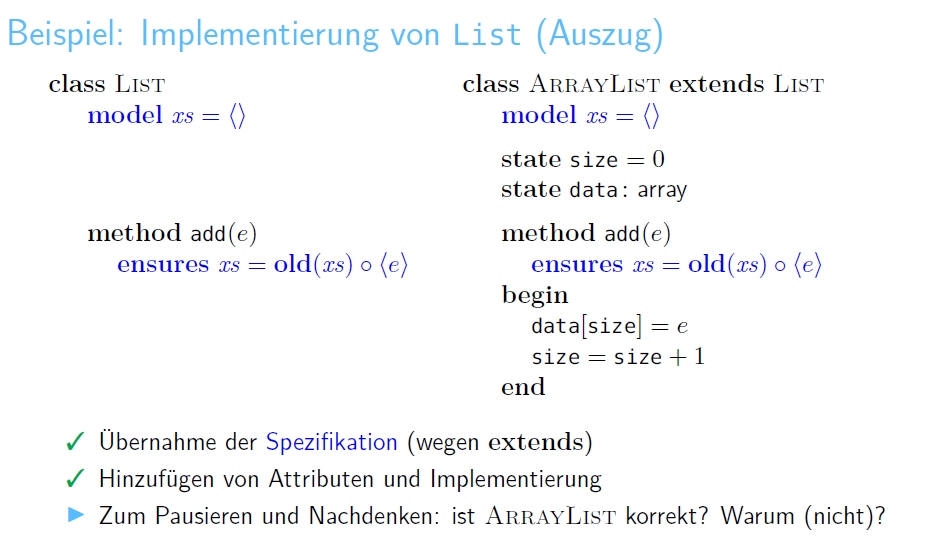

属于 [[project/lmu - FSV1|lmu - FSV1]]

### method验证框架
method关键字 函数名(变量名: 变量类型)
- returns关键字(可无)
- requires关键字(可无)
- ensures关键字(可无)
  
assert关键字
```Dafny
method abs(i: int)
    returns (j: int)
    requires true
    ensures j == i || j == -i
{
    if i < 0 { j := -i; }
    else     { j :=  i; }

    assert j >= 0;
}
```

## 函数头拓展操作
```dafny
method toInt(b: bool)
    returns (i: int)
    ensures  b ==> i == 1
         // !b || i == 1

    ensures !b ==> i == 0
{
    if(b) { i := 1; }
    else  { i := 0; }
    assert 0 <= i && i <= 1;
}
```

- implement \==>
- 传入的数组想要修改，需要在函数头加上`modifies`关键字
- 函数名(变量名?: 变量类型) 表示一个指针类型可以为null
 
### Variables
- 定义变量
    - var i:= 0;
    - 没有类型
- 赋值用`:=`
- 数组
```
    var a: array<int>;
    a[0] == 0;
    a.Length
    modifies a
```

```dafny
method init(a: array<int>)
    modifies a
    ensures forall k:int ::
        0 <= k < a.Length ==> a[k] == 0
{
    var i := 0;

    while i < a.Length
        modifies a
        invariant 0 <= i <= a.Length
        invariant forall k:int ::
            0 <= k < i ==> a[k] == 0
    {
        a[i] := 0;
        i := i + 1;
    }
}
```

### invariant
- 写在循环里面，这个是在循环内必须满足的条件
- FSV1 Project2的作业里的示例不错

- 例：loop
```dafny
method loop(n: int)
    requires n >= 0
{
    var i: int;
    i := 0;

    assert 0 <= n;

    while i < n
        invariant 0 <= i && i <= n
    {
        assert i < n;
        i := i + 1;
        assert i <= n;
    }

    assert i == n;
}
```

- 例：gauss
```dafny
method gauss(n: nat)
    returns (s: nat)
    requires n >= 0
    ensures s == n*(n+1)/2;
{
    s := 0;

    var i := 0;
    while i < n
        invariant 0 <= i <= n;  //可以写多个
        invariant s == i*(i+1)/2;
    {
        i := i + 1;
        s := s + i;
    }

    assert i >= n;
    assert i == n;
    assert s == n*(n+1)/2;
}
```

- 例: linear_search (forall写法)
```dafny
method linear_search(a: array<int>, x: int)
{
    var i := a.Length -1;
    var b := false;

    while i >= 0
        invariant forall k: int::
            i < k < a.Length && k >= 0 ==> a[k] != x
    {
        if a[i] == x {
            b := true;
            break;
        }
        i := i - 1;
    }

    // Nichtdeterministische Auswahl eines gültigen Indizes
    // der stellvertretend für alle Indizes geprüft wird.
    var k: int;
    assume 0 <= k < a.Length -1; // hier ok: Spezifikationsmechanismus!

    assert  b ==> a[i] == x;
    assert !b ==> a[k] != x;       // Gesamtziel der Verifikation
}
```

### model
- 