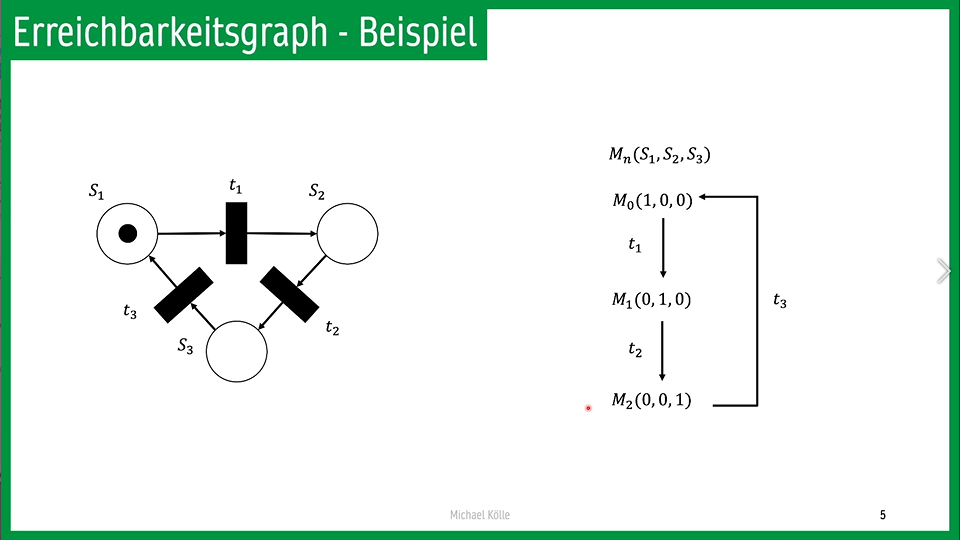
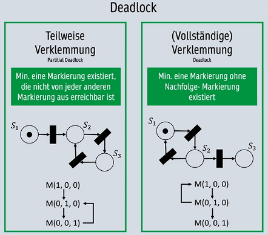

属于 [[project/lmu - Betriebsystem|lmu - Betriebsystem]]

## Petri-Netze components
- Petrinetze $$Y = (S,T,F,K,W,M_0)$$
- Stellen **S**
    - statische Objekte
- Transitionen **T**
    - Aktionen
- Kanten **F**
    - S --> T oder T --> S
- Kapizität **K** einer Stelle
    - 某个Stelle的最大Mark数
- Kantengewicht **W** einer Kante
    - 链出减少，链入增加
- Marken **M**
    - 资源
## ·x, x·, -x, x-
- Sei $$ x \in S \bigcup T$$
- `·x`:= $$\{y \in S \bigcup T : (y, x) \in F \}$$
    - **Vorbereich** einer Stelle/Transition x
    - 链入x的Stelle/Transitionen
- `x·` := $$\{ y \in S \bigcup T : (x, y) \in F\}$$
    - **Nachbereich** einer Stelle/Transition x
    - x链出的Stelle/Transitionen
- `-x`:= $$\{(y,x) \in (S \times T) \bigcup ( T \times S) : (y,x) \in F\}$$
    - **Menge aller Eingangskanten** von x
    - 链入x的Kanten
- `x-` := $$\{(x,y) \in (S \times T) \bigcup ( T \times S) : (x,y) \in F\}$$
    - **Menge aller Ausganskanten** von x
    - 链出x的Kanten
   
## Markierung
- Markierung可以理解为状态，下标从0开始
- 形如:
  $$M = \{0,0,1,0\}$$
  $$M_1 = \{1, 0, 0, 1 \}$$
- 注：这个Petri-Netze有4个Stellen, 在M状态时S2有一个Mark, （转换到）M1状态时S0, S3有一个Mark
- **Aktivierte Transitionen** (在M状态下)可以执行的Transition。
  collapsed:: true
    - 条件：
        - 其Vorbereich有足够的Marken
        - 其Nachbereich有足够的空余容量
- **Folgemarkierung** $M^{'}$: 即经过一次T后（计算得到）的下一个Markierung

## Erreichbarkeitsgraph
- Die Erreichbarkeitsmenge $E_Y$ zu dem Petri-Netze Y enthält die Anfangsmarkeirung $M_0$:
  $$E_Y = E_Y (M_0) := \{ M^{'}: \exists n \in \mathbb{N_0}, t_1,...,t_n \in T^* : M_0  \xrightarrow{t_1,...,t_n} M^{'} \}$$
- 就是从M出发能到的所有Markierung
- 
 
## Deadlock/Verleimmungen
- Teilweise Verklemmung
    - Min. eine Markierung existiert, die nicht von jeder anderen Markierung aus erreichbar ist.
- Vollständige Verklemmung
    - Min. eine markierung ohne Nachfolge- Markierung existiert.
- 
## How to draw a Petrinetze
- 每个 Object 的每个状态需要一个 Stelle
- 每多一个 Ressouce，就需要一个 Stelle。权限也算做Ressouce