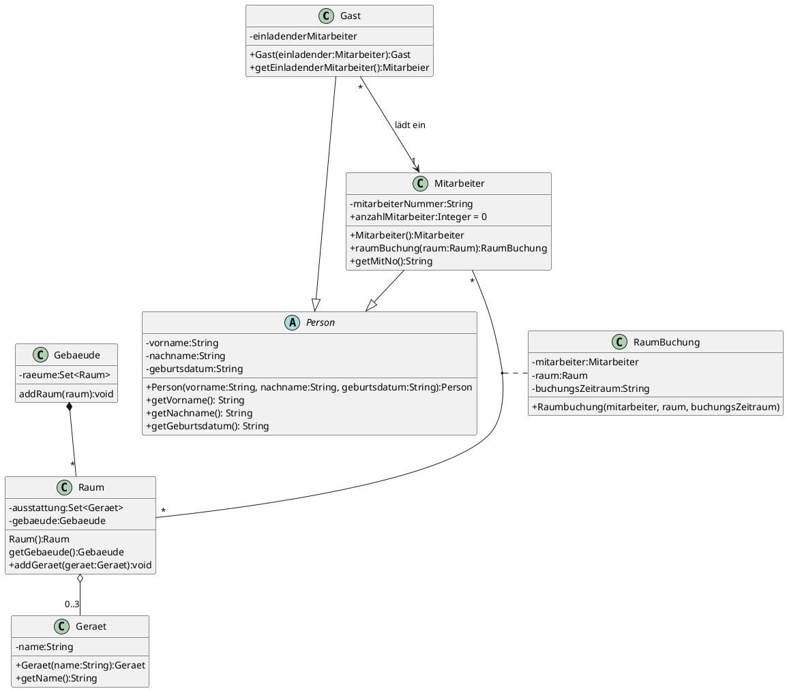
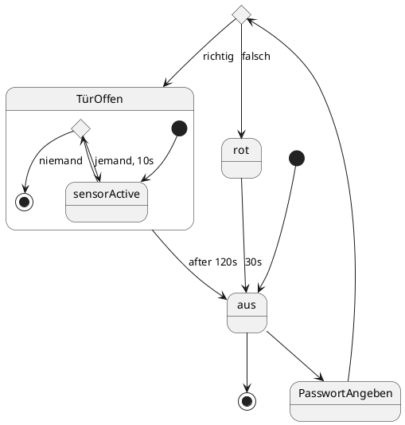
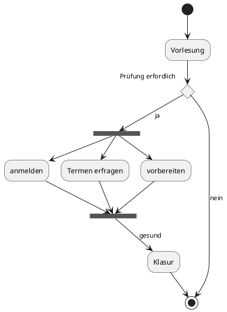
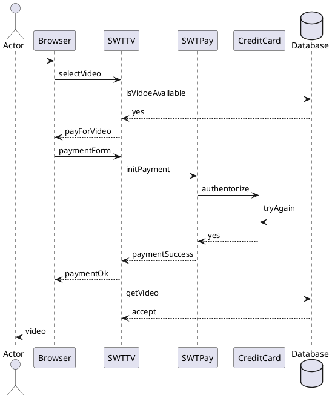

### UML
- 在线画图工具: https://www.processon.com/
- 

### 每个图用在什么流程
| Stage          | Structure | Behavior |
| -------------- | --------- | -------- |
| Requirement    | Use-case  | Activity |
| Analyse        |           | Sequence |
| Design         | Class     | State, Communication         |
| Implementation |           |          |
## Class Diagram
一个简单说明 [[02-Tutorial-annotated.pdf]]
![[attachments/Pasted image 20230219103932.png|L|300]]

PlantUML

#### 类

#### 属性/方法
- + public
- - private
- \# protected
- (\_) default

![[attachments/Pasted image 20230219093649.png|400]]

#### Association
association 会指示
- 关联类型
- 角色
- 多边关系
![[attachments/Pasted image 20230219093347.png|400]]

![[attachments/Pasted image 20230219093410.png|400]]

![[attachments/Pasted image 20230219093154.png|400]]
- aggregation: 成员没有聚合体还是成员(树没有森林还是树)
- composition: 部分没有整体就不是部分(玩家没有游戏就不是玩家)

#### 对象图
某个类的具体对象在 UML 中的表示
![[attachments/Pasted image 20230219100019.png|L|300]]

## State Diagram
src: Software Entwuf mit UML2 7
![[attachments/Pasted image 20230219110939.png|L|300]]

PlantUML

#### 基础路线
![[attachments/Pasted image 20230219094045.png|L|300]]

#### 分支

静态分支: 条件在执行前检查过了
![[attachments/Pasted image 20230219094313.png|L|300]]

动态分支: 
- 如果还要判断
- 用空心圆或者菱形
- Möglichkeit Bedingungsteile
![[attachments/Pasted image 20230219094425.png|L|300]]

#### 原子状态和持续状态(Activity)
- atomar
- andauernd(enter, do, exit)
![[attachments/Pasted image 20230219095549.png|L|300]]

#### Protokollzustandsautomaten
状态协议机表示了在某一个协议下, 什么操作会发生什么变化
![[attachments/Pasted image 20230219095618.png|L|400]]

### Hierarchy
![[attachments/Pasted image 20230219160622.png|L|350]]
- 一个状态可以有任意多个的子状态

#### Nebenläufige Zustände
- 并发状态
- 两个实体(两个图) 可能在某一过程执行时同时改变状态
![[attachments/Pasted image 20230219095529.png|L|300]]

#### History-State
- 历史状态存储了在离开上一层状态前所处的最后一个子状态
- 某个状态被打断的时候, 重新进入应该在哪个点开始
![[attachments/Pasted image 20230219161027.png|L|400]]

## Activity Diagram
src: Software-Entwurf mit UML2 K3
![[attachments/Pasted image 20230219111916.png|L|300]]

- 参考: https://zhuanlan.zhihu.com/p/149079804
- 也可以用来建模算法

#### 活动节点

**普通节点**
![[attachments/Pasted image 20230219112546.png|L|400]]
用来表示一个活动

**起始节点/终止节点**
![[attachments/Pasted image 20230219112620.png|L|200]]
- 起始节点也可以是实心圆(不是终止那种外面有一圈的)

#### 分支

**条件分支**
![[attachments/Pasted image 20230219112720.png|L|200]]

**分叉与汇合**
![[attachments/Pasted image 20230219112819.png|L|300]]

#### 一个建模算法的例子
- □ 表示某一属性
![[attachments/Pasted image 20230219113702.png|L|300]]

## Sequence Diagram

![[attachments/Pasted image 20230219114052.png|L|300]]

#### 消息的类型
![[attachments/Pasted image 20230219120547.png|L|500]]
- 实心箭头(如上)是过程调用
- 单边箭头 $\rightharpoonup$ 是异步消息

#### 分支, 循环
- 这应该是一个大富翁
- 虚线表示没有时序关系
![[attachments/Pasted image 20230219115711.png|L|400]]

![[attachments/Pasted image 20230219115828.png|L|400]]

#### 交互范围
![[attachments/Pasted image 20230219120121.png|L|400]]

#### 时间轴/生命线
- 时间轴是从上往下的
- 只关心顺序和同步

## Interaction Diagram
- 交互图
- ![[attachments/Pasted image 20230219120949.png|L|300]]

### Communication Diagram

#### 图例
- character
- sequence number(可以是变量, 表达式)
- direction
- operation
![[attachments/Pasted image 20230219122332.png|L|400]]

## Use-case Diagram
![[attachments/Pasted image 20230219141737.png|L|300]]

![[attachments/Pasted image 20230219142447.png|L|400]]
- 用例, 即是外部可见的系统功能
- 主要由 actor, use-case 组成

#### 关联
![[attachments/Pasted image 20230219142604.png|L|400]]
- 泛化: 指通常理解为继承的关系, 子指向父, 如 vip -> guest
- 包含: 分解的关系
    - ![[attachments/Pasted image 20230219143106.png|L|350]]
- 扩展: 
    - ![[attachments/Pasted image 20230219142957.png|L|450]]
- 依赖 dependency: VS2010中拓展的一种关系, 指向被依赖项
    - ![[attachments/Pasted image 20230219143333.png|L|300]]

#### 示例
![[attachments/Pasted image 20230219143423.png|L|400]]