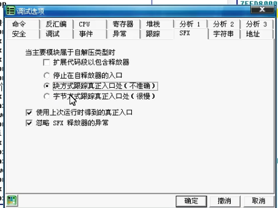

## 找OEP

### 通用方法汇总
#### 0、 概述
- OEP通常在基址附近，经过较大的跳转来到
#### 1、单步法
- 一步一步跟踪，规则：
    - 向上 `jxx` 不让实现，直接f4运行到 `jxx` 的下一行
    - 如果跳转的下一行是 `call` 或者还是`jxx`(无论是向上还是向下), 则运行到再下一行
    - 如果跑飞，在跑飞的地方不要f8，f7进去
    - 其他一步一步往下，向下跳转也继续f8, 看到popad通常离OEP不远了
#### 2、ESP突变
**ESP突变**指关键句如(push)的下一句只有ESP一个寄存器变红(发生变化)

1. 单步到ESP突变
2. 在**数据窗口**跟随此时ESP的值(这是一个地址)，方法有三种：
    1. 在ESP的值上`右键 - 在数据窗口跟随`
    2. 在命令窗口: `dd 地址`
    3. 在命令窗口: `hr 地址`
3. 此时数据窗口中，会显示该地址的值，右键值，`断点 - 设置硬件访问断点 - Word/Dword`(两者都可)
4. 运行（然后记得删除硬件断点`调试-硬件断点`）
5. 再单几步就到了

#### 3、两次内存镜像法
1. 打开内存（`查看-内存`或`M`标记）
2. 在程序的`.rsrc` 段 `f2`(右键-设置访问中断) (你知道，程序的段就是基址和后面一点那些)
3. 运行
4. 再打开内存，在 `401000`位置的段下一个段（也就是第二个段(?)），运行
5. 然后按单步法的规则单几步就到了

#### 4. 一步直达法
- 据说只有UPX和ASPACK能用
- 带壳程序的入口是pushad，那就查找`ctrl+f`popad(`ctrl+L`下一个查找结果), f4过去
- 剩下的单步

#### 5、 模拟跟踪法
- 让OD自行查找
- 在内存中找到 `SFX,imports,..`  一行，在命令行输入:`tc eip<该行地址`
- 此时左上叫显示跟踪，此方法比较慢，等一会就好

#### 6、SFX模拟跟踪
- 也是让OD自行查找
- `选项-调试选项-SFX`, 选块方式跟踪或字节方式跟踪
- 
### ASPACK (2)
- 前六种
### NSPACK(北斗) (3)
- 前六种
- ximo有1.3, 2.4, 3.7版本的示例，2.4, 3.7 用PEID查不出, 但可以看到EP区段是`nsp0`或`nsp1`
- *北斗专用的一个特殊方法
    - 据说因为是VC++写的
    - 命令`at GetVersion` 回车
    - 运行到下面的`retn`
    - 然后向上滚动
- 2.4很怪，一开始是个jmp, 单步，就到了push
### UPX (1)
- 前四种（六种？）

## 脱壳&修复入口点
### 1. OD自带的OllyDump
- 见于UPX
- 在OEP右键，`用OllyDump脱壳调试进程`
- 方式一方式二都行
### 2. LordPE + ImportREC
- 见于UPX（在教程中两者都是OD菜单里工具里有的）
- （在OD中运行到了OEP的状态下）在LordPE程序列表里找到目标，修正镜像大小并完整转存
- *如果没脱干净(用查壳软件看，还是带壳)
    - 用ImportREC附加在OD中加载了的程序
    - 手动输入OEP地址(记得要减基址)，`自动修复IAT`
    - `获取输入表`，(显示一下无效函数，没有),  `修复转存文件`，选择没脱干净的程序