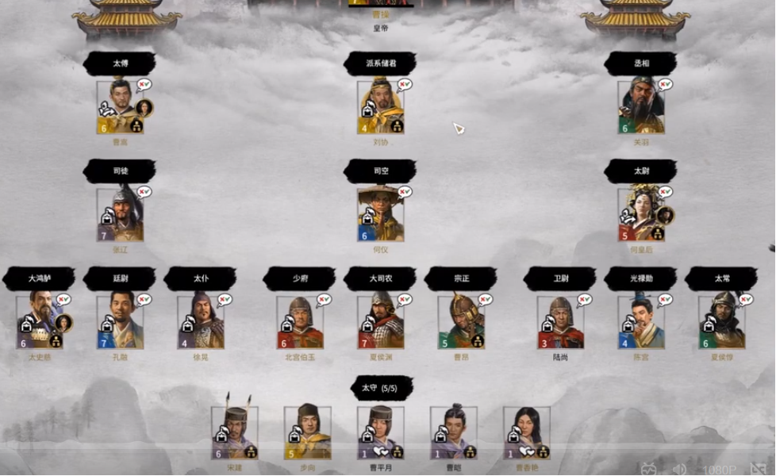

 
## 三公
- 三公：丞相，太尉（/大司马），御史大夫（/大司空）
    - **丞相**又改称过相国，有时分设左右丞相，金印紫绶（萧何绿绶更高）
    - 汉朝**太尉**不常设，汉初年到武帝60年间，只有5位太尉：卢绾，周勃，灌婴，周亚夫，田蚡。金印紫绶
    - 武帝**大司马**为加官，加在将军上
    - **御史大夫**，银印青绶，位上卿，但实际上会被人们称为三公，副官有两丞，御史中丞和御史丞。
- 将军比公者四：大将军，次骠骑将军，次车骑将军，次卫将军。又有前后左右将军，杂号将军
- 印的质料有金、银、铜、玉等。
- 太师，太傅，太保位三公上，，金印银绶，实是虚职
## 九卿
西汉九卿是一个统称，可能不只九个人，也可能不只九个官。

东汉后汉书中，有些官会明确卿几人。九卿在东汉是执金吾前面九人。
- **太常**：原称奉常，景帝时改称太常，掌宗庙礼仪。每年的祭祀活动很庞大，相关人员上十万，耗费众多。多次有上书减少宗庙消耗。
  三辅：京兆尹，左冯翊，右扶京
- **光禄勋**：郎中令，掌宫殿掖门户（前殿宫内总管）。属官有大夫，郎，谒者，期门，羽林。
    - 大夫掌论议（顾问官员）：太中大夫/光禄大夫，中大夫，谏大夫
    - 郎掌门户（皇帝的随从）：议郎，中郎（有五官、左右中郎将），侍郎
    - 谒者治礼（司仪工作）
    - 期门掌执兵送从，后改称虎贲，置中郎将
    - 羽林置中郎将。羽林和期门是皇帝的卫队
- **卫尉**：景帝时更名中大夫令，又改回。卫戍部队。与光禄勋同样负责宫门警戒，但更外围。
  不只一个。
- **太仆**：掌舆马（宫中车马和军马）。有时也驾车。第一任夏侯婴，滕公。
- **廷尉**：掌刑辟，又称大理。最高司法官员。
- **大鸿胪**：原称典客，改大行令，又改大鸿胪，王莽改典乐。掌归义蛮夷（的接待）（原本由典属国负责，后来典属国归并大鸿胪。也负责进京地方官的接待和外交接待。
- **宗正**：又称宗伯，掌亲属。管理皇室和外戚，由皇族担任，西汉时多是楚元王后代。
- **大司农**：治粟内史，改大农令，后改大司农，掌谷货，财政官员。
- **少府**：掌山海池泽之税。皇帝的财政官和大管家。又叫小府。下有六丞（一般只有一丞）。
- **执金吾**（通御音御）：又称中尉，掌徼循京师。负责京城治安，还是皇帝的仪仗队。

## 内朝/中朝
- 皇帝身边的一群人，有的是顾问，有的是掌实权的。

## 加官
- 加在别的官衔之上的，不能单独存在的官职。
- 西汉有：大司马，侍中，左右曹，诸吏，散骑，中常侍，给事中等。内朝官大多有加官。