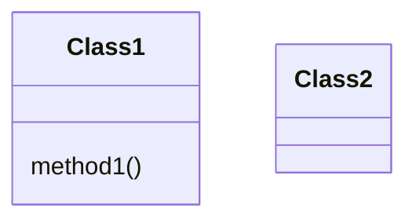
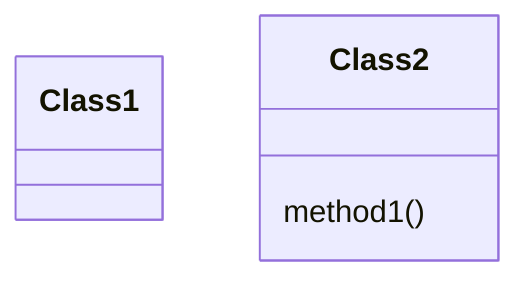

refactoring techniques
src: [Source Making](https://sourcemaking.com/refactoring/refactorings)

## Composing methods

#### Extract Method
一个方法内的语句应该是应该是在同一层级的, 这样有利于代码结构的清晰.
```java
// Before
void printOwing() {
  printBanner();

  // Print details.
  System.out.println("name: " + name);
  System.out.println("amount: " + getOutstanding());
}
// After
void printOwing() {
	printBanner();
	printDetails();
}

void printDetails() {
  System.out.println("name: " + name);
  System.out.println("amount: " + getOutstanding());
}
```

实践: 
1. 将原本的方法的任务划分成几个小任务
2. 根据小任务的内容提取出新的方法

#### Inline Method
如果一个方法的内容比取方法名还简单, 那就不应该单独作为一个方法
```java
// Before
class PizzaDelivery {
  // ...
  int getRating() {
    return moreThanFiveLateDeliveries() ? 2 : 1;
  }
  boolean moreThanFiveLateDeliveries() {
    return numberOfLateDeliveries > 5;
  }
}
// After
class PizzaDelivery {
  // ...
  int getRating() {
    return numberOfLateDeliveries > 5 ? 2 : 1;
  }
```

实践:
1. 首先, 子方法不能在子类中被重写. 如果是, 则这样情况不适用于本重构技巧.
2. 然后改就是了

#### Extract Variable
理由: to make a (long) statement more readable
```java
// Before
void renderBanner() {
  if ((platform.toUpperCase().indexOf("MAC") > -1) &&
       (browser.toUpperCase().indexOf("IE") > -1) &&
        wasInitialized() && resize > 0 )
  {
    // do something
  }
}
// After
void renderBanner() {
	boolean isMac = platform.toUpperCase().indexOf("MAC") > -1;
	boolean isIE = browser.toUpperCase().indexOf("IE") > -1;
	boolean wasResized = resize > 0;

	if (isMac && isIE && wasInitialized() && wasResized) {
		// do something
	}
}
```

#### Inline Temp
如果一个本地变量只被用来计算一个简单的表达式, 那么其实使用表达式本身就足够易懂了.

```java
// Before
boolean hasDiscount(Order order) {
  double basePrice = order.basePrice();
  return basePrice > 1000;
}
// After
boolean hasDiscount(Order order) {
	return order.basePrise() > 1000;
}
```

#### Replace Temp with Query
用简单的函数取代本地变量, 好处是代码更简洁和可读

```java
// Before
double calculateTotal() {
  double basePrice = quantity * itemPrice;
  if (basePrice > 1000) {
    return basePrice * 0.95;
  }
  else {
    return basePrice * 0.98;
  }
}
// After
double calculateTotal() {
	if (basePrice() > 1000) {
		return basePrice() * 0.95;
	}
	else {
		return basePrice() * 0.98;
	}
}

double basePrice() {
	return quantity * itemPrice;
}
```

#### Split Temporary Variable
使用暂时的变量的时候, 不要一个 temp 走天下, 可以使用不同名称的本地变量. 更易读, 也不容易发生意外的错误

```java
// Before
double temp = 2 * (height + width);
System.out.println(temp);
temp = height * width;
System.out.println(temp);
// After
double perimeter = 2 * (height + width);
System.out.println(perimeter);
area = height * width;
System.out.println(area);
```

#### Remove Assignments to Parameters
不要直接修改传入的实参, 这个习惯不好. 用一个新的本地变量获得它的值.

```java
// Before
int discount(int inputVal, int quantity) {
  if (quantity > 50) {
    inputVal -= 2;
  }
  // ...
}
// After
int discount(int inputVal, int quantity) {
  int result = inputVal
  if (quantity > 50) {
    result -= 2;
  }
  // ...
}
```
#### Replace Method with Method Object
如果方法太长难以提取方法, 那就提取成方法对象(一个新的内部类, 在新类的内部实现方法), 从而在主类中节省空间, 提高可读性

```java
// Before
class Order {
  // ...
  public double price() {
    double primaryBasePrice;
    double secondaryBasePrice;
    double tertiaryBasePrice;
    // Perform long computation.
  }
}
// After
class Order {
	double price() {
		return new PriceCalculator(this).compute();
	}

	class PriceCalculator {
	    double primaryBasePrice;
	    double secondaryBasePrice;
	    double tertiaryBasePrice;

		public PriceCalculator(Order order) {
			// ...
		}

		public double compute() {
			// Perform long computation.
		}
	}
}
```

实践:
1. 新建内部类, 将要提取的方法相关的变量和参数移动到类中
2. 类的初始化方法的参数为主类
3. 主类调用方法时, 新建内部类, 传入主类自身作为参数, 并调用内部类的方法


## Moving Features between Objects

#### Move Method
如果一个方法在另一个类中用得更多, 就把它移动到另一个类里

Before


After


## Organizing Data

## Simplifying Conditional Expressions


## Simplifying Method Calls

## Dealing with Generalisation


