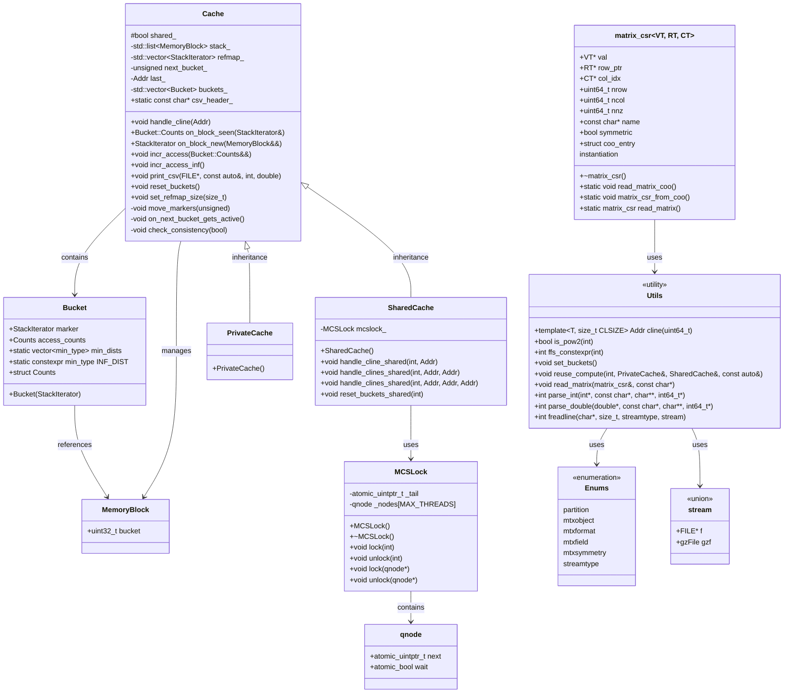
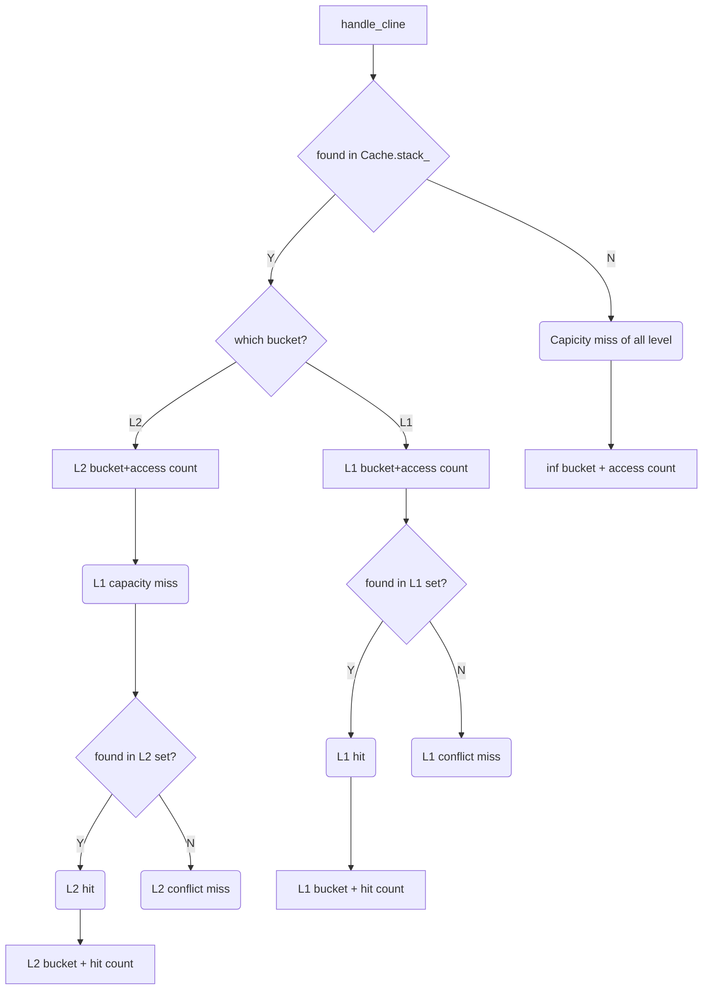

## Prepare and Config

##### git ssh
-  Ubuntu 24 user.email: nuohengluo@qq.com

通过 `ssh-keygen -t rsa -C 邮箱` 生成的 rsa 在
```
Your identification has been saved in /home/nk/.ssh/id_rsa
Your public key has been saved in /home/nk/.ssh/id_rsa.pub
The key fingerprint is:
SHA256:2gStlQbeNsbwGLsmHzbtCekFYYehJnbEtvIFEyDuhCI nuohengluo@qq.com
The key's randomart image is:
+---[RSA 3072]----+
|. .oo.Bo.        |
|o. .=+.& .       |
|Eoo.++* %        |
|=..+. .% .       |
| . o..X S        |
|    .* X .       |
|      + +        |
|                 |
|                 |
+----[SHA256]-----+
```

```
ssh-rsa AAAAB3NzaC1yc2EAAAADAQABAAABgQCqRKdNEi0BdbS4d4vL5N27pEPi65fbbySJ4JFyy8Kcxc2StMsqJFmyG7PWOvsz3k3RCkNlRFunIbLerX7bucTry9V9+66kVVFhH28o+TAzSGvbOsyR5GV7Dtdl3qLhiNZjrwgO0bnT2LYioVNShhzsLFguNE5D6SIGk5gwXjLC7dew/avQ6jYyaG+7xIPHMETu1Bgl3kTy2l8EEtowz5/WKTWRy5maCrP7iio+fsfTbl3CGv1jowBG3e0pWiU9mUP+x6sNqyBZVntzeQi83Uz2rKCLdxM9ErVvbEQY+e61axlCC8v+xNuLgz9yIkAfikjWkKrBisNiopN4TeXWEq0eTmxAF8M1JA2Ld7G7LkXOKHKjQt/Nfw7+xcA3CEReKacehbswuPGlerb4ZBj//4TDCTZiwU+k1Dgm6u9ISMqWZmcLFgXQtiZCIs6awarTToOmzKF100FCkMZV1ZzN/lfYHTYIukOYgs/1bEqvYgiRJGB2dSKpvwpvRhgISfn3E6E= nuohengluo@qq.com
```

#### beast

ssh cip + 151

ssh lrzcluster -p 22 + 151

2FA: Privacy IDEA(Android+ios) + PUSH Toke

以上两个都设置好了应该不再需要输密码

ssh beast

ssh-copy-id lrzcluster -p 22 

![[attachments/Pasted image 20250729111156.png]]

## Collect Materials

- you should cite it if your use their matrices [About | SuiteSparse Matrix Collection](https://sparse.tamu.edu/about)

cpu uses SRAM

The stack distance algorithm is based on [Kim et al. 1991](https://dl.acm.org/doi/pdf/10.1145/107972.107995)

## extend

- Victim Cache：(by conflict miss)额外缓存被替换的数据块，减少冲突影响
## Comments

#### makefile
This is a Makefile for building a C++ program called `spmvrd` (likely "Sparse Matrix-Vector Multiplication with Reordering"). Let me break it down section by section:

##### Basic Configuration

```makefile
SHELL:=/bin/bash
BIN:=spmvrd
```

Sets the shell to bash and defines the final executable name as `spmvrd`.

##### File Discovery

```makefile
HEADERS:=$(wildcard *.h)
SOURCES:=$(wildcard *.cpp)
OBJECTS:=$(SOURCES:.cpp=.o)
```

Automatically finds all `.h` header files and `.cpp` source files in the current directory, then creates a list of corresponding `.o` object files.

##### Compiler Flags

The `CXXFLAGS` are built up incrementally:

**Performance flags:**

- `-std=c++20`: Use C++20 standard
- `-fopenmp`: Enable OpenMP for parallel processing
- `-Ofast`: Aggressive optimization (faster than `-O3`)
- `-march=native -mtune=native`: Optimize for the current CPU architecture
- `-flto`: Link-time optimization

**Build configuration:**

- `-DNDEBUG`: Disable debug assertions
- `-g3`: Include debug symbols (maximum level)

**Warning flags:**

- `-Wall -Wextra -Wpedantic`: Enable comprehensive warnings
- Multiple `-Wno-*` flags to disable specific warnings that are apparently not relevant for this codebase

**Commented-out options:**

- Profiling flags (`-pg -fno-inline`)
- Additional strict warnings (`-Weffc++`, `-Wconversion`)
- Sanitizers for debugging (undefined behavior, address, thread)

##### Hardware-Specific Optimization

```makefile
CXXFLAGS+=-DMEMBLOCKLEN=$(shell getconf LEVEL1_DCACHE_LINESIZE)
CXXFLAGS+=-DCACHE_LINESIZE=$(shell getconf LEVEL1_DCACHE_LINESIZE)
```

These dynamically determine the CPU's L1 data cache line size and pass it as preprocessor definitions. This allows the code to optimize memory access patterns for the specific hardware it's running on.

##### Build Rules

```makefile
$(BIN): $(OBJECTS)
	$(CXX) $(CXXFLAGS) $^ -o $@ $(LDFLAGS)

%.o: %.cpp $(HEADERS)
	$(CXX) $(CXXFLAGS) -c $< -o $@
```

Standard pattern: compile each `.cpp` file to a `.o` object file, then link all objects into the final executable. Object files depend on all headers, so changing any header will trigger recompilation.

This Makefile is clearly for a high-performance computing application, likely involving sparse matrix operations, with careful attention to CPU optimization and parallel processing.

These are **automatic variables** in Make that represent different parts of the current rule:

##### automatic variables
###### `$@` - Target

The name of the target (what's being built)

```makefile
$(BIN): $(OBJECTS)
	$(CXX) $(CXXFLAGS) $^ -o $@ $(LDFLAGS)
```

Here `$@` expands to `$(BIN)`, which is `spmvrd`. So this becomes:

```bash
g++ [flags] [objects] -o spmvrd [ldflags]
```

###### `$^` - All Prerequisites

All the dependencies/prerequisites of the target

In the same rule, `$^` expands to `$(OBJECTS)`, which might be something like `main.o utils.o matrix.o`. So the full command becomes:

```bash
g++ [flags] main.o utils.o matrix.o -o spmvrd [ldflags]
```

###### `$<` - First Prerequisite

The first (or only) dependency

```makefile
%.o: %.cpp $(HEADERS)
	$(CXX) $(CXXFLAGS) -c $< -o $@
```

For a specific file like `main.cpp`, `$<` expands to `main.cpp` (the first prerequisite), while `$@` expands to `main.o`. This becomes:

```bash
g++ [flags] -c main.cpp -o main.o
```

###### Why Use These?

They make Makefiles more maintainable and less error-prone:

- No need to repeat target/dependency names
- Rules work generically for pattern matching (like `%.o: %.cpp`)
- Less chance of typos when copying similar rules

Other common automatic variables include `$?` (prerequisites newer than target) and `$*` (the stem of pattern rules).

### mcslock.h

这是一个MCS锁(Mellor-Crummey and Scott Lock)的实现，它是一种自旋锁的变体，专门设计用于减少高竞争环境下的缓存一致性流量。

让我们逐部分分析：

1. 基础结构体 `qnode`:
```cpp
struct alignas(CACHE_LINESIZE) qnode {
    atomic_uintptr_t next;  // 指向队列中下一个节点的指针
    atomic_bool      wait;  // 表示是否需要等待的标志
};
```
- 使用`alignas(CACHE_LINESIZE)`确保每个节点都对齐到缓存行，避免伪共享
- 每个节点包含两个原子变量：指向下一个节点的指针和等待标志

2. `MCSLock`类的主要组件：
```cpp
private:
    atomic_uintptr_t _tail;  // 指向队列尾部的指针
    qnode            _nodes[MAX_THREADS];  // 为每个线程预分配的节点数组
```

3. 加锁操作(`lock`)的工作流程：
- 初始化当前节点：清空next指针，设置wait为true
- 将节点添加到队列尾部，并获取之前的尾节点
- 如果有前驱节点：
  - 将当前节点链接到前驱节点
  - 自旋等待直到wait标志被清除

4. 解锁操作(`unlock`)的工作流程：
- 获取后继节点
- 如果没有后继节点：
  - 尝试将尾指针设为NULL（表示队列为空）
  - 如果成功，直接返回
  - 如果失败，说明有新节点正在入队，需要等待其完成
- 最后，将后继节点的wait标志设为false，允许其获取锁


使用示例：
```cpp
MCSLock lock;
// 在线程中使用
lock.lock(thread_id);   // 获取锁
// 临界区代码 do something
lock.unlock(thread_id); // 释放锁
```

这个实现使用了C++的原子操作来确保线程安全，并且通过预分配节点数组来避免动态内存分配的开销。代码中的`MAX_THREADS`常量定义了支持的最大线程数。

#### mcs 主要优点
1. 每个线程只在自己的本地变量上自旋，减少了缓存一致性流量
2. FIFO(先进先出)顺序保证了公平性
3. 没有中央热点，扩展性好
#### mcs 如何降低缓存一致性开销

MCS锁通过以下方式降低缓存一致性开销：

- **将等待线程组织成队列**（每个线程在其本地缓存行上自旋）
- **仅在锁交接时更新队列尾指针**
- **消除传统自旋锁的"群惊效应"（thundering herd effect）**
- Organizing waiting threads in a **queue** (each thread spins on its own local cache line)
- Only updating the queue tail pointer during lock handoff
- Eliminating the "thundering herd" effect of traditional spin locks

#### 惊群 Thundering Herd Effect

**群惊效应**指当锁释放时，所有等待线程同时被唤醒并争抢资源导致的性能骤降现象，此译名在分布式系统文献中被广泛采用。

 **触发场景**：  
当某个共享资源（如锁、网络连接、文件句柄）从**不可用变为可用**时：
- 操作系统会唤醒 **所有正在等待该资源的线程/进程**
- 这些被唤醒的线程会**同时发起资源请求**
- 最终**只有一个线程能成功获取资源**，其他线程再次陷入等待

**性能损耗来源**：
- ⚡ **CPU资源浪费**：大量上下文切换（Context Switching）
- 🧩 **缓存失效**：多个核心频繁读写同一内存地址（缓存行乒乓）
- 📉 **系统抖动**：资源争抢导致响应延迟飙升

**典型场景案例**
1. **多线程锁竞争**
    - **传统自旋锁（如pthread_mutex）**：  
        锁释放时唤醒所有等待线程 → 引发惊群
    - **优化方案**：  
        使用 **队列化锁（如MCS锁、Futex）**，仅唤醒下一个等待线程
2. **网络服务器（如Nginx/Apache）**
    - **accept() 系统调用**：  
        当新连接到达时，内核唤醒**所有监听同一端口的Worker进程**
    - **优化方案**：  
        开启 `SO_REUSEPORT`（Linux 3.9+）或使用 **EPOLLEXCLUSIVE** 标志（Linux 4.5+）
3. **文件系统事件（如inotify）**
    - 文件修改事件触发 → 通知**所有监控该文件的进程**
    - **优化方案**：  
        使用 **事件合并机制**（如Fanotify）

#### mcs 伪代码

```cpp
// MCS锁实现伪代码
void lock(MCSLock* lock, MCSNode* node) {
  node->next = NULL;
  MCSNode* prev = atomic_exchange(&lock->tail, node);  // 原子入队
  if (prev != NULL) {
    prev->next = node;     // 传递指针
    while (!node->locked); // 仅自旋本地变量
  }
}
```

#### 自旋锁

**自旋锁（Spinlock）** 是一种基础的**忙等待锁**，用于多线程/多核环境中保护共享资源。

其核心特点是：当线程尝试获取锁失败时，不会进入睡眠状态，而是通过**循环检测（自旋）** 持续检查锁状态，直到成功获取锁。

依赖**原子指令**（如x86的`LOCK CMPXCHG`）确保锁操作的*原子性*

```cpp
// 加锁
while (true) {
  if (锁空闲) {       // 步骤1：检查锁状态
    获取锁并退出循环;  // 步骤2：原子操作设置锁状态
  }
  // 否则持续循环检查（自旋）
}

// 解锁
原子操作将锁标记为“空闲”;  // 允许其他线程获取
```

#### 自旋锁 vs. 临界锁
| **特性**   | 自旋锁 (Spinlock) | 互斥锁 (Mutex)    |
| -------- | -------------- | -------------- |
| **阻塞行为** | 忙等待（不释放CPU）    | 睡眠等待（释放CPU）    |
| **开销来源** | CPU循环消耗        | 上下文切换（~1-10μs） |
| **适用场景** | 短临界区、非抢占式内核    | 长临界区、用户态应用     |
| **死锁风险** | 在单核需禁用抢占       | 支持超时和死锁检测      |
| **实现位置** | 内核/用户态均可       | 通常依赖操作系统调度     |

> 💡 黄金法则：
> 临界区执行时间 < 线程切换时间 → 选**自旋锁**；
> 否则 → 选**互斥锁**

#### atomic

- 原子操作库
- 无需锁的线程安全编程
- 避免对原子变量进行非原子操作（如直接解引用），必须通过原子接口访问。

```cpp
atomic_int counter = ATOMIC_VAR_INIT(0);
// 原子的写入一个值并返回原值
C atomic_exchange(volatile A* obj, C desired);
int old_val = atomic_exchange(&counter, 0);

atomic_bool exit_flag = ATOMIC_VAR_INIT(false);
// 原子地存储新值
void atomic_store(volatile A* obj, C desired);
atomic_store(&exit_flag, true);

// 读取指针（需反向转换）
while (atomic_load(&(p->wait)))
qnode *succ = (qnode *)atomic_load(&(p->next));
```

#### atomic CAS
compare and swap

- strong版本提供了更强的保证，只有在实际值确实不匹配时才会失败
- weak 可能会伪失败, 即使比较值相等

```cpp
bool atomic_compare_exchange_weak(volatile A* obj, C* expected, C desired);
bool atomic_compare_exchange_strong(volatile A* obj, C* expected, C desired);
```

```cpp
// _tail == old_p ?
// _tail = nullptr (true) : old_p = _tail (false)
if (atomic_compare_exchange_strong(&_tail, (uintptr_t *)&old_p, (uintptr_t)NULL)) {
    // _tail was p and is now nullptr
    return;
}
```

让我解释这段代码中`compare_exchange`的使用目的：

这里的`compare_exchange`操作并非"什么都没做"，而是在执行一个非常重要的原子检查和更新操作。让我详细解释这段逻辑：

1. 这段代码出现在`unlock`操作中，当一个线程发现没有后继节点（`succ == NULL`）时执行。

2. `compare_exchange`在这里的作用是：
```cpp
if (atomic_compare_exchange_strong(&_tail, (uintptr_t *)&old_p, (uintptr_t)NULL))
```
- 检查`_tail`是否仍然指向当前节点（`p`）
- 如果是，则将`_tail`设置为`NULL`
- 如果不是，则将实际的`_tail`值存储在`old_p`中

3. 这个操作有两种可能的结果：

   - 成功情况：
     - 说明当前节点确实是队列中的最后一个节点
     - 没有其他线程正在尝试获取锁
     - 这种情况下，直接返回即可，因为队列已经为空
   
   - 失败情况：
     - 说明在我们检查`succ`为`NULL`到执行`compare_exchange`期间
     - 有新的线程加入了队列
     - 这种情况下，我们需要等待新线程完成将自己链接到当前节点的操作

4. 为什么这很重要：
   - 这是一个关键的竞态条件处理
   - 如果没有这个检查，可能会在新节点还没有正确链接时就释放锁
   - 这可能导致队列断裂，使得某些线程永远等待

简单来说，这个`compare_exchange`操作是一个原子性的"检查并更新"操作，用于安全地处理队列为空的情况，同时也能检测到是否有新的线程正在尝试获取锁。这是确保锁正确性的关键操作，而不是"什么都没做"。

为什么用 strong?
- 操作的正确性比轻微的性能优化更重要
- 避免伪失败导致的不必要自旋

### cache

#### 纵览




这是一个用于模拟和分析内存访问模式的缓存模拟器

2. 核心数据结构：
```cpp
class Cache {
    std::list<MemoryBlock> stack_{};  // 缓存栈
    std::vector<StackIterator> refmap_{};  // 引用映射
    std::vector<Bucket> buckets_{};  // 桶系统
};
```

3. 主要功能和工作原理：

a) 缓存行访问处理：
```cpp
void Cache::handle_cline(Addr addr) {
    if (addr == last_) {
        incr_access({0u});
        return;
    }
    last_ = addr;
    StackIterator &it = refmap_[addr];
    
    if (it == stack_.end()) {
        incr_access_inf();
        refmap_[addr] = on_block_new(MemoryBlock{0u});
    } else {
        incr_access(on_block_seen(it));
    }
}
```
- 检查是否是重复访问
- 查找缓存行是否在缓存中
- 处理缓存命中或未命中的情况

b) 缓存替换策略：
```cpp
StackIterator Cache::on_block_new(MemoryBlock &&mb) {
    stack_.push_front(std ::move(mb));
    move_markers(next_bucket_ - 1);
    
    if (Bucket::min_dists[next_bucket_] != Bucket::INF_DIST &&
        (stack_.size() > Bucket::min_dists[next_bucket_])) {
        on_next_bucket_gets_active();
    }
    return stack_.begin();
}
```
- 使用栈式替换策略
- 新访问的块放在栈顶
- 通过桶系统跟踪访问距离

c) 桶系统管理：
```cpp
void Cache::move_markers(unsigned bucket_max) {
    for (unsigned b{1u}; b <= bucket_max; b++) {
        --(buckets_[b].marker);
        (buckets_[b].marker)->bucket++;
    }
}
```
- 使用桶来分类缓存块
- 根据访问距离将块分配到不同的桶
- 动态调整桶的标记位置

4. 多线程支持：
```cpp
class SharedCache : public Cache {
    void handle_cline_shared(int tid, Addr a) {
        mcslock_.lock(tid);
        handle_cline(a);
        mcslock_.unlock(tid);
    }
    MCSLock mcslock_{};
};
```
- 使用 MCSLock 实现线程安全
- 提供线程安全的缓存访问方法

5. 性能分析功能：
```cpp
void Cache::print_csv(FILE *file, const auto &matrix, int id, double time) const {
    size_t working_set_size = stack_.size();
    for (size_t i{0u}; i != Bucket::min_dists.size(); ++i) {
        fprintf(file, "%s,%zu,%zu,%d,%d,%f,%zu,%zu,%lu\n",
                matrix.name, matrix.nnz, matrix.nrow, id,
                shared_, time, working_set_size,
                Bucket::min_dists[i], buckets_[i].access_counts.count);
    }
}
```
- 记录缓存访问统计信息
- 输出性能指标到 CSV 文件

6. 一致性检查：
```cpp
void Cache::check_consistency(bool force) {
    // 检查桶标记的位置是否正确
    // 验证访问距离是否符合预期
}
```
- 确保缓存状态的一致性
- 验证桶系统的正确性

这个缓存模拟器的主要用途是：
1. 分析内存访问模式
2. 评估缓存性能
3. 研究缓存替换策略
4. 支持多线程环境下的缓存行为分析

特别适用于：
- 矩阵运算等计算密集型应用
- 内存访问模式分析
- 缓存性能优化研究
- 多线程程序的内存行为分析

这个实现的特点是：
1. 使用栈式替换策略
2. 通过桶系统跟踪访问距离
3. 支持多线程访问
4. 提供详细的性能统计
5. 包含完整的一致性检查机制

#### stack_(cache sys simulator), refmap_(cache block search)

让我详细解释 `stack_` 和 `refmap_` 的作用和关系：

1. 数据结构定义：
```cpp
std::list<MemoryBlock> stack_{};  // 缓存栈
std::vector<StackIterator> refmap_{};  // 引用映射
```

2. 它们的作用：

`stack_`：
- 是一个双向链表，存储实际的缓存块
- 最近访问的块在栈顶（链表头部）
- 最久未访问的块在栈底（链表尾部）
- 每个块都记录了自己的桶号（bucket）

`refmap_`：
- 是一个向量，用于快速查找缓存块
- 索引是缓存行地址（Addr）
- 值是 `stack_` 中对应块的迭代器
- 用于 O(1) 时间复杂度的缓存查找

##### 举例说明：

假设我们有以下内存访问序列：
```
访问地址：A -> B -> C -> A -> D -> B
```

让我们看看 `stack_` 和 `refmap_` 如何变化：

初始状态：
```
stack_: 空
refmap_: 所有位置指向 stack_.end()
```

访问 A：
```
stack_: [A]
refmap_: [A的迭代器, 其他都是end]
```

访问 B：
```
stack_: [B, A]
refmap_: [A的迭代器, B的迭代器, 其他都是end]
```

访问 C：
```
stack_: [C, B, A]
refmap_: [A的迭代器, B的迭代器, C的迭代器, 其他都是end]
```

访问 A（再次访问）：
```
stack_: [A, C, B]
refmap_: [A的迭代器, B的迭代器, C的迭代器, 其他都是end]
```

访问 D：
```
stack_: [D, A, C, B]
refmap_: [A的迭代器, B的迭代器, C的迭代器, D的迭代器, 其他都是end]
```

访问 B（再次访问）：
```
stack_: [B, D, A, C]
refmap_: [A的迭代器, B的迭代器, C的迭代器, D的迭代器, 其他都是end]
```

##### 关键操作示例

a) 查找缓存块：
```cpp
StackIterator &it = refmap_[addr];
if (it == stack_.end()) {
    // 缓存未命中
} else {
    // 缓存命中
}
```

b) 添加新块：
```cpp
stack_.push_front(std::move(mb));  // 新块放在栈顶
refmap_[addr] = stack_.begin();    // 更新引用映射
```

c) 移动已存在的块：
```cpp
// 将块移到栈顶
stack_.splice(stack_.begin(), stack_, it);
// refmap_ 不需要更新，因为迭代器仍然有效
```

##### 性能特点

`stack_`：
- 使用 `std::list` 实现
- 支持 O(1) 时间的插入和删除
- 支持 O(1) 时间的块移动
- 内存开销较大

`refmap_`：
- 使用 `std::vector` 实现
- O(1) 时间的查找
- 连续内存布局，缓存友好
- 需要预分配空间

6. 实际应用场景：

假设在矩阵运算中：
```
访问矩阵元素：M[0,0] -> M[0,1] -> M[1,0] -> M[0,0]
```

对应的缓存行访问：
```
访问缓存行：C0 -> C1 -> C2 -> C0
```

缓存模拟器会：
1. 通过 `refmap_` 快速检查缓存行是否在缓存中
2. 使用 `stack_` 维护缓存行的访问顺序
3. 根据访问模式更新桶系统
4. 记录缓存命中/未命中的统计信息

这种设计的优点：
1. 快速查找（O(1)）
2. 高效更新（O(1)）
3. 准确模拟缓存行为
4. 支持详细的性能分析

这种实现特别适合：
- 分析内存访问模式
- 研究缓存替换策略
- 优化程序的内存访问
- 评估缓存性能

#### Bucket: miss/hit stats

| 桶索引 | 最小距离   | 含义      | 缓存行为       |
| --- | ------ | ------- | ---------- |
| 0   | 0      | 立即重用    | 缓存命中（最近访问） |
| 1   | 1024   | L1缓存范围内 | 可能在L1缓存中   |
| 2   | 131072 | L2缓存范围内 | 可能在L2缓存中   |
| 3   | ∞      | 超出所有缓存  | 冷缺失（从内存加载） |
-  通过桶系统跟踪 reuse distance

```cpp
void incr_access(Bucket::Counts &&bucket) {
    auto [bx] = bucket;
    buckets_[bx].access_counts.count++;  // 在对应桶中增加计数
}
```

```cpp
void incr_access_inf() {
    auto bucket_inf = Bucket::min_dists.size() - 1;  // 使用最后一个桶
    incr_access({bucket_inf});  // 在无限距离桶中增加计数
}
```

##### 实例
```
访问A（未命中）：
- 增加 INF 距离桶的计数

访问B（未命中）：
- 增加 INF 距离桶的计数

访问C（未命中）：
- 增加 INF 距离桶的计数

访问A（命中，距离=2）：
- 增加距离2桶的计数

访问D（未命中）：
- 增加 INF 距离桶的计数

访问B（命中，距离=2）：
- 增加距离2桶的计数
```


#### cache misses
 1 冷缺失（Cold Miss）
    • 首次访问某数据时必然发生，因数据尚未加载到缓存中，也称为冷启动缺失。
 2 容量缺失（Capacity Miss）
    • 因缓存容量有限，当活跃数据量超过缓存大小时，部分数据被替换出去，再次访问时引发缺失。
 3 冲突缺失（Conflict Miss）
    • 由缓存映射规则（如组相联映射）导致：多个数据竞争同一缓存组（行），即使缓存仍有空闲空间也会触发替换。
 4 一致性缺失（Coherency Miss）
    • 多核/多处理器系统中，因其他核心修改共享数据（缓存一致性协议触发失效）而导致的缺失。

#### grammar

我来分析这两行代码使用的语法：

第53行：`incr_access({0u});`

这行代码使用了**列表初始化（List Initialization）**语法，这是C++11引入的特性：

- `{0u}` 创建了一个临时的 `Bucket::Counts` 对象
- `0u` 表示无符号整数0
- 大括号 `{}` 用于直接初始化对象，编译器会根据 `incr_access` 函数的参数类型自动推导

第77行：`auto [bx] = bucket;`

这行代码使用了**结构化绑定（Structured Bindings）**语法，这是C++17引入的特性：

- `auto [bx]` 声明了一个结构化绑定
- `bucket` 是一个 `Bucket::Counts` 对象
- `bx` 被绑定到 `bucket` 的第一个成员
- 这种语法允许你直接解构对象并访问其成员，而不需要显式访问

从代码上下文可以看出，`Bucket::Counts` 是一个包含单个成员的结构体或类，所以 `[bx]` 只绑定了一个变量。

这两种语法都是现代C++的特性，提供了更简洁和表达力更强的代码编写方式。
### openMP

#### 速通
 -  parallel：创建并行区域。
 -  critical：保护共享数据（慎用，性能低）。
 -  single：只有一个线程执行任务。
 -  barrier：所有线程到达 barrier 再继续执行. (OpenMP 在某些隐式同步点, 如 parallel for 结束, 会自动插入屏障)
 -  schedule：优化循环分配策略。
 -  规则：优先用 atomic 替代 critical，用 reduction 处理规约操作，避免过度同步。
 
```cpp
#include <omp.h>
#include <stdio.h>

int main() {
    int sum = 0;
    #pragma omp parallel
    {
        #pragma omp single
        printf("Threads: %d\n",
omp_get_num_threads());

        #pragma omp for schedule(static)
reduction(+:sum)
        for (int i = 0; i < 100; i++) {
            sum += i;
        }

        #pragma omp barrier  //
确保所有线程完成累加

        #pragma omp critical
        printf("Thread %d: sum = %d\n",
omp_get_thread_num(), sum);
    }
    return 0;
}
```

#### func

##### `omp_get_num_threads()` 
返回当前并行区域的总线程数

##### `omp_get_max_threads()`
- 用于获取当前环境下可用的最大线程数
- 项目中用 `MAX_THREADS` 配置, env 用 `OMP_NUM_THREADS`

##### `omp_set_num_threads()`, `#pragma omp parallel num_threads(N)`
实际使用的线程数可能通过 `omp_set_num_threads()` 或 `#pragma omp parallel num_threads(N)` 动态调整

##### `omp_get_thread_num()`
- 获取当前线程的唯一id
- 返回 int 类型，范围是 0 到 omp_get_num_threads() - 1. 也就是内部的线程 id

##### `omp_get_wtime()`
- 高精度计时函数，用于测量代码段的执行时间 （wall-clock time，即真实世界时间）
- 返回 double, seconds since 1970
- 精度通常达到微秒 $\mu s$ , 取决于系统硬件

#### paralleling

<span style="color: rgb(75, 153, 211); display: flex; flex-direction: row; align-items: center; padding: 0px 0.5em; font-size: 0.824em; border-radius: 0.428em; line-height: 2.306em; background-color: rgba(75, 153, 211, 0.15);"><span style="margin-right: 0.2em; display: flex; flex-direction: row; align-items: center; justify-content: center;"><svg xmlns="http://www.w3.org/2000/svg" version="1.1" viewBox="0 0 24 24" width="1.9988577955454025em" height="1.9988577955454025em" stroke="currentColor" aria-hidden="true" class=""><path d="m21.15 6.85c0-2.2056-1.7944-4-4-4-4.1765-0.01989-5.4993 5.7322-1.8147 7.5629-0.263 0.63631-0.4627 1.4421-0.6559 2.2215-0.1397 0.56337-0.2841 1.1459-0.4405 1.6084-0.0728 0.2155-0.1286 0.4813-0.1891 0.4813-0.5072-0.7362-0.8126-2.2507-1.0979-3.3161-0.47879-1.5358-0.72936-4.4237-2.8018-4.558-0.77422 7e-5 -1.3844 0.52253-1.8138 1.553-0.55019 1.254-0.75064 3.2421-1.3784 4.4472-0.39648 3e-4 -0.79576 0.0045-1.1877 0.0703-0.67978 0.1073-1.3339 0.4195-1.798 0.9347-0.39707 0.4315-0.6427 0.9874-0.74275 1.5623-0.063545 0.351-0.07691 0.7094-0.07883 1.0654 0.001935 0.4718-0.01324 0.9457 0.027745 1.4163 0.09435 1.151 0.65732 2.1308 1.7281 2.6237 0.43467 0.1975 0.91053 0.2877 1.3854 0.3129 0.40096 0.0215 0.80345 0.0129 1.2048 0.0139 0.6491 2e-4 1.2891-0.0515 1.888-0.3229 0.90042-0.4067 1.4845-1.2039 1.6712-2.1666 0.0761-0.3779 0.09179-0.7654 0.09344-1.15 7.7e-4 -0.2699 0.00148-0.5413-7.8e-4 -0.8111-0.00379-0.4854-0.04143-0.9771-0.19121-1.4414-0.28748-0.9172-0.98053-1.616-1.8964-1.909 0.43984-1.1576 0.66815-2.7594 1.1268-3.8895 0.3537 0.72804 0.57113 1.7669 0.82283 2.7298 0.26567 1.0724 0.5404 2.1814 0.90896 3.0557 0.87204 2.2985 3.1124 2.7586 4.0452 0.392 0.5508-1.2642 0.7508-3.279 1.3828-4.4916 2.1142-0.10339 3.8024-1.8557 3.8024-3.995zm-12.073 8.8023c0.05605 0.2275 0.06623 0.465 0.07092 0.6983 0.00363 0.2444 0.00195 0.4906 0.00214 0.735-0.0063 0.408 0.01486 0.882-0.18359 1.2496-0.24573 0.4539-0.8026 0.501-1.2651 0.5114-0.33714 0.0058-0.67525 0.0041-1.0124 0.0018-0.46455-0.0092-1.0361-0.0245-1.3192-0.4545-0.16612-0.2552-0.19733-0.5702-0.21202-0.8673-0.01004-0.2443-0.00683-0.4906-0.0075-0.735 5.9e-4 -0.2322-0.00201-0.4664 0.01171-0.6983 0.01886-0.2936 0.06332-0.6069 0.24969-0.8453 0.34185-0.4331 1.0226-0.3889 1.5228-0.3979 0.38828 0.0035 0.77905-0.0131 1.1658 0.0285 0.49865 0.0566 0.85211 0.2621 0.97684 0.7737zm8.0732-6.8023c-2.6379-0.06696-2.6373-3.9334 0-4 2.6378 0.06697 2.6373 3.9334 0 4z" fill="currentColor"></path></svg></span>OpenMP Parallel 区域的基本行为</span>

 1. **线程创建和分配**
```cpp
#pragma omp parallel
{
    int tid = omp_get_thread_num();
    // 每个线程都会执行这个代码块
}
```

当遇到 `#pragma omp parallel` 时：
- **创建线程池**：OpenMP 会创建多个线程（默认等于 CPU 核心数）
- **代码复制**：每个线程都会执行 `{}` 内的所有代码
- **线程ID分配**：`omp_get_thread_num()` 给每个线程分配唯一的ID（0, 1, 2, ...）

 2. **在这个程序中的具体分配**

让我们看看每个线程会执行什么：

```cpp
#pragma omp parallel
{
    int tid = omp_get_thread_num();  // 线程0, 1, 2, 3, ...

    PrivateCache pc{};  // 每个线程创建自己的私有缓存
    SharedCache &sc = shared_caches[tid / threads_per_shared_cache];  // 共享缓存分配

    pc.set_refmap_size(refmap_size);  // 每个线程设置自己的私有缓存
    sc.set_refmap_size(refmap_size);  // 每个线程设置共享缓存
}
```

 <span style="color: rgb(75, 153, 211); display: flex; flex-direction: row; align-items: center; padding: 0px 0.5em; font-size: 0.824em; border-radius: 0.428em; line-height: 2.306em; background-color: rgba(75, 153, 211, 0.15);"><span style="margin-right: 0.2em; display: flex; flex-direction: row; align-items: center; justify-content: center;"><svg xmlns="http://www.w3.org/2000/svg" version="1.1" viewBox="0 0 24 24" width="1.9988577955454025em" height="1.9988577955454025em" stroke="currentColor" aria-hidden="true" class=""><path d="m21.15 6.85c0-2.2056-1.7944-4-4-4-4.1765-0.01989-5.4993 5.7322-1.8147 7.5629-0.263 0.63631-0.4627 1.4421-0.6559 2.2215-0.1397 0.56337-0.2841 1.1459-0.4405 1.6084-0.0728 0.2155-0.1286 0.4813-0.1891 0.4813-0.5072-0.7362-0.8126-2.2507-1.0979-3.3161-0.47879-1.5358-0.72936-4.4237-2.8018-4.558-0.77422 7e-5 -1.3844 0.52253-1.8138 1.553-0.55019 1.254-0.75064 3.2421-1.3784 4.4472-0.39648 3e-4 -0.79576 0.0045-1.1877 0.0703-0.67978 0.1073-1.3339 0.4195-1.798 0.9347-0.39707 0.4315-0.6427 0.9874-0.74275 1.5623-0.063545 0.351-0.07691 0.7094-0.07883 1.0654 0.001935 0.4718-0.01324 0.9457 0.027745 1.4163 0.09435 1.151 0.65732 2.1308 1.7281 2.6237 0.43467 0.1975 0.91053 0.2877 1.3854 0.3129 0.40096 0.0215 0.80345 0.0129 1.2048 0.0139 0.6491 2e-4 1.2891-0.0515 1.888-0.3229 0.90042-0.4067 1.4845-1.2039 1.6712-2.1666 0.0761-0.3779 0.09179-0.7654 0.09344-1.15 7.7e-4 -0.2699 0.00148-0.5413-7.8e-4 -0.8111-0.00379-0.4854-0.04143-0.9771-0.19121-1.4414-0.28748-0.9172-0.98053-1.616-1.8964-1.909 0.43984-1.1576 0.66815-2.7594 1.1268-3.8895 0.3537 0.72804 0.57113 1.7669 0.82283 2.7298 0.26567 1.0724 0.5404 2.1814 0.90896 3.0557 0.87204 2.2985 3.1124 2.7586 4.0452 0.392 0.5508-1.2642 0.7508-3.279 1.3828-4.4916 2.1142-0.10339 3.8024-1.8557 3.8024-3.995zm-12.073 8.8023c0.05605 0.2275 0.06623 0.465 0.07092 0.6983 0.00363 0.2444 0.00195 0.4906 0.00214 0.735-0.0063 0.408 0.01486 0.882-0.18359 1.2496-0.24573 0.4539-0.8026 0.501-1.2651 0.5114-0.33714 0.0058-0.67525 0.0041-1.0124 0.0018-0.46455-0.0092-1.0361-0.0245-1.3192-0.4545-0.16612-0.2552-0.19733-0.5702-0.21202-0.8673-0.01004-0.2443-0.00683-0.4906-0.0075-0.735 5.9e-4 -0.2322-0.00201-0.4664 0.01171-0.6983 0.01886-0.2936 0.06332-0.6069 0.24969-0.8453 0.34185-0.4331 1.0226-0.3889 1.5228-0.3979 0.38828 0.0035 0.77905-0.0131 1.1658 0.0285 0.49865 0.0566 0.85211 0.2621 0.97684 0.7737zm8.0732-6.8023c-2.6379-0.06696-2.6373-3.9334 0-4 2.6378 0.06697 2.6373 3.9334 0 4z" fill="currentColor"></path></svg></span>共享缓存的分配策略</span>

 1. **分配公式分析**
```cpp
SharedCache &sc = shared_caches[tid / threads_per_shared_cache];
```

根据配置：
```cpp
constexpr int threads_per_shared_cache = 12;
constexpr int num_shared_caches        = 4;
```

 2. **具体分配示例**
假设有48个线程（`MAX_THREADS = 48`）：

| 线程ID | 计算 | 共享缓存索引 | 共享缓存 |
|--------|------|-------------|----------|
| 0-11   | 0/12=0 | 0 | shared_caches[0] |
| 12-23  | 12/12=1 | 1 | shared_caches[1] |
| 24-35  | 24/12=2 | 2 | shared_caches[2] |
| 36-47  | 36/12=3 | 3 | shared_caches[3] |
 
<span style="color: rgb(75, 153, 211); display: flex; flex-direction: row; align-items: center; padding: 0px 0.5em; font-size: 0.824em; border-radius: 0.428em; line-height: 2.306em; background-color: rgba(75, 153, 211, 0.15);"><span style="margin-right: 0.2em; display: flex; flex-direction: row; align-items: center; justify-content: center;"><svg xmlns="http://www.w3.org/2000/svg" version="1.1" viewBox="0 0 24 24" width="1.9988577955454025em" height="1.9988577955454025em" stroke="currentColor" aria-hidden="true" class=""><path d="m21.15 6.85c0-2.2056-1.7944-4-4-4-4.1765-0.01989-5.4993 5.7322-1.8147 7.5629-0.263 0.63631-0.4627 1.4421-0.6559 2.2215-0.1397 0.56337-0.2841 1.1459-0.4405 1.6084-0.0728 0.2155-0.1286 0.4813-0.1891 0.4813-0.5072-0.7362-0.8126-2.2507-1.0979-3.3161-0.47879-1.5358-0.72936-4.4237-2.8018-4.558-0.77422 7e-5 -1.3844 0.52253-1.8138 1.553-0.55019 1.254-0.75064 3.2421-1.3784 4.4472-0.39648 3e-4 -0.79576 0.0045-1.1877 0.0703-0.67978 0.1073-1.3339 0.4195-1.798 0.9347-0.39707 0.4315-0.6427 0.9874-0.74275 1.5623-0.063545 0.351-0.07691 0.7094-0.07883 1.0654 0.001935 0.4718-0.01324 0.9457 0.027745 1.4163 0.09435 1.151 0.65732 2.1308 1.7281 2.6237 0.43467 0.1975 0.91053 0.2877 1.3854 0.3129 0.40096 0.0215 0.80345 0.0129 1.2048 0.0139 0.6491 2e-4 1.2891-0.0515 1.888-0.3229 0.90042-0.4067 1.4845-1.2039 1.6712-2.1666 0.0761-0.3779 0.09179-0.7654 0.09344-1.15 7.7e-4 -0.2699 0.00148-0.5413-7.8e-4 -0.8111-0.00379-0.4854-0.04143-0.9771-0.19121-1.4414-0.28748-0.9172-0.98053-1.616-1.8964-1.909 0.43984-1.1576 0.66815-2.7594 1.1268-3.8895 0.3537 0.72804 0.57113 1.7669 0.82283 2.7298 0.26567 1.0724 0.5404 2.1814 0.90896 3.0557 0.87204 2.2985 3.1124 2.7586 4.0452 0.392 0.5508-1.2642 0.7508-3.279 1.3828-4.4916 2.1142-0.10339 3.8024-1.8557 3.8024-3.995zm-12.073 8.8023c0.05605 0.2275 0.06623 0.465 0.07092 0.6983 0.00363 0.2444 0.00195 0.4906 0.00214 0.735-0.0063 0.408 0.01486 0.882-0.18359 1.2496-0.24573 0.4539-0.8026 0.501-1.2651 0.5114-0.33714 0.0058-0.67525 0.0041-1.0124 0.0018-0.46455-0.0092-1.0361-0.0245-1.3192-0.4545-0.16612-0.2552-0.19733-0.5702-0.21202-0.8673-0.01004-0.2443-0.00683-0.4906-0.0075-0.735 5.9e-4 -0.2322-0.00201-0.4664 0.01171-0.6983 0.01886-0.2936 0.06332-0.6069 0.24969-0.8453 0.34185-0.4331 1.0226-0.3889 1.5228-0.3979 0.38828 0.0035 0.77905-0.0131 1.1658 0.0285 0.49865 0.0566 0.85211 0.2621 0.97684 0.7737zm8.0732-6.8023c-2.6379-0.06696-2.6373-3.9334 0-4 2.6378 0.06697 2.6373 3.9334 0 4z" fill="currentColor"></path></svg></span>任务分配的不同层次</span> 

 1. **并行区域级别（当前代码）**
```cpp
#pragma omp parallel
{
    // 所有线程都执行相同的代码
    // 通过 tid 区分不同线程的行为
}
```

 2. **矩阵行分配（在 reuse_compute 中）**
```cpp
#pragma omp for schedule(static)
for (unsigned r = 0; r < matrix.nrow; ++r) {
    // 处理矩阵的第 r 行
}
```

这里使用了 `#pragma omp for schedule(static)`：
- **静态调度**：矩阵行被均匀分配给所有线程
- **负载均衡**：每个线程处理大致相同数量的矩阵行

 3. **具体分配示例**
假设有4个线程，矩阵有100行：

| 线程ID | 分配的行范围 | 行数 |
|--------|-------------|------|
| 0 | 0-24 | 25行 |
| 1 | 25-49 | 25行 |
| 2 | 50-74 | 25行 |
| 3 | 75-99 | 25行 |

<span style="color: rgb(75, 153, 211); display: flex; flex-direction: row; align-items: center; padding: 0px 0.5em; font-size: 0.824em; border-radius: 0.428em; line-height: 2.306em; background-color: rgba(75, 153, 211, 0.15);"><span style="margin-right: 0.2em; display: flex; flex-direction: row; align-items: center; justify-content: center;"><svg xmlns="http://www.w3.org/2000/svg" version="1.1" viewBox="0 0 24 24" width="1.9988577955454025em" height="1.9988577955454025em" stroke="currentColor" aria-hidden="true" class=""><path d="m21.15 6.85c0-2.2056-1.7944-4-4-4-4.1765-0.01989-5.4993 5.7322-1.8147 7.5629-0.263 0.63631-0.4627 1.4421-0.6559 2.2215-0.1397 0.56337-0.2841 1.1459-0.4405 1.6084-0.0728 0.2155-0.1286 0.4813-0.1891 0.4813-0.5072-0.7362-0.8126-2.2507-1.0979-3.3161-0.47879-1.5358-0.72936-4.4237-2.8018-4.558-0.77422 7e-5 -1.3844 0.52253-1.8138 1.553-0.55019 1.254-0.75064 3.2421-1.3784 4.4472-0.39648 3e-4 -0.79576 0.0045-1.1877 0.0703-0.67978 0.1073-1.3339 0.4195-1.798 0.9347-0.39707 0.4315-0.6427 0.9874-0.74275 1.5623-0.063545 0.351-0.07691 0.7094-0.07883 1.0654 0.001935 0.4718-0.01324 0.9457 0.027745 1.4163 0.09435 1.151 0.65732 2.1308 1.7281 2.6237 0.43467 0.1975 0.91053 0.2877 1.3854 0.3129 0.40096 0.0215 0.80345 0.0129 1.2048 0.0139 0.6491 2e-4 1.2891-0.0515 1.888-0.3229 0.90042-0.4067 1.4845-1.2039 1.6712-2.1666 0.0761-0.3779 0.09179-0.7654 0.09344-1.15 7.7e-4 -0.2699 0.00148-0.5413-7.8e-4 -0.8111-0.00379-0.4854-0.04143-0.9771-0.19121-1.4414-0.28748-0.9172-0.98053-1.616-1.8964-1.909 0.43984-1.1576 0.66815-2.7594 1.1268-3.8895 0.3537 0.72804 0.57113 1.7669 0.82283 2.7298 0.26567 1.0724 0.5404 2.1814 0.90896 3.0557 0.87204 2.2985 3.1124 2.7586 4.0452 0.392 0.5508-1.2642 0.7508-3.279 1.3828-4.4916 2.1142-0.10339 3.8024-1.8557 3.8024-3.995zm-12.073 8.8023c0.05605 0.2275 0.06623 0.465 0.07092 0.6983 0.00363 0.2444 0.00195 0.4906 0.00214 0.735-0.0063 0.408 0.01486 0.882-0.18359 1.2496-0.24573 0.4539-0.8026 0.501-1.2651 0.5114-0.33714 0.0058-0.67525 0.0041-1.0124 0.0018-0.46455-0.0092-1.0361-0.0245-1.3192-0.4545-0.16612-0.2552-0.19733-0.5702-0.21202-0.8673-0.01004-0.2443-0.00683-0.4906-0.0075-0.735 5.9e-4 -0.2322-0.00201-0.4664 0.01171-0.6983 0.01886-0.2936 0.06332-0.6069 0.24969-0.8453 0.34185-0.4331 1.0226-0.3889 1.5228-0.3979 0.38828 0.0035 0.77905-0.0131 1.1658 0.0285 0.49865 0.0566 0.85211 0.2621 0.97684 0.7737zm8.0732-6.8023c-2.6379-0.06696-2.6373-3.9334 0-4 2.6378 0.06697 2.6373 3.9334 0 4z" fill="currentColor"></path></svg></span>同步机制</span>

1. **Barrier 同步**
```cpp
#pragma omp barrier
#pragma omp single
time = omp_get_wtime();
```

- `#pragma omp barrier`：所有线程在此等待，确保所有线程都完成前面的工作
- `#pragma omp single`：只有一个线程执行时间测量

 2. **Critical 区域**
```cpp
#pragma omp critical
pc.print_csv(csv_file, matrix, tid, time_diff);
```

确保只有一个线程同时写入CSV文件，避免输出混乱。

<span style="color: rgb(75, 153, 211); display: flex; flex-direction: row; align-items: center; padding: 0px 0.5em; font-size: 0.824em; border-radius: 0.428em; line-height: 2.306em; background-color: rgba(75, 153, 211, 0.15);"><span style="margin-right: 0.2em; display: flex; flex-direction: row; align-items: center; justify-content: center;"><svg xmlns="http://www.w3.org/2000/svg" version="1.1" viewBox="0 0 24 24" width="1.9988577955454025em" height="1.9988577955454025em" stroke="currentColor" aria-hidden="true" class=""><path d="m21.15 6.85c0-2.2056-1.7944-4-4-4-4.1765-0.01989-5.4993 5.7322-1.8147 7.5629-0.263 0.63631-0.4627 1.4421-0.6559 2.2215-0.1397 0.56337-0.2841 1.1459-0.4405 1.6084-0.0728 0.2155-0.1286 0.4813-0.1891 0.4813-0.5072-0.7362-0.8126-2.2507-1.0979-3.3161-0.47879-1.5358-0.72936-4.4237-2.8018-4.558-0.77422 7e-5 -1.3844 0.52253-1.8138 1.553-0.55019 1.254-0.75064 3.2421-1.3784 4.4472-0.39648 3e-4 -0.79576 0.0045-1.1877 0.0703-0.67978 0.1073-1.3339 0.4195-1.798 0.9347-0.39707 0.4315-0.6427 0.9874-0.74275 1.5623-0.063545 0.351-0.07691 0.7094-0.07883 1.0654 0.001935 0.4718-0.01324 0.9457 0.027745 1.4163 0.09435 1.151 0.65732 2.1308 1.7281 2.6237 0.43467 0.1975 0.91053 0.2877 1.3854 0.3129 0.40096 0.0215 0.80345 0.0129 1.2048 0.0139 0.6491 2e-4 1.2891-0.0515 1.888-0.3229 0.90042-0.4067 1.4845-1.2039 1.6712-2.1666 0.0761-0.3779 0.09179-0.7654 0.09344-1.15 7.7e-4 -0.2699 0.00148-0.5413-7.8e-4 -0.8111-0.00379-0.4854-0.04143-0.9771-0.19121-1.4414-0.28748-0.9172-0.98053-1.616-1.8964-1.909 0.43984-1.1576 0.66815-2.7594 1.1268-3.8895 0.3537 0.72804 0.57113 1.7669 0.82283 2.7298 0.26567 1.0724 0.5404 2.1814 0.90896 3.0557 0.87204 2.2985 3.1124 2.7586 4.0452 0.392 0.5508-1.2642 0.7508-3.279 1.3828-4.4916 2.1142-0.10339 3.8024-1.8557 3.8024-3.995zm-12.073 8.8023c0.05605 0.2275 0.06623 0.465 0.07092 0.6983 0.00363 0.2444 0.00195 0.4906 0.00214 0.735-0.0063 0.408 0.01486 0.882-0.18359 1.2496-0.24573 0.4539-0.8026 0.501-1.2651 0.5114-0.33714 0.0058-0.67525 0.0041-1.0124 0.0018-0.46455-0.0092-1.0361-0.0245-1.3192-0.4545-0.16612-0.2552-0.19733-0.5702-0.21202-0.8673-0.01004-0.2443-0.00683-0.4906-0.0075-0.735 5.9e-4 -0.2322-0.00201-0.4664 0.01171-0.6983 0.01886-0.2936 0.06332-0.6069 0.24969-0.8453 0.34185-0.4331 1.0226-0.3889 1.5228-0.3979 0.38828 0.0035 0.77905-0.0131 1.1658 0.0285 0.49865 0.0566 0.85211 0.2621 0.97684 0.7737zm8.0732-6.8023c-2.6379-0.06696-2.6373-3.9334 0-4 2.6378 0.06697 2.6373 3.9334 0 4z" fill="currentColor"></path></svg></span>总结</span>

在这个程序中，OpenMP的任务分配是**多层次**的：

1. **线程级别**：每个线程获得唯一的 `tid`
2. **缓存级别**：线程按组分配到共享缓存
3. **工作级别**：矩阵行通过 `#pragma omp for` 静态分配给线程
4. **同步级别**：使用 barrier 和 critical 确保正确的执行顺序

这种设计既保证了并行效率，又维护了缓存分析的正确性。

### main

#### 走一遍流程

准备工作:
- getopt 获取文件路径, verbose 参数
- read matrix
- set_buckets()
- init shared_caches_

each thread: 
- 自己的 pc
- 获取分配的 sc
- pc.set_refmap_size()
- sc.set_refmap_size()
    - 每个线程都会调用, 但因为 `#pragma omp critical` 只会执行一次
    - 保证了每个 sc 都设置到, 而且只执行一次

barrier: 等待 set_refmap_size() 完成

这个时候开始计时 (omp single), 等一下, 为什么从第一次开始计时

执行两次 reuse_compute, 第二次会 reset_buckets

reuse_compute
- 先模拟内存布局, 为 matrix 中的每个数据都分配虚拟的地址
- sc 和 pc 分别处理访问, 这是为了模拟私有缓存和共享缓存

然后 barrier, 停止计时

打印结果
- 注意 shared 是布尔值, cache id 是 tid
- working_set_size = stact_.size()

---

现在我们来到 handle cline




move_markers(next_bucket_ - 1)
- 各级 bucket.marker 往前移一个(因为刚刚插入了新数据)
- 最后一个 it 算进下一个 bucket
#### csr format
- compress sparse row
- 适用于绝大多数元素为零的矩阵
- 三个数组存储 data(非零元素), indices(列索引), indptr(偏移)
    - 通过这三个数组和 shape 可以反推原数组

**data**
存储所有非零元素值，按行优先顺序排列。

**indices**
存储每个非零元素对应的列索引（从0开始）。

**indptr**
划分行范围. 存储每行的起始位置在data中的偏移。长度为行数+1，最后一项为总非零元素数。

又名: 使用压缩稀疏行（CSR）格式，存储非零元素的值（`values`）、列索引（`col_indices`）和行指针（`row_ptr`）。

<section style="display: flex; flex-direction: row; align-items: center;"><span style="color: rgb(205, 82, 85); display: flex; flex-direction: row; align-items: center; padding: 0px 0.5em; font-size: 0.824em; border-radius: 0.428em; line-height: 2.306em; background-color: rgba(205, 82, 85, 0.15);"><span style="margin-right: 0.2em; display: flex; flex-direction: row; align-items: center; justify-content: center;"><svg xmlns="http://www.w3.org/2000/svg" version="1.1" viewBox="0 0 24 24" width="1.9988577955454025em" height="1.9988577955454025em" stroke="currentColor" aria-hidden="true" class=""><path fill="currentColor" d="m21.9 15.621c0.1248-1.8535-0.6087-3.4099-2.6058-3.8292-0.7712-0.15744-1.3921-0.13977-2.1113-0.14543-0.6323 0.0048-1.1718-0.01567-1.8401 0.03203 1.5356-0.8078 1.6998-2.205 1.6567-3.546 0.1272-2.3708-1.4685-3.666-3.7727-3.673-2.2427-0.04024-5.0463-0.27229-5.9443 1.9172-0.28083 0.6692-0.27606 1.2179-0.28202 1.6587-0.08527 1.4303 0.20687 2.9224 1.662 3.6429-2.3051-0.05275-5.3273-0.39212-6.28 1.8983-0.28073 0.66862-0.27595 1.2174-0.282 1.6572-0.10329 1.6061 0.3059 3.171 2.0252 3.8067 1.2061 0.4187 2.2175 0.2869 3.3945 0.3134 2.0524 0.0901 4.0448-0.4637 4.4796-2.4982 0.609 2.5638 3.2086 2.5463 5.3204 2.4982 2.7823 0.1278 4.7024-0.9368 4.5798-3.7329zm-12.899-7.6287c-0.14889-1.8665 1.8839-1.4921 3.1358-1.546 0.8939 0.05358 2.4743-0.21158 2.8003 0.88445 0.2729 2.4494-0.0297 2.8555-2.5242 2.8232-0.94713-0.07259-2.869 0.28949-3.3134-0.77077-0.14881-0.44557-0.08538-0.92893-0.09846-1.3909zm0.2606 9.2128c-0.56638 0.162-1.1652 0.1412-1.7487 0.1488-0.59786-0.0036-1.1977 0.0131-1.7948-0.0233-0.93407-0.0365-1.6776-0.3579-1.6157-1.4217 0.01574-0.5119-0.06845-1.0551 0.11822-1.5436 0.4432-0.84155 1.5978-0.6728 2.4032-0.7191 0.81712 0.01614 1.6464-0.05154 2.4536 0.10154 0.99382 0.17537 1.0564 0.91742 1.0227 1.7752-6.1e-4 0.7729 0.04085 1.416-0.83867 1.6821zm2.9212-3.6286c-0.0836 0.19457-0.14194 0.3848-0.18279 0.56614-0.18535-0.87758-0.76293-1.6189-1.5605-2.02 1.0871 0.04933 2.0387 0.04959 3.1216-8e-5 -0.7672 0.39034-1.1687 0.96486-1.3783 1.4539zm6.8788 3.6286c-0.5664 0.162-1.1652 0.1412-1.7488 0.1488-0.5978-0.0036-1.1977 0.0131-1.7947-0.0233-0.9341-0.0365-1.6776-0.3579-1.6157-1.4217 0.0157-0.5119-0.0685-1.0551 0.1182-1.5436 0.4432-0.84155 1.5978-0.6728 2.4033-0.7191 0.8171 0.01614 1.6464-0.05154 2.4536 0.10154 0.9938 0.17537 1.0563 0.91742 1.0227 1.7752-6e-4 0.7729 0.0409 1.416-0.8386 1.6821z"></path></svg></span>example</span></section>

示例：\[0, 2, 3, 5]
• 第0行：data\[0:2]（元素3, 2）
• 第1行：data\[2:3]（元素5）
• 第2行：data\[3:5]（元素1, 4）

$$\left( \begin{array}{cccc} 3 & 0 & 0 & 0 \\ 0 & 2 & 5 & 0 \\ 0 & 1 & 0 & 4 \\ \end{array} \right)$$ 对应CSR表示为：

 • data = \[3, 2, 5, 1, 4]
 • indices = \[0, 1, 2, 1, 3]
 • indptr = \[0, 1, 3, 5]

data: 第一按行排序, 第二按列排序

indices: data 对应元素的列索引

indptr: enumerate(i, x) 表示从 data 中的 第 x 个元素开始, 进入 第 i 行
- \[0, 1, 3, 5]
- 第 0 行从第 *0* 个元素开始
- 第 1 行从 第 *1* 个元素开始
- 第 2 行从第 *3* 个元素开始
- 一共 *5* 个非 0 元素


#### csv

nnz : \#(non zero elements) of matrix

working set size : how many memory blocks used

min dist : 0, 1024, 131072, inf
- 0: cache hit, reuse
- 1024: in L1
- 131072: in L2
- inf: cold miss

#### reuse_compute

让我详细分析 `reuse_compute` 函数，这是整个缓存分析程序的核心函数。

---
函数签名和目的

```cpp
void reuse_compute(int tid, PrivateCache &pc, SharedCache &sc, const auto &matrix)
```

**目的**：模拟稀疏矩阵向量乘法（SpMV）的内存访问模式，分析缓存性能。

---
1. 内存布局设计

 虚拟内存地址分配
```cpp
//           x[0]...x[ncol] <padding> rowptr[0] ... rowptr[nrow] ...
//
// cacheline(x[0]) = 0 ... cacheline(ncol) = ncol * sizeof(val_t) / MEMBLOCKLEN ...
// assign cache line number 0 to x_0
auto cl_x_end     = cline<val_t, MEMBLOCKLEN>(matrix.ncol);
auto cl_row_start = cl_x_end + 1;
auto cl_y_start   = cl_row_start + cline<rowptr_t, MEMBLOCKLEN>(matrix.nrow + 1) + 1;
auto cl_a_start   = cl_y_start + cline<val_t, MEMBLOCKLEN>(matrix.nrow) + 1;
auto cl_col_start = cl_a_start + cline<val_t, MEMBLOCKLEN>(matrix.nnz) + 1;
```

这里设计了一个**虚拟内存布局**，模拟CSR格式矩阵在内存中的存储：

```
内存布局：
[ x向量 ] [ rowptr数组 ] [ y向量 ] [ a数组 ] [ col_idx数组 ]
   ↑           ↑           ↑         ↑         ↑
 cl_x_end   cl_row_start cl_y_start cl_a_start cl_col_start
```


 缓存行计算详解
```cpp
template <typename T, size_t CLSIZE>
Addr cline(uint64_t idx)
{
    constexpr static auto first_bit_set = ffs_constexpr(CLSIZE / sizeof(T));
    return static_cast<Addr>(idx >> first_bit_set);
}
```

这个函数计算数组索引对应的缓存行号：
- `CLSIZE`：缓存行大小（通常是64字节）
- `sizeof(T)`：数据类型大小（如 `double` 是8字节）
- `first_bit_set`：计算 `CLSIZE/sizeof(T)` 的二进制中第一个1的位置
- 结果：`idx >> first_bit_set`，相当于 `idx / (CLSIZE/sizeof(T))`

**示例**：
- 如果 `CLSIZE=64`, `sizeof(double)=8`
- 则 `CLSIZE/sizeof(double) = 8`
- `first_bit_set = 3`（因为8=2³）
- `cline<double, 64>(16) = 16 >> 3 = 2`

---
2. 线程特定的初始化

```cpp
// row_ptr[r]
unsigned first_row = (matrix.nrow / omp_get_num_threads()) * omp_get_thread_num();

auto cl_row = cl_row_start + cline<rowptr_t, MEMBLOCKLEN>(first_row);
pc.handle_cline(cl_row);
sc.handle_cline_shared(tid, cl_row);
```

每个线程首先访问自己负责的第一个矩阵行的 `rowptr` 元素，这确保了：
- 每个线程都有初始的缓存状态
- 模拟真实的并行SpMV算法

---
3. 主要的SpMV模拟循环

 并行循环结构
```cpp
#pragma omp for schedule(static)
for (unsigned r = 0; r < matrix.nrow; ++r) {
    // 处理矩阵的第r行
}
```

使用静态调度将矩阵行分配给线程。

 每行的处理步骤

 步骤1：访问行指针
```cpp
// rowptr[r + 1]
auto cl_row_plus1 = cl_row_start + cline<rowptr_t, MEMBLOCKLEN>(r + 1);
pc.handle_cline(cl_row_plus1);
```

访问当前行的结束位置指针。

 步骤2：访问输出向量
```cpp
// y[r]
auto cl_y = cl_y_start + cline<val_t, MEMBLOCKLEN>(r);
pc.handle_cline(cl_y);
```

访问输出向量 `y[r]`。

 步骤3：共享缓存处理
```cpp
sc.handle_clines_shared(tid, cl_row_plus1, cl_y);
```

将这两个访问提交到共享缓存（使用锁保护）。

 步骤4：处理非零元素
```cpp
for (rowptr_t i = matrix.row_ptr[r]; i < matrix.row_ptr[r + 1]; ++i) {
    // a[i]
    auto cl_a = cl_a_start + cline<val_t, MEMBLOCKLEN>(i);
    pc.handle_cline(cl_a);
    // col_idx[i]
    auto cl_col = cl_col_start + cline<colidx_t, MEMBLOCKLEN>(i);
    pc.handle_cline(cl_col);
    // x[col_idx[i]]
    auto cl_x = cline<val_t, MEMBLOCKLEN>(matrix.col_idx[i]);
    pc.handle_cline(cl_x);
    // avoid some locking by merging 3 lines here
    sc.handle_clines_shared(tid, cl_a, cl_col, cl_x);
}
```

这是SpMV的核心部分，模拟对每个非零元素的访问：

1. **`a[i]`**：矩阵值
2. **`col_idx[i]`**：列索引
3. **`x[col_idx[i]]`**：输入向量元素

---
4. 缓存访问模式分析

 SpMV算法的内存访问模式
```cpp
y[r] = 0;
for (i = row_ptr[r]; i < row_ptr[r+1]; i++) {
    y[r] += a[i] * x[col_idx[i]];
}
```

这个函数模拟了上述算法的内存访问：

1. **顺序访问**：`rowptr[r]`, `rowptr[r+1]`
2. **顺序访问**：`y[r]`（写操作）
3. **顺序访问**：`a[i]`, `col_idx[i]`
4. **随机访问**：`x[col_idx[i]]`（这是缓存性能的关键）

 缓存性能瓶颈
- **`x` 向量的随机访问**：这是SpMV算法的主要性能瓶颈
- **缓存行对齐**：通过 `cline` 函数确保正确的缓存行计算
- **局部性**：矩阵的非零元素分布影响缓存性能

---
5. 优化策略

 批量处理共享缓存访问
```cpp
// avoid some locking by merging 3 lines here
sc.handle_clines_shared(tid, cl_a, cl_col, cl_x);
```

将三个缓存行访问合并到一次锁操作中，减少锁开销。

 私有缓存 vs 共享缓存
- **私有缓存**：每个线程独立，无锁开销
- **共享缓存**：多个线程共享，需要锁保护

---
总结

`reuse_compute` 函数是一个**高度优化的SpMV内存访问模拟器**：

1. **精确模拟**：完全按照CSR格式的SpMV算法模拟内存访问
2. **性能分析**：通过重用距离分析识别缓存性能瓶颈
3. **并行优化**：使用私有缓存减少锁竞争
4. **内存布局优化**：虚拟内存布局便于缓存行计算

这个函数是理解稀疏矩阵算法缓存性能的关键工具。

## if we want set-associality

##### need to change
- all cache blocks in a LRU stack -> divide into more sets
- cline addr -> set and tag
- how to calc reuse distance under set-associative cache? -> follow RD inside a set
- Cache -> a global stack and stack for each set?
- statistics

<section style="display: flex; flex-direction: row; align-items: center;"><span style="color: rgb(116, 104, 212); display: flex; flex-direction: row; align-items: center; padding: 0px 0.5em; font-size: 0.824em; border-radius: 0.428em; line-height: 2.306em; background-color: rgba(116, 104, 212, 0.15);"><span style="margin-right: 0.2em; display: flex; flex-direction: row; align-items: center; justify-content: center;"><svg xmlns="http://www.w3.org/2000/svg" version="1.1" viewBox="0 0 24 24" width="1.9988577955454025em" height="1.9988577955454025em" stroke="currentColor" aria-hidden="true" class=""><path d="m12.006 2.4861c8.295-0.034635 12.587 10.042 6.9396 15.995 0.302-0.0792 0.5884 0.106 0.8099 0.2931 0.1763 0.1517 0.337 0.3223 0.4938 0.4938 0.1806 0.1987 0.3602 0.3999 0.5393 0.6 0.158 0.1775 0.3162 0.3571 0.4573 0.5485 0.0932 0.127 0.1803 0.2635 0.2402 0.4098 0.0591 0.1432 0.0867 0.3066 0.0463 0.4586l-0.0182 0.058c-0.0546 0.1443-0.1606 0.2646-0.2695 0.3712-0.0972 0.0941-0.2013 0.1853-0.3018 0.2759-0.1104 0.0982-0.2212 0.201-0.3417 0.287-0.1188 0.0852-0.2583 0.1531-0.4066 0.159-0.2688 9e-3 -0.5043-0.1558-0.7006-0.3227-0.1407-0.1218-0.2719-0.2564-0.3983-0.3929-0.2101-0.2279-0.4164-0.4606-0.6233-0.6914-0.1578-0.1777-0.3167-0.3566-0.4572-0.5485-0.0869-0.1186-0.1682-0.2449-0.2272-0.3799-0.06-0.136-0.0946-0.2901-0.0688-0.4385l0.0117-0.0521 0.0161-0.0498c-1.7182 1.3134-3.966 2.0444-6.2474 1.9119-12.23-1.0527-11.717-18.608 0.50643-18.986zm-6.8e-4 2c-3.9794 3.5e-4 -7.2654 3.1166-7.4809 7.0946-0.30103 4.0208 3.0533 7.76 7.0834 7.8947 4.1153 0.2383 7.6845-2.9602 7.8946-7.0833 0.319-4.1746-3.3113-8.0014-7.4964-7.9059" fill="currentColor"></path><path d="m8.2769 7.8469c0.29326 0.69532 0.64074 1.1934 1.5 1.3397 0.4567-0.53241 1.0671-0.92645 1.7212-0.97652 0.65414-0.05007 1.1756 0.26304 1.2305 0.98096 0.10016 1.3082-2.47 2.532-1.899 4.9596 0.64656 0.38624 1.7475 0.36741 2.2073 0.03029-0.36861-2.09 2.575-3.1725 2.4052-5.3901-0.16975-2.2175-1.7734-3.0416-3.7676-2.8889-1.4358 0.10991-2.597 0.87279-3.3975 1.945z" fill="currentColor"></path><path d="m12.01 14.568c-0.99198 0-1.696 0.76802-1.696 1.7601 0 0.992 0.70406 1.776 1.696 1.776 0.97603 0 1.696-0.78404 1.696-1.776 0-0.99204-0.72002-1.7601-1.696-1.7601z" fill="currentColor"></path></svg></span>how to get cache set number?</span></section>

```
#set = (cache capacity) / (ways * cache line size)
```

<section style="display: flex; flex-direction: row; align-items: center;"><span style="color: rgb(116, 104, 212); display: flex; flex-direction: row; align-items: center; padding: 0px 0.5em; font-size: 0.824em; border-radius: 0.428em; line-height: 2.306em; background-color: rgba(116, 104, 212, 0.15);"><span style="margin-right: 0.2em; display: flex; flex-direction: row; align-items: center; justify-content: center;"><svg xmlns="http://www.w3.org/2000/svg" version="1.1" viewBox="0 0 24 24" width="1.9988577955454025em" height="1.9988577955454025em" stroke="currentColor" aria-hidden="true" class=""><path d="m12.006 2.4861c8.295-0.034635 12.587 10.042 6.9396 15.995 0.302-0.0792 0.5884 0.106 0.8099 0.2931 0.1763 0.1517 0.337 0.3223 0.4938 0.4938 0.1806 0.1987 0.3602 0.3999 0.5393 0.6 0.158 0.1775 0.3162 0.3571 0.4573 0.5485 0.0932 0.127 0.1803 0.2635 0.2402 0.4098 0.0591 0.1432 0.0867 0.3066 0.0463 0.4586l-0.0182 0.058c-0.0546 0.1443-0.1606 0.2646-0.2695 0.3712-0.0972 0.0941-0.2013 0.1853-0.3018 0.2759-0.1104 0.0982-0.2212 0.201-0.3417 0.287-0.1188 0.0852-0.2583 0.1531-0.4066 0.159-0.2688 9e-3 -0.5043-0.1558-0.7006-0.3227-0.1407-0.1218-0.2719-0.2564-0.3983-0.3929-0.2101-0.2279-0.4164-0.4606-0.6233-0.6914-0.1578-0.1777-0.3167-0.3566-0.4572-0.5485-0.0869-0.1186-0.1682-0.2449-0.2272-0.3799-0.06-0.136-0.0946-0.2901-0.0688-0.4385l0.0117-0.0521 0.0161-0.0498c-1.7182 1.3134-3.966 2.0444-6.2474 1.9119-12.23-1.0527-11.717-18.608 0.50643-18.986zm-6.8e-4 2c-3.9794 3.5e-4 -7.2654 3.1166-7.4809 7.0946-0.30103 4.0208 3.0533 7.76 7.0834 7.8947 4.1153 0.2383 7.6845-2.9602 7.8946-7.0833 0.319-4.1746-3.3113-8.0014-7.4964-7.9059" fill="currentColor"></path><path d="m8.2769 7.8469c0.29326 0.69532 0.64074 1.1934 1.5 1.3397 0.4567-0.53241 1.0671-0.92645 1.7212-0.97652 0.65414-0.05007 1.1756 0.26304 1.2305 0.98096 0.10016 1.3082-2.47 2.532-1.899 4.9596 0.64656 0.38624 1.7475 0.36741 2.2073 0.03029-0.36861-2.09 2.575-3.1725 2.4052-5.3901-0.16975-2.2175-1.7734-3.0416-3.7676-2.8889-1.4358 0.10991-2.597 0.87279-3.3975 1.945z" fill="currentColor"></path><path d="m12.01 14.568c-0.99198 0-1.696 0.76802-1.696 1.7601 0 0.992 0.70406 1.776 1.696 1.776 0.97603 0 1.696-0.78404 1.696-1.776 0-0.99204-0.72002-1.7601-1.696-1.7601z" fill="currentColor"></path></svg></span>how to decide miss type?</span></section>

- first access -> cold miss
- global RD > capacity -> capacity miss
- global RD <= capacity && not in set(set full) -> conflict miss

so add a hit_count in Bucket
#### laptop info

![[attachments/Pasted image 20250625133102.png]]

```lscpu
Architecture:             x86_64
  CPU op-mode(s):         32-bit, 64-bit
  Address sizes:          48 bits physical, 48 bits virtual
  Byte Order:             Little Endian
CPU(s):                   16
  On-line CPU(s) list:    0-15
Vendor ID:                AuthenticAMD
  Model name:             AMD Ryzen 9 6900HS with Radeon Graphics
    CPU family:           25
    Model:                68
    Thread(s) per core:   2
...
Caches (sum of all):
  L1d:                    256 KiB (8 instances)
  L1i:                    256 KiB (8 instances)
  L2:                     4 MiB (8 instances)
  L3:                     16 MiB (1 instance)
  ```

|                      |               |                                                                                         |          |
| -------------------- | ------------- | --------------------------------------------------------------------------------------- | -------- |
| AMD Ryzen 9 6900HS « | 3.3 - 4.9 GHz | 8 / 16  | 16 MB L3 |
cache line size: 64 B

![[attachments/Pasted image 20250715174240.png]]

![[attachments/Pasted image 20250715170531.png]]
    ![[attachments/Pasted image 20250715170538.png]]


## draft


### BG 

![[attachments/Pasted image 20250722132931.png]]

论点+找论据支持/源头

#### 2.1 Role of Caches in Modern Computer Architecture

- 为什么需要 cache
- 大概是怎么工作的
- 总结

Modern computer architectures are built based on the famous von Neumann structure, where the Central Processing Unit(CPU) is the core component to execute instructions and manipulate data. As the CPU clock speeds have increased exponentially over years, an instruction cycle is able to execute within 1 nanosecond. However, the main memory(DRAM) access latency has failed to keep pace with the execution speed. If data are retrieved from DRAM during each instruction cycle, the processor will waste tens to hundreds of nanoseconds waiting for the data to arrive.

This imbalance is mitigated by cache. Cache is a small amount of storage integrated into CPU, hierarchically positioned between CPU registers and memory{cite: Cache memory}. Instead of directly accessing data from the memory, the processor will firstly check if it is already existed in cache. It takes less time to fetch a word from the cache than from the memory. Based on the principle of data locality{Cite: Denning}, the cache retains hot data that is more likely to be used next and discards the data that is less likely to be used, thus saving the retrieving time in an instruction cycle. In practical cache behavior, whether data is retained or not is determined by the chosen replacement algorithm.

Although cache bridges the speed gap between processors and memory, which improves CPU utilization and overall system efficiency, poor data locality and limited memory bandwidth remain critical performance bottlenecks for many applications. Therefore, analyzing and studying cache behavior is extremely helpful in improving computer performance, especially for optimizing memory-bound workloads.

#### 2.2 Memory Hierarchy Model

Cache is organized in different levels, each level trades capacity for speed. A typical computer includes L1, L2 and L3 levels of cache, where L3 may not be present on older personal computers. For a multi-core processor, the cache may be private or shared between several processors. (A figure of  example)

Figure 2 illustrates the classic memory hierarchy and their typical sizes and speeds. The memory hierarchy model indicates the order in which the processor searches for data, from higher level to lower level. When a block of data is not found in the L1 cache, then the processor turns to the L2 cache. 

(a figure like this, in pyramid)(figure based on ...cite)
![[attachments/Pasted image 20250722161415.png]]


In the memory hierarchy model, there are two principles typically to be followed: 

- Inclusion: Upper levels are subsets of lower levels (e.g., L3 data includes all L2/L1 copies), though strict inclusion is not forced for performance.{cite book ch2}

- Coherence: Coherence ensures all processors observe a single logical view of shared data, which is realized by specific protocols (e.g., MESI){cite:sorin}.

 >  In most cases (but not all), the data contained in a lower level are a superset of the next higher level. This property, called the inclusion property, is always required for the lowest level of the hierarchy, which consists of main memory in the case of caches and disk memory in the case of virtual memory. (p72)

#### 2.3 Cache Miss types

Cache miss is a term related to cache hit. A cache miss represents that the instruction or data required by the processor were not found in cache, while a cache hit means the opposite. Hill has proposed the established 3C Model in 1987{cite} for classifiying types of misses, which was later extended with a forth category.

The 3C Model consists of Compulsory misses, Capacity misses and Conflict misses.

Compulsory misses (also called cold misses) occur when data is accessed for the first time. These errors are unavoidable; however, they can be mitigated by prefetching techniques{cite?}.

Capacity misses arise when a program's working set exceeds the cache size. These misses dominate in data-intensive applications such as sparse matrix operations, e.g., the capacity miss ratio in McKinley and Temam's research using spec95fc reaches the percentage of 68\%{cite}. Expanding cache capacity offers the most direct solution, though practical constraints often preclude this approach.

Conflict misses occur due to limitations in set-associative caches. When hash collision happens and the secific cache set is full, a memory block will be evicted although other cache set maintain vacuum. Increasing the cache associativicy reduces conflict misses, however, introduces circuit complexity and memory space redundance.

A fourth category emerges in modern multi-core processors: coherence misses. This type of misses stems from cache consistency protocols such as MESI, where one core invalidates another's cached copy during shared data modification. Coherence misses manifest exclusively in shared-memory concurrency scenarios.

#### 2.4 Cache associativity

Cache associativity addresses mapping schemes inside the cache, determining where incoming data may reside and how conflicts are resolved when multiple blocks compete for the same cache location. The cache associativity has been demonstrated to have a significant impact on cache performance and cost. It achieves this by balancing speed, hardware complexity, and efficiency to minimize cache misses.

Direct-mapped caches allocate each memory block to a single cache slot.  If the cache has 1024 lines, and main memory addresses A and B satisfy A mod 1024 = B mod 1024, then they will compete for the same cache line. This, in turn, will result in a conflict miss when the cache line is accessed in an alternating manner. Implementing a direct mapping has the lowest cost, accordingly a highest rate of conflict misses.

In set-associative caches, a set references to a group of slots into which memory blocks can be placed. A n-way set-associative cache is characterized by the presence of n positions within a single set. In the event that two addresses are assigned to the same set, which causes a conflict miss in direct-mapped caches, provided that there remains space in the set, they can be maintained in the same set in conjunction. An increase in the number of ways has been shown to result in a reduction of conflict misses; however, this increase has been accompanied by an increase in both spatial overheads and access latency. Modern CPUs employs 4-16 ways associativity to achieve an balance.

In the context of fully associative caches, the allocation of memory blocks to specific slots is not constrained; any memory block may be assigned to any slot. It can be consider as a specialized cache system characterized by the presence of a single set. This theoretically eliminates conflict misses. Nevertheless, the considerable expenses of searching across all slots and the intricate nature of hardware implementation restrict the viability of practical implementations to modest translation look-aside buffers (TLBs).