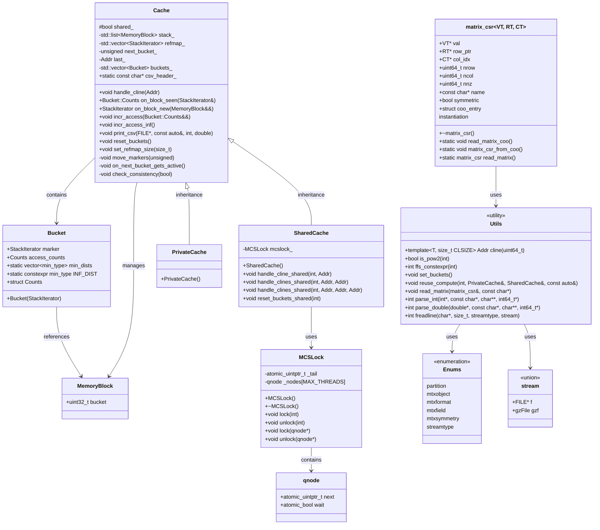
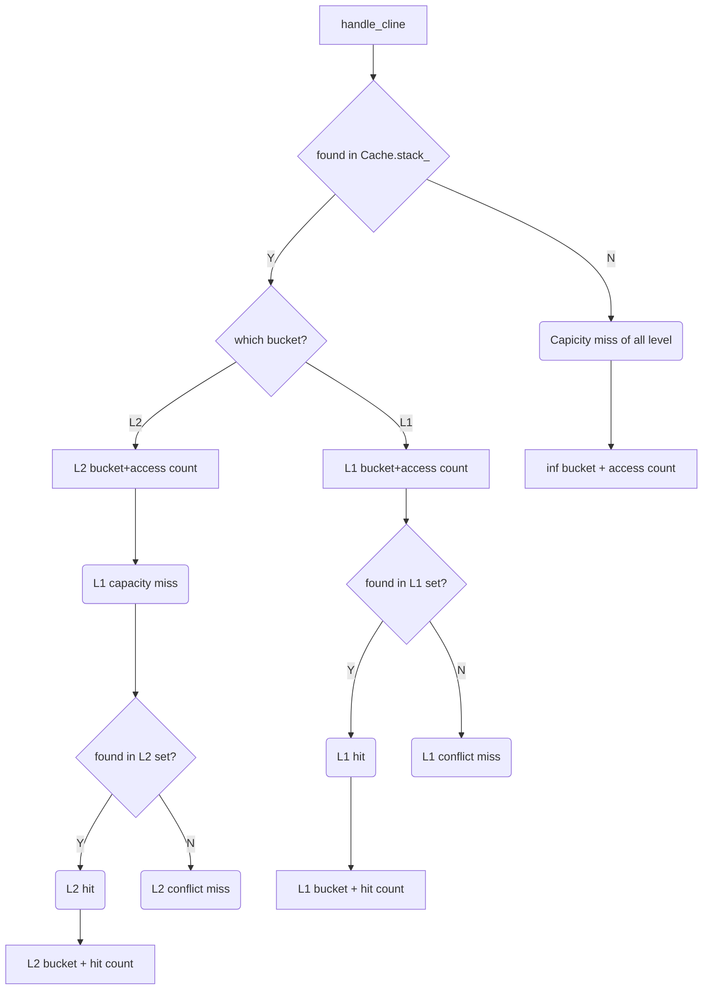
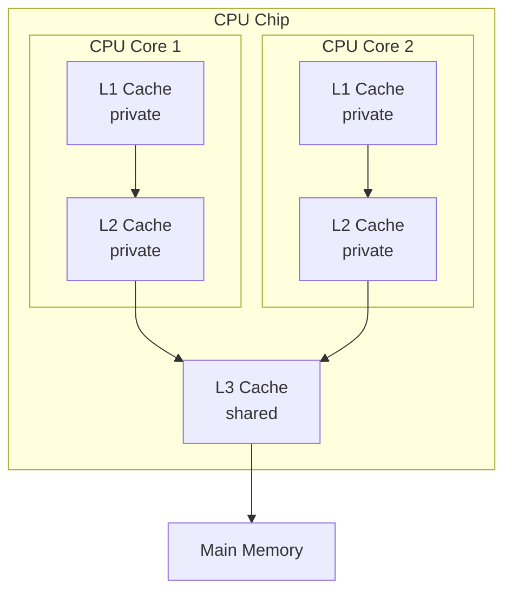

# BA

## Prepare and Config

##### git ssh
-  Ubuntu 24 user.email: nuohengluo@qq.com

通过 `ssh-keygen -t rsa -C 邮箱` 生成的 rsa 在
```
Your identification has been saved in /home/nk/.ssh/id_rsa
Your public key has been saved in /home/nk/.ssh/id_rsa.pub
The key fingerprint is:
SHA256:2gStlQbeNsbwGLsmHzbtCekFYYehJnbEtvIFEyDuhCI nuohengluo@qq.com
The key's randomart image is:
+---[RSA 3072]----+
|. .oo.Bo.        |
|o. .=+.& .       |
|Eoo.++* %        |
|=..+. .% .       |
| . o..X S        |
|    .* X .       |
|      + +        |
|                 |
|                 |
+----[SHA256]-----+
```

```
ssh-rsa AAAAB3NzaC1yc2EAAAADAQABAAABgQCqRKdNEi0BdbS4d4vL5N27pEPi65fbbySJ4JFyy8Kcxc2StMsqJFmyG7PWOvsz3k3RCkNlRFunIbLerX7bucTry9V9+66kVVFhH28o+TAzSGvbOsyR5GV7Dtdl3qLhiNZjrwgO0bnT2LYioVNShhzsLFguNE5D6SIGk5gwXjLC7dew/avQ6jYyaG+7xIPHMETu1Bgl3kTy2l8EEtowz5/WKTWRy5maCrP7iio+fsfTbl3CGv1jowBG3e0pWiU9mUP+x6sNqyBZVntzeQi83Uz2rKCLdxM9ErVvbEQY+e61axlCC8v+xNuLgz9yIkAfikjWkKrBisNiopN4TeXWEq0eTmxAF8M1JA2Ld7G7LkXOKHKjQt/Nfw7+xcA3CEReKacehbswuPGlerb4ZBj//4TDCTZiwU+k1Dgm6u9ISMqWZmcLFgXQtiZCIs6awarTToOmzKF100FCkMZV1ZzN/lfYHTYIukOYgs/1bEqvYgiRJGB2dSKpvwpvRhgISfn3E6E= nuohengluo@qq.com
```

#### beast

ssh cip + 151

ssh lrzcluster -p 22 + 151

2FA: Privacy IDEA(Android+ios) + PUSH Toke

以上两个都设置好了应该不再需要输密码

ssh beast

ssh-copy-id lrzcluster -p 22 

ssh-rsa AAAAB3NzaC1yc2EAAAADAQABAAABgQDMvKIE3fCDxWG+Ribh82LfCGMDogD9qvih1sN9753BOmOuJR62xpjUnozlV3Exl2wsfEdVkK4/eH0C7DIP98O8FwL6b3Hn0O6P388lVt9h2/zdggUd/CQWxCrbNzF2+Q9T1VzUi7kDqX2cVcMeZsx7vUlY4oebnPCIwYA8QR941wBJog3uDlfOee8/M8/OwjL+SIKc/jw8jjtMx55pQZQAbqBkO1yg7FWA16UVioqFxMVKVRhyIehrrs6gCBM+xpF3A38immZfswZPvhKBrnC4OxqTXtmUPss3jvNg0zqeFr3rNna0Aejoa0RKJqDpR0xmu8zRHL48onQys0IV0SXbZhCxbPFyOO7N7DEFD2jAIAELPJ2LJpC3IjZV3ikgEctHKVQA74V5LI1VG0k50A+REyHNBTUUfXkNIBZfcIjQOjqBtyi5sWpnQR7UH1ZFFrdZmou6awf0rlSUvooXpR+QoN5LGbtS0hoW63WLO/aFkQtNM3hU5AEYX/5c9hsYkDs= ra72qab@coop1

![[attachments/Pasted image 20250729111156.png]]

window 不支持 ControlPath, 去 config 里注释掉就好了


不知道怎么出了一次问题, vsc 怎么也连不上
[ra72qab@cs2 ~]$ rm -rf .vscode-server/ 删掉了重装又连上了cs2, 其他还是不行

然后又在 coop1 上删一次, 就登上了 coop1
## Collect Materials

- you should cite it if your use their matrices [About | SuiteSparse Matrix Collection](https://sparse.tamu.edu/about)

cpu uses SRAM

The stack distance algorithm is based on [Kim et al. 1991](https://dl.acm.org/doi/pdf/10.1145/107972.107995)

Christie Alappat, Nils Meyer, Jan Laukemann, Thomas Gruber, Georg Hager, Gerhard Wellein, and Tilo Wettig. 2022. Execution-Cache-Memory modeling and performance tuning of sparse matrix-vector multiplication and Lattice quantum chromodynamics on A64FX. Concurrency and Computation: Practice and Experience 34, 20 (2022), e6512. 
## extend

- Victim Cache：(by conflict miss)额外缓存被替换的数据块，减少冲突影响
## Comments

#### makefile
This is a Makefile for building a C++ program called `spmvrd` (likely "Sparse Matrix-Vector Multiplication with Reordering"). Let me break it down section by section:

##### Basic Configuration

```makefile
SHELL:=/bin/bash
BIN:=spmvrd
```

Sets the shell to bash and defines the final executable name as `spmvrd`.

##### File Discovery

```makefile
HEADERS:=$(wildcard *.h)
SOURCES:=$(wildcard *.cpp)
OBJECTS:=$(SOURCES:.cpp=.o)
```

Automatically finds all `.h` header files and `.cpp` source files in the current directory, then creates a list of corresponding `.o` object files.

##### Compiler Flags

The `CXXFLAGS` are built up incrementally:

**Performance flags:**

- `-std=c++20`: Use C++20 standard
- `-fopenmp`: Enable OpenMP for parallel processing
- `-Ofast`: Aggressive optimization (faster than `-O3`)
- `-march=native -mtune=native`: Optimize for the current CPU architecture
- `-flto`: Link-time optimization

**Build configuration:**

- `-DNDEBUG`: Disable debug assertions
- `-g3`: Include debug symbols (maximum level)

**Warning flags:**

- `-Wall -Wextra -Wpedantic`: Enable comprehensive warnings
- Multiple `-Wno-*` flags to disable specific warnings that are apparently not relevant for this codebase

**Commented-out options:**

- Profiling flags (`-pg -fno-inline`)
- Additional strict warnings (`-Weffc++`, `-Wconversion`)
- Sanitizers for debugging (undefined behavior, address, thread)

##### Hardware-Specific Optimization

```makefile
CXXFLAGS+=-DMEMBLOCKLEN=$(shell getconf LEVEL1_DCACHE_LINESIZE)
CXXFLAGS+=-DCACHE_LINESIZE=$(shell getconf LEVEL1_DCACHE_LINESIZE)
```

These dynamically determine the CPU's L1 data cache line size and pass it as preprocessor definitions. This allows the code to optimize memory access patterns for the specific hardware it's running on.

##### Build Rules

```makefile
$(BIN): $(OBJECTS)
	$(CXX) $(CXXFLAGS) $^ -o $@ $(LDFLAGS)

%.o: %.cpp $(HEADERS)
	$(CXX) $(CXXFLAGS) -c $< -o $@
```

Standard pattern: compile each `.cpp` file to a `.o` object file, then link all objects into the final executable. Object files depend on all headers, so changing any header will trigger recompilation.

This Makefile is clearly for a high-performance computing application, likely involving sparse matrix operations, with careful attention to CPU optimization and parallel processing.

These are **automatic variables** in Make that represent different parts of the current rule:

##### automatic variables
###### `$@` - Target

The name of the target (what's being built)

```makefile
$(BIN): $(OBJECTS)
	$(CXX) $(CXXFLAGS) $^ -o $@ $(LDFLAGS)
```

Here `$@` expands to `$(BIN)`, which is `spmvrd`. So this becomes:

```bash
g++ [flags] [objects] -o spmvrd [ldflags]
```

###### `$^` - All Prerequisites

All the dependencies/prerequisites of the target

In the same rule, `$^` expands to `$(OBJECTS)`, which might be something like `main.o utils.o matrix.o`. So the full command becomes:

```bash
g++ [flags] main.o utils.o matrix.o -o spmvrd [ldflags]
```

###### `$<` - First Prerequisite

The first (or only) dependency

```makefile
%.o: %.cpp $(HEADERS)
	$(CXX) $(CXXFLAGS) -c $< -o $@
```

For a specific file like `main.cpp`, `$<` expands to `main.cpp` (the first prerequisite), while `$@` expands to `main.o`. This becomes:

```bash
g++ [flags] -c main.cpp -o main.o
```

###### Why Use These?

They make Makefiles more maintainable and less error-prone:

- No need to repeat target/dependency names
- Rules work generically for pattern matching (like `%.o: %.cpp`)
- Less chance of typos when copying similar rules

Other common automatic variables include `$?` (prerequisites newer than target) and `$*` (the stem of pattern rules).

### mcslock.h

这是一个MCS锁(Mellor-Crummey and Scott Lock)的实现，它是一种自旋锁的变体，专门设计用于减少高竞争环境下的缓存一致性流量。

让我们逐部分分析：

1. 基础结构体 `qnode`:
```cpp
struct alignas(CACHE_LINESIZE) qnode {
    atomic_uintptr_t next;  // 指向队列中下一个节点的指针
    atomic_bool      wait;  // 表示是否需要等待的标志
};
```
- 使用`alignas(CACHE_LINESIZE)`确保每个节点都对齐到缓存行，避免伪共享
- 每个节点包含两个原子变量：指向下一个节点的指针和等待标志

2. `MCSLock`类的主要组件：
```cpp
private:
    atomic_uintptr_t _tail;  // 指向队列尾部的指针
    qnode            _nodes[MAX_THREADS];  // 为每个线程预分配的节点数组
```

3. 加锁操作(`lock`)的工作流程：
- 初始化当前节点：清空next指针，设置wait为true
- 将节点添加到队列尾部，并获取之前的尾节点
- 如果有前驱节点：
  - 将当前节点链接到前驱节点
  - 自旋等待直到wait标志被清除

4. 解锁操作(`unlock`)的工作流程：
- 获取后继节点
- 如果没有后继节点：
  - 尝试将尾指针设为NULL（表示队列为空）
  - 如果成功，直接返回
  - 如果失败，说明有新节点正在入队，需要等待其完成
- 最后，将后继节点的wait标志设为false，允许其获取锁


使用示例：
```cpp
MCSLock lock;
// 在线程中使用
lock.lock(thread_id);   // 获取锁
// 临界区代码 do something
lock.unlock(thread_id); // 释放锁
```

这个实现使用了C++的原子操作来确保线程安全，并且通过预分配节点数组来避免动态内存分配的开销。代码中的`MAX_THREADS`常量定义了支持的最大线程数。

#### mcs 主要优点
1. 每个线程只在自己的本地变量上自旋，减少了缓存一致性流量
2. FIFO(先进先出)顺序保证了公平性
3. 没有中央热点，扩展性好
#### mcs 如何降低缓存一致性开销

MCS锁通过以下方式降低缓存一致性开销：

- **将等待线程组织成队列**（每个线程在其本地缓存行上自旋）
- **仅在锁交接时更新队列尾指针**
- **消除传统自旋锁的"群惊效应"（thundering herd effect）**
- Organizing waiting threads in a **queue** (each thread spins on its own local cache line)
- Only updating the queue tail pointer during lock handoff
- Eliminating the "thundering herd" effect of traditional spin locks

#### 惊群 Thundering Herd Effect

**群惊效应**指当锁释放时，所有等待线程同时被唤醒并争抢资源导致的性能骤降现象，此译名在分布式系统文献中被广泛采用。

 **触发场景**：  
当某个共享资源（如锁、网络连接、文件句柄）从**不可用变为可用**时：
- 操作系统会唤醒 **所有正在等待该资源的线程/进程**
- 这些被唤醒的线程会**同时发起资源请求**
- 最终**只有一个线程能成功获取资源**，其他线程再次陷入等待

**性能损耗来源**：
- ⚡ **CPU资源浪费**：大量上下文切换（Context Switching）
- 🧩 **缓存失效**：多个核心频繁读写同一内存地址（缓存行乒乓）
- 📉 **系统抖动**：资源争抢导致响应延迟飙升

**典型场景案例**
1. **多线程锁竞争**
    - **传统自旋锁（如pthread_mutex）**：  
        锁释放时唤醒所有等待线程 → 引发惊群
    - **优化方案**：  
        使用 **队列化锁（如MCS锁、Futex）**，仅唤醒下一个等待线程
2. **网络服务器（如Nginx/Apache）**
    - **accept() 系统调用**：  
        当新连接到达时，内核唤醒**所有监听同一端口的Worker进程**
    - **优化方案**：  
        开启 `SO_REUSEPORT`（Linux 3.9+）或使用 **EPOLLEXCLUSIVE** 标志（Linux 4.5+）
3. **文件系统事件（如inotify）**
    - 文件修改事件触发 → 通知**所有监控该文件的进程**
    - **优化方案**：  
        使用 **事件合并机制**（如Fanotify）

#### mcs 伪代码

```cpp
// MCS锁实现伪代码
void lock(MCSLock* lock, MCSNode* node) {
  node->next = NULL;
  MCSNode* prev = atomic_exchange(&lock->tail, node);  // 原子入队
  if (prev != NULL) {
    prev->next = node;     // 传递指针
    while (!node->locked); // 仅自旋本地变量
  }
}
```

#### 自旋锁

**自旋锁（Spinlock）** 是一种基础的**忙等待锁**，用于多线程/多核环境中保护共享资源。

其核心特点是：当线程尝试获取锁失败时，不会进入睡眠状态，而是通过**循环检测（自旋）** 持续检查锁状态，直到成功获取锁。

依赖**原子指令**（如x86的`LOCK CMPXCHG`）确保锁操作的*原子性*

```cpp
// 加锁
while (true) {
  if (锁空闲) {       // 步骤1：检查锁状态
    获取锁并退出循环;  // 步骤2：原子操作设置锁状态
  }
  // 否则持续循环检查（自旋）
}

// 解锁
原子操作将锁标记为“空闲”;  // 允许其他线程获取
```

#### 自旋锁 vs. 临界锁
| **特性**   | 自旋锁 (Spinlock) | 互斥锁 (Mutex)    |
| -------- | -------------- | -------------- |
| **阻塞行为** | 忙等待（不释放CPU）    | 睡眠等待（释放CPU）    |
| **开销来源** | CPU循环消耗        | 上下文切换（~1-10μs） |
| **适用场景** | 短临界区、非抢占式内核    | 长临界区、用户态应用     |
| **死锁风险** | 在单核需禁用抢占       | 支持超时和死锁检测      |
| **实现位置** | 内核/用户态均可       | 通常依赖操作系统调度     |

> 💡 黄金法则：
> 临界区执行时间 < 线程切换时间 → 选**自旋锁**；
> 否则 → 选**互斥锁**

#### atomic

- 原子操作库
- 无需锁的线程安全编程
- 避免对原子变量进行非原子操作（如直接解引用），必须通过原子接口访问。

```cpp
atomic_int counter = ATOMIC_VAR_INIT(0);
// 原子的写入一个值并返回原值
C atomic_exchange(volatile A* obj, C desired);
int old_val = atomic_exchange(&counter, 0);

atomic_bool exit_flag = ATOMIC_VAR_INIT(false);
// 原子地存储新值
void atomic_store(volatile A* obj, C desired);
atomic_store(&exit_flag, true);

// 读取指针（需反向转换）
while (atomic_load(&(p->wait)))
qnode *succ = (qnode *)atomic_load(&(p->next));
```

#### atomic CAS
compare and swap

- strong版本提供了更强的保证，只有在实际值确实不匹配时才会失败
- weak 可能会伪失败, 即使比较值相等

```cpp
bool atomic_compare_exchange_weak(volatile A* obj, C* expected, C desired);
bool atomic_compare_exchange_strong(volatile A* obj, C* expected, C desired);
```

```cpp
// _tail == old_p ?
// _tail = nullptr (true) : old_p = _tail (false)
if (atomic_compare_exchange_strong(&_tail, (uintptr_t *)&old_p, (uintptr_t)NULL)) {
    // _tail was p and is now nullptr
    return;
}
```

让我解释这段代码中`compare_exchange`的使用目的：

这里的`compare_exchange`操作并非"什么都没做"，而是在执行一个非常重要的原子检查和更新操作。让我详细解释这段逻辑：

1. 这段代码出现在`unlock`操作中，当一个线程发现没有后继节点（`succ == NULL`）时执行。

2. `compare_exchange`在这里的作用是：
```cpp
if (atomic_compare_exchange_strong(&_tail, (uintptr_t *)&old_p, (uintptr_t)NULL))
```
- 检查`_tail`是否仍然指向当前节点（`p`）
- 如果是，则将`_tail`设置为`NULL`
- 如果不是，则将实际的`_tail`值存储在`old_p`中

3. 这个操作有两种可能的结果：

   - 成功情况：
     - 说明当前节点确实是队列中的最后一个节点
     - 没有其他线程正在尝试获取锁
     - 这种情况下，直接返回即可，因为队列已经为空
   
   - 失败情况：
     - 说明在我们检查`succ`为`NULL`到执行`compare_exchange`期间
     - 有新的线程加入了队列
     - 这种情况下，我们需要等待新线程完成将自己链接到当前节点的操作

4. 为什么这很重要：
   - 这是一个关键的竞态条件处理
   - 如果没有这个检查，可能会在新节点还没有正确链接时就释放锁
   - 这可能导致队列断裂，使得某些线程永远等待

简单来说，这个`compare_exchange`操作是一个原子性的"检查并更新"操作，用于安全地处理队列为空的情况，同时也能检测到是否有新的线程正在尝试获取锁。这是确保锁正确性的关键操作，而不是"什么都没做"。

为什么用 strong?
- 操作的正确性比轻微的性能优化更重要
- 避免伪失败导致的不必要自旋

### cache

#### 纵览




这是一个用于模拟和分析内存访问模式的缓存模拟器

2. 核心数据结构：
```cpp
class Cache {
    std::list<MemoryBlock> stack_{};  // 缓存栈
    std::vector<StackIterator> refmap_{};  // 引用映射
    std::vector<Bucket> buckets_{};  // 桶系统
};
```

3. 主要功能和工作原理：

a) 缓存行访问处理：
```cpp
void Cache::handle_cline(Addr addr) {
    if (addr == last_) {
        incr_access({0u});
        return;
    }
    last_ = addr;
    StackIterator &it = refmap_[addr];
    
    if (it == stack_.end()) {
        incr_access_inf();
        refmap_[addr] = on_block_new(MemoryBlock{0u});
    } else {
        incr_access(on_block_seen(it));
    }
}
```
- 检查是否是重复访问
- 查找缓存行是否在缓存中
- 处理缓存命中或未命中的情况

b) 缓存替换策略：
```cpp
StackIterator Cache::on_block_new(MemoryBlock &&mb) {
    stack_.push_front(std ::move(mb));
    move_markers(next_bucket_ - 1);
    
    if (Bucket::min_dists[next_bucket_] != Bucket::INF_DIST &&
        (stack_.size() > Bucket::min_dists[next_bucket_])) {
        on_next_bucket_gets_active();
    }
    return stack_.begin();
}
```
- 使用栈式替换策略
- 新访问的块放在栈顶
- 通过桶系统跟踪访问距离

c) 桶系统管理：
```cpp
void Cache::move_markers(unsigned bucket_max) {
    for (unsigned b{1u}; b <= bucket_max; b++) {
        --(buckets_[b].marker);
        (buckets_[b].marker)->bucket++;
    }
}
```
- 使用桶来分类缓存块
- 根据访问距离将块分配到不同的桶
- 动态调整桶的标记位置

4. 多线程支持：
```cpp
class SharedCache : public Cache {
    void handle_cline_shared(int tid, Addr a) {
        mcslock_.lock(tid);
        handle_cline(a);
        mcslock_.unlock(tid);
    }
    MCSLock mcslock_{};
};
```
- 使用 MCSLock 实现线程安全
- 提供线程安全的缓存访问方法

5. 性能分析功能：
```cpp
void Cache::print_csv(FILE *file, const auto &matrix, int id, double time) const {
    size_t working_set_size = stack_.size();
    for (size_t i{0u}; i != Bucket::min_dists.size(); ++i) {
        fprintf(file, "%s,%zu,%zu,%d,%d,%f,%zu,%zu,%lu\n",
                matrix.name, matrix.nnz, matrix.nrow, id,
                shared_, time, working_set_size,
                Bucket::min_dists[i], buckets_[i].access_counts.count);
    }
}
```
- 记录缓存访问统计信息
- 输出性能指标到 CSV 文件

6. 一致性检查：
```cpp
void Cache::check_consistency(bool force) {
    // 检查桶标记的位置是否正确
    // 验证访问距离是否符合预期
}
```
- 确保缓存状态的一致性
- 验证桶系统的正确性

这个缓存模拟器的主要用途是：
1. 分析内存访问模式
2. 评估缓存性能
3. 研究缓存替换策略
4. 支持多线程环境下的缓存行为分析

特别适用于：
- 矩阵运算等计算密集型应用
- 内存访问模式分析
- 缓存性能优化研究
- 多线程程序的内存行为分析

这个实现的特点是：
1. 使用栈式替换策略
2. 通过桶系统跟踪访问距离
3. 支持多线程访问
4. 提供详细的性能统计
5. 包含完整的一致性检查机制

#### stack_(cache sys simulator), refmap_(cache block search)

让我详细解释 `stack_` 和 `refmap_` 的作用和关系：

1. 数据结构定义：
```cpp
std::list<MemoryBlock> stack_{};  // 缓存栈
std::vector<StackIterator> refmap_{};  // 引用映射
```

2. 它们的作用：

`stack_`：
- 是一个双向链表，存储实际的缓存块
- 最近访问的块在栈顶（链表头部）
- 最久未访问的块在栈底（链表尾部）
- 每个块都记录了自己的桶号（bucket）

`refmap_`：
- 是一个向量，用于快速查找缓存块
- 索引是缓存行地址（Addr）
- 值是 `stack_` 中对应块的迭代器
- 用于 O(1) 时间复杂度的缓存查找

##### 举例说明：

假设我们有以下内存访问序列：
```
访问地址：A -> B -> C -> A -> D -> B
```

让我们看看 `stack_` 和 `refmap_` 如何变化：

初始状态：
```
stack_: 空
refmap_: 所有位置指向 stack_.end()
```

访问 A：
```
stack_: [A]
refmap_: [A的迭代器, 其他都是end]
```

访问 B：
```
stack_: [B, A]
refmap_: [A的迭代器, B的迭代器, 其他都是end]
```

访问 C：
```
stack_: [C, B, A]
refmap_: [A的迭代器, B的迭代器, C的迭代器, 其他都是end]
```

访问 A（再次访问）：
```
stack_: [A, C, B]
refmap_: [A的迭代器, B的迭代器, C的迭代器, 其他都是end]
```

访问 D：
```
stack_: [D, A, C, B]
refmap_: [A的迭代器, B的迭代器, C的迭代器, D的迭代器, 其他都是end]
```

访问 B（再次访问）：
```
stack_: [B, D, A, C]
refmap_: [A的迭代器, B的迭代器, C的迭代器, D的迭代器, 其他都是end]
```

##### 关键操作示例

a) 查找缓存块：
```cpp
StackIterator &it = refmap_[addr];
if (it == stack_.end()) {
    // 缓存未命中
} else {
    // 缓存命中
}
```

b) 添加新块：
```cpp
stack_.push_front(std::move(mb));  // 新块放在栈顶
refmap_[addr] = stack_.begin();    // 更新引用映射
```

c) 移动已存在的块：
```cpp
// 将块移到栈顶
stack_.splice(stack_.begin(), stack_, it);
// refmap_ 不需要更新，因为迭代器仍然有效
```

##### 性能特点

`stack_`：
- 使用 `std::list` 实现
- 支持 O(1) 时间的插入和删除
- 支持 O(1) 时间的块移动
- 内存开销较大

`refmap_`：
- 使用 `std::vector` 实现
- O(1) 时间的查找
- 连续内存布局，缓存友好
- 需要预分配空间

6. 实际应用场景：

假设在矩阵运算中：
```
访问矩阵元素：M[0,0] -> M[0,1] -> M[1,0] -> M[0,0]
```

对应的缓存行访问：
```
访问缓存行：C0 -> C1 -> C2 -> C0
```

缓存模拟器会：
1. 通过 `refmap_` 快速检查缓存行是否在缓存中
2. 使用 `stack_` 维护缓存行的访问顺序
3. 根据访问模式更新桶系统
4. 记录缓存命中/未命中的统计信息

这种设计的优点：
1. 快速查找（O(1)）
2. 高效更新（O(1)）
3. 准确模拟缓存行为
4. 支持详细的性能分析

这种实现特别适合：
- 分析内存访问模式
- 研究缓存替换策略
- 优化程序的内存访问
- 评估缓存性能

#### Bucket: miss/hit stats

| 桶索引 | 最小距离   | 含义      | 缓存行为       |
| --- | ------ | ------- | ---------- |
| 0   | 0      | 立即重用    | 缓存命中（最近访问） |
| 1   | 1024   | L1缓存范围内 | 可能在L1缓存中   |
| 2   | 131072 | L2缓存范围内 | 可能在L2缓存中   |
| 3   | ∞      | 超出所有缓存  | 冷缺失（从内存加载） |
-  通过桶系统跟踪 reuse distance

```cpp
void incr_access(Bucket::Counts &&bucket) {
    auto [bx] = bucket;
    buckets_[bx].access_counts.count++;  // 在对应桶中增加计数
}
```

```cpp
void incr_access_inf() {
    auto bucket_inf = Bucket::min_dists.size() - 1;  // 使用最后一个桶
    incr_access({bucket_inf});  // 在无限距离桶中增加计数
}
```

##### 实例
```
访问A（未命中）：
- 增加 INF 距离桶的计数

访问B（未命中）：
- 增加 INF 距离桶的计数

访问C（未命中）：
- 增加 INF 距离桶的计数

访问A（命中，距离=2）：
- 增加距离2桶的计数

访问D（未命中）：
- 增加 INF 距离桶的计数

访问B（命中，距离=2）：
- 增加距离2桶的计数
```


#### cache misses
 1 冷缺失（Cold Miss）
    • 首次访问某数据时必然发生，因数据尚未加载到缓存中，也称为冷启动缺失。
 2 容量缺失（Capacity Miss）
    • 因缓存容量有限，当活跃数据量超过缓存大小时，部分数据被替换出去，再次访问时引发缺失。
 3 冲突缺失（Conflict Miss）
    • 由缓存映射规则（如组相联映射）导致：多个数据竞争同一缓存组（行），即使缓存仍有空闲空间也会触发替换。
 4 一致性缺失（Coherency Miss）
    • 多核/多处理器系统中，因其他核心修改共享数据（缓存一致性协议触发失效）而导致的缺失。

#### grammar

我来分析这两行代码使用的语法：

第53行：`incr_access({0u});`

这行代码使用了**列表初始化（List Initialization）**语法，这是C++11引入的特性：

- `{0u}` 创建了一个临时的 `Bucket::Counts` 对象
- `0u` 表示无符号整数0
- 大括号 `{}` 用于直接初始化对象，编译器会根据 `incr_access` 函数的参数类型自动推导

第77行：`auto [bx] = bucket;`

这行代码使用了**结构化绑定（Structured Bindings）**语法，这是C++17引入的特性：

- `auto [bx]` 声明了一个结构化绑定
- `bucket` 是一个 `Bucket::Counts` 对象
- `bx` 被绑定到 `bucket` 的第一个成员
- 这种语法允许你直接解构对象并访问其成员，而不需要显式访问

从代码上下文可以看出，`Bucket::Counts` 是一个包含单个成员的结构体或类，所以 `[bx]` 只绑定了一个变量。

这两种语法都是现代C++的特性，提供了更简洁和表达力更强的代码编写方式。
### openMP

#### 速通
 -  parallel：创建并行区域。
 -  critical：保护共享数据（慎用，性能低）。
 -  single：只有一个线程执行任务。
 -  barrier：所有线程到达 barrier 再继续执行. (OpenMP 在某些隐式同步点, 如 parallel for 结束, 会自动插入屏障)
 -  schedule：优化循环分配策略。
 -  规则：优先用 atomic 替代 critical，用 reduction 处理规约操作，避免过度同步。
 
```cpp
#include <omp.h>
#include <stdio.h>

int main() {
    int sum = 0;
    #pragma omp parallel
    {
        #pragma omp single
        printf("Threads: %d\n",
omp_get_num_threads());

        #pragma omp for schedule(static)
reduction(+:sum)
        for (int i = 0; i < 100; i++) {
            sum += i;
        }

        #pragma omp barrier  //
确保所有线程完成累加

        #pragma omp critical
        printf("Thread %d: sum = %d\n",
omp_get_thread_num(), sum);
    }
    return 0;
}
```

#### func

##### `omp_get_num_threads()` 
返回当前并行区域的总线程数

##### `omp_get_max_threads()`
- 用于获取当前环境下可用的最大线程数
- 项目中用 `MAX_THREADS` 配置, env 用 `OMP_NUM_THREADS`

##### `omp_set_num_threads()`, `#pragma omp parallel num_threads(N)`
实际使用的线程数可能通过 `omp_set_num_threads()` 或 `#pragma omp parallel num_threads(N)` 动态调整

##### `omp_get_thread_num()`
- 获取当前线程的唯一id
- 返回 int 类型，范围是 0 到 omp_get_num_threads() - 1. 也就是内部的线程 id

##### `omp_get_wtime()`
- 高精度计时函数，用于测量代码段的执行时间 （wall-clock time，即真实世界时间）
- 返回 double, seconds since 1970
- 精度通常达到微秒 $\mu s$ , 取决于系统硬件

#### paralleling

<span style="color: rgb(75, 153, 211); display: flex; flex-direction: row; align-items: center; padding: 0px 0.5em; font-size: 0.824em; border-radius: 0.428em; line-height: 2.306em; background-color: rgba(75, 153, 211, 0.15);"><span style="margin-right: 0.2em; display: flex; flex-direction: row; align-items: center; justify-content: center;"><svg xmlns="http://www.w3.org/2000/svg" version="1.1" viewBox="0 0 24 24" width="1.9988577955454025em" height="1.9988577955454025em" stroke="currentColor" aria-hidden="true" class=""><path d="m21.15 6.85c0-2.2056-1.7944-4-4-4-4.1765-0.01989-5.4993 5.7322-1.8147 7.5629-0.263 0.63631-0.4627 1.4421-0.6559 2.2215-0.1397 0.56337-0.2841 1.1459-0.4405 1.6084-0.0728 0.2155-0.1286 0.4813-0.1891 0.4813-0.5072-0.7362-0.8126-2.2507-1.0979-3.3161-0.47879-1.5358-0.72936-4.4237-2.8018-4.558-0.77422 7e-5 -1.3844 0.52253-1.8138 1.553-0.55019 1.254-0.75064 3.2421-1.3784 4.4472-0.39648 3e-4 -0.79576 0.0045-1.1877 0.0703-0.67978 0.1073-1.3339 0.4195-1.798 0.9347-0.39707 0.4315-0.6427 0.9874-0.74275 1.5623-0.063545 0.351-0.07691 0.7094-0.07883 1.0654 0.001935 0.4718-0.01324 0.9457 0.027745 1.4163 0.09435 1.151 0.65732 2.1308 1.7281 2.6237 0.43467 0.1975 0.91053 0.2877 1.3854 0.3129 0.40096 0.0215 0.80345 0.0129 1.2048 0.0139 0.6491 2e-4 1.2891-0.0515 1.888-0.3229 0.90042-0.4067 1.4845-1.2039 1.6712-2.1666 0.0761-0.3779 0.09179-0.7654 0.09344-1.15 7.7e-4 -0.2699 0.00148-0.5413-7.8e-4 -0.8111-0.00379-0.4854-0.04143-0.9771-0.19121-1.4414-0.28748-0.9172-0.98053-1.616-1.8964-1.909 0.43984-1.1576 0.66815-2.7594 1.1268-3.8895 0.3537 0.72804 0.57113 1.7669 0.82283 2.7298 0.26567 1.0724 0.5404 2.1814 0.90896 3.0557 0.87204 2.2985 3.1124 2.7586 4.0452 0.392 0.5508-1.2642 0.7508-3.279 1.3828-4.4916 2.1142-0.10339 3.8024-1.8557 3.8024-3.995zm-12.073 8.8023c0.05605 0.2275 0.06623 0.465 0.07092 0.6983 0.00363 0.2444 0.00195 0.4906 0.00214 0.735-0.0063 0.408 0.01486 0.882-0.18359 1.2496-0.24573 0.4539-0.8026 0.501-1.2651 0.5114-0.33714 0.0058-0.67525 0.0041-1.0124 0.0018-0.46455-0.0092-1.0361-0.0245-1.3192-0.4545-0.16612-0.2552-0.19733-0.5702-0.21202-0.8673-0.01004-0.2443-0.00683-0.4906-0.0075-0.735 5.9e-4 -0.2322-0.00201-0.4664 0.01171-0.6983 0.01886-0.2936 0.06332-0.6069 0.24969-0.8453 0.34185-0.4331 1.0226-0.3889 1.5228-0.3979 0.38828 0.0035 0.77905-0.0131 1.1658 0.0285 0.49865 0.0566 0.85211 0.2621 0.97684 0.7737zm8.0732-6.8023c-2.6379-0.06696-2.6373-3.9334 0-4 2.6378 0.06697 2.6373 3.9334 0 4z" fill="currentColor"></path></svg></span>OpenMP Parallel 区域的基本行为</span>

 1. **线程创建和分配**
```cpp
#pragma omp parallel
{
    int tid = omp_get_thread_num();
    // 每个线程都会执行这个代码块
}
```

当遇到 `#pragma omp parallel` 时：
- **创建线程池**：OpenMP 会创建多个线程（默认等于 CPU 核心数）
- **代码复制**：每个线程都会执行 `{}` 内的所有代码
- **线程ID分配**：`omp_get_thread_num()` 给每个线程分配唯一的ID（0, 1, 2, ...）

 2. **在这个程序中的具体分配**

让我们看看每个线程会执行什么：

```cpp
#pragma omp parallel
{
    int tid = omp_get_thread_num();  // 线程0, 1, 2, 3, ...

    PrivateCache pc{};  // 每个线程创建自己的私有缓存
    SharedCache &sc = shared_caches[tid / threads_per_shared_cache];  // 共享缓存分配

    pc.set_refmap_size(refmap_size);  // 每个线程设置自己的私有缓存
    sc.set_refmap_size(refmap_size);  // 每个线程设置共享缓存
}
```

 <span style="color: rgb(75, 153, 211); display: flex; flex-direction: row; align-items: center; padding: 0px 0.5em; font-size: 0.824em; border-radius: 0.428em; line-height: 2.306em; background-color: rgba(75, 153, 211, 0.15);"><span style="margin-right: 0.2em; display: flex; flex-direction: row; align-items: center; justify-content: center;"><svg xmlns="http://www.w3.org/2000/svg" version="1.1" viewBox="0 0 24 24" width="1.9988577955454025em" height="1.9988577955454025em" stroke="currentColor" aria-hidden="true" class=""><path d="m21.15 6.85c0-2.2056-1.7944-4-4-4-4.1765-0.01989-5.4993 5.7322-1.8147 7.5629-0.263 0.63631-0.4627 1.4421-0.6559 2.2215-0.1397 0.56337-0.2841 1.1459-0.4405 1.6084-0.0728 0.2155-0.1286 0.4813-0.1891 0.4813-0.5072-0.7362-0.8126-2.2507-1.0979-3.3161-0.47879-1.5358-0.72936-4.4237-2.8018-4.558-0.77422 7e-5 -1.3844 0.52253-1.8138 1.553-0.55019 1.254-0.75064 3.2421-1.3784 4.4472-0.39648 3e-4 -0.79576 0.0045-1.1877 0.0703-0.67978 0.1073-1.3339 0.4195-1.798 0.9347-0.39707 0.4315-0.6427 0.9874-0.74275 1.5623-0.063545 0.351-0.07691 0.7094-0.07883 1.0654 0.001935 0.4718-0.01324 0.9457 0.027745 1.4163 0.09435 1.151 0.65732 2.1308 1.7281 2.6237 0.43467 0.1975 0.91053 0.2877 1.3854 0.3129 0.40096 0.0215 0.80345 0.0129 1.2048 0.0139 0.6491 2e-4 1.2891-0.0515 1.888-0.3229 0.90042-0.4067 1.4845-1.2039 1.6712-2.1666 0.0761-0.3779 0.09179-0.7654 0.09344-1.15 7.7e-4 -0.2699 0.00148-0.5413-7.8e-4 -0.8111-0.00379-0.4854-0.04143-0.9771-0.19121-1.4414-0.28748-0.9172-0.98053-1.616-1.8964-1.909 0.43984-1.1576 0.66815-2.7594 1.1268-3.8895 0.3537 0.72804 0.57113 1.7669 0.82283 2.7298 0.26567 1.0724 0.5404 2.1814 0.90896 3.0557 0.87204 2.2985 3.1124 2.7586 4.0452 0.392 0.5508-1.2642 0.7508-3.279 1.3828-4.4916 2.1142-0.10339 3.8024-1.8557 3.8024-3.995zm-12.073 8.8023c0.05605 0.2275 0.06623 0.465 0.07092 0.6983 0.00363 0.2444 0.00195 0.4906 0.00214 0.735-0.0063 0.408 0.01486 0.882-0.18359 1.2496-0.24573 0.4539-0.8026 0.501-1.2651 0.5114-0.33714 0.0058-0.67525 0.0041-1.0124 0.0018-0.46455-0.0092-1.0361-0.0245-1.3192-0.4545-0.16612-0.2552-0.19733-0.5702-0.21202-0.8673-0.01004-0.2443-0.00683-0.4906-0.0075-0.735 5.9e-4 -0.2322-0.00201-0.4664 0.01171-0.6983 0.01886-0.2936 0.06332-0.6069 0.24969-0.8453 0.34185-0.4331 1.0226-0.3889 1.5228-0.3979 0.38828 0.0035 0.77905-0.0131 1.1658 0.0285 0.49865 0.0566 0.85211 0.2621 0.97684 0.7737zm8.0732-6.8023c-2.6379-0.06696-2.6373-3.9334 0-4 2.6378 0.06697 2.6373 3.9334 0 4z" fill="currentColor"></path></svg></span>共享缓存的分配策略</span>

 1. **分配公式分析**
```cpp
SharedCache &sc = shared_caches[tid / threads_per_shared_cache];
```

根据配置：
```cpp
constexpr int threads_per_shared_cache = 12;
constexpr int num_shared_caches        = 4;
```

 2. **具体分配示例**
假设有48个线程（`MAX_THREADS = 48`）：

| 线程ID | 计算 | 共享缓存索引 | 共享缓存 |
|--------|------|-------------|----------|
| 0-11   | 0/12=0 | 0 | shared_caches[0] |
| 12-23  | 12/12=1 | 1 | shared_caches[1] |
| 24-35  | 24/12=2 | 2 | shared_caches[2] |
| 36-47  | 36/12=3 | 3 | shared_caches[3] |
 
<span style="color: rgb(75, 153, 211); display: flex; flex-direction: row; align-items: center; padding: 0px 0.5em; font-size: 0.824em; border-radius: 0.428em; line-height: 2.306em; background-color: rgba(75, 153, 211, 0.15);"><span style="margin-right: 0.2em; display: flex; flex-direction: row; align-items: center; justify-content: center;"><svg xmlns="http://www.w3.org/2000/svg" version="1.1" viewBox="0 0 24 24" width="1.9988577955454025em" height="1.9988577955454025em" stroke="currentColor" aria-hidden="true" class=""><path d="m21.15 6.85c0-2.2056-1.7944-4-4-4-4.1765-0.01989-5.4993 5.7322-1.8147 7.5629-0.263 0.63631-0.4627 1.4421-0.6559 2.2215-0.1397 0.56337-0.2841 1.1459-0.4405 1.6084-0.0728 0.2155-0.1286 0.4813-0.1891 0.4813-0.5072-0.7362-0.8126-2.2507-1.0979-3.3161-0.47879-1.5358-0.72936-4.4237-2.8018-4.558-0.77422 7e-5 -1.3844 0.52253-1.8138 1.553-0.55019 1.254-0.75064 3.2421-1.3784 4.4472-0.39648 3e-4 -0.79576 0.0045-1.1877 0.0703-0.67978 0.1073-1.3339 0.4195-1.798 0.9347-0.39707 0.4315-0.6427 0.9874-0.74275 1.5623-0.063545 0.351-0.07691 0.7094-0.07883 1.0654 0.001935 0.4718-0.01324 0.9457 0.027745 1.4163 0.09435 1.151 0.65732 2.1308 1.7281 2.6237 0.43467 0.1975 0.91053 0.2877 1.3854 0.3129 0.40096 0.0215 0.80345 0.0129 1.2048 0.0139 0.6491 2e-4 1.2891-0.0515 1.888-0.3229 0.90042-0.4067 1.4845-1.2039 1.6712-2.1666 0.0761-0.3779 0.09179-0.7654 0.09344-1.15 7.7e-4 -0.2699 0.00148-0.5413-7.8e-4 -0.8111-0.00379-0.4854-0.04143-0.9771-0.19121-1.4414-0.28748-0.9172-0.98053-1.616-1.8964-1.909 0.43984-1.1576 0.66815-2.7594 1.1268-3.8895 0.3537 0.72804 0.57113 1.7669 0.82283 2.7298 0.26567 1.0724 0.5404 2.1814 0.90896 3.0557 0.87204 2.2985 3.1124 2.7586 4.0452 0.392 0.5508-1.2642 0.7508-3.279 1.3828-4.4916 2.1142-0.10339 3.8024-1.8557 3.8024-3.995zm-12.073 8.8023c0.05605 0.2275 0.06623 0.465 0.07092 0.6983 0.00363 0.2444 0.00195 0.4906 0.00214 0.735-0.0063 0.408 0.01486 0.882-0.18359 1.2496-0.24573 0.4539-0.8026 0.501-1.2651 0.5114-0.33714 0.0058-0.67525 0.0041-1.0124 0.0018-0.46455-0.0092-1.0361-0.0245-1.3192-0.4545-0.16612-0.2552-0.19733-0.5702-0.21202-0.8673-0.01004-0.2443-0.00683-0.4906-0.0075-0.735 5.9e-4 -0.2322-0.00201-0.4664 0.01171-0.6983 0.01886-0.2936 0.06332-0.6069 0.24969-0.8453 0.34185-0.4331 1.0226-0.3889 1.5228-0.3979 0.38828 0.0035 0.77905-0.0131 1.1658 0.0285 0.49865 0.0566 0.85211 0.2621 0.97684 0.7737zm8.0732-6.8023c-2.6379-0.06696-2.6373-3.9334 0-4 2.6378 0.06697 2.6373 3.9334 0 4z" fill="currentColor"></path></svg></span>任务分配的不同层次</span> 

 1. **并行区域级别（当前代码）**
```cpp
#pragma omp parallel
{
    // 所有线程都执行相同的代码
    // 通过 tid 区分不同线程的行为
}
```

 2. **矩阵行分配（在 reuse_compute 中）**
```cpp
#pragma omp for schedule(static)
for (unsigned r = 0; r < matrix.nrow; ++r) {
    // 处理矩阵的第 r 行
}
```

这里使用了 `#pragma omp for schedule(static)`：
- **静态调度**：矩阵行被均匀分配给所有线程
- **负载均衡**：每个线程处理大致相同数量的矩阵行

 3. **具体分配示例**
假设有4个线程，矩阵有100行：

| 线程ID | 分配的行范围 | 行数 |
|--------|-------------|------|
| 0 | 0-24 | 25行 |
| 1 | 25-49 | 25行 |
| 2 | 50-74 | 25行 |
| 3 | 75-99 | 25行 |

<span style="color: rgb(75, 153, 211); display: flex; flex-direction: row; align-items: center; padding: 0px 0.5em; font-size: 0.824em; border-radius: 0.428em; line-height: 2.306em; background-color: rgba(75, 153, 211, 0.15);"><span style="margin-right: 0.2em; display: flex; flex-direction: row; align-items: center; justify-content: center;"><svg xmlns="http://www.w3.org/2000/svg" version="1.1" viewBox="0 0 24 24" width="1.9988577955454025em" height="1.9988577955454025em" stroke="currentColor" aria-hidden="true" class=""><path d="m21.15 6.85c0-2.2056-1.7944-4-4-4-4.1765-0.01989-5.4993 5.7322-1.8147 7.5629-0.263 0.63631-0.4627 1.4421-0.6559 2.2215-0.1397 0.56337-0.2841 1.1459-0.4405 1.6084-0.0728 0.2155-0.1286 0.4813-0.1891 0.4813-0.5072-0.7362-0.8126-2.2507-1.0979-3.3161-0.47879-1.5358-0.72936-4.4237-2.8018-4.558-0.77422 7e-5 -1.3844 0.52253-1.8138 1.553-0.55019 1.254-0.75064 3.2421-1.3784 4.4472-0.39648 3e-4 -0.79576 0.0045-1.1877 0.0703-0.67978 0.1073-1.3339 0.4195-1.798 0.9347-0.39707 0.4315-0.6427 0.9874-0.74275 1.5623-0.063545 0.351-0.07691 0.7094-0.07883 1.0654 0.001935 0.4718-0.01324 0.9457 0.027745 1.4163 0.09435 1.151 0.65732 2.1308 1.7281 2.6237 0.43467 0.1975 0.91053 0.2877 1.3854 0.3129 0.40096 0.0215 0.80345 0.0129 1.2048 0.0139 0.6491 2e-4 1.2891-0.0515 1.888-0.3229 0.90042-0.4067 1.4845-1.2039 1.6712-2.1666 0.0761-0.3779 0.09179-0.7654 0.09344-1.15 7.7e-4 -0.2699 0.00148-0.5413-7.8e-4 -0.8111-0.00379-0.4854-0.04143-0.9771-0.19121-1.4414-0.28748-0.9172-0.98053-1.616-1.8964-1.909 0.43984-1.1576 0.66815-2.7594 1.1268-3.8895 0.3537 0.72804 0.57113 1.7669 0.82283 2.7298 0.26567 1.0724 0.5404 2.1814 0.90896 3.0557 0.87204 2.2985 3.1124 2.7586 4.0452 0.392 0.5508-1.2642 0.7508-3.279 1.3828-4.4916 2.1142-0.10339 3.8024-1.8557 3.8024-3.995zm-12.073 8.8023c0.05605 0.2275 0.06623 0.465 0.07092 0.6983 0.00363 0.2444 0.00195 0.4906 0.00214 0.735-0.0063 0.408 0.01486 0.882-0.18359 1.2496-0.24573 0.4539-0.8026 0.501-1.2651 0.5114-0.33714 0.0058-0.67525 0.0041-1.0124 0.0018-0.46455-0.0092-1.0361-0.0245-1.3192-0.4545-0.16612-0.2552-0.19733-0.5702-0.21202-0.8673-0.01004-0.2443-0.00683-0.4906-0.0075-0.735 5.9e-4 -0.2322-0.00201-0.4664 0.01171-0.6983 0.01886-0.2936 0.06332-0.6069 0.24969-0.8453 0.34185-0.4331 1.0226-0.3889 1.5228-0.3979 0.38828 0.0035 0.77905-0.0131 1.1658 0.0285 0.49865 0.0566 0.85211 0.2621 0.97684 0.7737zm8.0732-6.8023c-2.6379-0.06696-2.6373-3.9334 0-4 2.6378 0.06697 2.6373 3.9334 0 4z" fill="currentColor"></path></svg></span>同步机制</span>

1. **Barrier 同步**
```cpp
#pragma omp barrier
#pragma omp single
time = omp_get_wtime();
```

- `#pragma omp barrier`：所有线程在此等待，确保所有线程都完成前面的工作
- `#pragma omp single`：只有一个线程执行时间测量

 2. **Critical 区域**
```cpp
#pragma omp critical
pc.print_csv(csv_file, matrix, tid, time_diff);
```

确保只有一个线程同时写入CSV文件，避免输出混乱。

<span style="color: rgb(75, 153, 211); display: flex; flex-direction: row; align-items: center; padding: 0px 0.5em; font-size: 0.824em; border-radius: 0.428em; line-height: 2.306em; background-color: rgba(75, 153, 211, 0.15);"><span style="margin-right: 0.2em; display: flex; flex-direction: row; align-items: center; justify-content: center;"><svg xmlns="http://www.w3.org/2000/svg" version="1.1" viewBox="0 0 24 24" width="1.9988577955454025em" height="1.9988577955454025em" stroke="currentColor" aria-hidden="true" class=""><path d="m21.15 6.85c0-2.2056-1.7944-4-4-4-4.1765-0.01989-5.4993 5.7322-1.8147 7.5629-0.263 0.63631-0.4627 1.4421-0.6559 2.2215-0.1397 0.56337-0.2841 1.1459-0.4405 1.6084-0.0728 0.2155-0.1286 0.4813-0.1891 0.4813-0.5072-0.7362-0.8126-2.2507-1.0979-3.3161-0.47879-1.5358-0.72936-4.4237-2.8018-4.558-0.77422 7e-5 -1.3844 0.52253-1.8138 1.553-0.55019 1.254-0.75064 3.2421-1.3784 4.4472-0.39648 3e-4 -0.79576 0.0045-1.1877 0.0703-0.67978 0.1073-1.3339 0.4195-1.798 0.9347-0.39707 0.4315-0.6427 0.9874-0.74275 1.5623-0.063545 0.351-0.07691 0.7094-0.07883 1.0654 0.001935 0.4718-0.01324 0.9457 0.027745 1.4163 0.09435 1.151 0.65732 2.1308 1.7281 2.6237 0.43467 0.1975 0.91053 0.2877 1.3854 0.3129 0.40096 0.0215 0.80345 0.0129 1.2048 0.0139 0.6491 2e-4 1.2891-0.0515 1.888-0.3229 0.90042-0.4067 1.4845-1.2039 1.6712-2.1666 0.0761-0.3779 0.09179-0.7654 0.09344-1.15 7.7e-4 -0.2699 0.00148-0.5413-7.8e-4 -0.8111-0.00379-0.4854-0.04143-0.9771-0.19121-1.4414-0.28748-0.9172-0.98053-1.616-1.8964-1.909 0.43984-1.1576 0.66815-2.7594 1.1268-3.8895 0.3537 0.72804 0.57113 1.7669 0.82283 2.7298 0.26567 1.0724 0.5404 2.1814 0.90896 3.0557 0.87204 2.2985 3.1124 2.7586 4.0452 0.392 0.5508-1.2642 0.7508-3.279 1.3828-4.4916 2.1142-0.10339 3.8024-1.8557 3.8024-3.995zm-12.073 8.8023c0.05605 0.2275 0.06623 0.465 0.07092 0.6983 0.00363 0.2444 0.00195 0.4906 0.00214 0.735-0.0063 0.408 0.01486 0.882-0.18359 1.2496-0.24573 0.4539-0.8026 0.501-1.2651 0.5114-0.33714 0.0058-0.67525 0.0041-1.0124 0.0018-0.46455-0.0092-1.0361-0.0245-1.3192-0.4545-0.16612-0.2552-0.19733-0.5702-0.21202-0.8673-0.01004-0.2443-0.00683-0.4906-0.0075-0.735 5.9e-4 -0.2322-0.00201-0.4664 0.01171-0.6983 0.01886-0.2936 0.06332-0.6069 0.24969-0.8453 0.34185-0.4331 1.0226-0.3889 1.5228-0.3979 0.38828 0.0035 0.77905-0.0131 1.1658 0.0285 0.49865 0.0566 0.85211 0.2621 0.97684 0.7737zm8.0732-6.8023c-2.6379-0.06696-2.6373-3.9334 0-4 2.6378 0.06697 2.6373 3.9334 0 4z" fill="currentColor"></path></svg></span>总结</span>

在这个程序中，OpenMP的任务分配是**多层次**的：

1. **线程级别**：每个线程获得唯一的 `tid`
2. **缓存级别**：线程按组分配到共享缓存
3. **工作级别**：矩阵行通过 `#pragma omp for` 静态分配给线程
4. **同步级别**：使用 barrier 和 critical 确保正确的执行顺序

这种设计既保证了并行效率，又维护了缓存分析的正确性。

### main

#### 走一遍流程

准备工作:
- getopt 获取文件路径, verbose 参数
- read matrix
- set_buckets()
- init shared_caches_

each thread: 
- 自己的 pc
- 获取分配的 sc
- pc.set_refmap_size()
- sc.set_refmap_size()
    - 每个线程都会调用, 但因为 `#pragma omp critical` 只会执行一次
    - 保证了每个 sc 都设置到, 而且只执行一次

barrier: 等待 set_refmap_size() 完成

这个时候开始计时 (omp single), 等一下, 为什么从第一次开始计时

执行两次 reuse_compute, 第二次会 reset_buckets

reuse_compute
- 先模拟内存布局, 为 matrix 中的每个数据都分配虚拟的地址
- sc 和 pc 分别处理访问, 这是为了模拟私有缓存和共享缓存

然后 barrier, 停止计时

打印结果
- 注意 shared 是布尔值, cache id 是 tid
- working_set_size = stact_.size()

---

现在我们来到 handle cline




move_markers(next_bucket_ - 1)
- 各级 bucket.marker 往前移一个(因为刚刚插入了新数据)
- 最后一个 it 算进下一个 bucket
#### csr format
- compress sparse row
- 适用于绝大多数元素为零的矩阵
- 三个数组存储 data(非零元素), indices(列索引), indptr(偏移)
    - 通过这三个数组和 shape 可以反推原数组

**data/value**
存储所有非零元素值，按行优先顺序排列。

**indices/col_idx**
存储每个非零元素对应的列索引（从0开始）。

**indptr/row_ptr**
划分行范围. 存储每行的起始位置在data中的偏移。长度为行数+1，最后一项为总非零元素数。

又名: 使用压缩稀疏行（CSR）格式，存储非零元素的值（`values`）、列索引（`col_indices`）和行指针（`row_ptr`）。

<section style="display: flex; flex-direction: row; align-items: center;"><span style="color: rgb(205, 82, 85); display: flex; flex-direction: row; align-items: center; padding: 0px 0.5em; font-size: 0.824em; border-radius: 0.428em; line-height: 2.306em; background-color: rgba(205, 82, 85, 0.15);"><span style="margin-right: 0.2em; display: flex; flex-direction: row; align-items: center; justify-content: center;"><svg xmlns="http://www.w3.org/2000/svg" version="1.1" viewBox="0 0 24 24" width="1.9988577955454025em" height="1.9988577955454025em" stroke="currentColor" aria-hidden="true" class=""><path fill="currentColor" d="m21.9 15.621c0.1248-1.8535-0.6087-3.4099-2.6058-3.8292-0.7712-0.15744-1.3921-0.13977-2.1113-0.14543-0.6323 0.0048-1.1718-0.01567-1.8401 0.03203 1.5356-0.8078 1.6998-2.205 1.6567-3.546 0.1272-2.3708-1.4685-3.666-3.7727-3.673-2.2427-0.04024-5.0463-0.27229-5.9443 1.9172-0.28083 0.6692-0.27606 1.2179-0.28202 1.6587-0.08527 1.4303 0.20687 2.9224 1.662 3.6429-2.3051-0.05275-5.3273-0.39212-6.28 1.8983-0.28073 0.66862-0.27595 1.2174-0.282 1.6572-0.10329 1.6061 0.3059 3.171 2.0252 3.8067 1.2061 0.4187 2.2175 0.2869 3.3945 0.3134 2.0524 0.0901 4.0448-0.4637 4.4796-2.4982 0.609 2.5638 3.2086 2.5463 5.3204 2.4982 2.7823 0.1278 4.7024-0.9368 4.5798-3.7329zm-12.899-7.6287c-0.14889-1.8665 1.8839-1.4921 3.1358-1.546 0.8939 0.05358 2.4743-0.21158 2.8003 0.88445 0.2729 2.4494-0.0297 2.8555-2.5242 2.8232-0.94713-0.07259-2.869 0.28949-3.3134-0.77077-0.14881-0.44557-0.08538-0.92893-0.09846-1.3909zm0.2606 9.2128c-0.56638 0.162-1.1652 0.1412-1.7487 0.1488-0.59786-0.0036-1.1977 0.0131-1.7948-0.0233-0.93407-0.0365-1.6776-0.3579-1.6157-1.4217 0.01574-0.5119-0.06845-1.0551 0.11822-1.5436 0.4432-0.84155 1.5978-0.6728 2.4032-0.7191 0.81712 0.01614 1.6464-0.05154 2.4536 0.10154 0.99382 0.17537 1.0564 0.91742 1.0227 1.7752-6.1e-4 0.7729 0.04085 1.416-0.83867 1.6821zm2.9212-3.6286c-0.0836 0.19457-0.14194 0.3848-0.18279 0.56614-0.18535-0.87758-0.76293-1.6189-1.5605-2.02 1.0871 0.04933 2.0387 0.04959 3.1216-8e-5 -0.7672 0.39034-1.1687 0.96486-1.3783 1.4539zm6.8788 3.6286c-0.5664 0.162-1.1652 0.1412-1.7488 0.1488-0.5978-0.0036-1.1977 0.0131-1.7947-0.0233-0.9341-0.0365-1.6776-0.3579-1.6157-1.4217 0.0157-0.5119-0.0685-1.0551 0.1182-1.5436 0.4432-0.84155 1.5978-0.6728 2.4033-0.7191 0.8171 0.01614 1.6464-0.05154 2.4536 0.10154 0.9938 0.17537 1.0563 0.91742 1.0227 1.7752-6e-4 0.7729 0.0409 1.416-0.8386 1.6821z"></path></svg></span>example</span></section>

示例：\[0, 2, 3, 5]
• 第0行：data\[0:2]（元素3, 2）
• 第1行：data\[2:3]（元素5）
• 第2行：data\[3:5]（元素1, 4）

$$\left( \begin{array}{cccc} 3 & 0 & 0 & 0 \\ 0 & 2 & 5 & 0 \\ 0 & 1 & 0 & 4 \\ \end{array} \right)$$ 对应CSR表示为：

 • data = \[3, 2, 5, 1, 4]
 • indices = \[0, 1, 2, 1, 3]
 • indptr = \[0, 1, 3, 5]

data: 第一按行排序, 第二按列排序

indices: data 对应元素的列索引

indptr: enumerate(i, x) 表示从 data 中的 第 x 个元素开始, 进入 第 i 行
- \[0, 1, 3, 5]
- 第 0 行从第 *0* 个元素开始
- 第 1 行从 第 *1* 个元素开始
- 第 2 行从第 *3* 个元素开始
- 一共 *5* 个非 0 元素


#### csv

nnz : \#(non zero elements) of matrix

working set size : how many memory blocks used

min dist : 0, 1024, 131072, inf
- 0: cache hit, reuse
- 1024: in L1
- 131072: in L2
- inf: cold miss

#### reuse_compute

让我详细分析 `reuse_compute` 函数，这是整个缓存分析程序的核心函数。

---
函数签名和目的

```cpp
void reuse_compute(int tid, PrivateCache &pc, SharedCache &sc, const auto &matrix)
```

**目的**：模拟稀疏矩阵向量乘法（SpMV）的内存访问模式，分析缓存性能。

---
1. 内存布局设计

 虚拟内存地址分配
```cpp
//           x[0]...x[ncol] <padding> rowptr[0] ... rowptr[nrow] ...
//
// cacheline(x[0]) = 0 ... cacheline(ncol) = ncol * sizeof(val_t) / MEMBLOCKLEN ...
// assign cache line number 0 to x_0
auto cl_x_end     = cline<val_t, MEMBLOCKLEN>(matrix.ncol);
auto cl_row_start = cl_x_end + 1;
auto cl_y_start   = cl_row_start + cline<rowptr_t, MEMBLOCKLEN>(matrix.nrow + 1) + 1;
auto cl_a_start   = cl_y_start + cline<val_t, MEMBLOCKLEN>(matrix.nrow) + 1;
auto cl_col_start = cl_a_start + cline<val_t, MEMBLOCKLEN>(matrix.nnz) + 1;
```

这里设计了一个**虚拟内存布局**，模拟CSR格式矩阵在内存中的存储：

```
内存布局：
[ x向量 ] [ rowptr数组 ] [ y向量 ] [ a数组 ] [ col_idx数组 ]
   ↑           ↑           ↑         ↑         ↑
 cl_x_end   cl_row_start cl_y_start cl_a_start cl_col_start
```


 缓存行计算详解
```cpp
template <typename T, size_t CLSIZE>
Addr cline(uint64_t idx)
{
    constexpr static auto first_bit_set = ffs_constexpr(CLSIZE / sizeof(T));
    return static_cast<Addr>(idx >> first_bit_set);
}
```

这个函数计算数组索引对应的缓存行号：
- `CLSIZE`：缓存行大小（通常是64字节）
- `sizeof(T)`：数据类型大小（如 `double` 是8字节）
- `first_bit_set`：计算 `CLSIZE/sizeof(T)` 的二进制中第一个1的位置
- 结果：`idx >> first_bit_set`，相当于 `idx / (CLSIZE/sizeof(T))`

**示例**：
- 如果 `CLSIZE=64`, `sizeof(double)=8`
- 则 `CLSIZE/sizeof(double) = 8`
- `first_bit_set = 3`（因为8=2³）
- `cline<double, 64>(16) = 16 >> 3 = 2`

---
2. 线程特定的初始化

```cpp
// row_ptr[r]
unsigned first_row = (matrix.nrow / omp_get_num_threads()) * omp_get_thread_num();

auto cl_row = cl_row_start + cline<rowptr_t, MEMBLOCKLEN>(first_row);
pc.handle_cline(cl_row);
sc.handle_cline_shared(tid, cl_row);
```

每个线程首先访问自己负责的第一个矩阵行的 `rowptr` 元素，这确保了：
- 每个线程都有初始的缓存状态
- 模拟真实的并行SpMV算法

---
3. 主要的SpMV模拟循环

 并行循环结构
```cpp
#pragma omp for schedule(static)
for (unsigned r = 0; r < matrix.nrow; ++r) {
    // 处理矩阵的第r行
}
```

使用静态调度将矩阵行分配给线程。

 每行的处理步骤

 步骤1：访问行指针
```cpp
// rowptr[r + 1]
auto cl_row_plus1 = cl_row_start + cline<rowptr_t, MEMBLOCKLEN>(r + 1);
pc.handle_cline(cl_row_plus1);
```

访问当前行的结束位置指针。

 步骤2：访问输出向量
```cpp
// y[r]
auto cl_y = cl_y_start + cline<val_t, MEMBLOCKLEN>(r);
pc.handle_cline(cl_y);
```

访问输出向量 `y[r]`。

 步骤3：共享缓存处理
```cpp
sc.handle_clines_shared(tid, cl_row_plus1, cl_y);
```

将这两个访问提交到共享缓存（使用锁保护）。

 步骤4：处理非零元素
```cpp
for (rowptr_t i = matrix.row_ptr[r]; i < matrix.row_ptr[r + 1]; ++i) {
    // a[i]
    auto cl_a = cl_a_start + cline<val_t, MEMBLOCKLEN>(i);
    pc.handle_cline(cl_a);
    // col_idx[i]
    auto cl_col = cl_col_start + cline<colidx_t, MEMBLOCKLEN>(i);
    pc.handle_cline(cl_col);
    // x[col_idx[i]]
    auto cl_x = cline<val_t, MEMBLOCKLEN>(matrix.col_idx[i]);
    pc.handle_cline(cl_x);
    // avoid some locking by merging 3 lines here
    sc.handle_clines_shared(tid, cl_a, cl_col, cl_x);
}
```

这是SpMV的核心部分，模拟对每个非零元素的访问：

1. **`a[i]`**：矩阵值
2. **`col_idx[i]`**：列索引
3. **`x[col_idx[i]]`**：输入向量元素

---
4. 缓存访问模式分析

 SpMV算法的内存访问模式
```cpp
y[r] = 0;
for (i = row_ptr[r]; i < row_ptr[r+1]; i++) {
    y[r] += a[i] * x[col_idx[i]];
}
```

这个函数模拟了上述算法的内存访问：

1. **顺序访问**：`rowptr[r]`, `rowptr[r+1]`
2. **顺序访问**：`y[r]`（写操作）
3. **顺序访问**：`a[i]`, `col_idx[i]`
4. **随机访问**：`x[col_idx[i]]`（这是缓存性能的关键）

 缓存性能瓶颈
- **`x` 向量的随机访问**：这是SpMV算法的主要性能瓶颈
- **缓存行对齐**：通过 `cline` 函数确保正确的缓存行计算
- **局部性**：矩阵的非零元素分布影响缓存性能

---
5. 优化策略

 批量处理共享缓存访问
```cpp
// avoid some locking by merging 3 lines here
sc.handle_clines_shared(tid, cl_a, cl_col, cl_x);
```

将三个缓存行访问合并到一次锁操作中，减少锁开销。

 私有缓存 vs 共享缓存
- **私有缓存**：每个线程独立，无锁开销
- **共享缓存**：多个线程共享，需要锁保护

---
总结

`reuse_compute` 函数是一个**高度优化的SpMV内存访问模拟器**：

1. **精确模拟**：完全按照CSR格式的SpMV算法模拟内存访问
2. **性能分析**：通过重用距离分析识别缓存性能瓶颈
3. **并行优化**：使用私有缓存减少锁竞争
4. **内存布局优化**：虚拟内存布局便于缓存行计算

这个函数是理解稀疏矩阵算法缓存性能的关键工具。

## if we want set-associality

##### need to change
- all cache blocks in a LRU stack -> divide into more sets
- cline addr -> set and tag
- how to calc reuse distance under set-associative cache? -> follow RD inside a set
- Cache -> a global stack and stack for each set?
- statistics

<section style="display: flex; flex-direction: row; align-items: center;"><span style="color: rgb(116, 104, 212); display: flex; flex-direction: row; align-items: center; padding: 0px 0.5em; font-size: 0.824em; border-radius: 0.428em; line-height: 2.306em; background-color: rgba(116, 104, 212, 0.15);"><span style="margin-right: 0.2em; display: flex; flex-direction: row; align-items: center; justify-content: center;"><svg xmlns="http://www.w3.org/2000/svg" version="1.1" viewBox="0 0 24 24" width="1.9988577955454025em" height="1.9988577955454025em" stroke="currentColor" aria-hidden="true" class=""><path d="m12.006 2.4861c8.295-0.034635 12.587 10.042 6.9396 15.995 0.302-0.0792 0.5884 0.106 0.8099 0.2931 0.1763 0.1517 0.337 0.3223 0.4938 0.4938 0.1806 0.1987 0.3602 0.3999 0.5393 0.6 0.158 0.1775 0.3162 0.3571 0.4573 0.5485 0.0932 0.127 0.1803 0.2635 0.2402 0.4098 0.0591 0.1432 0.0867 0.3066 0.0463 0.4586l-0.0182 0.058c-0.0546 0.1443-0.1606 0.2646-0.2695 0.3712-0.0972 0.0941-0.2013 0.1853-0.3018 0.2759-0.1104 0.0982-0.2212 0.201-0.3417 0.287-0.1188 0.0852-0.2583 0.1531-0.4066 0.159-0.2688 9e-3 -0.5043-0.1558-0.7006-0.3227-0.1407-0.1218-0.2719-0.2564-0.3983-0.3929-0.2101-0.2279-0.4164-0.4606-0.6233-0.6914-0.1578-0.1777-0.3167-0.3566-0.4572-0.5485-0.0869-0.1186-0.1682-0.2449-0.2272-0.3799-0.06-0.136-0.0946-0.2901-0.0688-0.4385l0.0117-0.0521 0.0161-0.0498c-1.7182 1.3134-3.966 2.0444-6.2474 1.9119-12.23-1.0527-11.717-18.608 0.50643-18.986zm-6.8e-4 2c-3.9794 3.5e-4 -7.2654 3.1166-7.4809 7.0946-0.30103 4.0208 3.0533 7.76 7.0834 7.8947 4.1153 0.2383 7.6845-2.9602 7.8946-7.0833 0.319-4.1746-3.3113-8.0014-7.4964-7.9059" fill="currentColor"></path><path d="m8.2769 7.8469c0.29326 0.69532 0.64074 1.1934 1.5 1.3397 0.4567-0.53241 1.0671-0.92645 1.7212-0.97652 0.65414-0.05007 1.1756 0.26304 1.2305 0.98096 0.10016 1.3082-2.47 2.532-1.899 4.9596 0.64656 0.38624 1.7475 0.36741 2.2073 0.03029-0.36861-2.09 2.575-3.1725 2.4052-5.3901-0.16975-2.2175-1.7734-3.0416-3.7676-2.8889-1.4358 0.10991-2.597 0.87279-3.3975 1.945z" fill="currentColor"></path><path d="m12.01 14.568c-0.99198 0-1.696 0.76802-1.696 1.7601 0 0.992 0.70406 1.776 1.696 1.776 0.97603 0 1.696-0.78404 1.696-1.776 0-0.99204-0.72002-1.7601-1.696-1.7601z" fill="currentColor"></path></svg></span>how to get cache set number?</span></section>

```
#set = (cache capacity) / (ways * cache line size)
```

<section style="display: flex; flex-direction: row; align-items: center;"><span style="color: rgb(116, 104, 212); display: flex; flex-direction: row; align-items: center; padding: 0px 0.5em; font-size: 0.824em; border-radius: 0.428em; line-height: 2.306em; background-color: rgba(116, 104, 212, 0.15);"><span style="margin-right: 0.2em; display: flex; flex-direction: row; align-items: center; justify-content: center;"><svg xmlns="http://www.w3.org/2000/svg" version="1.1" viewBox="0 0 24 24" width="1.9988577955454025em" height="1.9988577955454025em" stroke="currentColor" aria-hidden="true" class=""><path d="m12.006 2.4861c8.295-0.034635 12.587 10.042 6.9396 15.995 0.302-0.0792 0.5884 0.106 0.8099 0.2931 0.1763 0.1517 0.337 0.3223 0.4938 0.4938 0.1806 0.1987 0.3602 0.3999 0.5393 0.6 0.158 0.1775 0.3162 0.3571 0.4573 0.5485 0.0932 0.127 0.1803 0.2635 0.2402 0.4098 0.0591 0.1432 0.0867 0.3066 0.0463 0.4586l-0.0182 0.058c-0.0546 0.1443-0.1606 0.2646-0.2695 0.3712-0.0972 0.0941-0.2013 0.1853-0.3018 0.2759-0.1104 0.0982-0.2212 0.201-0.3417 0.287-0.1188 0.0852-0.2583 0.1531-0.4066 0.159-0.2688 9e-3 -0.5043-0.1558-0.7006-0.3227-0.1407-0.1218-0.2719-0.2564-0.3983-0.3929-0.2101-0.2279-0.4164-0.4606-0.6233-0.6914-0.1578-0.1777-0.3167-0.3566-0.4572-0.5485-0.0869-0.1186-0.1682-0.2449-0.2272-0.3799-0.06-0.136-0.0946-0.2901-0.0688-0.4385l0.0117-0.0521 0.0161-0.0498c-1.7182 1.3134-3.966 2.0444-6.2474 1.9119-12.23-1.0527-11.717-18.608 0.50643-18.986zm-6.8e-4 2c-3.9794 3.5e-4 -7.2654 3.1166-7.4809 7.0946-0.30103 4.0208 3.0533 7.76 7.0834 7.8947 4.1153 0.2383 7.6845-2.9602 7.8946-7.0833 0.319-4.1746-3.3113-8.0014-7.4964-7.9059" fill="currentColor"></path><path d="m8.2769 7.8469c0.29326 0.69532 0.64074 1.1934 1.5 1.3397 0.4567-0.53241 1.0671-0.92645 1.7212-0.97652 0.65414-0.05007 1.1756 0.26304 1.2305 0.98096 0.10016 1.3082-2.47 2.532-1.899 4.9596 0.64656 0.38624 1.7475 0.36741 2.2073 0.03029-0.36861-2.09 2.575-3.1725 2.4052-5.3901-0.16975-2.2175-1.7734-3.0416-3.7676-2.8889-1.4358 0.10991-2.597 0.87279-3.3975 1.945z" fill="currentColor"></path><path d="m12.01 14.568c-0.99198 0-1.696 0.76802-1.696 1.7601 0 0.992 0.70406 1.776 1.696 1.776 0.97603 0 1.696-0.78404 1.696-1.776 0-0.99204-0.72002-1.7601-1.696-1.7601z" fill="currentColor"></path></svg></span>how to decide miss type?</span></section>

- first access -> cold miss
- global RD > capacity -> capacity miss
- global RD <= capacity && not in set(set full) -> conflict miss

so add a hit_count in Bucket
#### laptop info

![[attachments/Pasted image 20250625133102.png]]

```lscpu
Architecture:             x86_64
  CPU op-mode(s):         32-bit, 64-bit
  Address sizes:          48 bits physical, 48 bits virtual
  Byte Order:             Little Endian
CPU(s):                   16
  On-line CPU(s) list:    0-15
Vendor ID:                AuthenticAMD
  Model name:             AMD Ryzen 9 6900HS with Radeon Graphics
    CPU family:           25
    Model:                68
    Thread(s) per core:   2
...
Caches (sum of all):
  L1d:                    256 KiB (8 instances)
  L1i:                    256 KiB (8 instances)
  L2:                     4 MiB (8 instances)
  L3:                     16 MiB (1 instance)
  ```

- 使用 `lscpu` 命令。输出中的 `CPU(s):` 表示逻辑核心数，`Core(s) per socket:` 表示每个CPU插槽的物理核心数，`Thread(s) per core:` 通常为2（表示启用了超线程，每个核心有2个线程）。
    
- 公式：`逻辑CPU数 = Socket数 × 每Socket物理核心数 × 每核心线程数`

|                      |               |                                                                                         |          |
| -------------------- | ------------- | --------------------------------------------------------------------------------------- | -------- |
| AMD Ryzen 9 6900HS « | 3.3 - 4.9 GHz | 8 / 16  | 16 MB L3 |
cache line size: 64 B

![[attachments/Pasted image 20250715174240.png]]

![[attachments/Pasted image 20250715170531.png]]
    ![[attachments/Pasted image 20250715170538.png]]


## draft


#### BG 

![[attachments/Pasted image 20250722132931.png]]

论点+找论据支持/源头


#### 矩阵统计
AG-Monien debr Undirected Graph Sequence
AG-Monien wave 2D/3D Problem
AMD G3_circuit Circuit Simulation Problem
Andrianov ins2 Optimization Problem
ATandT pre2 Frequency Domain Circuit Simulation Problem
Belcastro human_gene1 Undirected Weighted Graph
Bodendiek CurlCurl_1 Model Reduction Problem
Boeing bcsstk35 Structural Problem
Boeing pcrystk03 Duplicate Materials Problem
Botonakis thermomech_dK Thermal Problem
Bourchtein atmosmodd Computational Fluid Dynamics Problem
Castrillon denormal Counter Example Problem
CEMW t2em Electromagnetics Problem
Chen pkustk03 Structural Problem
Cunningham qa8fk Acoustics Problem
DIMACS10 AS365 Undirected Graph
DIMACS10 rgg_n_2_19_s0 Undirected Random Graph
Dziekonski dielFilterV2real Electromagnetics Problem
Freescale circuit5M_dc Circuit Simulation Problem
GAP GAP-road Directed Weighted Graph
GHS_indef mario002 Duplicate 2D/3D Problem
Gleich wikipedia-20051105 Directed Graph
Goodwin Goodwin_054 Computational Fluid Dynamics 
Gupta gupta1 Optimization Problem
HB bcsstk30 Structural Problem
Janna ML_Laplace Structural Problem
LAW eu-2005 Directed Graph
Mallya lhr71 Chemical Process Simulation Problem
MAWI mawi_201512012345 Undirected Weighted Graph
Mycielski mycielskian14 Undirected Graph
ND nd3k 2D/3D Problem
Nemeth nemeth21 Subsequent Theoretical/Quantum Chemistry Problem
Oberwolfach boneS01 Model Reduction Problem
PARSEC Ga10As10H30 Theoretical/Quantum Chemistry Problem
Simon venkat01 Computational Fluid Dynamics Problem Sequence
TSOPF TSOPF_FS_b300 Power Network Problem
VanVelzen Zd_Jac2 Chemical Process Simulation Problem
VLSI nv1 Semiconductor Device Problem
Williams pdb1HYS Weighted Undirected Graph
Zaoui kkt_power Optimization Problem

18种


#### machine
coop1
46 bits physical??
![[attachments/Pasted image 20250902230403.png]]![[attachments/Pasted image 20250902230719.png]]![[attachments/Pasted image 20250903180351.png]]![[attachments/Pasted image 20250902230813.png]]
![[attachments/Pasted image 20250902231926.png]]
???
![[attachments/Pasted image 20250902234044.png]]

rome1
![[attachments/Pasted image 20250903085113.png]]
![[attachments/Pasted image 20250903085236.png]]
![[attachments/Pasted image 20250903085734.png]]

gh2
![[attachments/Pasted image 20250903085543.png]]
![[attachments/Pasted image 20250903085558.png]]
![[attachments/Pasted image 20250903085609.png]]
gh200

#### real_spmv

threads=1 curlcurl1

![[attachments/Pasted image 20250910222026.png]]


threads=1, lhr71
![[attachments/Pasted image 20250910222129.png]]


#### 也许能参考
![[attachments/Pasted image 20250918151852.png]]

![[attachments/Pasted image 20250918152050.png]]


##### related

您导师的反馈非常关键，这直接指出了您的文献综述需要加强与该领域最相关应用（SpMV）的结合。您需要证明您不仅了解通用的缓存理论，更深入了解这些理论在稀疏计算这一特定、且非常重要的场景中的应用。

以下是一些关于SpMV中数据局部性和缓存行为的重要研究工作，您可以将它们整合到您的“Related Work”部分。我提供了几个整合思路和段落范例。

关键相关论文推荐

这些论文从不同角度处理SpMV的缓存性能问题，与您的工作直接相关：

1.  **White & Sadayappan (1997): *On Improving the Performance of Sparse Matrix-Vector Multiplication***
    *   **核心贡献**：这是一篇早期的基础性工作，明确讨论了稀疏矩阵的非零元分布对缓存性能的影响。他们提出了基于矩阵图划分的方法来重组数据，以提高局部性。
    *   **与您工作的联系**：这为“优化SpMV缓存行为”这一问题奠定了基调，说明这是一个历史悠久且重要的问题。您可以将其作为该研究方向的起点。

2.  **Buluç et al. (2011): *Reducing Communication in Sparse Matrix-Vector Multiplication***
    *   **核心贡献**：虽然这篇论文的重点是减少并行计算中的通信，但其基础是通过矩阵重排序（如图划分中的广度优先搜索BFS）来改善数据的局部性。更好的局部性不仅减少通信，也直接改善缓存利用率。
    *   **与您工作的联系**：这表明缓存优化与更广泛的性能目标（如通信避免）是紧密相连的。

3.  **Pichel et al. (2006): *Improving Locality in the Sparse Matrix-Vector Product Using Graph Partitioning***
    *   **核心贡献**：直接使用图划分算法（如METIS）对矩阵的行/列进行重新排序，使得被连续访问的数据在内存中也更靠近，从而提高缓存命中率。
    *   **与您工作的联系**：这是“**基于数据布局/重排序**”优化SpMV缓存行为的经典范例，与您通过“**建模预测**”缓存行为的方法形成对比和补充。在文献综述中区分不同方法论非常重要。

4.  **Kowarschik & Weiß (2003): *An Overview of Cache Optimization Techniques and Cache-Aware Numerical Algorithms***
    *   **核心贡献**：虽然不专门针对SpMV，但其对缓存优化技术（如循环分块`tiling`）的综述非常有名。文中也讨论了将这些技术应用于稀疏矩阵计算的挑战与尝试。
    *   **与您工作的联系**：您可以将您的工作置于“缓存感知`Cache-Aware`”（通过模型预测来理解行为）和“缓存优化`Cache-Oblivious`”（设计具有良好局部性的通用算法）这一更广阔的学术背景中。

整合到“Related Work”的段落范例

您可以在现有段落的基础上，新增一个段落来专门讨论SpMV相关的缓存研究。以下是一个范例：

---

\section{Related Work}

... [您原有的第一段关于重用距离的理论基础] ...

While some researchers have argued that reuse distance can be adapted to set-associative caches, most existing work has been limited to low associativity (e.g., $\leq$ 4 ways) or has not systematically quantified the impact of associativity on prediction accuracy \cite{marin2004cross, beyls2005generating}. Kim et al. \cite{kim1991implementing} proposed a stack simulation method tailored for highly associative memories, which inspired Breiter et al. \cite{breiter2023modelling} to develop a lightweight reuse distance-based approach for estimating cache behavior in Sparse Matrix-Vector Multiplication (SpMV).

**Beyond reuse distance analysis, a significant body of research has directly addressed the challenge of poor data locality in SpMV, a kernel known for its irregular memory access patterns. Early work by White and Sadayappan \cite{white1997improving} highlighted the impact of matrix structure on performance and proposed graph-based reordering to improve locality. This inspired a line of research focused on cache-aware data layout transformations, such as the graph partitioning techniques used by Pichel et al. \cite{pichel2006improving} to cluster non-zero elements for better cache utilization. In contrast to these optimization-focused approaches, which aim to *improve* locality, our work and that of Breiter et al. \cite{breiter2023modelling} focus on *modeling and predicting* the inherent cache behavior of a given SpMV computation. The simulator used in this study extends these modeling contributions by incorporating support for set-associative cache modeling with higher associativity and explicitly evaluating its effect on prediction error.**

---

整合要点说明：

1.  **承上启下**：用“Beyond reuse distance analysis...”开头，将话题从通用理论转移到具体应用（SpMV）。
2.  **点明问题**：明确指出SpMV存在“不规则内存访问”和“数据局部性差”的问题，说明相关研究的必要性。
3.  **分类介绍**：将相关研究分为“**基于数据重排序的优化方法**”（如White, Pichel）和“**基于行为建模预测的方法**”（如Breiter， 以及您的工作）。这种分类显示了您对领域有清晰的认识。
4.  **突出您的工作**：在最后一句，将您的工作与Breiter的工作归为“建模预测”一类，并再次强调您的独特贡献（支持更高关联度、量化其影响），从而清晰地定位了您研究的创新点。

通过这样的补充，您的“Related Work”部分会显得更加丰满、有深度，并且直接回应了导师的宝贵意见。

# BA draft

#### 1.1 Motivation
The memory wall, a phenomenon widely known as the performance gap between processor clock speed and memory access latency, has created bottlenecks that limit the computational efficiency over the past decades. As essential hardware components in modern computer systems, effective cache designs can reduce average memory access time by storing frequently accessed data. Consequently, the ability to accurately predict cache behavior has become increasingly important for both hardware designers and software developers seeking to optimize performance.

Some modern microprocessor architectures integrate hardware performance counters that track cache hit and miss rates directly. While valuable and convenient for hardware behavior monitoring, these solutions are platform-specific. To develop more generalized and accessible cache behavior prediction tools, there is a growing need for accurate software-based cache simulation methodologies, for example, trace-driven simulations.

Reuse distance analysis, which is also called stack distance analysis, has been extensively accepted as an theoretically grounded method for cache modeling. This technique is implemented in cache performance prediction and program locality modeling. However, conventional reuse distance analysis incorporates simplifying assumptions deviated from real-world hardware implementations such as cache associativity, replacement policy details and hardware-optimizations, which lead to  predictive gaps. These discrepancies between theoretical models and practical environments motivates the central research problems in this work.

#### 1.2 Research Questions

This thesis aims to explore the effectiveness of cache behavior prediction by adjusting an existing reuse distance algorithm to support set-associative cache systems, using Sparse Matrix-Vector Multiplication(SpMV) as as case study.

The work is guided by the following primary research questions:

1. What is the accuracy gap between origin prediction algorithm and measured hardware performance in SpMV?
2. How does incorporating cache associativity and set conflicts into the reuse distance affect its prediction accuracy?
3. To what extent can the two approaches accurately predict the cache behavior of the SpMV application and under what circumstances would these prediction methods be ineffective?

#### 1.3 related work

Matt 提出了 Reuse, B&H 则将 Reuse 作为 cache behavior 的 metric

被广泛应用于各种缓存研究, 开始举例

然后一些论文 已经提出即使用 fully 也能比较有效地预测

gap: 关联度, 测试集

而本研究


{Recently, Ding, et al. [2, 14], have proposed techniques
to predict the reuse distance of memory references across
all program inputs using a few profiling runs. They use
curve fitting to predict reuse distance (the number of dis-
tinct memory locations accessed between two references to
the same memory location) as a function of a program’s
data size. By quantifying reuse as a function of data size,
the information obtained via a few profiled runs allow the
prediction of reuse to be quite accurate over varied data
sizes. Ding, et al., have used reuse-distance predictions to
accurately predict whole program miss rates [14].}

#### 1.4 structure of this thesis
This thesis is organized into seven chapters.

To provide the necessary background, Chapter \ref{2} introduces essential cache concepts, focusing on mechanisms that shape performance and highlighting background techniques for broader context. Chapter \ref{3} presents the background of cache behavior prediction, emphasizing reuse distance as a metric and sparse matrix-vector multiplication as workload for this work. 

Chapter \ref{4} describes the methodological design, covering the experimental setup, matrix selection, and strategies for generating reliable ground truth and simulation data. Chapter \ref{5} details the implementation of the cache simulator, from a baseline model to extended features, emphasizing design choices that enable accurate and efficient evaluation. Chapter \ref{6} analyzes the experimental results, comparing simulated and measured outcomes, interpreting prediction gaps, and discussing the validity and limitations of the findings. Finally, Chapter \ref{7} concludes the thesis by summarizing the contributions, reflecting on their implications, and suggesting directions for future work.
#### 2 intro
This paper focuses entirely on the cache system of modern computers. To better understand the paper, this chapter introduces basic cache knowledge, emphasizing content relevant to this research and briefly introducing related technologies not used.

This chapter explains the basic principles of cache memory, which are essential for understanding the research presented in this thesis.

**Section 2.1** describes the role of caches in modern computer architecture. It explains how caches act as a high-speed temporary storage between the CPU and main memory to reduce the performance gap between the CPU's fast speed and the main memory's slower speed.

**Section 2.2** introduces the memory hierarchy model. It explains the different levels of cache (L1, L2) and how they work together, including the key concepts of inclusion and coherence.

**Section 2.3** categorizes the different types of cache misses using the established 3C model (Compulsory, Capacity, Conflict) and adds a fourth type (Coherence) for multi-core systems. This helps in understanding why cache misses happen.

**Section 2.4** discusses cache associativity, which defines where data can be placed in the cache. It compares the three main mapping methods: direct-mapped, set-associative, and fully-associative caches.

**Section 2.5** reviews common cache replacement policies. These policies, such as LRU (Least Recently Used), decide which data to remove when the cache is full and new data needs to be loaded.

Finally, **Section 2.6** explains the two primary write strategies, write-through and write-back, which manage how data updates are handled between the cache and the main memory.

Together, the concepts in this chapter provide the necessary foundation for understanding cache behavior, which supports the development of the cache model discussed in the following chapters.

To understand how a cache locates data, it is essential to define its fundamental building blocks.
#### 2.1 Role of Caches in Modern Computer Architecture

- 为什么需要 cache
- 大概是怎么工作的
- 总结

Modern computer architectures are built based on the famous von Neumann structure, where the Central Processing Unit(CPU) is the core component to execute instructions and manipulate data. As the CPU clock speeds have increased exponentially over years, an instruction cycle is able to execute within 1 nanosecond. However, the main memory access latency has failed to keep pace with the execution speed. If data are retrieved from DRAM during each instruction cycle, the processor will waste tens to hundreds of nanoseconds waiting for the data to arrive.

This imbalance is mitigated by cache. Cache is a small amount of storage integrated into CPU, hierarchically positioned between CPU registers and memory{cite: Cache memory}. Instead of directly accessing data from the memory, the processor will firstly check if it is already existed in cache. It takes less time to fetch a word from the cache than from the memory. Based on the principle of data locality{Cite: Denning}, the cache retains hot data that is more likely to be used next and discards the data that is less likely to be used, thus saving the retrieving time in an instruction cycle. In practical cache behavior, whether data is retained or not is determined by the chosen replacement algorithm.

Although cache bridges the speed gap between processors and memory, which improves CPU utilization and overall system efficiency, poor data locality and limited memory bandwidth remain critical performance bottlenecks for many applications. Therefore, analyzing and studying cache behavior is extremely helpful in improving computer performance, especially for optimizing memory-bound workloads.

#### 2.2 Memory Hierarchy Model

Cache is organized in different levels, each level trades capacity for speed. A typical computer includes L1, L2 and L3 levels of cache, where L3 may not be present on certain computers. For a multi-core processor, the cache may be private or shared between several processors. (A figure of  example)



caption: A simple example of CPU cache memory hierarchy (L1, L2, L3) in a 2-core processor, illustrating the flow of data requests from the CPU core to main memory. L1 and L2 caches are private to each core and integrated within the core. The L3 cache is shared but remains located within the CPU package.

Figure 2 illustrates the classic memory hierarchy and their typical sizes and speeds. The memory hierarchy model indicates the order in which the processor searches for data, from higher level to lower level. When a block of data is not found in the L1 cache, then the processor turns to the L2 cache. 

(a figure like this, in pyramid)(figure based on ...cite) The memory hierarchy in computer systems, organized as a pyramid from registers at the top to main memory at the base, with indicative latencies (left) and typical sizes (right). 
![[attachments/Pasted image 20250722161415.png]]

![[attachments/mermaid-diagram-2025-08-27-221849 1.svg]]


In the memory hierarchy model, there are two principles typically to be followed: 

- Inclusion: Upper levels are subsets of lower levels (e.g., L3 data includes all L2/L1 copies), though strict inclusion is not forced for performance.{cite book ch2}

- Coherence: Coherence ensures all processors observe a single logical view of shared data, which is realized by specific protocols (e.g., MESI){cite:sorin}.

 >  In most cases (but not all), the data contained in a lower level are a superset of the next higher level. This property, called the inclusion property, is always required for the lowest level of the hierarchy, which consists of main memory in the case of caches and disk memory in the case of virtual memory. (p72)

#### 2.3 Cache Miss types

Cache miss is a term related to cache hit. A cache miss represents that the instruction or data required by the processor were not found in cache, while a cache hit means the opposite. Hill has proposed the established 3C Model in 1987{cite} for classifiying types of misses, which was later extended with a forth category.

The 3C Model consists of Compulsory misses, Capacity misses and Conflict misses.

Compulsory misses (also called cold misses) occur when data is accessed for the first time. These errors are unavoidable; however, they can be mitigated by prefetching techniques{cite?}.

Capacity misses arise when a program's working set exceeds the cache size. These misses dominate in data-intensive applications such as sparse matrix operations, e.g., the capacity miss ratio in McKinley and Temam's research using spec95fc reaches the percentage of 68\%{cite}. Expanding cache capacity offers the most direct solution, though practical constraints often preclude this approach.

Conflict misses occur due to limitations in set-associative caches. When hash collision happens and the secific cache set is full, a memory block will be evicted although other cache set maintain vacuum. Increasing the cache associativicy reduces conflict misses, however, introduces circuit complexity and memory space redundance.

A fourth category emerges in modern multi-core processors: coherence misses. This type of misses stems from cache consistency protocols such as MESI, where one core invalidates another's cached copy during shared data modification. Coherence misses manifest exclusively in shared-memory concurrency scenarios.

#### 2.4 Cache Addressing
The cache is divided into slots of the same size, called cache lines or cache block. Correspondingly, data is transferred in fixed-size chunks, each chunk fits into a cache line. The size of a cache line (e.g., 64 bytes) determines the amount of data fetched from memory.

The block address can be divided into three fields: tag, index and offset. The offset is the address of the desired data within the block, the index is used to select
the set according to associativity and the tag field is compared against another tag for a determining a hit or not.


#### 2.4 Cache associativity

Cache associativity addresses mapping schemes inside the cache, determining where incoming data may reside and how conflicts are resolved when multiple blocks compete for the same cache location. The cache associativity has been demonstrated to have a significant impact on cache performance and cost. It achieves this by balancing speed, hardware complexity, and efficiency to minimize cache misses.

Direct-mapped caches allocate each memory block to a single cache slot.  If the cache has 1024 lines, and main memory addresses A and B satisfy A mod 1024 = B mod 1024, then they will compete for the same cache line. This, in turn, will result in a conflict miss when the cache line is accessed in an alternating manner. Implementing a direct mapping has the lowest cost, accordingly a highest rate of conflict misses.

In set-associative caches, a set references to a group of slots into which memory blocks can be placed. A n-way set-associative cache is characterized by the presence of n positions within a single set. In the event that two addresses are assigned to the same set, which causes a conflict miss in direct-mapped caches, provided that there remains space in the set, they can be maintained in the same set in conjunction. An increase in the number of ways has been shown to result in a reduction of conflict misses; however, this increase has been accompanied by an increase in both spatial overheads and access latency. Modern CPUs employs 4-16 ways associativity to achieve an balance.

In the context of fully associative caches, the allocation of memory blocks to specific slots is not constrained; any memory block may be assigned to any slot. It can be consider as a specialized cache system characterized by the presence of a single set. This theoretically eliminates conflict misses. Nevertheless, the considerable expenses of searching across all slots and the intricate nature of hardware implementation restrict the viability of practical implementations to modest translation look-aside buffers (TLBs).

#### 2.5 Cache replacement policies

Cache replacement policies are the strategies to select a memory block to be replaced by cache miss occurs. The two simplest replacement methods are Random and First In, First Out(FIFO). These two algorithms are easy to implement in hardware, however, at the cost of poor performance. The Random policy selects a victim block at random, leading to potentially poor efficiency and unpredictable behavior. The FIFO policy replaces the block that has been in the cache longest, based on the order of insertion; it may also evict frequently accessed blocks that were loaded early.

One of the most common and efficient replacement algorithms is Least Recently Used(LRU). LRU replaces the block that has not been accessed for the longest period of time, operating under the principle that recently used data is likely to be used again in the near future. Although LRU generally yields good performance, its main drawback is the implementation overhead, as it requires tracking access history precisely, which can be expensive for highly associative caches.

To reduce the hardware cost of LRU, the Pseudo-LRU (PLRU) algorithm is often employed. PLRU approximates true LRU by maintaining less state information per set, using a tree structure or bits to track relative recency. While not always replacing the absolute least recently used block, it provides a good trade-off between implementation complexity and cache performance, making it practical for many real-world processors.

Other common cache replacement policies include Least Frequently Used (LFU), which evicts the block with the fewest accesses; more advanced adaptive policies such as Adaptive Replacement Cache (ARC) and Clock variants, which aim to balance between recency and frequency of use to accommodate diverse access patterns.

#### 2.6 Write Strategies

Write strategies, also referred to as write policies, determine how an updated data block in the cache is written back to the lower-level memory. When data in the cache is modified by the processor, it becomes inconsistent with the copy in the lower-level memory. The write strategies are policies that manage this inconsistency.

The two main write strategies are write-through and write-back. The *write through* strategy ensures data consistency by updating both the cache block and the corresponding lower-level memory location on every write operation. This approach simplifies cache coherence in cache hierarchy system; however, its major disadvantage is high write latency, as each write must wait for the slower lower-level memory access to complete, which can significantly degrade processor performance.

In contrast, the *write-back* policy mitigates write latency by deferring the memory update. When a write operation occurs, only the cache block is modified and marked by a dedicated *dirty bit*. The updated data is written back to lower-level memory only when the dirty block is evicted from the cache during a replacement. This approach minimizeds bus traffic and reduces write latency, as multiple writes to the same block require only one final memory update. Nevertheless, write-back introduces greater complexity in maintaining cache coherence, as the lower-level memory can hold stale data, requiring special protocols to ensure correctness, especially in systems with multiple processors.

The choice of write policy is often coupled with a decision on *write allocation*. On a write miss, a *write-allocate* policy will load the missed block into the cache from memory and then perform the write operation on the cached copy. This policy is typically used with write-back caches. Conversely, a *no-write-allocate* policy bypasses the cache and writes directly to lower-level memory, making it more suitable for write-through caches. Modern systems predominantly employ a write-back policy with write allocation to optimize for the common case of localized write patterns.


#### 3 Cache behavior prediction
As established in Section 2.1, the growing performance gap between processor and memory speeds has made the memory subsystem a critical bottleneck in modern computing systems. Caches serve as a fundamental technique to mitigate this gap by storing frequently accessed data close to the processor. Consequently, improving cache utilization efficiency is directly linked to enhancing overall system performance. To achieve this, a deeper understanding of cache access patterns is essential. This necessity motivates the field of cache behavior prediction, which aims to anticipate future data accesses and manage cache resources more intelligently.

This chapter explores methods for predicting cache behavior to inform and optimize replacement decisions. Section 3.1 begins by reviewing and summarizing the replacement operations within a cache system upon a miss, building upon the foundational knowledge from the previous chapter. Section 3.2 introduces reuse distance, a critical metric for predicting cache behavior, and discusses the specific extensions with set-associativity to this metric proposed in our study. Following this, Section 3.3 surveys existing cache simulation approaches commonly employed in prior research to evaluate replacement policies and predictive models. Finally, Section 3.4 analyzes the potential sources of error between predictions and actual outcomes, providing a discussion on the limitations and realism of our approach.

#### 3.1 Objectives of Cache Behavior Prediction

Prediction aims to proactively guide cache decisions, optimizing performance across diverse workloads. Consequently, cache behavior prediction primarily focuses on two interrelated aspects: the cache miss rate and the cache misses types.

The miss rate is a direct measure of cache performance; a lower miss rate signifies higher efficiency and lower average memory access time. Prediction algorithms aim to achieve this by accurately forecasting which cached data will be reused in the near future.

Although the aggregate miss rate is important, understanding the composition of misses provides deeper insight for optimization. For instance, Capacity misses indicate that the working set exceeds the cache size; a high number of conflict misses suggests inefficiencies in the mapping and replacement logic.

The reuse distance metric, which will be introduced in the next section, serves as an effective tool for characterizing these aspects, enabling a more accurate evaluation of cache performance and informing strategies to improve efficiency.

(A cache miss triggers a series of operations that ultimately require the cache to select a victim block for replacement. Upon a cache miss, the request is propagated down the memory hierarchy until the data is located.)
#### 3.2 reuse

Reuse Distance, also known as Stack Distance under the Least Recently Used(LRU) replacement model, is a fundamental metric used in computer architecture to analyze the locality of reference in a program's memory access pattern. The stack distance of a memory address is defined as the number of unique memory addresses accessed between a given access to a memory location and the previous access to that same location. If an address has never been referenced before, the stack distance is infinity.

Under the assumption of an optimal Least Recently Used (LRU) cache replacement policy, a memory access will result in a hit if the Reuse Distance is smaller than the cache size; otherwise, a miss occurs. (Figure shows an example of stack distance calculation)


(讲拓展到 set)


#### 3.3 approaches

Evaluating the effectiveness of cache behavior prediction requires a robust methodology for cache system stimulation. Simulators operate at two primary levels: application-level and full-system. Application-level simulators execute only user-level code and are unaware of system calls or privileged instructions, making them simpler, faster, and suitable for user-mode dominanted workloads. In contrast, full-system simulators run entire operating systems, capturing all executed instructions including kernel behavior, thereby offering higher accuracy at the cost of complexity.

Simulators are categorized into three main modes: execution-driven, which runs programs natively on the host for low overhead but requires application binary interface (ABI) compatibility; emulation-driven, which virtualizes the execution environment to support different ABIs and full-system behavior at higher computational cost; and trace-driven, which uses pre-recorded address or instruction traces for deterministic and reproducible simulations, though it cannot capture runtime non-determinism. Each mode offers distinct trade-offs between accuracy, overhead, and flexibility in evaluating cache systems.

In theoretical research, however, simulation is often conducted under idealized assumptions due to constraints in computational cost or implementation complexity. For example, many studies simulate cache behavior using a fully associative cache model or assume an exact LRU replacement policy rather than its hardware-efficient approximation like Pseudo-LRU. While such simplifications facilitate clearer algorithmic analysis and reduce simulation time, they may lead to an overestimation of performance potential and introduce a gap between simulation results and real-world hardware behavior. Additional factors contributing to this deviation will be further discussed in Section 3.4.

In this study, a trace-driven, application-level simulator was employed to specifically evaluate the cache performance of sparse matrix-vector multiplication. Further implementation details will be elaborated in Chapter 4.
#### 3.4 Causes of Prediction Accuracy Gap

The cache behavior prediction models developed and evaluated within simulation environments inherently simplify or deviate from real hardware characteristics. This divergence introduces a prediction accuracy gap, where the performance estimated by the simulation does not align with actual hardware behavior. This section outlines the primary causes of this gap.

Cold Start Effect

In simulation, a cache is typically modeled as starting from an empty state. This results in the recording of compulsory misses (cold misses) that would not occur in reality on a continuously running system, where the cache is rarely fully flushed. This effect can be  mitigated by warming up the simulator program before starting the simulation recording.

Hardware Prefetching

In real hardware, aggressive prefetchers proactively pull data into the cache before the CPU requests it. Consequently, a predictor that is unaware of prefetching behavior will make decisions based on an incomplete picture of the cache state, resulting in a accuracy gap.

Imperfect Modeling of Conflict Misses

While reuse distance is highly effective for predicting capacity misses, accurately modeling conflict misses is challenging. If simulation assumes a fully associative cache to simplify analysis, conflict misses will be entirely omitted.

Idealized vs. Actual Replacement Policy

Least Recently Used (LRU) is considered as a baseline or assumption for prediction models. However, real hardware almost exclusively employs approximations, for example tree-based or bit-based Pseudo-LRU(PLRU), in order to reduce circuit complexity and power consumption. In the PLRU algorithms, the goal is not to find the strictly least recently used block, but rather to approximate the relatively recently used block using a few bits of state information. The divergence in replacement decisions between ideal LRU and practical algorithms causes the actual eviction order to differ from the simulated one, directly leading to a gap between predicted and actual cache behavior.

Write Strategy Implications

The choice of write strategy (**write-through** vs. **write-back**) influences cache performance and replacement behavior. Simulations might simplify this by assuming one strategy or ignoring the latency and bus traffic effects of writing dirty data back to memory. In reality, the write strategy can affect the priority for eviction.

Virtual-to-Physical Address Mapping

In simulation environments, cache behavior prediction is often performed using virtual addresses for simplicity. However, real hardware caches typically use physical addresses for indexing and tagging. The translation from virtual to physical addresses might map two virtually contiguous addresses to non-contiguous physical addresses, potentially causing different collision patterns in the cache sets than those predicted by virtual-address-based models.

Multi-threading and Inter-core Interference

In real multi-core processors, shared cache contention from other threads significantly perturbs the access pattern and eviction flow, an effect rarely captured in simulation, leading to overly optimistic predictions.


#### 4 Methodology

This chapter will detail the experimental design of this study. 

#### Testing Environment
The experiments are conducted in the Bavarian Energy Architecture & Software Testbed(BEAST) environment at Leibniz Supercomputing Centre(LRZ). Beast 实验环境中提供了多种 state-of-the-art hardware architectures, 可以在 OpenMP 接口及其目标卸载功能的帮助下处理 GPU 编程和代码重定位. 在本次研究中, 基于其中四种不同的 cpu model 执行测试.

https://www.lrz.de/presse/ereignisse/2020-11-06_BEAST/

The A64FX is a 48-core processor with private 64 KiB 4-way L1D caches grouped into four NUMA domains. Each NUMA domain has an 8 MiB 16-way last-level L2 cache, shared by 12 cores each, and is connected to an HBM2 module [10] This is an ARM system by Fujitsu with a rather simple topology (48 cores, each core has a private L1 cache, 12 cores share the same last-level L2 cache, no L3 cache).

#### OpenMP

The parallel programming content in this study utilizes OpenMP directives. OpenMP is the de facto standard API for developing shared memory parallel applications in C, C++, and Fortran. It enables programmers to parallelize serial code easily by adding compiler directives (pragmas), without requiring in-depth knowledge of low-level hardware details or complex multithreaded management. OpenMP is particularly suited for the shared memory parallelism model, in which all threads operate within a single address space and share data seamlessly. This allows multiple threads to access the same memory locations and efficiently share variable values. 

#### Sparse Matrix-Vector multiplication
This study investigated the cache behavior while simulating a Sparse Matrix-Vector multiplication program. Sparse Matrix-Vector multiplication (SpMV), denoted operation of multiplying a sparse matrix and a vector. Wilkinson stated his definition of sparse matrix in [Wilkinson 12]:

> The matrix may be sparse, either with the nonzero elements concentrated
on a narrow band centered on the diagonal or alternatively they may be
distributed in a less systematic manner.

Sparse Matrix-Vector multiplication is a fundamental kernel routine in numerical linear algebra and computational mathematics, usually expressed in the format `y = A * x`. In this operation, `A` represents a sparse matrix, while `x` and `y` are dense vectors. 


The principal challenge and design focus of efficient SpMV implementations stem from the matrix's sparsity. SpMV algorithms strategically avoid unnecessary arithmetic on zero operands. Specifically, they ensure that each element of the matrix is accessed only once during computation. However, the irregular and data-dependent access pattern to the vector `x` often results in poor cache utilization, presenting a significant performance bottleneck.

Different sparse matrix storage formats also affect cache access patterns. In this study, the CSR format is employed. The CSR format stores a matrix using three arrays: `var[]` stores all nonzeros, `col_idx[]` stores the column index of each nonzero element, and `row_ptr[]` stores the starting index of each new row in `val[]`. Listing aa shows the pseudocode for performing SpMV operations using the CSR format. In the study, this operation is not actually executed; instead, simulated cache accesses to matrices and vectors are performed.

Listing aa
```pseudo
do i = 1, Nr
    do j = row_ptr(i), row_ptr(i+1) - 1
        y(i) = y(i) + val(j) * A(col_idx(j))
    enddo
enddo
```
#### Sparse Matrix-Vector Dataset

The SuiteSparse Matrix Collection from the University of Florida[] is a widely recognized repository of sparse matrices derived from a wide spectrum of domains. It serves as a standard benchmark in evaluating the performance of sparse matrix algorithms. In this study, the dataset was used as the workload for SpMV. 

%% The matrices within the collection span a broad range of application domains, including both geometric (such as 2D/3D models) and non-geometric problems. Furthermore, the dataset includes matrices of varying scales, ranging from small to medium and large dimensions, making it suitable for computational experiments. By providing a diverse set of realistically occurring matrices, the collection supports robust and reproducible experimental comparisons. %%

According to Davis and Hu’s 2011 study, matrices within the dataset can be classified into 27 distinct application domains[]. In this work, 40 matrices were selected from the collection, encompassing 18 of these categories as indicated by the “kind” tag in the data source. During the selection process, a wide variety of matrix sources were incorporated  (also referred to as the group attribute), with the number of nonzeros scaling from \_ to \_. Table 4.1 lists the data tags for the selected matrices.

todo range
todo 表格

#### 4.2 Experimental Procedure


#### 5. Implementation

The cache simulator is built upon an existing fully associative cache implementation that uses the stack distance algorithm [Kim et al., 1991] and is modified based on the implementation in [Breiter et al., 2023]. 
#### 5.1 Cache Simulator Architecture
[[attachments/Listing 5]]


Listing 5.1
```cpp
class Cache {
    std::list<MemoryBlock> stack_{};
    std::unordered_map<Addr, StackIterator> refmap_{};
    std::vector<Bucket> buckets_{};
};
```


`MemoryBlock` is a custom data structure that models a cache block. `StackIterator`, defined as an alias for `std::list<MemoryBlock>::iterator`, represents an iterator used to traverse and manipulate elements within the `stack_` container. `Addr` is an integer type alias specifically designated for representing virtual address line numbers. `Bucket` is another custom structure designed for collecting and categorizing cache hit statistics.

#### 5.2 Bucket System for Reuse Distance Tracking

这一段可能要移到第四章, 用来描述统计方法. 又或者在这里加上具体的 miss 统计公式

The concept of employing a bucket system to track and analyze reuse distance was proposed by [Kim et al. (1991)]. In Listing 5.1, the `buckets_` variable is implemented as a vector consisting of multiple buckets. Each bucket contains a parameter named `mindist`, denoting the minimal distance.

Consider a processor configuration with a 32 KiB L1 cache, a 512 KiB L2 cache, no L3 cache, and a cache line size of 64 bytes. In this bucket system, the `buckets` vector comprises four buckets with `mindist` values of 0, 512, 8192, and INF. These four buckets correspond to the L1 cache range, the L2 cache range, cache misses, and an infinite distance category. The minimal distances for the second and third buckets are derived from the L1 capacity divided by the cache line size and the L2 capacity divided by the cache line size, respectively.

图?

 If a cache block is assigned to a particular bucket, it indicates that the block’s stack distance is greater than or equal to the current bucket’s `mindist` and less than the `mindist` of the next bucket. For example, if a cache block exhibits a stack distance of 512, the count in the third bucket—the bucket with a `mindist` of 8192—is incremented. This implies that, under the fully associative cache assumption, the access occurred within the L2 cache range, thereby imcreasing an L2 hit.


#### 5.3 Address Mapping

This cache simulator did not employ actual SpMV computations, instead, utilizes the virtual address mapping solution designed for SpMV cache partitioning in [Brei20]. The SpMV workload are systemetically allocated to distinct regions of the virtual cache line space. The vector x, which contains the input values, is mapped to cache lines starting from zero. The row pointer array, which stores the starting indices for each row in the sparse matrix, follows immediately after the vector x. The output vector y and the matrix values array are then mapped to subsequent cache line regions. Finally, the column index array, which stores the column positions of non-zero elements, occupies the highest cache line numbers in our virtual address space.

[Figure cite]

The `cline()` function serves as the convertor of the address mapping system. This function calculates the required offset by locating the first set bit in the cache line size divided by the data type size, then shifts the memory index right by that number of bits to obtain the cache line number. 

Listing 5.2
```cpp
template <typename T, size_t CLSIZE>
Addr cline(uint64_t idx)
{
    int x = CLSIZE / sizeof(T);
    
    int n = 0;
    while ((x & 1) == 0) {
        x >>= 1;
        n++;
    }

    static auto first_bit_set = n;
    return static_cast<Addr>(idx >> first_bit_set);
}
```
''
Listing 5.2 demonstrates the code principles of `cline()` function. In the actual program, constant expression grammar is employed to prevent redundant computations. The template parameter T represents the data type of values within the matrix, while CLSIZE denotes the cache line size. The function returns a virtual line address, which can be utilized for subsequent cache access simulation.

#### 5.4 LRU Replacement Policy

This cache simulator employs the most common LRU algorithm. In addition to moving the newest memory block to the top of the `stack_` during each cache access, the simulator also performs additional adjustments based on the bucket system.

As mentioned in Listing 5.1, the `stack_` member variable is a list container holding `MemoryBlock` structures, with each `MemoryBlock` simulating a cache block. Within this structure, a `bucket_idx` integer variable records the bucket index where the cache block should reside. The `handle_cline()` function is an entry of address handling. When the cache simulator attempts to access a cache block at address x, it first uses `refmap_.find(x)` to obtain the iterator for that cache block within `stack_`. It then processes the block using two functions: `on_block_seen()` for blocks already present in the cache history, and `on_block_new()` for blocks that have never entered the cache.

加一个 handle_cline()

Listing 5.3
```pseudo
function on_block_seen(iterator it):
    
    // Record current bucket index
    bucket = it->bucket_idx
    result = {bucket}
    
    // Move all bucket markers below current block's bucket
    move_markers(bucket)
    
    stack.splice(stack.begin(), stack, it)  
    it->bucket_idx = 0
    
    return result  // Return bucket index for statistics
```

For cache blocks that have been previously encountered, the `on_block_seen()` function takes a stack iterator as input and returns the bucket index for statistical analysis. This function first retrieves the current bucket index of the accessed cache block, then invokes `move_markers()` to adjust the bucket indices of other cache blocks in the stack accordingly. Subsequently, it resets the bucket index of the accessed block to 0, signifying that this block now belongs to the topmost bucket in `buckets_`. Following standard LRU replacement policy, the cache block is relocated to the top of the stack using the `splice` operation. The function's return value indicates which bucket's access counter should be incremented in the cache simulator. Listing 5.3 presents the pseudocode for the `on_block_seen()` function.

Listing 5.4 presents the pseudocode for the `on_block_new()` function. In contrast to `on_block_seen()`, this function constantly processes newly instantiated blocks, which are initialized with a bucket index of 0. After inserting a new block onto the stack, the function evaluates whether to activate the next bucket based on the current stack size and predefined distance thresholds. The function returns an iterator pointing to the newly inserted block. Following the execution of this function, the bucket corresponding to cache misses (infinite reuse distance) is incremented accordingly.

Listing 5.4
```pseudo
function on_block_new(memory_block mb):
    stack.push_front(mb)
    
    // Move all active bucket markers upward
    move_markers(next_bucket - 1)
    
    // Check if next bucket should be activated
    if stack.size > min_distance[next_bucket]:
        activate_next_bucket()
    
    return stack.begin()  // Return iterator to new block
```
#### 5.5 Multi-Threading Support

In this cache simulator, the `SharedCache` class, which inherits from the `Cache` base class, manages caches shared across multiple threads. To support parallel execution of SpMV, the simulator employs the Mellor-Crummey and Scott (MCS) Lock technology and OpenMP framework.
#### 5.5.1 Mellor-Crummey and Scott Lock

The Mellor-Crummey and Scott(MCS) lock[cite] is a variant of the spin lock specifically designed to minimize cache coherence traffic in high-contention scenarios. Unlike traditional spin locks, which notify all waiting threads when the lock is released—thereby triggering the Thundering Herd effect—the MCS lock maintains a FIFO queue and only notifies the next thread in line. Furthermore, each thread spins only on its own locally allocated variable, significantly reducing unnecessary cache coherence overhead.

The `SharedCache` class contains an `mcslock_` member variable, implemented as an MCS lock class that leverages the C++ atomic library for all synchronization operations. As demonstrated in Listing 5.5, this code example allows concurrent access to multiple cache addresses and effectively prevents resource contention.

Listing 5.5 Using MCS Lock to handle three cache accesses together
```cpp
MCSLock mcslock_;

void handle_clines_shared(int tid, Addr a0, Addr a1, Addr a2)
{
    mcslock_.lock(tid);
    handle_cline(a0);
    handle_cline(a1);
    handle_cline(a2);
    mcslock_.unlock(tid);
}

```

#### 5.5.2 OpenMP

The OpenMP parallel programming framework is integrated into this cache simulator through the inclusion of the `omp.h` header file, which provides access to OpenMP's thread management functions.

The implementation employs several key OpenMP constructs: `#pragma omp parallel` creates parallel regions where each thread simulates independent cache behavior using private cache instances. The `#pragma omp for schedule(static)` directive distributes matrix rows evenly among threads, mimicking typical SpMV parallelization strategies. Synchronization is achieved through `#pragma omp barrier` to coordinate timing measurements and `#pragma omp single` to ensure single-threaded execution of critical sections like time recording. Thread-safe cache access is managed through `#pragma omp critical` sections when writing simulation results to CSV files. 

To support shared cache simulation across multiple threads, an array of SharedCache class instances is created that represents all shared cache instances available on the target CPU architecture. Each thread is assigned to a specific shared cache instance based on its thread ID, ensuring that multiple threads can share the same cache while maintaining thread-safe access through appropriate synchronization mechanisms. The `omp_get_thread_num()` function returns the unique identifier of the currently executing thread within the parallel region. The allocation of threads to shared caches is implemented using a simple mapping function that divides the thread ID by the number of threads per shared cache, as illustrated in Listing 5.6.

Listing 5.6
```cpp
#include <omp.h>

std::array<SharedCache, num_shared_caches> shared_caches{};

#pragma omp parallel
    {
        int tid = omp_get_thread_num();
        SharedCache &sc = shared_caches[tid / threads_per_shared_cache];
        
        #pragma omp for schedule(static)
        for (/* condition */) {
        
            /* ... distributed work ... */
            
        }
    }
```
cap: In this project, the distributed work is the cache access handling.

#### 5.6 Cache Simulator Extended with Set-associativity

A key contribution of this research is the enhancement of the reuse distance-based cache simulator. Originally designed to measure cache misses in fully associative cache systems, the simulator was extended to support set-associative cache systems. This enhancement was achieved through three main objectives: (1) the implementation of a set-associative cache structure to simulate real-world n-way caches, (2) the modification of the original bucket system to enable counting of conflict misses, and (3) the development of a processing mechanism that handles cache accesses in the original program while simultaneously simulating their behavior within the set-associative cache structure.

#### 5.6.1 Set-associative Cache Structure

The set-associative cache structure is implemented using arrays of PrivateCache instances to simulate individual cache sets. The number of cache sets for each cache level is calculated based on the cache capacity, associativity, and cache line size. The calculation follows the standard cache design formula where the number of sets equals the cache capacity divided by the product of associativity and cache line size.

For private caches, the implementation creates separate arrays where each element represents a single cache set. The implementation is shown in Listing 5.7, assuming L1 and L2 caches are private:

Listing 5.7
```cpp
// Calculate number of cache sets
#define L1_NSETS (L1_CAPACITY / (L1_WAYS * CACHE_LINE_SIZE))
#define L2_NSETS (L2_CAPACITY / (L2_WAYS * CACHE_LINE_SIZE))

#pragma omp parallel
{
    // Create arrays of cache with cache sets for each thread
    auto l1_cache = std::vector<PrivateCache>(L1_NSETS);
    auto l2_cache = std::vector<PrivateCache>(L2_NSETS);
}
```

For shared caches, the method for calculating the number of cache sets remains the same. Assuming that in a certain processor, the L3 cache is shared, with a total of `num_shared_caches` shared cache blocks, and every `threads_per_shared_cache` threads share one shared cache block, then the L3 cache can be implemented and allocated using the code in Listing 5.8:

```cpp
#define L3_NSETS (L3_CAPACITY / (L3_WAYS * CACHE_LINE_SIZE))

// Create arrays of shared cache with cache sets
std::array<std::vector<SharedCache>, num_shared_caches> l3_shared_caches{};
for (int i = 0; i < num_shared_caches; i++) {
    l3_shared_caches[i] = std::vector<SharedCache>(L3_NSETS);
}

#pragma omp parallel
{
    // Acquire current thread number
    int tid = omp_get_thread_num();
    
    // Allocate shared caches for each thread
    auto& l3c = l3_shared_caches[tid / threads_per_shared_cache];
}
```


调整后的结构 uml 示意图

#### 5.6.2 Modification of Bucket system

As introduced in Section 5.2, the original bucket system assigns each bucket a `min_dist` attribute, which denotes the minimum reuse distance of cache blocks within that bucket, while also serving as a statistical container.

To adapt this system to a set-associative cache, specifically, to track and quantify conflict misses under set-associative mappings, the `min_dist` values must be replaced with the number of ways at each cache level. For instance, consider an L1 cache with 4-way associativity, an L2 cache with 4-way associativity, and an L3 cache with 8-way associativity. In this case, the corresponding `min_dist` values for the buckets would be 0, 4, 8, and ∞. The L1 and L2 caches share the same number of ways, however, duplicate buckets are unnecessary.

#### 5.6.3 Cache Access Handling in Sets

The allocation of a memory address to a specific cache set is determined through a modulo operation, where the address is divided by the number of cache sets. The resulting remainder identifies the set responsible for handling the access. For each cache level, the set index is computed as follows:

$$ set\ index = address\ \mod\ number\ of\ sets\ in\ cache$$

Listing demonstrated the code used in the project, assuming private L1 and a shared L2 cache. In the base program, each location `handle_cline()` is invoked to process a cache access, `handle_cline_in_set()` is invoked for set-specific handling.

Listing x
```cpp
void handle_cline_in_set(int tid, Addr addr, 
    std::vector<PrivateCache> &l1c, std::vector<SharedCache> &l2c)
{
    int l1_set_index = addr % L1_NSETS;
    int l2_set_index = addr % L2_NSETS;
    
    l1c[l1_set_index].handle_cline(addr);
    l2c[l2_set_index].handle_cline_shared(tid, addr);
}

```

#### 5.6.4 Parallel handling

As outlined in Section 5.5.1, the program initially intended to use MCS Lock to process multiple cache accesses simultaneously within a critical section. However, due to structural constraints in the program design, this approach was abandoned. Instead, the implemented version processes only one cache access at a time within the shared cache.

The function responsible for handling an access within a cache set is named `handle_cline_in_set()`. For every cache access processed in the original program via `handle_cline()` or `handle_cline_shared()`, the modified implementation now invokes `handle_cline_in_set()` once. This ensures that the frequency of cache access processing remains consistent with the original program, thereby minimizing potential cache inconsistencies introduced by multi-threaded handling. Given that our research does not focus on the efficiency of the cache simulator, the additional computational overhead is considered acceptable.

Listing x shows the source code of the `handle_cline_in_set()` function, while Listing y illustrates the handling of a specific cache access, including the calculation of the virtual address and the subsequent function calls. The method for determining the virtual address has been described previously in Section 5.3.

Listing y
```cpp
    auto cl_row = cl_row_start + cline<rowptr_t, MEMBLOCKLEN>(first_row);
    pc.handle_cline(cl_row);
    sc.handle_cline_shared(tid, cl_row);
    handle_cline_in_set(tid, cl_row, l1c, l2c);
```


#### 5.6.5 Statistics Collection

Since a `std::vector<Cache>` is used to model a cache with multiple sets, the counts of non-conflicted cache hits are distributed across the individual elements of the vector. To aggregate these statistics, a new function named `print_set_assoc_statistics()` was implemented.

This function first calculates the `working_set_size`, defined as the total number of unique cache lines across all sets, which is used for validation purposes. It then employs a two-level nested loop to accumulate the counts from each cache set, producing aggregated memory access statistics per reuse distance bucket. Finally, the results are printed using a single loop. The source code of this function is provided in Listing z.

```cpp
void print_set_assoc_statistics(FILE *file, const auto& matrix, std::vector<Cache>& cache_sets, const char* level, int id, double time, int shared) {
    
    size_t bucket_size = Bucket::min_dists.size();
    
    unsigned long working_set_size = 0;
    std::vector<unsigned long> counts(bucket_size, 0);
    
    for (size_t i = 0; i < cache_sets.size(); i++) {
        working_set_size += cache_sets[i].get_stack_size();
        for (size_t j = 0; j < bucket_size; j++) {
            counts[j] += cache_sets[i].get_buckets()[j].access_counts.count;
        }
    }
    
    for (size_t i = 0; i < bucket_size; i++) {
        /* ... print results to a csv file ... */
    }
}
```

#### 4.1 Experimental Procedure

The experiments are conducted in the Bavarian Energy Architecture & Software Testbed(BEAST) environment at Leibniz Supercomputing Centre(LRZ), 在 Fujitsu A64FX 的机器上执行, 使用了40个来自 suitesparse matrix collection 的矩阵作为测试负载. baseline 数据使用的是 breiter 等人在论文中提出的 approach, 这是一个基于 reuse distance 的 cache simulator. 此外, 使用了 likwid tools 收集真实 spmv 计算时产生的 cache misses 作为 ground truth. 

The A64FX is a state-of-the-art ARM hardware architectures designed by Fujitsu for High Performance Computing(HPC) with a 48-core processor. Each core has a private 64 KiB 4-way L1D caches and every 12 cores share the same L2 cache. 实验首先在单线程环境下进行, 收集 baseline simulator, extended simulator 下的 cache misses 数据, 然后与 likwid tools 收集的 ground truth 数据对比. 然后, 同样的流程也会再 12, 24, 36, 48 线程下重复, 以对比在多线程环境中与单线程环境的差异. 

baseline simulator 和 extended simulator 的优化程度通过以下公式计算:
$$\frac{1}{n}\sum^n_{i=0}(y_i - \hat{y}_i)/y_i$$

其中 yi 是第 i 个 矩阵的通过 simulator 得到的cache misses 数量, $\hat{y}_i$ 是相对应的 ground truth 数值

这个公式从 MAE 标准公式修改而来, 由于误差的方向(signed) 可以为我们提供信息, 因此不采用绝对值的方式. 又由于矩阵的大小各有差异, 因此通过除以ground truth , 可以得到一个相对标准化的优化率.

最后, 通过 shell scripting 和 python 程序汇总数据, 进行数值上的分析和结果可视化.

---

The experiments were conducted within the Bavarian Energy Architecture & Software Testbed (BEAST) environment at the Leibniz Supercomputing Centre (LRZ), using a Fujitsu A64FX machine for execution. A diverse set of 40 matrices from the SuiteSparse Matrix Collection was selected as test workloads to ensure representativeness across various sparsity patterns and problem scales. The baseline prediction data was generated using the reuse distance-based cache simulator originally proposed by Breiter et al[]. Additionally, the Likwid performance monitoring toolkit[] was employed to collect actual hardware performance data during the execution of the SpMV kernel, specifically cache miss events, providing the ground truth for validation.

The A64FX represents a state-of-the-art ARM-based architecture designed by Fujitsu for high-performance computing (HPC). It has a 48-core processor, where each core possesses a private 64 KiB 4-way set-associative L1 data cache. Every group of 12 cores shares an 8 MiB L2 cache. The experimental procedure began with single-threaded executions. For each matrix, cache miss predictions were collected from both the baseline simulator and the extended simulator. These results were compared against the ground truth measurements obtained via Likwid. The same procedure was subsequently repeated in multi-threaded configurations using 12, 24, 36, and 48 threads, in order to evaluate prediction accuracy under increasing parallelism and assess the impact of shared cache behavior and potential coherence overheads.

The accuracy of the baseline and extended simulators was quantified using the Mean Absolute Percentage Error (MAPE) metric, defined as:

$$\frac{100}{n}\sum^n_{i=1}|\frac{y_i - \hat{y}_i}{y_i}|$$

where y_i​ denotes the number of cache misses predicted by the simulator for the i-th matrix, and \hat{y}^i​ represents the corresponding ground truth value measured by hardware counters. MAPE is taking absolute values and discarding the direction of the error (over- or under-prediction), which offers valuable insight into systematic biases within the models, thus Mean Percentage Error(MPE) was applied in some phases of analysis. Furthermore, normalizing the error by the ground truth value enables a relative and scale-independent comparison across matrices of vastly different sizes. Finally, all experimental data was aggregated and processed using a combination of shell scripting and Python scripts, which facilitated consistent numerical analysis and generated the visualizations presented in the Results section.

#### 4.2 Matrices Selection


The SuiteSparse Matrix Collection from the University of Florida[] is a widely recognized repository of sparse matrices derived from a wide spectrum of domains. It serves as a standard benchmark in evaluating the performance of sparse matrix algorithms. SpMV 程序也是许多标准测试集中的常见部分, 属于典型的 loop-oriented 程序. 这个算法同时也是一种真实研究环境中无处不在的内核，例如在物理模拟和图算法中

According to Davis and Hu’s 2011 study, matrices within the dataset can be classified into 27 distinct application domains[]. In this work, 40 matrices were selected from the collection, encompassing 18 of these categories as indicated by the “kind” tag in the data source. During the selection process, a wide variety of matrix sources were incorporated  (also referred to as the group attribute), with the nonzeros scaling from 1 million to 50 millions, the number of rows ranging from 9000 to 20 millions. Table 4.1 lists the details for the selected matrices.

---

The SuiteSparse Matrix Collection from the University of Florida[] is a widely recognized repository of sparse matrices derived from a wide spectrum of scientific and engineering applications. It serves as a standard benchmark for evaluating the performance of sparse matrix algorithms. The Sparse Matrix-Vector Multiplication (SpMV) kernel is also a common component in many standard benchmark suites and is representative of loop-oriented, memory-bound computations. As a ubiquitous kernel in practical research environments, SpMV plays a critical role in domains such as physical simulations and graph algorithms.

According to Davis and Hu’s 2011 study, the matrices in the dataset can be classified into 27 distinct application domains[]. In this work, 40 matrices were selected from the collection, covering 18 of these categories, as indicated by the “kind” attribute in the metadata. The selection aimed to incorporate a diverse set of matrix sources (also referred to as the “group” attribute), with the number of nonzeros ranging from 1 million to 50 million, and the number of rows varying between 9,000 and 20 million. Table 4.1 provides detailed information on the selected matrices.

```latex
\documentclass{article}
\usepackage{booktabs}
\usepackage{array}
\usepackage{longtable}
\usepackage{siunitx} % 用于格式化数字和单位

\begin{document}

\begin{longtable}{>{\raggedright\arraybackslash}p{2.5cm}S[table-format=2.2]S[table-format=5.1]>{\raggedright\arraybackslash}p{2.5cm}>{\raggedright\arraybackslash}p{5cm}}
\caption{Matrices} \\
\toprule
\textbf{Name} & {\textbf{Nonzeros}} & {\textbf{Rows}} & \textbf{Group} & \textbf{Kind} \\
& {\textbf{(m)}} & {\textbf{(k)}} & & \\
\midrule
\endfirsthead

\caption[]{Matrixces(cont.)} \\
\toprule
\textbf{Name} & {\textbf{Nonzeros}} & {\textbf{Rows}} & \textbf{Group} & \textbf{Kind} \\
& {\textbf{(m)}} & {\textbf{(k)}} & & \\
\midrule
\endhead

\bottomrule
\endfoot

AS365 & 22.74 & 3799.3 & DIMACS10 & Undirected Graph \\
Ga10As10H30 & 6.12 & 113.1 & PARSEC & Theoretical/Quantum Chemistry Problem \\
GAP-road & 57.71 & 23947.3 & GAP & Directed Weighted Graph \\
G3\_circuit & 7.66 & 1585.5 & AMD & Circuit Simulation Problem \\
Goodwin\_054 & 1.03 & 32.5 & Goodwin & Computational Fluid Dynamics \\
ML\_Laplace & 27.69 & 377.0 & Janna & Structural Problem \\
TSOPF\_FS\_b300 & 4.40 & 29.2 & TSOPF & Power Network Problem \\
Zd\_Jac2 & 1.64 & 22.8 & VanVelzen & Chemical Process Simulation Problem \\
atmosmodd & 8.81 & 1270.4 & Bourchtein & Computational Fluid Dynamics Problem \\
bcsstk30 & 2.04 & 28.9 & HB & Structural Problem \\
bcsstk35 & 1.45 & 30.2 & Boeing & Structural Problem \\
boneS01 & 6.72 & 127.2 & Oberwolfach & Model Reduction Problem \\
circuit5M\_dc & 19.19 & 3523.3 & Freescale & Circuit Simulation Problem \\
CurlCurl\_1 & 2.47 & 226.5 & Bodendiek & Model Reduction Problem \\
debr & 4.19 & 1048.6 & AG-Monien & Undirected Graph Sequence \\
denormal & 1.16 & 89.4 & Castrillon & Counter Example Problem \\
dielFilterV2real & 48.54 & 1157.5 & Dziekonski & Electromagnetics Problem \\
eu-2005 & 19.24 & 862.7 & LAW & Directed Graph \\
gupta1 & 2.16 & 31.8 & Gupta & Optimization Problem \\
human\_gene1 & 24.67 & 22.3 & Belcastro & Undirected Weighted Graph \\
ins2 & 2.75 & 309.4 & Andrianov & Optimization Problem \\
kkt\_power & 14.61 & 2063.5 & Zaoui & Optimization Problem \\
lhr71 & 1.53 & 70.3 & Mallya & Chemical Process Simulation Problem \\
mario002 & 2.10 & 389.9 & GHS\_indef & Duplicate 2D/3D Problem \\
mawi\_201512012345 & 38.04 & 18571.2 & MAWI & Undirected Weighted Graph \\
mycielskian14 & 3.70 & 12.3 & Mycielski & Undirected Graph \\
nd3k & 3.28 & 9.0 & ND & 2D/3D Problem \\
nemeth21 & 1.17 & 9.5 & Nemeth & Subsequent Theoretical/Quantum Chemistry Problem \\
nv1 & 2.45 & 75.5 & VLSI & Semiconductor Device Problem \\
pcrystk03 & 1.75 & 24.7 & Boeing & Duplicate Materials Problem \\
pdb1HYS & 4.34 & 36.4 & Williams & Weighted Undirected Graph \\
pkustk03 & 3.13 & 63.3 & Chen & Structural Problem \\
pre2 & 5.96 & 659.0 & ATandT & Frequency Domain Circuit Simulation Problem \\
qa8fk & 1.66 & 66.1 & Cunningham & Acoustics Problem \\
rgg\_n\_2\_19\_s0 & 6.54 & 524.3 & DIMACS10 & Undirected Random Graph \\
t2em & 4.59 & 921.6 & CEMW & Electromagnetics Problem \\
thermomech\_dK & 2.85 & 204.3 & Botonakis & Thermal Problem \\
venkat01 & 1.72 & 62.4 & Simon & Computational Fluid Dynamics Problem Sequence \\
wave & 2.12 & 156.3 & AG-Monien & 2D/3D Problem \\
wikipedia-20051105 & 19.75 & 1635.0 & Gleich & Directed Graph \\
\bottomrule
\end{longtable}

\end{document}
```

#### 4.3 Ground Truth Collection and Cache Simulation Methodology

在收集 Ground Truth 时, 使用了一个 CSR 格式的 SpMV 模拟程序. 读取测试矩阵后, 分配一个虚拟向量, 并使用这个虚拟向量与测试矩阵执行 SpMV 算法. 在缓存分配时不会用 likwid 记录 cache misses, 记录开始于 SpMV 的运算之前.

 Cache simulator 则没有进行真正的 SpMV 运算, 而是通过模拟 SpMV 对内存的访问, 为运算中涉及的变量分配了虚拟的内存地址, 并在每次访问这个虚拟的内存地址, 模拟缓存栈的行为和统计 cache misses 计数.

在处理器真实执行程序时, 常常会通过例如 hardware prefetching 的手段减少 Cold misses 的发生. 本论文中的 simulator 无法模拟这种优化, 出于这个考虑, simulator 执行了 11 次 SpMV 模拟, 并只统计后10次的结果. 相对应地, SpMV 程序也会重复执行 11 次运算并放弃第一次的结果.

但这样的处理同时也带来一个问题: 在真实的 SpMV 运行环境中, 不可避免地会有其他程序同时在执行, 因此, 即使执行了第一次运算的预热, 也会有其他程序读取并替换缓存中的部分内容; 而在缓存模拟器中, 只有 SpMV 模拟在运行, 因此, 缓存会完完全全地保留预热后的状态, 也就是, 缓存栈中的所有块都是与 SpMV 模拟相关的内容. A64FX 是 state of the art 的 HPC 机器, 拥有总共 32 MiB 的 shared L2 caches, 当矩阵的大小不足以占满缓存空间时, 这个问题被放大得更严重了. 

在计算 simulator 的预测准确率时, 考虑矩阵的 working set size 和 当前环境的 active shared cache lines. Working Set Size(wss) 是指, 当使用此矩阵进行模拟器, 有多少个 unique 的虚拟地址被使用了. wss 可以通过统计模拟程序结束后的 stack 状态获得. active shared cache lines 则是在当前运行环境下, 有多少 cache lines 被启用. 计算公式为: 
$active\ shared\ cache\ lines = active\ shared\ memories * shared / memory\ size / cache\ line\ size$
例如, A64FX 的 cache line size 为 256 Bytes, 当前在 24 线程下运行, 则 L2 缓存的 active shared cache lines 为 8 MiB * 2 / 256 Bytes = 65536. 如果 wss 小于 active shared cache lines, 或者两者的差距不够大, 那么这种情况下测量的结果将被视为无效的. 

---

To collect ground truth data, a SpMV program using the CSR format was employed. After reading the test matrix, a dummy vector was allocated, and the SpMV algorithm was executed using this vector and the matrix. Cache misses were not recorded during the initial allocation phase, the measurement started immediately before the SpMV computation began using Likwid tools.

The cache simulator, on the other hand, does not perform actual SpMV computations. Instead, it simulates the memory access patterns of SpMV by assigning virtual memory addresses to all variables involved. Each access to a virtual address is tracked to emulate cache stack behavior and count the number of cache misses.

In real processor executions, techniques such as hardware prefetching are often used to reduce cold misses. Since the simulator in this study cannot emulate such optimizations, each simulation was run 11 times, with only the last 10 results being collected. The first run was regarded as a "warm-up" of cache stack and was excluded. Similarly, the actual SpMV program was also executed 11 times, with the first run being discarded to account for cold-start effects.

However, this approach introduces a problem: in a real execution environment, there are other processes inevitably running concurrently. After the first "warm-up" iteration, these processes may access and replace parts of the cache blocks. In contrast, the cache simulator runs in isolation, meaning the cache remains entirely unchanged after warming up. This issue is particularly serious on state-of-the-art HPC systems like the A64FX, which features a total of 32 MiB of shared L2 cache, especially when the matrix working set size is not large enough to occupy the entire cache.

To account for this when evaluating simulator accuracy, both the working set size (WSS) of the matrix and the number of active shared cache lines in the environment are considered. The working set size refers to the number of unique virtual addresses accessed during the simulation, which can be obtained by analyzing the state of the cache stack at the end of the simulation. The number of active shared cache lines is estimated based on the currently allocated shared memory and cache line size, using the formula:

$active\ shared\ cache\ lines = active\ shared\ memories * shared / memory\ size / cache\ line\ size$

For example, on the A64FX with a cache line size of 256 bytes running with 24 threads, the number of active shared cache lines in L2 would be:

8 MiB×2/256 bytes=65536

If the working set size (WSS) is smaller than the number of active shared cache lines, or if the difference between them is not substantial, the corresponding measurement is considered invalid and excluded from the accuracy analysis. In this study, a credible threshold was established through visual analysis of the relationship between WSS and prediction accuracy. Only matrices whose WSS exceeds this empirically determined threshold are included in the final comparative evaluation.

#### 6.1 Prediction results

#### 6.1.1 Accuracy Comparison Between Simulated and Measured Cache Misses

Figure 展示了使用 simulator 程序测量得到的结果与 likwid tools 测量结果的差距. 图中每一个矩阵的 difference 百分比由 (likwid result - simulator result)/likwid result * 100 获得, 没有使用绝对值, 保留了 over/under-prediction 的方向, 因此一个 negative 的 value 表示 simulator 预测到了比 likwid tools 更多的 cache misses. 矩阵是按照 Working set size 降序排列的, 同一张 figure 中, 越上面的 矩阵拥有越大的 WSS. 左边的 figure 中的矩阵的 WSS 大于 160K, 而右边则小于. 如同图例中的说明, 红色的 bar 表示baseline simulator 的测量结果, 而蓝色的 bar 则是本论文中经过 extended 的 simulator 结果.

---

Figure X presents a comparison of cache miss predictions generated by the simulators against the ground truth measurements obtained from Likwid performance counters. The percentage difference for each matrix in the figure is calculated as:

$$ Difference(\%)=\frac{(Likwid\ Result - Simulator\ Result)×100}{Likwid\ Result}$$

Notably, absolute values are not applied in this calculation, allowing the retention of directionality in the form of over-prediction (positive values) or under-prediction (negative values). A negative value, therefore, indicates that the simulator predicted more cache misses than were actually measured by Likwid.

The matrices are arranged in descending order of Working Set Size (WSS), meaning matrices with larger WSS values appear on the top of the figure. The left panel includes matrices with a WSS greater than 160K, while the right panel contains those with a WSS below this value. As indicated in the legend, the red bars correspond to results from the baseline simulator, and the blue bars represent results from the extended simulator proposed in this study.

10 图
#### 6.1.2 Analysis of L1 Prediction Accuracy

首先注意到,  L2 caches 的预测结果中出现了相当多的接近 100% 的 error. L2 数据异常的原因在 section 4.3 中已有解释, 是由于L2的缓存空间超过了矩阵的总大小. 因此会在稍后的小节中确认数据的有效性再行比较.

对 L1 cache 的预测, 总体来说, extended simulator 得到了与 原本的 simulator 相近的结果. 两者对大部分矩阵的预测, 与 gound truth 的 error 集中在 2.5% 到 10% 之间, 最高的误差在 18% 左右. 矩阵的大小与预测的准确率并没有表现出相关性, 与之相比, 矩阵的个体差异对预测准确率的影响更大. 例如, GAP-road, mycielskian14, nv1 这几个矩阵在不同的线程下, L1 预测结果都出现了相似的模式. 更具体地举例来说, nv1 在各个线程下, 原 simulator 测试得到的 error 总是在 17.5% 附近, extended simulator 的测试结果则维持在 12.5% 左右.

将 conflict misses 融合入程序中后, 预测程序对 L1 cache 的预测表现并不总是比原程序好. 在两个版本的 simulator 200 次对比中,  只有其中的 128 次(64%), extended 后的程序表现得更优. Table 展示了 Mean and standard deviation of the absolute percentage error for predicting L1 cache misses using before and after extending the algorithm. 总体而言, 拓展后的程序对 L1 cache 的预测误差减小了大约 0.6%,  在 1, 12, 24, 36, 48 线程中, 分别比原来优化了10.59%, 10.71%, 9.15%, 9.62%, 9.68%, 平均的优化率为 9.95%.

---

First, it is notable that a significant number of nearly 100% errors are observed in the L2 cache predictions. As explained in Section 4.3, this anomaly is attributed to the fact that the L2 cache capacity exceeds the total size of many test matrices, causing a large portion of the measurements invalid under the adopted method. Therefore, a validity filtering will be applied before further comparative analysis of L2 cache results is conducted in a later subsection.

For L1 cache predictions, the extended simulator generally yields results similar to those of the baseline simulator. Both versions obtain errors between 2.5% and 10% for the majority of matrices, with the highest observed error around 18%. Prediction accuracy does not appear to correlate strongly with matrix size; instead, matrix-specific characteristics introduces a greater influence. For instance, matrices such as GAP-road, mycielskian14, and nv1 consistently show similar error patterns across different thread counts. A representative example is nv1, for which the baseline simulator consistently produces an error around 17.5%, while the extended simulator maintains an error of approximately 12.5% across all thread numbers.

After integrating conflict miss modeling, the extended simulator does not consistently outperform the baseline in predicting L1 cache behavior. In a total of 200 comparative tests, the extended version demonstrated better accuracy in only 128 cases (64%). Table X summarizes the mean and standard deviation of the absolute percentage error for L1 cache miss predictions before and after the algorithm extension. Overall, the extended simulator reduces the average prediction error by approximately 0.6%. The relative improvement is 10.59% for 1 thread, 10.71% for 12 threads, 9.15% for 24 threads, 9.62% for 36 threads, and 9.68% for 48 threads respectively, yielding an average optimization rate of 9.95%.
#### 6.1.3 Explanation of Reduced Predicted Cache Misses

对比 baseline simulator 和 extended simulator 的结果会发现, 后者有时候测量出了比前者更少的 cache misses. 直觉上来说, 原本的程序只能测量 capacity misses, 在 integrating conflict misses 之后, 测量得到的 total cache misses 应该只能增加. 但实际上, 根据论文中的 simulator 的实现方式, 这种现象是可能发生的. 

这里使用一个简化的例子来解释这种现象: 考虑一个 2-way associatity, 拥有 4 cache sets, 总共的 capacity 为8 的 cache, 按顺序访问地址 0, 4, 1, 5, 2, 6, 3, 7. 此时再访问地址 9, 13, 则现在 stack 的状态如 figure a 所示. 访问 9 和 13 各造成了一次 capacity miss 和 conflict miss, 并将 capacity LRU stack 中的 地址 0, 4 出队. 然而, 在 cache set 0 自身的 LRU stack 中, 还保留着地址 0 和 4. 此时再次访问 地址 0 和 4, 就只会造成 capacity miss, 而没有 conflict miss(如 figure b). 这种现象也是可以重复的, in the most extreme case, capacity misses can be **twice** as high as conflict misses.

---

The comparison between the baseline and extended simulators reveals that the latter occasionally predicts fewer cache misses than the former. Intuitively, one might expect that integrating conflict misses into a model that originally accounted only for capacity misses would increase the total number of predicted misses. However, due to the specific implementation of the simulator presented in this work, such a result is indeed possible.

This phenomenon can be illustrated through a simplified example. Consider a 2-way associative cache with 4 sets and a total capacity of 8 cache blocks. Suppose the following sequence of addresses is accessed:  
`0, 4, 1, 5, 2, 6, 3, 7`, followed by `9, 13`.  
After these accesses, the state of the cache stacks is shown in Figure (a). The accesses to addresses 9 and 13 both result in a capacity miss and a conflict miss, evicting addresses 0 and 4 from the global capacity LRU stack. However, within the local LRU stack of cache set 0, addresses 0 and 4 are still retained. If addresses 0 and 4 are accessed again, these accesses will now be recorded only as capacity misses—not conflict misses—as illustrated in Figure (b). This mechanism is repetitive. In the most extreme case, the number of capacity misses can be up to twice that of conflict misses.

Thus, the interaction between the global capacity management policy and the set-specific replacement logic can lead to scenarios where a more detailed modeling of conflict misses paradoxically reduces the total miss count in the extended simulator compared to the baseline.
#### 6.2 Determination of a Valid Working Set Size Threshold for L2 Cache Evaluation

我们已经知道 wss 小于 active cache lines 会导致预测失效, 本小节的实验结果探究了到底应该选择 wss 为多大的 矩阵才可以视为没有受到 4.3 中描述的问题的影响. Figure 展示了在仅考虑 wss 大于 x 倍 active cache lines的矩阵时, 在各线程下预测 L2 cache misses 的平均 MAPE. 即使是最小的矩阵, 其 wss 也远大于 L1 private cache 的容量, 因此只需要考虑对 L2 的预测设置 threshold. 从图中可以看到, 当这个系数 在1.0 到 1.8 之间时, both MAPE 的 mean 值 和 standard deviation 快速下降. 而当 x > 2 时, y 轴的数值趋于平稳. 这个结果表明, 至少在本实验中, 仅使用 wss 大于 2 倍 active cache lines 的矩阵所得到的结果是较为可靠的.

---

As established earlier, a Working Set Size (WSS) smaller than the number of active cache lines can lead to invalid predictions. This subsection investigates the minimum WSS multiplier required to mitigate the confounding effect described in Section 4.3 and ensure reliable L2 cache miss predictions.

Figure Y displays the Mean Absolute Percentage Error (MAPE) of L2 cache miss predictions across various thread counts, considering only matrices whose WSS exceeds x times the number of active shared cache lines. Since even the smallest matrix in the test suite has a WSS significantly larger than the capacity of a private L1 cache, it was only necessary to establish a validity threshold for L2 cache predictions.

The results indicate that as the multiplier x increases from 1.0 to 1.8, both the mean and standard deviation of the MAPE decrease rapidly. Beyond x = 2, the values on the y-axis stabilize, showing little further variation. This trend suggests that using only matrices with a WSS greater than twice the number of active cache lines yields statistically stable and reliable results for L2 cache prediction accuracy evaluation in this experimental setting.
#### 6.3 L2 Prediction Accuracy after Filtering

#### 6.3.1 Accuracy Comparison Between Simulated and Measured Cache Misses

根据 6.2 的结果, 缩小了矩阵范围再对 L2 预测误差进行展示(见 Figure). 与  6.1.1 中的结果不同, 此处的 difference 加上了绝对值, 以便于分析 extended cache simulator 的优化程度. 

---

Based on the validity threshold established in section 6.2, the set of evaluated matrices was refined to include only those whose Working Set Size (WSS) exceeds twice the number of active shared cache lines. This filtering ensures that the subsequent analysis of L2 cache behavior is not influenced by the overestimation artifacts described earlier. The prediction accuracy for this reduced set of matrices is presented in Figure Z.

In contrast to the results in section 6.1.1, which retained the directionality of prediction errors (over- or under-prediction), the differences shown here are expressed in terms of absolute percentage error. This choice allows for a clearer and more direct assessment of the overall improvement achieved by the extended cache simulator, as it focuses on the magnitude of deviations rather than their sign.
#### 6.3.2 Interpretation and Evaluation

相比于 L1 cache 的预测结果, L2 cache 的结果与 ground truth 的误差普遍更小. 同时, 最大误差超过25%, 这是在 L1 cache 中没有的, 考虑到 L2 是共享缓存, 预测存在更多干扰, 这个结果也是解释得通的.与L1 相同的是, L2 结果也没有表现出 预测准确率与 matrix size的相关性. 在 L2 result 中同样有与其他矩阵结果差异较大的 outliner, 比如矩阵 wikipedia-20051105, 在部分线程下测得了远超其他矩阵的误差.

在经过筛选的两个版本的 simulator 139 次对比中,  其中的 84 次(60.43%), extended 后的程序表现得更优. 拓展后的程序对 L2 cache 的预测误差优化幅度非常小,  在 1, 12, 24, 36, 48 线程中, 分别比原来优化了-0.02%, 1.31%, 1.60%, 1.76%, 1.06%, 平均的优化率为 1.14%.

---

The evaluation reveals distinct characteristics in the prediction accuracy between L1 and L2 caches. While the L2 cache predictions generally demonstrate smaller absolute errors compared to ground truth measurements than those observed in L1 predictions, they exhibit maximum errors exceeding 25\%, which is not encountered in L1 results. This discrepancy can be attributed to the shared nature of the L2 cache, where interference from concurrent processes and coherence overhead introduces additional unpredictability that is challenging to model accurately.

Similar to the L1 findings, the accuracy of L2 predictions shows no significant correlation with matrix size. However, certain matrices function as notable outliers in the L2 results. For instance, wikipedia-20051105 demonstrates substantially higher error rates compared to other matrices under specific thread configurations.

In the filtered matrices analysis comprising 139 valid tests between the two simulator versions, the extended simulator demonstrated superior performance in 84 instances, representing 60.43\% of cases. Howeve, the extended simulator provided very limited improvements in L2 cache prediction accuracy. The optimization rates across different thread counts were: -0.02\% for 1 thread, 1.31\% for 12 threads, 1.60\% for 24 threads, 1.76\% for 36 threads, and 1.06\% for 48 threads, yielding an average improvement of 1.14\%.

#### 6.4 Accuracy Gap in this study

Cold Start Effect
本研究的实验中, 通过一次不计入预测结果的 SpMV 模拟或者真实执行, 对 cache 执行一次预热, 尽可能地避免了 cold start effect. 

Hardware Prefetching
模拟器无法完成 hardware prefetching 的模拟, 因此这一 accuracy gap 依然存在. 

Imperfect Modeling of Conflict Misses
本研究中, 通过对只支持 fully associative 的 cache simulator, 拓展为支持 N-way set-associative cache, 大力缩小了这一 gap.

Idealized vs. Actual Replacement Policy
LRU 算法 在此 simulator 中被使用, 而不是更贴近现实的 tree/bit based pseudo LRU. 这是未来可以改进的空间.

Write Strategy Implications
实验中应用的是 write-through strategy. 真实环境中使用的策略可能因机器的差异而不同.

Virtual-to-Physical Address Mapping
你来写

Multi-threading and Inter-core Interference
你来写

---

Cold Start Effect  
In this study, both the simulation and actual execution of SpMV were preceded by a warm-up phase, during which one complete iteration was performed and excluded from measurement. This approach effectively preloaded the cache with relevant data, thereby substantially mitigating the cold start effect.

Hardware Prefetching  
The simulator does not model hardware prefetching mechanisms. As a result, this represents a persistent accuracy gap between simulated and actual cache behavior.

Imperfect Modeling of Conflict Misses  
The original cache simulator supported only fully associative cache modeling. This study extended it to simulate N-way set-associative caches, thereby significantly improving the accuracy of conflict miss prediction.

Idealized vs. Actual Replacement Policy  
The simulator employs a strict Least Recently Used (LRU) replacement policy. In contrast, real-world architectures often use more hardware-efficient approximations such as tree-based or bit-based pseudo-LRU policies. This divergence represents a limitation in the current modeling approach and offers a direction for future improvement.

Write Strategy Implications  
The experiments adopted a write-through strategy for cache write operations. However, actual systems may employ alternative strategies such as write-back or write-allocate, depending on the specific machine architecture. This difference may lead to deviations in write-related cache events.

Virtual-to-Physical Address Mapping  
The simulator operates using virtual memory addresses and does not account for virtual-to-physical address translation effects. In real systems, address mapping mechanisms based on physical addresses can significantly alter cache set contention and conflict behavior. This omission results in an inherent gap between the simulation model and actual hardware performance.

Multi-threading and Inter-core Interference  
While the simulator incorporates basic support for multi-threaded execution, it does not fully capture inter-core interference effects such as cache line invalidations due to coherence protocols, shared cache contention. These hardware-level interactions in multi-core environments introduce additional noise and uncertainty that are not reflected in the current simulation results.

#### 6.5 Experimental Limitations

从实验方法来说, 本研究的实验存在两个限制: 一是在矩阵的选择时, 为了使矩阵的来源覆盖到各种不同领域, 矩阵的选择受到人为干预, 并不是随机的. 二是矩阵的普遍大小不够大, 研究中只用到了 Nonzeros 最大为 57 millions 的矩阵, 而实际上, 矩阵大小超过这个数字, 甚至 Nonzeros 达到 100 millions 的矩阵也不少. 另外, 重复实验的次数也可以增加, 以得到更可靠的实验结果.

这些限制导致了一个问题: 实验结果受到随机性影响. 从本实验已有的结果来看, 不同矩阵的差异对预测结果的影响很大. 因此, 无论是误差预测的准确率, 还是 6.2 中 threshold 的确定, 都不可避免的在通用性上有所缺失. 

此外, 本研究中对 working set size 与 active cache lines 的关系分析使用的是基于可视化方法的估计, 通过更大的数据集以及更科学的方法可以有办法确定一个更可信的参考值.

---

This study is restricted to several methodological limitations. First, the selection of matrices was intentionally planned to cover a diverse range of application domains rather than following a random sampling approach. While this improves the representativeness of the matrix set, it may introduce selection bias. Second, the size of the matrices used in the experiments is limited, with the largest matrix containing 57 million nonzeros. In practice, many real-world sparse matrices exceed this size, with some containing over 100 million nonzeros, which may exhibit different cache behavior patterns. Furthermore, the number of experimental repetitions was relatively limited, increasing the trial count would improve the statistical reliability of the results.

These limitations increase the susceptibility of the experimental outcomes to randomness and matrix-specific variations. The observed results indicate that prediction accuracy is highly influenced by matrix-specifig characteristics, which implies that both the error rates  and the threshold derived in Section 6.2 may lack generalizability beyond the studied matrix set.

Additionally, the analysis of the relationship between working set size (WSS) and the number of active cache lines relied primarily on visual estimation methods. A more rigorous and data-driven approach, supported by a larger and more varied dataset, would help establish a more robust and widely applicable reference value for determining valid simulation conditions.

#### Conclusion

This study investigated the accuracy of cache behavior prediction based on reuse distance analysis, with a specific focus on irregular memory access patterns in Sparse Matrix-Vector Multiplication (SpMV). An existing reuse distance-based cache miss measurement algorithm was extended to support set-associative cache systems, enabling more realistic modeling of conflict misses. Experiments were conducted on the A64FX architecture within the BEAST environment, where predictions from the extended cache simulator were systematically compared against hardware performance measurements obtained from Likwid counters.

The results demonstrate a clear disparity in the effectiveness of the proposed extension between private and shared cache levels. For L1 cache, which is private per core, the modified simulator achieved an average optimization rate of 9.95\%, indicating a meaningful improvement in prediction accuracy. In contrast, for the shared L2 cache, even after applying validity filtering based on working set size, the average optimization rate was only 1.14\%. This suggests that the extended approach, which primarily targets conflict miss modeling through set-associativity simulation, is notably more effective in private cache environments than in shared ones. The limited improvement in L2 predictions highlights the greater complexity of shared cache behavior, indicating the restriction of proposed approach.

This study has several limitations. Matrix selection prioritized diversity over randomness, potentially introducing bias. The maximum matrix size was limited to 57 million nonzeros, excluding larger real-world instances. The simulator also did not model important hardware features like prefetching, address translation, or detailed multi-core interference in shared caches, which affect real-world behavior.

In the future, several directions can be explored to address the limitations of this work and improve predictive accuracy. The simulation framework could be extended to more realistic cache replacement policies such as pseudo-LRU. Furthermore, testing on larger matrices and more hardware architectures would also help confirm and extend these findings. While software-based cache simulation using reuse distance provides valuable insights, achieving high accuracy in modern multi-core systems requires more nuanced and architecture-aware modeling.

#### abstract
Accurate prediction of cache behavior is essential for performance optimization, particularly for data-intensive applications with irregular memory access patterns such as Sparse Matrix-Vector Multiplication (SpMV). While reuse distance analysis offers a theoretical foundation for cache modeling, its practical accuracy is often limited by simplifications that ignore key architectural features.
This paper presents an extended reuse distance-based algorithm that incorporates cache associativity to better predict conflict misses. The study evaluates the model through trace-driven simulation of SpMV kernels using 40 matrices from the SuiteSparse collection, executed on a Fujitsu A64FX system. Predictions from both baseline and extended models are compared against hardware performance counters measured with Likwid.
Results indicate that the proposed extension optimizes prediction error for private L1 caches by an average of 9.95%, demonstrating significant improvement in accuracy. However, for shared L2 caches, optimization is limited to only 1.14% after applying a validity filter based on working set size. These findings suggest that while associativity-aware modeling enhances private cache predictions, shared caches may require more sophisticated approaches.

#### related work

reuse distance proposed by [mat] is the theoretical foundation of cache modeling. Beyls and D’Hollander 提出 reuse distance as a metric for characterizing application memory access behavior. A significant shortcoming of classical reuse distance theory is its assumption of full associativity. 即使受到关联性的限制, reuse distance analysis 仍广泛地应用于缓存优化研究, 如 cache performance prediction, program locality modeling, cache hits generation. 虽然有些研究指出, reuse distance 同样适用于 set-associativity, 但是这些工作要么是在较低关联度(<= 4 ways)中进行, 要么没有衡量 关联度对测量误差的影响.

Kim et at. 提出了一种 stack simulation for highly-associtive memories, 而 Breiter et al. 基于此提出了一种 lightweight approach to estimate cache behavior of SpMV based on reuse distance, 本研究的中的 simulator 基于这些工作拓展. Tools like Likwid Treibig et al. (2010) and PAPI Mucci et al. (1999) are widely used to obtain ground truth measurements for cache events, 本研究中使用前者在 Fujitsu A64FX 环境中得到硬件计数的 cache misses 数据. 测试中使用的 workload 来自 suitesparse collection.

---

The theoretical foundation of cache modeling in this work is built upon **reuse distance**, originally proposed by Mattson et al. [mat] and later advanced by Beyls and D’Hollander[] as a metric for characterizing application memory access behavior. However, a significant shortcoming of classical reuse distance theoryis its assumption of full associativity, which limits its direct applicability to modern set-associative cache architectures. Despite this limitation, reuse distance analysis is widely used in studies on cache performance prediction, program locality modeling, and cache hits generation[].

While some researchers have argued that reuse distance can be adapted to set-associative caches, most existing work has been limited to low associativity (e.g., ≤ 4 ways) or has not systematically quantified the impact of associativity on prediction accuracy[]  []. Kim et al.[] proposed a stack simulation method tailored for highly associative memories, which inspired Breiter et al.[] to develop a lightweight reuse distance-based approach for estimating cache behavior in Sparse Matrix-Vector Multiplication (SpMV). The simulator used in this study extends these contributions by incorporating support for set-associative cache modeling with higher associativity and explicitly evaluating its effect on prediction error.

To ensure rigorous validation, hardware-derived cache miss data were collected using Likwid [] on the Fujitsu A64FX platform, providing reliable ground truth measurements. The evaluation employed a diverse set of matrices from the SuiteSparse collection[], enabling comprehensive assessment under realistic and varied workload conditions.

#### 5.6 Ground Truth Collection

A parallel sparse matrix-vector multiplication (SpMV) kernel was implemented to collect cache misses counts using LIKWID performance profiling tools, which served as ground truth for the experiment. The implementation used OpenMP for shared-memory parallelization and represented the sparse matrix in Compressed Sparse Row (CSR) format.

The input vector x was initialized with unit values, and memory was allocated for the output vector y. Parallel computation was performed using OpenMP's #pragma omp for directive, where each thread processed different matrix rows. For each row, the dot product between the sparse row and the input vector was computed and stored in the output vector.

LIKWID performance markers were used to measure cache miss rates during execution. The first iteration served as cache warm-up, while performance measurement was conducted over the next ten iterations to avoid cold cache effects and obtain reliable cache miss statistics for the SpMV operation.

#### 废案
\subsection{OpenMP}

The parallel programming content in this study utilizes OpenMP directives. OpenMP is the de facto standard API for developing shared memory parallel applications in C, C++, and Fortran. It enables programmers to parallelize serial code easily by adding compiler directives (pragmas), without requiring in-depth knowledge of low-level hardware details or complex multithreaded management. OpenMP is particularly suited for the shared memory parallelism model, in which all threads operate within a single address space and share data seamlessly. This allows multiple threads to access the same memory locations and efficiently share variable values. 

\subsection{Sparse Matrix-Vector Dataset}

The SuiteSparse Matrix Collection from the University of Florida\cite{davis2011university} is a widely recognized repository of sparse matrices derived from a wide spectrum of domains. It serves as a standard benchmark in evaluating the performance of sparse matrix algorithms. In this study, the dataset was used as the workload for SpMV. 

\hfill\break
The matrices within the collection span a broad range of application domains, including both geometric (such as 2D/3D models) and non-geometric problems. Furthermore, the dataset includes matrices of varying scales, ranging from small to medium and large dimensions, making it suitable for computational experiments. By providing a diverse set of realistically occurring matrices, the collection supports robust and reproducible experimental comparisons.

\hfill\break
According to Davis and Hu’s 2011 study, matrices within the dataset can be classified into 27 distinct application domains\cite{davis2011university}. In this work, 40 matrices were selected from the collection, encompassing 18 of these categories as indicated by the “kind” tag in the data source. During the selection process, a wide variety of matrix sources were incorporated  (also referred to as the group attribute), with the number of nonzeros scaling from \_ to \_. Table 4.1 lists the data tags for the selected matrices.

##### spmv
\section{Experimental Procedure}

\subsection{Experiment Setup}

\subsection{Sparse Matrix-Vector multiplication}

This study investigated the cache behavior while simulating a Sparse Matrix-Vector multiplication program. Sparse Matrix-Vector multiplication (SpMV), denoted operation of multiplying a sparse matrix and a vector. Wilkinson stated his definition of sparse matrix in [Wilkinson 12]:

\hfill\break
\begin{displayquote}
The matrix may be sparse, either with the nonzero elements concentrated
on a narrow band centered on the diagonal or alternatively they may be
distributed in a less systematic manner.
\end{displayquote}


\hfill\break
Sparse Matrix-Vector multiplication is a fundamental kernel routine in numerical linear algebra and computational mathematics, usually expressed in the format `y = A * x`. In this operation, `A` represents a sparse matrix, while `x` and `y` are dense vectors. 

\hfill\break
The principal challenge and design focus of efficient SpMV implementations stem from the matrix's sparsity. SpMV algorithms strategically avoid unnecessary arithmetic on zero operands. Specifically, they ensure that each element of the matrix is accessed only once during computation. However, the irregular and data-dependent access pattern to the vector `x` often results in poor cache utilization, presenting a significant performance bottleneck.

\hfill\break
Different sparse matrix storage formats also affect cache access patterns. In this study, the CSR format is employed. The CSR format stores a matrix using three arrays: \verb|var[]| stores all nonzeros, \verb|col_idx[]| stores the column index of each nonzero element, and \verb|row_ptr[]| stores the starting index of each new row in \verb|val[]|. Listing aa shows the pseudocode for performing SpMV operations using the CSR format. In the study, this operation is not actually executed; instead, simulated cache accesses to matrices and vectors are performed.

\hfill\break
\begin{lstlisting}[language=C++]
do i = 1, Nr
    do j = row_ptr(i), row_ptr(i+1) - 1
        y(i) = y(i) + val(j) * A(col_idx(j))
    enddo
enddo
\end{lstlisting}


##### 2 intro
This paper focuses entirely on the cache system of modern computers. To better understand the paper, this chapter introduces basic cache knowledge, emphasizing content relevant to this research, and briefly introducing related technologies not used.

##### 3 intro
As established in Section 2.1, the growing performance gap between processor and memory speeds has made the memory subsystem a critical bottleneck in modern computing systems. Caches serve as a fundamental technique to mitigate this gap by storing frequently accessed data close to the processor. Consequently, improving cache utilization efficiency is directly linked to enhancing overall system performance. To achieve this, a deeper understanding of cache access patterns is essential. This necessity motivates the field of cache behavior prediction, which aims to anticipate future data accesses and manage cache resources more intelligently.

\hfill\break
This chapter explores methods for predicting cache behavior to inform and optimize replacement decisions. Section 3.1 begins by reviewing and summarizing the replacement operations within a cache system upon a miss, building upon the foundational knowledge from the previous chapter. Section 3.2 introduces reuse distance, a critical metric for predicting cache behavior, and discusses the specific extensions with set-associativity to this metric proposed in our study. Following this, Section 3.3 surveys existing cache simulation approaches commonly employed in prior research to evaluate replacement policies and predictive models. Finally, Section 3.4 analyzes the potential sources of error between predictions and actual outcomes, providing a discussion on the limitations and realism of our approach.

##### not related work
\hfill\break
To ensure rigorous validation, hardware-derived cache miss data were collected using Likwid tools\cite{treibig2011likwid} on the Fujitsu A64FX platform, providing reliable ground truth measurements. The evaluation employed a diverse set of matrices from the SuiteSparse collection\cite{mellor1991synchronization}, enabling comprehensive assessment under realistic and varied workload conditions.


##### do we really

\hfill\break
In this study, a trace-driven, application-level simulator was employed to specifically evaluate the cache performance of sparse matrix-vector multiplication. Further implementation details will be elaborated in Chapter 5.

# BA pre


intro: 
- 缓存行为是什么? 
    - 当系统写入一块缓存或读取一个缓存时,
- 为什么了解缓存行为很重要
    - 
    - 很多关于缓存的研究在基于与真实情况有区别的假设下, 我们需要知道这些假设对研究结果的准确性的影响
-Valuable insights to possible bottlenecks within certain applications(e.g. poor data locality)
-Cache relative researches are carried out under

背景: 造成 accuracy gap 的假设们 -> 我们的重点是 conflict

背景: 什么是 conflict miss
- 3C, cold miss and capacity miss
- associativity
- conflict miss example

Research questions and work

Testing environment and workload

Program design
- extended algorithm(main idea)
- ground truth colletor

L1 result

L2 result - problem

wss

L2 result

---

my name is 

thank you for coming to my final presentation for my bachelor's thesis and My topic is Conflicts in Cache Behavior Prediction

---
2
introduction

To better dive into the background, there are two questions need to be answered at beginning.  
The first one is: What is cache behavior here.  
  
When a program runs, it constantly reads and writes data from cache.  
  
Cache behavior refers to how data moves in and out of the cache. If the required data is found in the cache, it is called a cache hit, otherwise it will be a cache miss. When a cache miss occurs, the system also needs to decide how to bring new data into the cache and which old data should be replaced.   
Thess actions have a huge impact on program performance.  
  
And when we talk about cache behavior prediction, we mean predicting these hit/miss patterns and the behavior triggered by them in the system. So then comes the second question: why do we want to predict cache behavior?   
  
well the first reason is, it gives us valuable insights into programs.  
if we can predict frequent cache misses, we may identify problems that lowers the program performance, then we can analyze the code, and optimize the code.  
  
Second, an accurate prediction also helps in designing and evaluating cache architectures, allowing us to explore how different cache policies or configurations affect the system performance.

---
Background: Simplified Assumptions in
Cache Simulations


However, in many cache-related studies, researchers often make simplifications or idealized assumptions to make simulation or analysis easier.    
  
One common example is using a simplified replacement policy, typically the LeastRecentlyUsed, the lru algorithm,   instead of the pseudo-LRU scheme that is actually implemented in hardware.  
  
another example is Inter-core interference, which can occur in multi-threaded systems, that is different threads may affect each other when they share the same caches. this kind of interactions are usually not simulated and they are also difficult to observe in real hardware.   
  
There are also other factors that can influence cache behavior, such as hardware prefetching techniques and cache write policies, but these are often ignored or simplified in simulations.  
  
The last pointe I want to mention is using a fully associative cache instead of a set-associative cache. In my work, I mainly focus on analysing the impact of this assumption.   
  
on the left side, you can see a fully associative cache with the capacity 8 blocks.    
In this type of cache, a new data block can be placed in any free location.   
  
On the right side there is a two-way set-associative cache. Here, the cache space is divided into four different sets, each set contains two slots, and this is what “two-way” means.  
  
In which set a new data block can be placed in is calculated by memory address modulo by number of sets. for example, 6 modulo 4 equals 2, so block 6 would be placed in set 2.  
  
Set-associative caches are employed in most modern processors, while fully associative caches are only used for small hardware components, because they are very expensive.  
   
All these assumptions or simplifications help reduce complexity and overheads, but they can also lead to an accuracy gap between predicted results from simulation and actual cache behavior.

---

cache miss types

before moving on to next part. it is also useful to involve an introduction of  cache miss types.   
   
in the established 3c model, cache misses are categorized into 3 types, cold capacity conflict. there is also a forth type of miss called Coherence misses emerged thereafter,.   
  
i'm going to emphasize capacity misses and conflict misses, because they are the most relevant in my thesis.  
  
a capacity miss means that, the required data block was previously in the cache, but has been replaced by the new coming data due to the limited capacity. so you can no longer find it in the cache  and this is a miss;  
   
a conflict miss is a little bit more complicate, it occurs only in set-associative cache.  
   
Now in this example, the 2 places in set 2 are already occupied. If we now want to access a new block 10, it can only go to set 2, because 10 module 4 is 2.   
  
but set 2 is full, Then the least recently used block in set 2, will be replaced, even if there are many free spaces in other sets. So block 2 gets out, block 10 comes in.  
  
And now if we access block 2 again, this is going to be a conflict miss.  
   
so conflict misses are, in short, misses caused by conflicts within a single set.

---
 contribution
Now i would like to introduce the contribution of my thesis.  
  
My first goal is to extend an existing algorithm that simulates the cache access pattern of a SpMV program.    
SpMV means Sparse Matrix–Vector Multiplication, it is a widely used computational kernel in scientific and engineering applications, and it is often used to study memory and cache behavior as well.  
  
The algorithm is based on the reuse distance theory by mattson et al., this is a famous metric for modeling cache behavior. And the algorithm also measures the number of cache misses, the measuring method under this reuse distance framework was proposed by Kim et al.  
   
The original algorithm measures the number of capacity misses under a fully associative cache assumption.    
In my extended version, I modify it to simulate a set-associative cache, so it can also measure conflict misses.   
  
And then, i predicted cache misses with the two algorithms, the original one and my extended one, and compare the results with actual cache misses.

---

experiments

I ran the experiments on a Fujitsu A64FX processor, well this is one of the state-of-the-art architechture in BEAST system, which is located in our LRZ.  
  
There are two levels of caches in this architechture, L1 and L2, no L3 cache.  
The processor has 48 cores in total, Each core has a private L1 cache, with 4-way associativity.    
L2 caches are shared, every group of 12 cores shares an L2 cache, which is 16-way associative.   
   
I also ran the experiments under different thread configurations, both single thread and multiple threads, in order to study the effect of parallelism. And as the workload for the SpMV program, i used 40 matrices from Sparsesuite, which is a well known collection of sparse matrices in cache study domain.

---

program

As i mentioned, i extended an algorithm in this thesis, and I am going to briefly introduce how this is done.  
  
In the original version of the algorithm, there is a class called “private cache”, which simulates a fully associative cache.  
Inside this class, two member variables — “stack” and “refmap” — work together to maintain an LRU stack, so that the cache can keep track of the most recently used data.  
Another variable, called “bucket”, is used for statistical purposes — it records how many cache misses occur during the simulation.  
  
my extension is to make this structure support a set-associative cache.  
The main idea is to create a vector which stores all the sets within the same level of cache.  
Each set itself is a private cache object, and each of them maintains its own LRU stack.  
Correspondingly, the way we do the cache miss statistics are also adjusted.  
  
If a new data block comes in, the first step is to decide in which set it should be placed in. Then the following procedure in this set is similar to what happens in the fully associative cache.

---

program2

To evaluate the prediction accuracy of both algorithms, we need to know the real number of cache misses.  
  
The testing architechture we used supports hardware performance counters, which can record low-level events such as cache misses .  
  
So I wrote a simple program that runs the real SpMV computation, well this is how SpMV code looks like in CSR format using cplusplus, and I use LIKWID marker APIs to enable hardware counters during the execution, wrapping the computation here, so that i can measure cache misses within this area.  
  
The data collected by hardware counters is highly reliable, so it can be treated as ground truth.  The results from this program will be compared with the cache misses predicted by our simulation algorithms later.

---

results

after prediction, I calculated the Mean Absolute Percentage Error, or MAPE between predicted results and ground truth for every matrix, with both original and the extended algorithm. This value represents how far the prediction results are to the real data,  
  
As shown in the tables, the extended algorithm produces prediction results that are closer to the ground truth, which means a smaller MAPE value.  
We can also see that the standard deviation becomes more stable, indicating more consistent predictions across different thread counts.  
  
For the L1 cache, on average, the extended algorithm achieved an optimization rate of about 9.95% compared to the original one.  
For the L2 cache, the improvement is smaller — around 1.14% — but it still shows a slight gain in accuracy.

---

conclusion

Overall, the extended algorithm achieved more accurate predictions than the original version.  
This shows that simplifying a set-associative cache into a fully associative model can indeed reduce prediction accuracy, because it ignores conflict misses that occur in realistic cache architectures.  
  
While the extended algorithm achieved a notable improvement in the L1 cache — about 9.95% on average — the gain in the L2 cache was much smaller, only around 1.14%.  
  
The main difference between L1 and L2 is that L1 caches are private and have low associativity, making them more sensitive to conflict misses, whereas L2 caches are shared and have high associativity, where other factors like multi-core interference dominate.  
  
This indicates that the proposed approach is more effective for low-associativity, private caches, but less effective for complex, shared caches with many interacting factors.  
  
There are also some limitations in this study — for example, the matrix size was was limited. In the future, the framework could be extended with more realistic cache policies like pseudo-LRU, and tested on larger datasets and more architectures to improve its accuracy and generality.