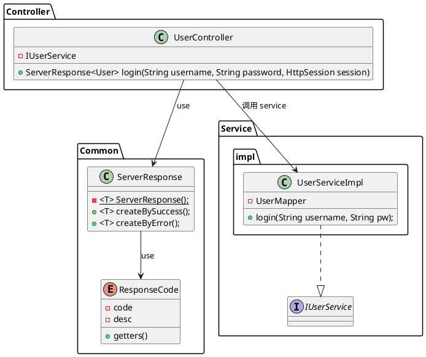

## 导学&资料
#### 一个大型电商的架构
![[attachments/Pasted image 20231204162540.png]]
- 还有一些看不到的, 如高并发, 容灾


[找工作的季节之简历及找工作的分享_慕课手记](https://www.imooc.com/article/19998)

[《Java从零打造企业级电商实战-服务端》思维导图&amp;知识点索引&amp;温馨tips_慕课手记](https://www.imooc.com/article/20193)

[happymmall课程QQ群分享手记_慕课手记](https://www.imooc.com/article/19094)

[happymmall课程QQ群分享手记_慕课手记](https://www.imooc.com/article/19094)
#### 邮箱注册验证的思路
数据库表设计：  
**账号ID，邮箱，生成的随机激活Key，有效验证时间**

发送邮件（SMTP协议之类，邮件格式为HTML），  
附带一个A标签的链接地址：  
**[http://XXX.XXX.XXX/XXX.XXX?id=](https://link.segmentfault.com/?enc=0OIXMSJgp3NmVEtlWW5xnA%3D%3D.qpRIdLH2PPUoqCn0JJAn2wLjboRlXoQLo4BuyHJP8%2Bw%3D)账号ID&key=特定的Key**

用户点击链接，后端代码处理：  
**验证时间、ID、Key是否有效，将邮箱保存到用户的信息表里去，完成。**

在数据库设一个 status, 验证前是锁定的, 验证后邮箱可以使用
[链接](https://segmentfault.com/u/superadmins)

#### 大型项目架构演进
推荐书: 大型网站技术架构核心原理与案例分析
[大型项目架构演进过程及思考的点_慕课手记](http://www.imooc.com/article/17545)

1. all in one 服务器, 包括 app, file, database 都放一个
2. 拆分服务器, app 的服务器性能强点, 数据服务器容量大点
3. 增加缓存服务器, app 的本地缓存
4. 增加负载均衡调度服务器
5. Session管理, 方案:
    1. Session Sticky 粘滞会话
    2. Session 复制
    3. Cookies
    4. Session 服务器              
6. 数据库读写分离
7. 反向代理和 CDN
8. 分布式文件系统
9. 数据垂直拆分, 专库专用, 如 Products, Users
10. 数据水平拆分, Users 拆成 User1, User2
11. 拆分搜索引擎

## 环境配置

####  jdk

#### tomcat

[Apache Tomcat® - Apache Tomcat 10 Software Downloads](https://tomcat.apache.org/download-10.cgi)

[[permanent/Tomcat 配置|Tomcat 配置]]
#### maven 安装配置

[[permanent/Maven 安装配置|Maven 安装配置]]

项目里说到的 Settings 是 `/conf/settings`
#### FTPserver

这个似乎是个私人小软件, 不是 Apache 的 FTPserver. 开箱即用

MS Edge, Firefox, Chrome 都不支持 ftp 了, 现在要用 File Explorer 访问 ftp

#### Nginx
[[private/Nginx|Nginx]]

win 直接下载压缩, 在 `/drivers/etc/host` 配置 host

在 `conf.d/*.conf` 下配置单个文件

##### image 配置(目录转发型)

配置 conf
![[attachments/Pasted image 20231221184047.png]]

在 hosts 添加 二级域名

在 win 下需要修改各路径, 注意用反斜杠


##### tomcat 配置(端口转发型)

![[attachments/Pasted image 20231221200444.png]]

然后启动 tomcat

##### 文件服务器搭建

根据以上两种 nginx 配置, 加上 apache 的一些 ftp 文件上传 API

![[attachments/Pasted image 20231225223111.png]]

#### MySQL 安装配置

Linux: 安装, 字符集配置, 自启动, 防火墙
Windows: 下载安装, 字符集配置

[[permanent/MySQL#安装和初配置|MySQL#安装和初配置]]

项目用的 MySQL 5.1.73

```sql
/* 本地用户赋予所有权限 mmall.* 是指这个数据库下所有 table */
grant all privileges on mmall.* to yourusername@localhost identified by 'yourpassword';
```

![[attachments/Pasted image 20231225230739.png]]


## 数据表设计

没有使用外键和触发器, 因为拓展修改和数据清洗麻烦

![[attachments/Pasted image 20231225234713.png]]

![[attachments/Pasted image 20231225231216.png]]
- 倒数第二句, 把 username 设为唯一索引

![[attachments/Pasted image 20231225231821.png]]

![[attachments/Pasted image 20231225231837.png]]
- text 比 varchar 长很多, 如果作了 url 长度限制, 也可以用 varchar

![[attachments/Pasted image 20231225232259.png]]
- 一项应该是某个用户购物车里的一条商品信息
- 加了 user_id 的索引来提高效率

![[attachments/Pasted image 20231225232427.png]]

![[attachments/Pasted image 20231225232658.png]]
- shipping_ip 对应订单的收货地址表id 

![[attachments/Pasted image 20231225232930.png]]
- 这里的商品名称和图片起到一个快照的作用

![[attachments/Pasted image 20231225233440.png]]

## 项目初始化和配置

### 项目初始化
IntelliJ 需要配置 JDK, Maven, tomcat

[[permanent/Maven 安装配置|Maven 安装配置]] 沿用了 erpcrm 的 settings

创建项目
- 用 maven 的 archetype `org.apache.maven.archetypes:maven-archetype-webapp`
- 创建好了在 main 目录下创建 java 目录并标记成 src root; 在 src 下创建 test/java 标记为 test root

然后在 `Run/Debug Configuration` 增加 tomcat server 配置
- 如果没有找到要先装 plugin
- 选择 tomcat 根目录
- 端口改成了 8088
- run, 然后 8088 就可以看到 hello world 了. 此时还能在 `\webapps\ROOT` 看到 `index.jsp` ([[permanent/JSP|JSP文件]])

### Git 配置

在 github 创建一个仓库


在本地项目创建 readme.md 和 .gitignore

```gitignore
*.class

# package file
#*.jar
*.war
*.ear

# kdiff3
*.orig

# maven
target/

# eclipse
.settings/
.project
.classpath

# IntelliJ IDEA
.idea/
/idea/
*.ipr
*.iml
*.iws

# temporary file
*.log
*.cache
*.patch
*.diff
*.tmp

# system
.DS_store
Thumbs.db
```

[[permanent/Git#将本地仓库上传到 remote|Git#将本地仓库上传到 remote]]

然后创建一个新的分支用于开发, 并推送分支到远程`git push origin HEAD -u`
### 数据库初始化
教程用的 Navicat, 太贵了, 我用的 DBeaver

mmall.sql 文件可以在慕课的代码仓库找到

我的 3306 是一个 8.0, 3307 是一个 5.7

这个项目用在 5.7

#### pom 配置

直接复制了, 建议熟悉各个包后可以再来看看

maven-compiler-plugin 报错, 加上 `<version>2.3.2</version>` 就可以了

还需要配置一下 extendir, 因为中央仓库没有的包放在项目里

实操了一下配 jedis

配置 pom 的方式是
- 中央仓库 [search.maven.org](search.maven.org)
- 搜索需要的 jar, 点进去, 复制

pom 在实际开发中, 是用到一个配一个的

### java 结构
![[attachments/Pasted image 20240102172054.png]]
- common 常量
- controller 控制层
- dao 数据库
- pojo 数据库对象
- service
- util
- vo =view object

dao 层跟 db 交互, 中间是 service 层, 交给 controller

pojo 是数据库对象, vo 封装, 再交给 controller 展示

### Mybatis

#### Mybatis-generator
根据数据库自动生成 pojo 和 dao 和对应的 xml 文件

[MyBatis Generator Core – MyBatis Generator Quick Start Guide](https://mybatis.org/generator/quickstart.html)

使用 MBG 需要配置 `generator.xml`, 如果涉及到变量, 还需 `datasource.properties`(这是自己命名的文件, 导入了)

需要的 mysql driver 包在 源码 tools 文件夹下

![[attachments/Pasted image 20240102181812.png]]

然后在右边 maven, 找到 mbg, 双击执行, 需要一个有权限的 mysql 用户.

BUILD SUCCESS 之后 dao 层 pojo 就会出现内容, resources.mapper 也有很多 xml

#### 时间戳优化

将 createTime 和 updateTime 的处理交给 mysql 内置函数
- 注意 if

具体做法是将 xml(也就是 java 转 sql 代码) 中, 
- create 函数的 createTime 和 updateTime 都交给 now() 处理
- update 函数的 交给 now()

#### Mybatis-plus

直接搜索 Mybatis-Plugin 搜不到了, 用这个
[安装 | MyBatis-Plus](https://baomidou.com/pages/bab2db/#spring-boot3)

效果是在 dao 层增加了新方法后可以直接在 xml 添加模板

#### Mybatis-PageHelper
[pagehelper/Mybatis-PageHelper: Mybatis通用分页插件](https://github.com/pagehelper/Mybatis-PageHelper)

商品翻页的时候会用上. 在 pom 加载就行

源码的 array 报红, 去掉就行了

### Spring

[Spring Framework](https://spring.io/projects/spring-framework/) 官方

用例
- [spring-attic/spring-mvc-showcase: Demonstrates the features of the Spring MVC web framework](https://github.com/spring-attic/spring-mvc-showcase)
- [spring-projects/spring-petclinic: A sample Spring-based application](https://github.com/spring-projects/spring-petclinic)
- [spring-attic/greenhouse: Reference web application for Spring technologies and social destination for Spring developers.](https://github.com/spring-attic/greenhouse)
- https://github.com/spring-projects/spring-boot


把这 5 个直接复制来了(实际上是上面几个用例了复制过来改) 
![[attachments/Pasted image 20240103172905.png]]

#### Web.xml
![[attachments/Pasted image 20240103174342.png]]
####
#### applicationContext.xml
主配置

![[attachments/Pasted image 20240103174859.png]]

配置注解: 在Spring配置文件中配置扫描除@Controller以外的注解类, 在SpringMVC中配置只扫描带@Controller的类

![[attachments/Pasted image 20240103175837.png]]

数据库建议配置 
```properties
db.initialSize = 20
db.maxActive = 50
db.maxIdle = 20
db.minIdle = 10
db.maxWait = 10
db.defaultAutoCommit = true
db.minEvictableIdleTimeMillis = 3600000
```

![[attachments/Pasted image 20240103181035.png]]

pageHelper 的配置红了, 在官方 github 找到新的一个写法
[abel533/Mybatis-Spring: 这是一个集成了Mybatis分页插件和通用Mapper的示例项目](https://github.com/abel533/Mybatis-Spring)

但好像去掉 array 就行了

然后还有配置扫描和回滚, 不多写了

#### dispatcher-servlet.xml
Spring-MVC 的配置

这个xml是默认的名字, 可以通过在 web.xml 里添加 init-param 节点, 修改 XX 改
![[attachments/Pasted image 20240103182334.png]]


![[attachments/Pasted image 20240103182518.png]]

![[attachments/Pasted image 20240103182626.png]]

### logback 配置

直接复制

![[attachments/Pasted image 20240103182952.png]]
[catalina.out 和 catalina.log 的区别和用途_.out是什么日志-CSDN博客](https://blog.csdn.net/itzhangdaopin/article/details/79139777)

console 所以打印到 catalina.out

![[attachments/Pasted image 20240103184108.png]]

![[attachments/Pasted image 20240103184057.png]]

![[attachments/Pasted image 20240103184236.png]]

#### ftp 配置
![[attachments/Pasted image 20240103184401.png]]

#### idea 注入和自动编译

![[attachments/Pasted image 20240103184738.png]]
实时 build, 可以在下方 problems 看到实时的问题

配置结束了上传 git 吧

然后介绍了 fehelper 和 Restlet Client 插件, 后者和 postman 差不多, 就用 postman 吧

## 用户模块开发

### 一些公用的东西

#### ResponseCode

- enum, common 下

![[attachments/Pasted image 20240105141903.png]]

#### ServerResponse
common 包下的类 `ServerResponse<T>`, 用来封装响应, impl Serializable

加上注解 
`@JsonSerialize(include = JsonSerialize.Inclusion.NON_NULL)` 
保证序列化 json 的时候, 如果是 null 的对象, key 也会消失

`alt+\` 智能感知, 显示注解里可以添加的属性, 有的是 tab+space

构造器

![[attachments/Pasted image 20240105141319.png]]

判断成功的方法, 加上注解不会被 json 序列化

![[attachments/Pasted image 20240105142715.png]]


再加上三个属性的 getter


成功时的调用
![[attachments/Pasted image 20240105142322.png]]

再创建失败时的调用
![[attachments/Pasted image 20240105142631.png]]

### 登录功能




![[attachments/Pasted image 20240105142818.png]]
#### UserController
首先在 controller 下创建一个 package `portal`, 其中创建一个类 `UserController`

对类添加注解
- `@Controller`
- `@RequestMapping("/user/")` 表示我们现在定义的接口是在 /user 路径下

login
- username, pw, HttpSession session
- 返回 `ServerResponse<User>`
- 注解
    - `@RequestMapping(value = "login.do", method = RequestMethod.POST)`
    - `@ResponseBody` 将返回值序列化为 json, 这是 dispatch-servlet 里配置的 Jackson converter 处理的. 注入的内容是 `supportedMediaTypes`

#### IUserService
在 service 下创建接口 IUserService, 包含 login 方法, login(username, pw) -> Object

#### UserServiceImpl
然后 在 service 下创建 impl 包, 创建 实现上面接口的 `UserServiceImpl`

```java
@Autowired
private UserMapper userMapper;
```

然后去 UserMapper 增加一个 int checkUsername(username);

去到 UserMapper.xml 里改
![[attachments/Pasted image 20240105151622.png]]

再增加一个 selectLogin()
```java
User selectLogin(@Param("username") String username, @Param("password") String password);  // Mybatis 传多个参数需要用 @Param, parameterType 写 map
```

![[attachments/Pasted image 20240105152515.png]]

有以上的基础就可以实现 login 函数了

![[attachments/Pasted image 20240105152639.png]]

#### 注入 Controller
对 impl 类添加注解
`@Service("iUserService")` 
注意小写

对 `UserController` 类增加参数
```java
@Autowired
private IUserService iUserService;
```

顺便在 Common.Const 写个常量
```java
public static final String CURRENT_USER = "currentUser";
```

![[attachments/Pasted image 20240105153547.png]]

答案也要屏蔽
### 登出接口

登出其实相当于 清除 session


![[attachments/Pasted image 20240108151437.png]]

### 注册接口

逻辑需求: 校验用户名是否存在, 校验 email

小技巧: 用 interface 分组 Const
![[attachments/Pasted image 20240108152546.png]]

直接 copy 了 md5 算法

![[attachments/Pasted image 20240108154421.png]]

这时候顺便补一下之前的 md5 加密 todo, 再把边角处理一下

### 校验
check_valid.do

写一个 checkValid, 可以检验用户名和邮箱

- String.Utils.isNotBlank(" ") = false;
- String.Utils.isNotEmpty(" ") = true;

其实根据上面的就可以自己写了, 以防万一
![[attachments/Pasted image 20240108170147.png]]

然后可以把这个函数复用到前面的注册

### 获取用户信息
![[attachments/Pasted image 20240109144837.png]]

user.setPassword(StringUtils.EMPTY);

答案同理

### 获取提示问题
先检查用户名存在, 再根据用户名从数据库获取问题

![[attachments/Pasted image 20240109145840.png]]

![[attachments/Pasted image 20240109145900.png]]
###  提问问题与答案
![[attachments/Pasted image 20240109150128.png]]

Common.TokenCache, 使用本地缓存
![[attachments/Pasted image 20240109151251.png]]
- import org.slf4j.Logger;

生成一个随机的 UUID 作为 token
![[attachments/Pasted image 20240109152108.png]]

![[attachments/Pasted image 20240109152142.png]]

### 重置密码

![[attachments/Pasted image 20240109171038.png]]

![[attachments/Pasted image 20240109171138.png]]

根据讨论区做了一个改进: 密码重置成功使用 LoadingCache 的 invalidate() 方法
TokenCache.removeKey(TokenCache.TOKEN_PREFIX + username);

### 登录状态重置密码

![[attachments/Pasted image 20240109200317.png]]

嗯, 然后图中还没有验证是否登录
### 登陆状态更新个人信息
![[attachments/Pasted image 20240109203808.png]]

![[attachments/Pasted image 20240109204049.png]]
- 防止越权, 从 session 读取 id
- 这里是用户名不可修改的情况

### 获取用户详细信息
- 需要强制登录那种, impl 回传的时候把密码和答案设空
- 例如需要修改信息时, 可以先用这个函数获取
![[attachments/Pasted image 20240111120839.png]]


### 后台管理员登录
- controller.backend.UserManageController
- 可以调用前台的登录并加一个 Role 检查
![[attachments/Pasted image 20240111123249.png]]

### 加盐
#todo [数据库的存储的密码加了盐，知道被加密后的内容和盐的值，能算出密码是多少吗？ - 知乎](https://www.zhihu.com/question/398702744)

mmall.properties 加一条盐值

![[attachments/Pasted image 20240111130302.png]]

### 模块测试
首先把 logback.xml, log 位置改一下. 不止截图这一个. 注意权限
![[attachments/Pasted image 20240111131716.png]]

> 如果要在tomcat中为TLD扫描的jar启用调试日志记录，则必须更改tomcat目录中的/conf/logging.properties文件 .
> 取消注释：  
> org.apache.jasper.servlet.TldScanner.level = FINE
> **FINE** 级别用于调试日志 .
> [至少有一个JAR被扫描用于TLD但尚未包含TLD-Java 学习之路](https://www.javaroad.cn/questions/355416)

(smartTomcat log 位置又不一样)

[How to properly configure Jakarta EE libraries in Maven pom.xml for Tomcat? - Stack Overflow](https://stackoverflow.com/questions/65703840/how-to-properly-configure-jakarta-ee-libraries-in-maven-pom-xml-for-tomcat)

无果, 下载了个 tomcat 8, 将环境配置项目配置都改了. 

发现两个问题, 主配置 `mappers/*.xml` 写错, 另一个是 sqlSettionFactory(pagehelper) 配错

测试没什么大问题(大概), 有用错重载函数的, 有 sql 写错列名的, 还有一些课程 bug


## 分类模块开发

### 接口列表
- 获取子分类: getCategory(int categoryId)
- 增加节点: addCategory(int parentId, String categoryName)
- 修改分类名: setCategoryName(int parentId, String categoryName)
- 获取当前分类 id 和递归子节点 id: get_deep_category(int categoryId)

backend.CategoryManageController

实用肯定还需要删除, 更新的功能
添加节点: 如果输入的 parentId 不存在?
### 公共

userImpl 写了一个专门检查权限的函数         

再创建一个 CategoryServiceImpl (以下省略)

### 增加分类
@RequestParam(value = "parentId", defaultValue="0") int parentId
如果前端没有传值默认 0

要判断用户登录和权限

![[attachments/Pasted image 20240112162214.png]]

检查参数后, 新建一个类 insert 进去
![[attachments/Pasted image 20240112162057.png]]

### 设置分类名

![[attachments/Pasted image 20240112162546.png]]


![[attachments/Pasted image 20240112162633.png]]

### 获取子接点(不递归)
getParallelChildrenCategory

用 sql 查就可以了

没有的时候 logger.info() 输出一行日志
![[attachments/Pasted image 20240112221112.png]]

```java
@Override
public ServerResponse<List<Category>> getParallelChildrenCategory(Integer categoryId) {
    if (categoryId == null) {
        return ServerResponse.createByErrorMessage("Incorrect parameters.");
    }
    List<Category> categoryList = categoryMapper.selectParalleiChildrenCategory(categoryId);
    if (CollectionUtils.isEmpty(categoryList)) {
        logger.info("No children category found.");
    }
    return ServerResponse.createBySuccess();
}
```

```xml
<select id="selectParalleiChildrenCategory" resultMap="BaseResultMap" parameterType="java.lang.Integer" >
select
<include refid="Base_Column_List" />
from mmall_category
where parent_id = #{parentId, jdbcType=INTEGER}
</select>
```
### 获取子节点(递归)


```java
@Override
public ServerResponse getRecursiveChildrenCategory(Integer categoryId) {
    if (categoryId == null) {
        return ServerResponse.createByErrorMessage("Incorrect parameters.");
    }
    List<Integer> categoryIdList = deepSearchChildrenCategory(new ArrayList<Integer>(), categoryId);
    return ServerResponse.createBySuccess(categoryIdList);
}

private List<Integer> deepSearchChildrenCategory(List<Integer> categoryIdList, Integer categoryId) {
    Category category = categoryMapper.selectByPrimaryKey(categoryId);
    if (category != null) {
        categoryIdList.add(category.getId());
    }
    List<Category> subCategoryList = categoryMapper.selectParallelChildrenCategory(categoryId);

    for(Category c:subCategoryList) {
        deepSearchChildrenCategory(categoryIdList, c.getId());
    }
    return categoryIdList;
}
```

## 商品模块开发

### POJO, BO, VO
![[attachments/Pasted image 20240115151041.png]]

### 接口
前
![[attachments/Pasted image 20240115151503.png]]

![[attachments/Pasted image 20240115151654.png]]
后
![[attachments/Pasted image 20240115151920.png]]

![[attachments/Pasted image 20240115152002.png]]

![[attachments/Pasted image 20240115152029.png]]

![[attachments/Pasted image 20240115152800.png]]

![[attachments/Pasted image 20240115152806.png]]

![[attachments/Pasted image 20240115152828.png]]

![[attachments/Pasted image 20240115152952.png]]

### 后台新增商品
- backend.ProductManageController
- /manage/product
- IProductService

后台功能全部是强制登录并检查权限的

因为老是查登录和权限很烦, 提取出了函数

updateProduct

后台 updateProduct(Product)
- 将 subImage 第一张设为主图
- 根据传入数据是否有 id 判断是新增还是更新

### 后台商品上下架

setSaleStatus(Integer productId, Integer status)

调用接口处 <C+T> 可以直接转到实现

这时候用 IllegalArgument 了

### 商品详情
getDetail(productId)

vo.ProductDetailVo + gettersetter
![[attachments/Pasted image 20240115202931.png]]

![[attachments/Pasted image 20240115203105.png]]
host 从配置中获取, 不要硬编码

static 块, 在类初始化时会执行一次, 一般用来初始化类变量,

static {...} -> {...} -> Constructor

用 forname 加载 com.mysql.jdbc.Driver 会执行 这个类里的 static 块

写 ProportiesUtil, new Proporties(), 写两个读取方法, 其中一个带默认值

然后 DateUtil, 毫秒 Timestamp 和 yyyyMMddhhmmss 互转

![[attachments/Pasted image 20240115230958.png]]

![[attachments/Pasted image 20240115231208.png]]

![[attachments/Pasted image 20240115231239.png]]