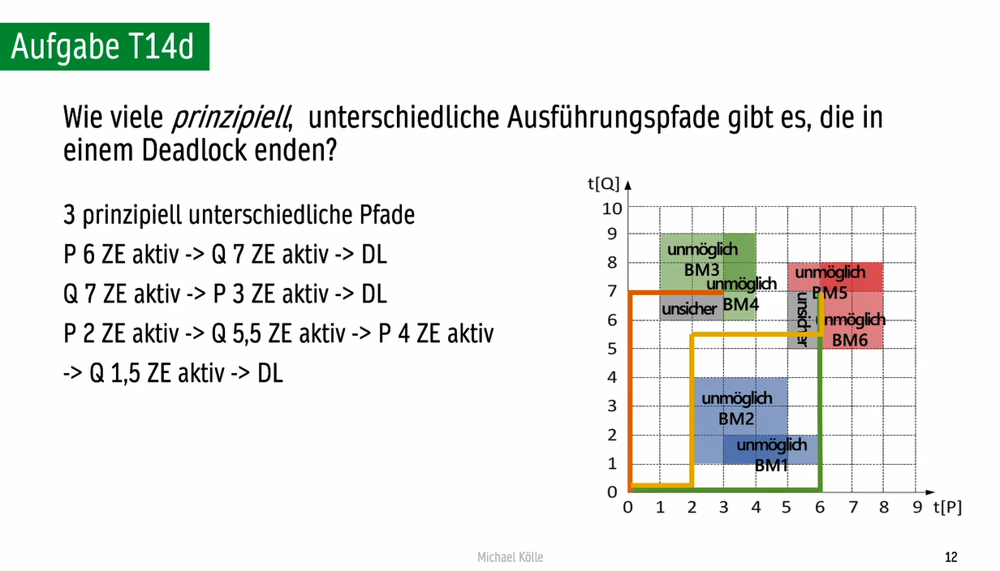
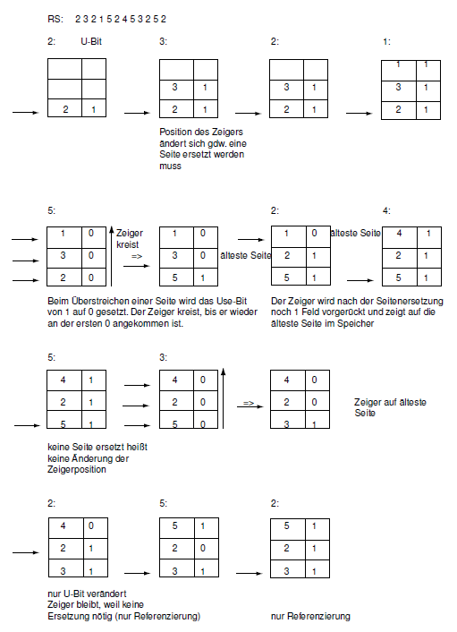

## K1 Das Betribssystem

### 1.1 Einordnung des Machinensprache
- 机器语言的分类/编排

#### Logische Hierarchie in einem Rechner
  ![[attachments/image_1638879655684_0.png]]
- BS: Anwendungsprogramme, Systemprogramme, Betriebssystem
- RA: Machinensprache, Mikroprogrammierung, Physikalische Geräte
- Mikroprogrammierung: 微指令集，对硬件解释机器语言

### 1.2 Aufgabe des Betriebssystem

#### Aufgabe des Betriebssystem
- Komplexitätreduktion
- Verwalrung und Verteilung(Multiplexing) von Systemressourcen
    - Time Multiplexing
    - Space Multiplexing
- Zugriffskontrolle

#### Kernel Mode and User Mode
- Systemmodus:
    - **Privilegiert**.
    - Zum **Betriebssystem** zählen Programme, die im Systemmodus lafen.
    - Dazu zählen unter anderem Gerätetreiber, Prozessmanager, Fenstermanager usw.
- Nutzermodus:
    - Nicht privilegiert.
    - Benutzerprogramme laufen im Nutzermodus.
    
#### Systemaufruf
- syscalls
- Die **Schnittstelle** zwischen Kernel Mode und User mode.
- Ein Anwendungsprogramme, das nicht direkt auf eine Ressource zugreifen darf, führt dazu einen **Systemaufruf** mit den entsprechenden Parametern aus.

### 1.3 Geschichte der Betriebssystem
- skipped
- [[蒋炎岩]]-南京大学“操作系统：设计与实现： P1 [绪论]操作系统的历史
  https://www.bilibili.com/video/BV1N741177F5?spm_id_from=333.999.0.0

## K2 Programme und Unterprogramme

### 2.2 Unterprogramme und Prozeduren
#### Offenes Unterprogramm
- Der entsprechende Programmtext wird an den erfordlichen Stellen ins Hauptprogramm **hineinkopiert**. (Makroaufruf宏调用)
- \- Speicherplatz verschwenden
- \- Hoher Arbeitsaufwand bei der Änderungen
#### Geschlossenes Unterprogrammm(Prozedur)
- Das Programmstück wird über seine Anfangsadresss angesprungen.
- Springen -> Ausführen -> Rückspringen
- \+ Wiederholung des Codes vermeiden
- \- Bei besonders kleinen Unterprogrammen ist es aber wiederum ungünstig. (Sprüge, Parameterübergaben, Sicherung und  Wiederherstellung des Caller-Kontexts, Ergebnisrückgaben.)
- Wir unterscheiden:
    - **Announcement**: ohne Ergebnisparameter
    - **Invocation**: mit Ergebnisparameter
- **Informationen** der UP: Was sind benötig?
    - Anfangsadresse
    - Rücksprungadresse
    - Aufrufparameter
    - Rückgabewert(e)
- **Kommunikation** der UP: Wie tauschen?
    - Stack: meistens
    - Spezielle Register: eine schnelle Möglichkeit
#### UP调用流程（4-stufige Aufrufkonvention）
- Prolog des Callers: push Register, Rücksprungadresse, Parameter
    - Prolog des Callees: pop Parameter
      `<CODE>`
      Epilog des Callees: pop Rücksprungadresse, push Rückgabewert(e)
- Epilog des Callers: pop Rückgabewert(e), Register
### 2.2.1 CALL und RET (und JMP)
- **PC**: Program Counter, 指向的地址中是下一条要被执行的指令
  **RA**: Register
  PUSHR: 所有寄存器入栈
#### JMP
```assembly
      COMMAND JMP addr
      BEGIN
        PC := addr;
      END
```
#### CALL
- CALL(RA)
```pseudo-assembly
      COMMAND CALL addr
      BEGIN
        RA := PC + 1;
        PC := addr;
      END
```
- CALL(Stack)
```pseudo-assembly
      COMMAND CALL addr
      BEGIN
        PUSH PC + 1;
        PC := addr;
      END
```
#### RET
- RET(RA)
```pseudo-assembly
      COMMAND RET addr
      BEGIN
        PC := RA;
      END
```
- RET(Stack)
 ```pseudo-assembly
      COMMAND RET addr
      BEGIN
        PC := POP;
      END
 ```
 
### 2.3 Realisierung eines Unterprogrammaufrufs

## K3 Prozess

### 3.1 Das Prozess Konzept

#### 3.1.1 Grundlagen von Prozessen
##### Prozess
- Ein in Ausführung befindliches Maschinenprogramm.
- Program $\xrightarrow[]{execute}$ Process
##### (Prozess-)Kontext
- Zum Kontext eines Prozessese gehören alle Informationen, die den aktuellen Ausführungszustand eines Prozess genau beschreiben.
- 进程中断后，在同一台计算机上继续执行所需的内容
##### (Prozess-)Image
- Die Gesamtheit der physischen Bestandteile eines Prozesses, also insbesondere seine Befehlsfolge (Trace), aber auch seinen
  Kontext, lokale und globale Variablen und der Ausführungs-Stack.
- Kontext + Programm + Stack
- 进程中断后，移动到另一台计算机并执行所需的内容
##### Uniprogramming
- Prozesse werden **sequenziell nacheinander, vollständig und ohne Unterbrechung** ausgeführt.
##### Multiprogramming
- Der Prozess wird zwischen mereren Prozessen hin und hergeschaltet.
- Quasiparallel/Pseudo-parallel
##### Multiprocessoring
- Stehen mehrere Prozesseoren zur Verfügung.
- Echt-parallel

#### 3.1.2 Erzeugung von Prozessen
- System:
    - ##### Unter Linux/Unix
        - fork()
        - 子程序也可以产生子程序
        - 所有程序都是`init`的后代
    - ##### Unter MS DOS
        - 父子不能并行执行
    - ##### Unter Windows
        - keine echte Prozesshierarchie
        - 不停切换
        - 父进程会收到子进程的句柄(Handle)
- ##### Ursachen für Erzeugung eines Prozess
    - Neuer Stapelauftrag 新的批处理任务
    - Benutzeranmeldung 用户以交互模式登录
    - Dienstleistungsprozess 服务流程，比如一个APP要打印文件时就会创建一个新的进程在后台接管打印工作
    - Kindprozesse
- ##### Schritte für Erzeugung eines Prozess
    - 进程以唯一的**PID**进入**进程表**
    - **进程图像**大小的内存空间被分配给进程
    - **PCB**初始化
    - 进程放入调度队列
    - 如有需要，拓展结构
    
#### 3.1.3 Realisierung von Multiprogramming
- **Scheduling** vs. **Dispatching** K5

#### 3.1.4 Das 2-Zustands-Prozessmodell
- ![[attachments/image_1638964022319_0.png]]
- ![[attachments/image_1638963980331_0.png]]
#### 3.1.5 Das 5-Zustands-Prozessmodell
- ![[attachments/image_1638964081968_0.png]]
- Status
    - **Running**: Der Prozess befindet sich in der Ausführung. Bei Einprozessor-Systemen
      kann sich zu jedem Zeitpunkt nur ein Prozess in diesem Zustand befinden.
    - **Ready**: Der Prozess ist zur Ausführung bereit.
    - **Blocked**: Der Prozess wartet auf ein Ereignis (z.B. Ende einer E/A-Operation, Benutzereingabe) und kann erst zur Ausführung kommen, nachdem das Ereignis eingetretenist.
    - **New**: Der Prozess wurde erzeugt, aber noch nicht durch das Betriebssystem zur
      Menge der ausführbaren Prozesse hinzugefügt.
    - **Exit**: Der Prozess wurde durch das Betriebssystem aus der Menge der ausführbaren Prozesse entfernt.
- Paths
    - **Null->New**: Ein Prozess wird erzeugt.
    - **New->Ready**: Das Betriebssystem ist in der Lage, einen zusätzlichen Prozess aufzunehmen (genug Speicher vorhanden).
    - **Ready->Running**: Ein rechenbereiter Prozess wird zur Ausführung ausgewählt.
    - **Running->Exit**: Das Betriebssystem beendet den Prozess.
    - **Running->Ready**: Ein anderer Prozess soll zur Ausführung ausgewählt werden (z.B. weil die maximale Zeit für einen Ausführungs-Slot abgelaufen oder ein höher-priorer Prozess ins System gekommen ist).
    - **Running->Blocked**: Der Prozess muss auf ein Ereignis warten.
    - **Blocked->Ready**: Das Ereignis, auf das gewartet wurde, ist eingetroffen.
#### 3.1.6 Das 7-Zustands-Prozessmodell
- **Virtueller Speicher**
    - Der virtuelle Speicher ist die Menge an Speicher (in Bytes), die dem Betriebssystems maximal zur Abbildung von Prozessen auf dem Hintergrundspeicher zur Verfügung steht.
    - 虚拟内存：虚拟内存是操作系统可用于在后台内存上映射进程的最大内存量（以字节为单位）。约等于主内存+suspend进程的数据。
    - 虚拟内存是计算机系统内存管理的一种技术。 它使得应用程序认为它拥有连续的可用的内存（一个连续完整的地址空间），而实际上，它通常是被分隔成多个物理内存碎片，还有部分暂时存储在外部磁盘存储器上，在需要时进行数据交换。 目前，大多数操作系统都使用了虚拟内存，如Windows家族的“虚拟内存”；Linux的“交换空间”等。
- ![[attachments/image_1638964425643_0.png]]
- Suspendierung原因
    - suspend: 将程序从Hauptspeicher移动到Hintergrudspeicher, 节省空间
    - 如Monitoring-Prozess, 长期很少地执行，不该占用太多主内存->ready suspend
- Das 9-Zustands-Prozessmodell 见3.3.5
### 3.2 Prozess Beschreibung
- Virtueller Speicher
    - Der virtuelle Speicher ist die Menge an Speicher (in Bytes), die dem Betriebssystems maximal zur Abbildung von Prozessen auf dem Hintergrundspeicher zur Verfügung steht.
      虚拟内存：虚拟内存是操作系统可用于在后台内存上映射进程的最大内存量（以字节为单位）。约等于主内存+suspend进程的数据。
      虚拟内存是计算机系统内存管理的一种技术。 它使得应用程序认为它拥有连续的可用的内存（一个连续完整的地址空间），而实际上，它通常是被分隔成多个物理内存碎片，还有部分暂时存储在外部磁盘存储器上，在需要时进行数据交换。 目前，大多数操作系统都使用了虚拟内存，如Windows家族的“虚拟内存”；Linux的“交换空间”等。
#### 3.2.1 Kontrollstrukturen des BSs
- Virtueller Speicher ~= HSP + HiSP
- **Frames**(Seitenrahmen)
    - Speicherzelle in **Hauptspeicher**
    - je 2-16 KB
- **Pages**(Seiten)
    - Speicherzelle in **Hintergrundspeicher**
    - alle sind gleich gross
    - frame的大小和page的大小一样
- **Laden**:
    - copy page into frame
- **Swapping**
    - Auslagern von Prozessen aus dem Hauptspeicher in den Hintergrundspeicher
- 操作系统管理的四张表和功能
    - **Speichertabellen**
        - 跟踪(ueber ... der Ueberblick behalten)主内存和虚拟内存
        - 主内存中的一部分会为系统进程保留
        - 内存表包括：
            - 进程的Page分配到的Frame
            - 虚拟内存分配到进程
            - 页面或框架的属性和权限
    - **E/A-Tabellen**
        - 一个I/O设备要么是可用的，要么被分配给一个特定的进程
    - **Dateitabellen**
        - 包含文件的存在，在HiSP的位置，当前状态和其他信息
        - 如果有独立的文件系统(常见)，很多信息会放到文件系统
    - **Prozesstabellen**
        - 包括如：进程的状态，进程被block时在什么位置
#### 3.2.2 Prozesskontrollstrukuren
- 管理一个进程需要知道两件事：进程被存储在哪(Prozesslokalisierung)？进程管理相关属性的值是什么(Prozesskontrollblock)？
- ##### Prozesslokalisierung
- 2 Variante
- **Segmentierung**
    - dynamische Partitionierung
    - alle Daten in ein Segment
    - ![[attachments/image_1639416061890_0.png]]
- **Paging**
        - feste Partitionierung
        - alle Daten in soviele Pages wie noetig
        - ![[attachments/image_1639416118711_0.png]]
- ##### Prozesskontrollblock(PCB)
- ![[attachments/image_1639416148380_0.png]]
- (a) **Prozessidentifikation**
    - PID
    - PPID
    - UserID
- (b) **Prozesszustandsinfo**
    - 1. Inhalt der Prozessorregister
    - 2. 若是被中断的进程：
        - 用户寄存器
        - 堆栈指针
        - PC，状态码(Condition codes)
    - 3. **Programmstatuswort**(PSW):
        - Die Menge der Register, die Statusinformationen enthalten
- (c) **Prozesskontrollinformationen**
  collapsed:: true
    - 1. Schedling- und Zustandsinfo
        - Prozesszustand("ready"..)
        - Priorität
        - Scheduling-Strategie-spezifische Zustandsinformationen(如已等待的时间)
        - Ereignisse, auf die der Prozess wartet
    - 2. Datenstruktur，例如，如果所有等待的进程都在一个队列中管理，则是对下一个进程的引用
    - 3. 两个独立进程之间交换的 Signale 或 Nachrichten（进程间通信）
    - 4. 有关进程的权限、内存管理、资源所有权等的额外信息。
    - ![[attachments/image_1639417190103_0.png]]
### 3.3 Prozesskontrolle
- ##### Funktionen des BS-Kerns
    - Support-functions
    - Selbstverwaltungs-functions(FCAPS)
    - I/O Management (canal and cache)
    - Speichermanagement (Segmentierung, Paging)
    - Prozessmanagement(erzeugen und wechseln)
#### 3.3.1 Kontext-Switch
- 1. **Aktualisierung und Sicherung** des PCB des bisherigen Prozesses, also insb. Sicherung der Zustandsinformationen
- 2. **Einfügen** des Prozesskontrollblocks des bisherigen Prozesses in die Warteschlange des Schedulers
- 3. **Auswahl** eines anderen Prozesses zur Ausführung
- 4. **Wiederherstellung und Aktualisierung** des Prozesskontrollblocks des neuen Prozesses (einschließlich der Änderung des Ausführungszustands auf “Running”)
#### 3.3.2 Unterbrechungen
- ##### Externe Unterbrechung (Interrupt)
    - 外部中断请求，如输入设备(CTRL+C，鼠标)
    - 移交给Unterbrechungsroutine
- ##### Interne Unterbrechung (Exception)
    - 内部异常
- ##### Unterbrechungsroutine(Interrupt Handler)
    - 处理中断的组件 Die Komponente, die die Unterbrechungsbehandlung durchführt
    - 决定最后执行的进程能否继续，或者是否有必要切换到另一个进程
#### 3.3.3 Moduswechsel
- 1. **Aktualisierung und Sicherung** der _Zustandsinformationen des PCB_ des gerade aktiven Prozesses (also insb. des Programmstatusworts)
- 2. **Durchführung** des eigentlichen Moduswechsels durch Freigabe aller Privilegien
- 3. **Sprung** zur Unterbrechungsroutine (Programmzähler wird auf dessen Anfangsadresse gesetzt)
#### 3.3.4 Konflikte bei Unterbrechungen
- **Lösung** von Konflikten: Zur Lösung von Konflikten werden **Prioritäten** von Unterbrechungen eingeführt.
    - Benutzerprozesse 0
    - Externe Unterbrechungen > Interne
    - 如果IPL有5位，则0到31
    - 如果中断中又中断，只有后一个的优先级echt高于前一个才会被响应
- **中断优先级（IPL）**：IPL是进程控制块中程序状态字（PSW）的一部分，它包含对用户或系统进程或中断处理程序的中断优先级。
- **Interrupt Priority Level (IPL)**: Das IPL ist Teil des Programmstatuswortes (PSW) im Prozesskontrollblock. und enthält die Unterbrechungs-Priorität zu einem Nutzer- oder Systemprozess bzw. zu einem Interrupt Handler.
#### 3.3.5 Ausführung des Betriebssystems 
- 操作系统是进程吗？在不同系统有不同答案
    - 1. **独立内核（非进程内核）的概念****：
        - 在这种方法中，代表了较早的操作系统，操作系统的内核在任何进程之外执行。如果一个正在执行的进程被中断，那么它的上下文必须被保存，并将控制权转移给操作系统的内核。操作系统有自己的内存和自己的系统地下室，用于控制过程调用和相应的返回。
        - ![[attachments/image_1639418601755_0.png]]
    - 2. **在用户进程中执行**：
        - 这是小型计算机的一种常见方法，所有的操作系统软件都在每个用户进程的上下文中执行。假设操作系统是一个可以被用户进程调用的例程集合（参见支持功能），并且也在各自的用户进程的环境中执行。只有在这些环境之外才会发生流程性的改变。这种方法的一个代表是Unix系统5。
        - ![[attachments/image_1639418611816_0.png]]
        - ![[attachments/image_1639418808499_0.png]]
    - 3. **基于进程的操作系统概念**：
        - 在这里，操作系统被实现为系统进程的集合。每个功能都被组织成一个独立的过程。因此，操作系统的结构是完全模块化的，只有实现进程变化所需的少量代码是在每个进程之外执行的。
        - ![[attachments/image_1639418634668_0.png]]
#### Das 9-Zustands-Prozessmodell
- 上述的第二种方法中，Running被分成User running 和 Kernel running, 7状态模型也因此可以被拓展为9状态模型
- ![[attachments/image_1639418846166_0.png]]
- ![[attachments/image_1639418853154_0.png]]
- ![[attachments/image_1639418858399_0.png]]
## K4 Threads
- 本章不是script而是ppt教学
- **Threads und Einführung in Java**
### Threads
- Einheit, die eine gewisse Aufgabe erledigt
- 特点
    - Teilen sich **gleichen Adressraum**
    - Habe **gemeinsamen Zugriff** auf Speicher und Ressourcen d. Prozesses
    - Eigener Stack für lokale Variablen
    - Eigener Deskriptor
### Multithreading 
- ![[attachments/image_1640609901369_0.png]]
### Thread-Zustände 
- ![[attachments/image_1640609963734_0.png]]
- Zustände zur **Suspendierung** von Threads nicht sinnvoll, da die Auslagerung ein Konzept von Prozessen ist
  → gemeinsamer Adressraum aller Threads eines Prozesses
### Thread-Arten
#### User-level-Threads ULT
- 在用户模式
- Vor
    - kann in jedem BS ablaufen. 可以在任何系统运行不需要任何改变
    - Threadwechsel, Threaderzeugung benötigen keine Privilegien
    - Das auf BS-Ebene implementierte Scheduling kann auf Thread-Ebene anwendungsspezifisch realisiert werden
- Nach
    - Wird ein Thread blockiert, so blockiert gleichzeitig der gesamte Prozess
    - Können in einer **Multiprozessor**umgebung **nicht parallel** ausgeführt werden
#### Kernel-level-Threads KLT
- 在系统模式
- **Threadmanagement vom Betriebssystemkern** durchgeführt
  – muss vom Betriebssystem unterstützt werden
- KLTs **deutlich schneller** als Prozesse erzeugt, gewechselt und terminiert werden
- Ist ein Thread **blockiert**, so kann die Kontrolle einem anderen Thread desselben Prozesses (der sich im Zustand ready befindet) **übergeben** werden
- KLTs können in einer Multiprozessorumgebung **echt parallel** ausgeführt werden
### Nebenläufigkeit 
- ![[attachments/image_1640611297381_0.png]]
### Vor- und Nachteile paralleler Programmierung

#### Vorteile:
- Komplexität in parallele Teilbereiche zerlegen
- Höherer Durchsatz/Performanz
- Hardware-Ausnutzung
- Ausnutzung von eingebetteten und verteilten Systemen

#### Nachteile:
- –Erhöhte Komplexität in der Verwaltung
- –Abläufe sind häufig schwer zu durchschauen
- –Sehr fehleranfällig
- –Schwer zu Debuggen bei Laufzeitfehlern
- –Konzepte zur Synchronisation und Thread-Sicherheit erforderlich, um deterministisches Verhalten zu gewährleisten

#### Nachteil: Race Conditions
- Race Condition: Wettlaufsituationen, bei der der zeitliche Ablauf das Ergebnis bestimmt

#### Kritischen Bereich
- Phase, in der ein Prozess gemeinsam benutzte (globale) Daten oder Betriebsmittel nutzt.

### Wechselseitiger Ausschluss
- Es gibt Ressourcen, die als ganzes oder bzgl. einzelner Operationen nur exklusiv, d.h. zu einem Zeitpunkt nur durch einen einzigen Prozess nutzbar sind
- Lösungen zur wechselseitiger Ausschluss
    - 1. **Mutual Exclusion**: Zu jedem Zeitpunkt darf sich höchstens ein Prozess im kritischen Bereich befinden.
    - 2. **Progress**: Befindet sich kein Prozess im kritischen Bereich, aber es gibt einen Kandidaten für diesen Bereich, so hängt die Entscheidung, welcher Prozess ihn betreten darf, nur von diesem Kandidaten ab und fällt in endlicher Zeit.
    - 3. **Bounded Waiting**: Zwischen der Anforderung eines Prozesses, in den kritischen Bereich einzutreten und dem tatsächlichen Eintreten in den kritischen Bereich kann eine gewisse Zeitdauer liegen. Es muss jedoch möglich sein, für diese Wartezeit eine endliche obere Schranke anzugeben.
### Deadlocks
- Zugriff auf unteilbare Ressourcen (kritische Bereiche) birgt die Gefahr von Verklemmungen
- ![[attachments/image_1640613196042_0.png]]
### Semaphore 
- integer Variable
- 信号量，表示可以同时进入Kritische Bereich的数量
- 3 Operationen:
    - init(S, Anfangswert)
    - wait(S), 减少
    - signal(S) = release(S) 增加
- ![[attachments/image_1640613503812_0.png]]
- ![[attachments/image_1640613358662_0.png]]
### Monitore
- 管程。实现对共享资源的互斥访问.
- Hoare的管程：将 "数据 "和 "对其定义的操作"、"访问同步"（对进入的进程/线程的队列）组合成一个抽象的数据类型，其操作保证相互排斥。技术上的实现通常是通过一个与对象相连的信号/锁，并在受保护方法的输入端分配，在其结束时再释放。
- Ziel:
  Wechselseitiger Ausschlusses der Monitoroperationen ⇔
  zu jedem Zeitpunkt ist höchstens ein Thread in einem Monitor aktiv
## Threads in Java 
- 特点
    - （对于现在的操作系统）echt parallel
    - KLT
    - ![[attachments/image_1644419475024_0.png]]
- Problem
    - Race-Conditions
    - Deadlocks
    - Fairness
    - Sicherheit
    - Ressourcenverbrauch
### Nebenläufigkeit in Java (Java相关类)
- Java库中的类：
    - **Thread **
        - java.lang.Thread
        - Jeder laufende Thread stelle ein Exemplar副本 dieser Klasse dar
    - **Runnable**
        - Programmcode, der parallel ausgeführt werden soll
    - **Lock**
        - Mit Lock können kritische Bereiche markiert werden (nur 1 Thread innerhalb krit. Bereich)
    - **Condition**
        - Threads können auf Benachrichtigungen anderer Threads warten
### 实践
- 继承`java.lang.Thread`类
- 继承 Thread 类的类中实现`run()`
- 调用时用`Thread.start()` 则为并行执行`run()`方法
- 需要的方法加`synchronized`关键字
- ![[attachments/image_1640616317159_0.png]]
- Train.java
```java
public class Train extends Thread {
     private RailAB  railAB;
     private boolean west;
     
     public Train(RailAB ab, boolean w) {
        railAB = ab;
        west = w;
     }
     
     public void run() {
        if(west) {
           System.out.println("Try to go West!");
         railAB.goWest();
        }
        else {
           System.out.println("Try to go East!");
           railAB.goEast();
        }
        railAB.leaveAB();
     }
}
```

- TrainNet.java
```java
public class TrainNet {
    public final static int MAX_THREADS = 10;
    public final static int MAX_TRAINS = 3;
    
    public static void main(String[] args) {
        RailAB ab= new RailAB(MAX_TRAINS);
        for(int i = 0; i < MAX_THREADS; i++) {
           Train train = new Train(ab, (i % 2 == 1));
           train.start();
        }
    }
}
```

- RailAB.java
```java
public class RailAB {
    private boolean west;
    private int MAX_TRAINS;
    private int numberTrains;

    public RailAB(int MAX_TRAINS) {
        this.MAX_TRAINS = MAX_TRAINS;
        this.west = true;
        this.numberTrains = 0;
      }
      
    public synchronized void goEast(){
        // wait?
        while(numberTrains == MAX_TRAINS || (west && numberTrains > 0)) {
            try {
                wait();
            } catch (InterruptedException e) {
                e.printStackTrace();
            }
        }
          
          // run
          west = false;
          numberTrains++;
    }
      
    public synchronized void goWest(){
        while(numberTrains == MAX_TRAINS || (!west && numberTrains > 0)) {
            try {
                wait();
            } catch (InterruptedException e) {
                e.printStackTrace();
            }
        }
          
        west = true;
        numberTrains++;
    }
      
    public synchronized void leaveAB(){
        numberTrains--;
        notifyAll();
    }
}
  
```

## K5 Scheduling
### 5.1 Prinzip
- **Scheduling**: Auswahl eines rechenbereiten Prozesses, der als nächstes dem Prozessor zugeordnet werden soll
- **Dispatching**: Realisierung des eigentlichen Kontextwechsels. Unterbrechung des aktuellen Prozesses, Starten des neuen Prozesses.
#### 5.1.1 Varianten des Schedulings
##### 1. Nicht preemptives Scheduling
- oder Run-to-Completion
- 非抢占式调度
- 在一个任务执行完之前不可打断
##### 2. Preemptives Scheduling
- 抢占式调度
- 可以打断
#### 5.1.2 Anforderungen an einen Scheduling-Algorithmus 
- **Fairness**
- **Policy Enforcement**: wird stets durchgesetzt, d.h. es gibt keine Ausnahmen
- **Balance**: Alle Teile des Systems sind (gleichmäßig) ausgelast.
- **Datensicherheit**
- **Skalierbarkeit**: 可扩展性, 随着负载（进程数量）的增长，平均性能得以保持。 没有任何阈值，超过这个阈值，调度工作就会非常缓慢或根本不工作。
- **Effizienz**
- 并非所有要求都必须满足，只是一种权衡
##### Batch-System 的其他指标
- Durchsatz
- Verweildauer 停留时间
- Prozessorauslastung
##### Interaktive System 的其他指标
- Antwortzeit 响应时间
- Verhältnismäßigkeit 相称性 算法应该对用户的期望做出反应（例如，简单地点击一个图标的反应不应该太长）
- Interaktion 交互 交互用户的数量应该是最大的。
##### Echtzeitsystem 的其他指标
- Sollzeitpunkte 目标时间
- Vorhersagbarkeit 可预测性

### 5.2 Scheduling Algorithmus
#### 5.2.1 Begriff
- ![[attachments/image_1640885683960_0.png]]
- **Ankunftzeit**, der Zeitpunkt ab dem ein Prozess existiert.
- **Startzeit**, der Zeitpunkt, an dem der Prozess zum ersten mal dem Prozessor zugewiesen wird.
- **Beendigungszeit**, der Zeitpunkt an dem der Prozess terminiert ist.
- **Wartezeit** = Startzeit - Ankunftzeit
- **Bedienzeit** = Beendigungszeit - Startzeit
- **Verweildauer** = Wartezeit + Bedienzeit

#### 5.2.2 Nicht-preemptive Scheduling-Algorithmen
##### First Come First Served (FCFS)
- 先到的先处理
- 问题：在这种处理器分配的情况下，I/O设备的阻塞问题很难受。(当I/O设备未被使用时，要求I/O访问的进程在准备队列中等待）。
- simple, fair
##### Shortest Process Next (SPN) / Shortest Job First (SJF)
- 先处理等待队列里用时最短的
- 问题1：操作系统如何知道作业需要多长时间来处理？ 可能的解决方案：对于类似的作业，看看已经处理过的作业的平均值。
- 问题2：较长进程的饥饿。(当然，只有在一开始就不知道所有要处理的进程的情况下，才会出现饥饿现象）。
- optimal for NP-Scheduling, short Antwortzeit,  but hard to realise
#### 5.2.3 Preemptive Scheduling-Algorthmen
- 注意： race condition
##### Shortest Remaining Processing Time (SRPT)
- SPN的剩余停留时间版
- SPN存在的问题同样存在
##### Round Robin (RR)
- 排队发糖，还要就重新排
- extern vor intern: 刚结束的在刚来的后面
- 优点： fair, kein Verhngern; praktisch implementierbar
- AWZ与现有的Prozess数量相关
#### 5.2.4 Priority Scheduling (PS)
- Vorteile:
    - Wichtige Prozesse können bevorzugt werden:
      Bislang haben wir bei “guten” Scheduling-Algorithmen ein Bevorzugen kurzer Prozesse
      beobachtet )wichtige=kurze Prozesse sollen schnell abgearbeitet werden, d.h. eine hohe Priorität bekommen.
    - praktisch implementierbar
- Nachteile:
    - Verhungern von Prozessen mit niedriger Priorität
    - relativ schlechte mittlere Verweildauer
#### 5.2.5 Multilevel Feedback Queueing (MLFQ)
- ![[attachments/image_1640886347948_0.png]]
- ![[attachments/image_1640886352177_0.png]]
### 5.3 Prozess wechsel
- **Dispatcher**
- **Dispatching**: Realisierung des eigentlichen Kontextwechsels. Unterbrechung des aktuellen Prozesses, Starten des neuen Prozesses.
### 5.4 Arten des Schedulings
- ![[attachments/image_1640886773159_0.png]]

## K6 Deadlock
- Philosophenproblem
- **Deadlock**
    - 死锁 如果至少有两个进程处于相互等待状态，并且即使释放其他可能的进程的所有资源也不能释放这种状态，那么系统就处于死锁状态。
    - 四个条件
        - ![[attachments/image_1644414243833_0.png]]
### Arten von BM
- wiederverwendbar
    - teilbar
    - unteilbar: kann von nur einem Prozess gleichzeitig verwendet werden
- konsumierbar
- **Prozessfortschrittsdiagramm**
    - 路线只能向上或向右，分别代表两个进程的处理
    - unmöglich: 两者都需要同一个BM的区间，线不可能走进去
    - unsicher: 暂时没有deadlock, 但继续走下去必定遇到deadlock的区间
    - 
    - 
- 此处引入：[[permanent/Petri-Netze]]
 
## K7 Prozesskoordination
### 7.1 Nebenläufigkeit
- **Unabhängige Abläufe**
    - 需要不同的资源
    - Gegebenfalls parallel auszuführende Benuzeraufträge, die sich gegenseitig nicht beeinflussen, d.h die für ihre Ausführung unterschiedliche Ressourcen des Systems benötigen(Speicher, Peripheriegeräte, etc)
- **Abhängige Abläufe**
    - 需要一样的资源
    - Koorperierende Proyess, die voreinander abhängig sind, da sie z.B. über geimeisame Speicherbereiche Daten austauschen oder Betriebsmittel gemeisam nutzen.
- **Quasi-Paralleilität**
    - mehrere Prozesse von einer CPU
    - Parallele Abläufe sind quasi-parpallel, wenn mehrere Prozesse von einem Prozessor stückweise bearbeitet werden(preemptive Schedulingstrategien)
- **Paralleilität**
    - mehrere Prozess von mehreren CPUs
    - Parallel Abläufe sind (echt) parallel, wenn mehrere Prozessoren ein oder mehrere Prozesse bearbeiten (Mehrprozessorsysteme)
- **Nebenläufigkeit**
    - Nebenläufigkeit = Parallelität + Abhängigkeit
- **Synchrones Ablaufverhalten**
    - Alle Abläufe sind streng getakt, so dass jeder der  beteiligten Prozess zu einem bestimmten Zeitpunkt an einer bestimmten Stelle seiner Ausführung angekommen ist.
- **Asynchrones Ablaufverhalten**
    - Alle Abläufe erfolgen ungeregelt, d.h. eine Koordination wird durch das Eintreffen bestimmter Ereignisses erzielt. z.B. wenn ein bestimmte Signal kommt, dann wird ein bestimmter Ablauf initiiert.
### 7.2 Kritische Bereiche
- **Kritische Bereich**
    - Teil eines Programms (ein paar Zeilen Programm code), in der bei Ausführung der Prozess auf gemeinsam genutzte BM zugreift
- 问题: 没有sync的E/V问题
    - 
- Lösungen:
    - 1. nicht-preemptive
    - 2. Ringpuffer
- **Ringpuffer**
    - 
    - **in** 指向第一个空位置
    - **out** 指向第一个要被取出的位置
    - 开始时 in = out
    - 判断饱和: out = (in+1) mod MAX
    - 
### 7.3 Wechselseitiger Ausschluss 互斥访问
- **Wechselseitiger Ausschluss**
    - Das Problem wechselseitiger Ausschluss besteht darin, Algorithmen zu finden, die - sobald sich ein Prozess in KB befindet - es keinem anderen Prozess mehr gestatten, den kritischen Bereich zu betreten
- Drei **Bedingungen** fuer eine richtige Loesung des WA:
    - 1. **Mutual Exclusion**
      Zu jedem Zeitpunkt darf sich hoechstens ein Prozess im KB befinden.
    - 2. **Progress**
      Kein Prozess der ausserhalb seines KB laeuft, darf andere Prozess blockieren.
    - 3. **Bounded Waiting**
      Kein Prozess darf beliebig/unendlich lange warten muessen, bis er in einer KB kommt(endliche Zeit zwischen Anforderung und Betreten)
#### Der Algorithmus von Decker (Erster Ansatz) 软件算法
- 思想
    - 有一块变量, 存储一个int, 该编号表示现在可以访问BM的进程
    - 该进程访问完成后, 将编号改为下一个进程的编号
- 问题
    - Progress不满足: 如果其中某个进程已经结束, 那它不再需要使用BM, 也不会再去调整编号, 下一个进程永远等待
- Code 
  
#### Der Algorithmus von Decker (Zweiter Ansatz) 软件算法
- 思想
    - 所有进程都有一个布尔变量, 0 表示目前没有访问BM
    - 进程想要访问BM时, 先 check 一遍所有其他进程, 如果全为 0, 将自己的改为 1, 访问BM, 完成后改回 0
- 问题
    - Mutual Exclusion不满足: check 需要时间(下面代码while和设置flag之间), 如果同时间有另一个进程也发现其他所有进程全0, 就可能出现同时访问的情况
- Code 
  
#### Der Algorithmus von Decker (Dritter Ansatz) 软件算法
- 思想
    - 前两者结合
    - 所有进程都有一个布尔变量, 0 表示目前没有访问BM**的需求**(will)
    - 有一块变量, 存储一个int, 该编号表示现在可以访问BM的进程(darf)
    - 当一个进程想要访问BM, 先将自己的will设为1, 再把darf变量**设为对方**(ich will, du darfst)
    - 当且仅当「对方will+对方darfst」时等待, 否则可以访问BM
- Code
  
  
  
- 三个条件都满足
#### Interrupt Disabling(Unterbrechungsvermeidung) 硬件算法
- Code
  ```Pseudo
  REPEAT
    <Disable Interrupt>
      <KB>
      <Enable Interrupt>
      <unkB>
  FOREVER
  ```
- 缺点:
    - Ban掉中断很危险, 如果出了错, 没有中断处理机制来接手
    - 多进程环境下无法使用, 因为真并行是无法避免的
- Test and Set
    - 思想
        - `i = 0`: BM 可用
        - `testset = true`: 允许使用
        - `testset(i)`
            - i = 0 => i = 1, testset = true
            - i = 1 => i = 1, testset = false
    - Code
      ```关键代码
      REPEAT {nothing} UNTIL testset(i);
        <KB>
          i := 0;
          <unkB>
      FOREVER
      ```
      ```Python
      def testset(i):
            testset = !i
          i = 1
      ```
### 7.4 Semaphor 信号量
#### 3 atomare Operationen
- init(S, Anfangswert);
```
S := Anfangswert;
```
- wait(S); 
    - ohne Warteschlange 
```
WHILE(S<=0) SKIP;
S := S - 1;
```
- wait(S); 
    - mit Warteschlange 
```
S := S - 1;
IF (S<0) THEN
    <ordne Prozess in Warteschlange and Position -S ein>
```
- signal(S);
    - ohne Warteschlange 
```
S := S + 1;
```
- signal(S);
    - mit Warteschlange 
```
S := S + 1;
IF (S<=0) THEN
    BEGIN
        <setze laengsten wartenden Prozess rechnend>
        <erlaube Zugriff auf KB>
    END;
```
- 使用
```
REPEAT
    wait(S);
    <kB>
        signal(S);
        <ukB>
    UNTIL FALSE;
```
#### E/V mit Semaphor
- S = Speicher 进入Speicher的权限
  P = Platz 空位
  B = Bestand 已使用位置
  S = 1
  b + p = MAX
- ==正确示范==
  ```
  init(s, 1)     // Zugriff
  init(b, 0)
  init(p, MAX)
  ```
  
- 错误示范
  
#### L/S mit Semaphor
```
(* Writer *)
REPEAT
  wait(S);
    <Schreibvorgang>;
    signal(S);
UNTIL FALSE;
  
(* Reader *)
REAPEAT
  wait(l);
    n := n+1;
    IF (n=1) THEN wait(s);
    signal(l);
      
    <Lesevorgang>;
      
    wait(l);
    n := n-1;
    IF (n=0) THEN signal(s);
    signal(l);
```
- 
### 7.5 Monitore 管程
- **管程机制**：代表共享资源的数据结构，以及由该共享数据结构实施操作的一组过程)所组成的资源管理程序共同构成了一个操作系统的资源管理模块，称为**管程**
- **Monitor**.
    - ein Objekt, das sich im wesentlichen aus eine **Menge von Prozeduren** auf gegebenfalls gemeinsam genutzen Daten zusammensetzt.
    - Zu jedem Zeitpunkt stets nur von **einem** Prozess genutzt werden darf.
#### Operationen
- cwait(c); 暂停调用该操作的进程，直到条件c发生
- csignal(c);  恢复一个等待条件c的已暂停的进程的执行。如果有多个进程则选其一。如果没有则不作为。
#### Bestandteilen von Monitoren
- Ⅰ. lokale Daten 局部于管程的共享数据结构
- Ⅱ. Bedingungsvariablen 条件变量 condition
- Ⅲ. Prozeduren 对数据结构进程操作的一组进程
- Ⅳ. initialisierungscode 对局部于管程的共享数据设置初始值的语句
- 除了在管程中的进程，其他进程：
    - 1. 要么已经离开
    - 2. 要么在WS里等到进入
    - 3. 要么进入了 Ⅲ Prozuduren 的等待队列
- 结构图
  
- Bsp.
    - 
    - 
### 7.6 Message Passing
- 分成 send 和 receive
- 分成 mit Blockierung 和 ohne Blockierung
#### 7.6.1 Blockierung
- 1. Bl send, bl receive: ineffezient, sender 和 receiver 一起等
- 2. nb send, bl receive: effizienter, sender 只 bl 发送需要的时间
- 3. nb  receive:Blockierung & Puffer
- 
#### 7.6.2 Addressierung
- 1. direkte addressierung
    - Send Primitiv 拥有 Zielprozesses 的 Identifikator
      Zielprozesse 要么知道发送源， 要么什么消息都收
- 2. Inderekte Addressierung
    - 先发送到共用的Datestructure
    - 四种：
      
- 用Mailbox实现互斥
  思想：收到NULL邮件的人才能进入KB，没有msg收的全被blockiert
  
- 

## 8 Speicher
### 8.1 Speicherverwaltung
- 5 Anforderung an die Speicherverwaltung
    - **Relocation** 搬迁，重复代码必须能转化成实际的物理地址
    - **Protection**
    - **Sharing**. Die Verwaltung muss verschiedenen Prozessen den Zugriff auf einen gemeisam genutzen Speicherbereich ermoeglichen.
    - **Logical Organization**. Die HS und Sekundaerspeicher has 1d Adressraum -> besser eine modulare Organisation realisieren.
    - **Physical Organization**. Transport von Daten zwischen HS und HinteS.
### 8.2 Speicherpartitionierung
- 
- **Interne Fragmentierung**
    - Als interne Fragmentierung bezeichnet man die Effekt, viele kleine Module belegen die Partiionen, so dass viel Platz verschwendet wird.
- **Externe Fragmentierung**
    - Ist keine genuegend grosses, zusammenhaegende Speicherstueckt mehr frei, obwohl die Summe  der freien Stueckt reichen wurde.
#### 8.2.1 Feste Partitionierung
- 1) alle Partitionen gleich gross
- 2) nicht gleich
- Problem: **Interne Fragmentierung**.
#### 8.2.2 Dynamishe Paritionierung
- verwendet so viele wie gebraucht
- Problem: ** Externe Fragmentierung**
- 
- **Compaction**: Von Zeit zu Zeit werden die Prozesse zu inem Block zusammengechoben
#### 8.2.3 Buddy-System
- Buddy-Bau: Halbieren Strategie, bis das Programm fit ist.
- aber: nicht optimal!
- Addressierung
    - Bisection, gemeisame Prefix zu suchen !
    - 
- \- interne und externe Fragmentierung
### 8.3 Virtueller Speicher
#### 8.3.1 Prinzip
- Def. 8.1 **Physischer Adressraum**. Die Menge der im Arbeitsspeicher physisch vorhandenen Speicherplaetze bildet den realen oder physischern Adressraum P.
- Def. 8.2 **Logischer Adressraum**. Dem Physischen oder realen Adressraum steht ein virtueller oder logischer Adressraum L gegenueber.
- Die **Aufgabe** der Speicherverwaltung besteht in der Zuordnung von logischen zu physischen Adressen. L -> P.
    - |L| <= |P|: einfach problemlos.
    - |L| > |P|: Klassische Fall. ->
- CPU kann nur die Hauptspeicher zugreifen.
#### 8.3.2 Datentransport
- **Seite/Page**: Feste Laenge definierte Transporteinheiten in logischem Adressraum.
- **Seitenrahmen/Frame**:**: Feste Laenge definierte Transporteinheiten in realem Adressraum(HS).
- laden:
    - Hintegrundspeicher -> Hauptspeicher
    - Page -> Frame
    - Pages und Frames sind gleich gross.
#### 8.3.3 Abbildung virtueller auf reale Adressen
- 
- 
- e.g. MI-Programmadresse
  
### 8.4 Paging
#### 8.4.1 Paging-Strategien
- **Demand Paging**. Wird von HS gefordert.(liegt ein Seitenfehler)
- **Demand Prepaging**. Zu viel gefordert, erst behalten.
- **Look-Ahead-Paging**. Auch nach anderen Kriterien nachladen koennen.
#### 8.4.2 Seitenaustausche Algorithmen
- 总览
    - **Resident Set Management Policy**
        - 规定给定的页数是固定的还是可变的进程在处理时应始终位于主内存中。 （重复：一些信息需要作为进程的驻留集不断地存在于主存中能得到的。）此外，此政策可用于限制符合交换条件的数量页面是受限的，这个事实被称为 **Replacement Scope**。
    - **Fetch Policy**
        - 本质上确定是否只有在出现页面错误时才重新加载新页面（Demand Paging）或是否也可以重新加载页面如果没有页面错误（Demand Prepaging）。后一种情况可能很有用 - 例如在页面错误的情况下几页也可以一次很好地作为一个块传输。大多数操作系统都实现了Demand Prepaging。
    - **Placement Policy**(Unwichtig)
        - 确定将进程的一部分写入内存的位置，例如根据最佳拟合、首次拟合……算法。
          此规则与分页无关，因为它不会带来任何存储优势
    - **Replacement Policy** 页面置换算法
        - OPT 6
        - FIFO-Strategy 9
        - LRU 7
        - LFU -
        - Climb 6
        - Clock 8
- 算法
    - **Optimal Strategy(OPT)**
        - am laengste nicht gefordert
        - +optimal
        - -nicht realisierbat
    - **FIFO Strategy**
        - am laengst im Frame bleiben.
        - +einfach
        - -nicht beste
    - **Least Recently Used(LRU)**
        - verkette Liste, am einfachsten realisierbar
    - **Least Frequently Used(LFU)**
        - Aufwand gross, kaum genutzt
    - **Climb**
        - bei jedem Aufruf eine Position hoeher
        - relative einfach, gut
    - **Clock-Strategie**
        - in einer zyklischen Liste mit m Ziffern
        - Zeige auf aelteste Seite
        - 引入 Use Bit
        - 走开擦掉一次当前UB
        - e.g.
            - 
              
              
              注意最后三个
#### 8.4.3 Minimierung von Seitenfehlen
- **Belady's Anomalie(异常)**: bei mehr Rahmen nicht immer weniger Seitenfehlrer
- **Stackalgorithmen**: 保证Rahmen越多 Seitenfehler不会越多
- **Reference String**: eine eindeutige Folge von Speicherzugriggen waehrend seiner Aus fuehrung.
    - e.g. 2 3 2 1 5 2 4 5 3 2 5 2
- **Distance String**
    - wie viele Frames m brache ich mind., damit KEIN Seitenfehlerauftritt.
    - 
    - $C_k$ Anzahl der vorkommen von k in DS
    - 给出DS，求 m Rahmen 时的 \#Seitenfehler: $C_\infty$ + $\sum{C_k}$, $\forall k:k>m$
- 
    - r: Nr. der Referenz
    - m: Anzahl der Frames
    - M: eine Menge, das den Status des Speichers beschreibe
#### 8.4.4 Working Set Strategie
- **Lifetime function**
    - 
    - 找的这个 optimal 的 m
- **Lokalitaetzprinzip**: Die Vergangenheit ist (oft) mit der unmittelbare Zufunft korelliert.
- **Working Set Strategie**
- m variabel
- W(t,h)
    - Menge von Seiten
    - t: der exakte Zeitpunkt einer Ersetzung
    - h: Die Groesse des Rueckwaertsfernster
    - 
- w(t,h)
    - Maechtigkeit
    -  
- Strategie
    - 
### 8.5 Segmentierungsstrategien
- **Segmentierung Strategie**
    - First Fit (FF):Plaziere das Segment in die erste passende Lücke.
    - Best Fit (BF): kleinste
    - Rotating First Fit (RFF)
        - 放置方式与 FF 相同，但下一个间隙是从上一次放置的位置开始搜索的，即使用过的间隙的末端
        - von vorne begonnen(wurde simulativ gezeigt die beste)
        - von hinten begonnen
    - e.g.
        - 

## 9 E/A Verwaltung

## 10 Lokale Interprozesskommunikation

## 11 Verteilte System