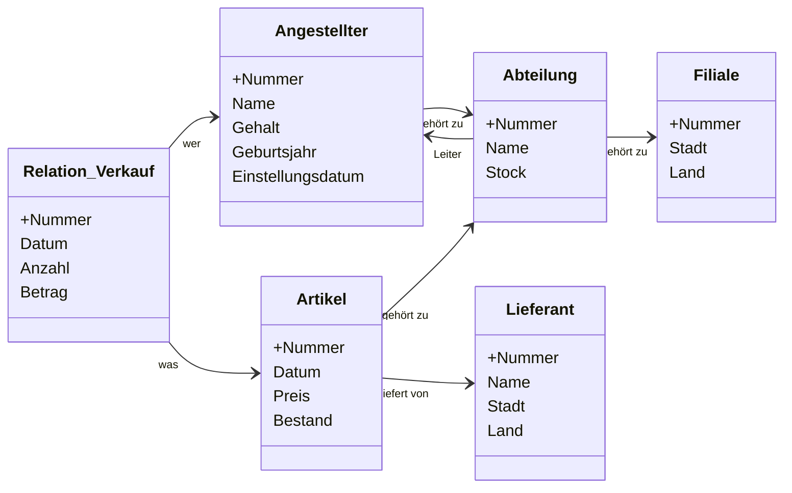

dbs
## Organization

- jede Woche Übungsblatt
- Tut ab 3. Woche

## Einführung

Arbeitsspeicher?
- 主内存, 电脑上内存条那个
- persistent speichern müssen
- Arbeitsspeicher nicht gross genug

Virtueller Speicher?
- 从硬盘里扣出来暂时用一下的 
- nicht ausreichen: von der Persistenz zu denken

![[attachments/permanent/内存和外部存储]]

![[attachments/permanent/主存储器技术]]

![[attachments/#磁盘的结构和原理]]

![[attachments/#更改异常(Update-Anomalie)]]

![[attachments/permanent/数据系统DBS的九个任务]]

### 数据库的内容
- Database Schema
	- 描述可能的数据
	- 元数据, 数据的结构和类型
	- 可以修改, 但很少修改
- 数据项 Ausprägung, Datenbank-Zustand

[[permanent/SQL|SQL语言]]

### 数据模型类型
- 关系型数据库: 表
- 树型, 层次型
- 网型
- 面向对象型
	- 纯的很少
- 对象关系型
	- 现在有些关系型数据库允许复杂的对象存储 
- NoSQL-database
	- e.g.
		- MongoDB, documentorient
		- 图数据库
		- KV数据库
	- 通常用于运行时间高相关型应用
	- [[permanent/数据系统DBS的九个任务#^6e8319|一致性监视]]常常受限

![[attachments/permanent/数据库比较]]

### 数据库与软件的连接
- 通过库
	- API
	- SQL语句通过参数传递
	- e.g. 
		- OCI: Oracle Call Interface
		- ODBC: Open Database Conectivity
		- JDBC
- 嵌入到语言
	- C, C++
	- SQLJ/JSQL for Java
		e.g. SQLJ![[attachments/Pasted image 20221021203907.png]]
	- 由预编译器调用API

### 数据库的结构
![[attachments/Pasted image 20221021204103.png|600]]

#### Konzeptionelle Ebene
- 独立于单个数据库的, 所有数据的视图
- 由DDL指定
- 没有数据细节

#### Externe Ebene
- 用户应该看到的数据
- 界面层

#### Interne Ebene
内部模式描述了系统特定的数据库对象（物理存储）的实现，例如 
- 存储数据记录的结构 
- 索引结构，如搜索树 
- 内部模式极大地决定了整个 DBS 的性能表现 -应用程序不受内部模式变化的影响（物理数据独立性）。

#### Logische Datenunabhängigkeit
Die Datenbank wird von die Änderungen und Erweiterungen des Anwenderschnittstellen abgekoppelt.
数据库与使用接口的变化和拓展脱钩.

#### Physische Datenunabhängigkeit
Die Anwendungen sind von die Änderung des internen Schemas nicht betroffen.
(数据库的)使用不受其内部模式变化影响.


## Das Relationale Modell

Domain
Kartesische Produkt
Relation
Kardinalität

### Relation in der Mathematik
`Attribute` Spalte einer Tabelle
`Grad/Stelligkeit` k in $R \subseteq D_1 \times D_2 \times \ ... \ \times\ D_k$
Relation = Menge von Tupel

### Relation in DBS
- `Relation r` Ausprägnung eines Relaionen-Schemas.
- `Attribute` Spalte einer Tabelle
- Position relative
![[attachments/Pasted image 20221029164838.png|600]]
- geordnetes Relationschema
	- `Attributnamen` $A_i$, $R = (A_1\ :\ D_1,\ ...\ A_k\ :\ D_k)$
- Relationenschema mit Domänenabbildung
	- `dom(m)` $R = \{A_1,\ ...\ A_k\}, dom(A_i) = D_i, 1 \le i \le k$ 属性类型
- e.g.
	- ![[attachments/Pasted image 20221029163408.png|600]]
一行是一个项, 一个 关系的元素, 一个 tuple
一列是一个属性
一个关系是一张表

### Key
Key K 是 RelationenSchemas $R$ 的 Attribute 的子集 ($K\subseteq R$)
就是可以辨识唯一性的属性, 可以是一组属性或一个属性
- `Eindeutigkeit` $\forall r,\ t_1, t_2 \in r,\ t_1 \neq t_2 \Rightarrow t_1[K] \neq t_2[K]$
- `Minimalität` $\forall T$ Attributmengen, die Eindeutigkeit erfüllen, $T \subseteq K \Rightarrow T = K$

##### Superkey
Superschlüssel
满足 Eindeutigkeit, 而不一定 Minimalität (这意味着超钥也可以作为唯一辨识, 而且不一定所有属性都需要用上)
Key 是 minimal Superkey

##### Unique
Schlüsselkandidate
unique 约束
符合 key, 即可作为唯一辨识符的一个或一组属性, 作为(数据表的 primary key)候选

##### Primary key
从候选里选出的主键
符合 not null 约束

##### Foreign key
一个表中的 foreign key 指向另一个表的 unique key

##### Referential Integrity
通过外键连接起来的行的完整性
含有外键的行的完整性也包括引用的行的完整性

### SQL
[[permanent/SQL#DDL#数据表的创建]]
[[permanent/SQL#SQL 数据类型]]
[[permanent/SQL#SQL 约束]]
[[permanent/SQL#DDL#修改属性, 增加属性, 删除属性]]


## Die Relationale Algebra

### Relationale Algebra

![[attachments/permanent/Linear Algebra Concepts 线性代数概念#Algebra 代数]]

![[attachments/permanent/Linear Algebra Concepts 线性代数概念#Closure 闭包]]

##### Relationale Algebra
- Operanden: Relationen(Tabelle)
- Operatoren: Selektoren(value>1000), UNION
- Abgeschlossenheit: Ergibnisse immer eine Relation

##### Grundoperationen
- Vereinigung
- Differenz
- Kartesisches Produdt(Kreuzprodukt)
- Selektion
- Projekt
- (Umbenennung der Element)

##### Projektion
删除不需要的列
e.g. $\pi_{Name,Abteilung}(Mitarbeiter)=...$
|Name |Abteilung |
|---|---|
|Huber |01 |
|Mayer |01 |
|Müller |02 |
|Mayer |01|


### Operation

##### Duplicate-Elimination
- $n\ log(n)$
- sort

##### Durchschnitt
$A \cap B = A - (A - B)$
- abgeleitete Operation
- 有时候被定义为 Grundoperation, 而 $-$ 是 abgeleitete

##### Quotient
有一点 $\forall$ 的意思, $R_1 \div R_2$, $R_1$ 中只有完整包含 $R_2$ 中每一个项的项才被保留
![[attachments/Pasted image 20221108205306.png|600]]


##### JOIN
Selektion+Kreuzprodukt
e.g. $\sigma_{Ableitung=ANr}(Mitarbeiter \times Abteilung)$
|PNr| Name |Vorname |Abteilung |ANr |Abteilungsname|
|---|---|---|---|---|---|
|001| Huber| Erwin|01|01|Buchhandlung|
|002 |Mayer |Hugo |01 |01|Buchhaltung|
|003 |Müller |Anton |02 |02|Produktion|

符号
$R\ \bowtie\ S$

分类:
- Theta-Join(Selector) $R \underset{A\ \Theta\ B}{\bowtie} S$
- Equi-Join $R \underset{A=B}{\bowtie} S$
- Natural-Join 同名的 Attribute 会合并

![[attachments/SQL#SQL JOIN]]

### SQL & relational operators
SQL is relational complete

**SELECT - projector** 
SELECT 但不会删除相同的项, 需要 SELECT DISTINCT

**FROM - crossproduct**
通配符*, as
> SELECT m.\*, a.Name AS Abteilungsname, ... 
> FROM Mitarbeiter m, Abteilung a

可以 self-join, 即 FROM 两次自己，可以在将整个数据表与某一项的某一值比较时用

**WHERE - selector**
compare oprater: <=, <>, ...
可以有 Prädikat: 加减乘除，concatenation `||`, substring, 逻辑运算

inexact: A1 LIKE ‘Datenbank%‘
% 任意个任意字符
_ 一个任意字符

IN: A1 in (2, 3, 5, 6)

##### Kompatible Wertebereich
![[attachments/SQL#数据类型兼容]]

##### UNION, INTERSECT, EXCEPT, MINUS
UNION - with duplication
UNION ALL - without duplication
UNION CORRESPONDING - same attribute name only
INTERSECT - intersection
EXCEPT, MINUS - difference

UNION 支持不同属性名合并, 也可以用 NULL 作占位符
e.g. 
> SELECT A,B,C FROM R UNION SELECT A,D,C FROM S

##### UPDATE
> UPDATE relation SET a1 = v1 WHERE con

##### DELETE
> DELETE FROM relation WHERE con

##### INSERT
将一个表或表的某些列复制到另一个表
> INSERT INTO table2 (column_name(s))  
> SELECT column_name(s) FROM table1;

## Relationen Kalkül

### Relationen Kalkül
- deklarative Sprache, vgl. Relationale Algebra ist prozedurale Sprache
- Tupelkalkül & Bereichskalkül

###  Tupelkalkül

|**Syntax** |Interpretation-> |**Semantik**|
|:--|---|:--|
|Tupelvariablen|->|konkrete Tupel|
|Formeln|->|true/false|
|Ausdruck|->|Relation|

##### Tuplevariablen
- kann in einer Formel frei oder gebunden auftreten
- haben Schemas
- $Schema(t) = (A_1: D_1, A_2: D_2)$

##### Atom
- $R(t)$
- $t.A \ \Theta \ s.B$
- $t.A \ \Theta \ c$, c constant

##### Formel
$\neg \wedge \vee \ \forall \ \exists$ von Atom

$I(\psi)$
Interpretation von Formel
e.g. I(R(r)) = true

##### Ausdruck(Anfrage)
$\{t | \psi(t)\}$

**ψ(r | t)**  
t Tuplevariable mit Schema(t)
r konkrete Tuple
ψ(r | t): alle t durch r ersetzt
e.g.
![[attachments/Pasted image 20221117083434.png|600]]

![[attachments/Pasted image 20221117084414.png|600]]


### Bereichkalkül

##### Sicher(Ausdruck)
Tuplevariable 只能用 gespeicherten Relation 可接受的值, 即 positiv in einem Atom R(t) vorkommt

##### Bereichvariablen
$x_1: D_1, \ x_2: D_2$

##### Ausdruck
$\{x_1, \ x_2, \ ... | \psi (x_1,\ x_2\ ...)\}$

##### Atom
- $R_1(x_1,\ x_2,\ ...)$
- $x\ \Theta \ y$

##### Formel
analog.  [[project/lmu - Database system#Formel|Tupelkalkül Formel]]

![[attachments/Pasted image 20221117092918.png|600]]

### 某作业
$\{Nummer,Datum | \exists abt, art, lie:Verkauf(Nummer, Datum, abt, art, \_, \_, \_)$  $\wedge Abteilung(abt, \_, \_, 3, \_) \wedge Artikel(art, \_, \_, \_, \_, lie)$ 
$\wedge Lieferant(lie, \_, \_, Land)$
$\wedge (Land=Italien \vee Land=Frankreich)\}$

c)
$Schema(t) = Schema(Nummer: Integer, Name: String, Abteilung: String)$
$\{[t.Nummer, t.Name, t.Abteilung]|$
$(\exists u \in Angestellter)(u.Nummer=t.Nummer \wedge u.Name=t.Name \wedge$
$(\exists v \in Abteilung)(v.Nummer=u.Abteilung \wedge v.Name=t.Abteilung \wedge$
$(\exists w \in Filiale)(w.Nummer=v.Filiale \wedge w.Stadt=Koeln)))\}$

$\{nr, name, abt|\exists abtnr, filnr: Angestellter(nr, name, \_, abtnr, \_, \_) \wedge$
$Abteitung(abtnr, abt, filnr, \_, \_) \wedge Filiale(filnr, Koeln, \_) \}$

d)
$Schema(t) = Schema(Angestellter)$
$\{[t.Nummer, t.Name, t.Gehalt, t.Geburtsjahr]|(t \in Angestellter) \wedge$
$(\exists v \in Verkauf)(v.Angestellter=t.Nummer \wedge v.Datum>01.10.2019) \wedge$
$(\neg \exists u \in Abteilung)(u.Leiter=t.Nummer)\}$

$\{nr, name, gehalt, geburtsjahr|$
$Angestellter(nr, name,gehalt, abtnr, geburtsjahr, \_) \wedge$
$\exists datum:Verkauf(\_, datum, \_, \_, nr, \_) \wedge$
$\neg \exists abtnr:Abteilung(abtnr, \_, \_, \_, nr)\}$


e)
$Schema(t) = Schema(Lieferant)$
$\{[t.Nummer, t.Name] |t \in Lieferant \wedge$
$(\exists art1, art2, art3 \in Artikel)(art1.Lieferant=t.Nummer \wedge$ 
$art2.Lieferant=t.Nummer \wedge art3.Lieferant=t.Nummer \wedge$
$art1 \neq art2 \wedge art1 \neq art3 \wedge art2 \neq art3)\}$

$\{nr, name| Lieferant(nr, name, \_, \_) \wedge \exists art1, art2, art3:$
$Artikel(art1, \_, \_, \_, \_, nr) \wedge Artikel(art2, \_, \_, \_, \_, nr) \wedge$
$Artikel(art3, \_, \_, \_, \_, nr)\wedge art1 \neq art2 \wedge art1 \neq art3 \wedge art2 \neq art3)\}$


a)
$Schema(t) = Schema(R)$
$\{t|t \in R \wedge t.A=x\}$

$\{a, b, c|R(a, b, c) \wedge a=x\}$

b)
$Schema(t) = Schema(R)$
$\{[t.A, t.B]|t \in R \}$

$\{a, b|R(a, b, \_)\}$

c)
$Schema(t) = Schema(A, B, C, D, E$)
$\{t|(R.C=S.C \wedge R.A=t.A \wedge$
$R.B=t.B \wedge S.D=t.D \wedge S.E=t.E)\}$

$\{a, b, c, d, e| R(a, b, c) \wedge S(c, d, e)\}$

d)
$Schema(t) = Schema(R)$
$\{t|t \in R \vee t \in S\}$

$\{a, b| R(a, b, c) \vee S(a, b, c)\}$

e)
$Schema(t) = Schema(R)$
$\{t|t \in R \wedge t \in S\}$

$\{a, b| R(a, b, c) \wedge S(a, b, c)\}$

f)
$Schema(t) = Schema(R)$
$\{t|t \in R \wedge t \notin S\}$

$\{a, b| R(a, b, c) \wedge \neg S(a, b, c)\}$

g)
$Schema(t) = Schema(A, B, C, D, E, F)$
$\{t|t.A=R.A \wedge t.B=R.B \wedge t.C=R.C \wedge t.D=S.D \wedge t.E=S.E \wedge t.F=S.F\}$

$\{a, b, c, d, e, f|R(a, b, c) \wedge S(d, e, f)\}$

h)
$Schema(t) = Schema(B)$
$\{t|(\forall s \in S)((\exists r \in R)(R.A=S.A \wedge r.B=t.B))\}$

$\{b|\forall a: S(a) \ \exists r: R(a, b)\}$

---

### Query By Example (QBE)
![[attachments/Pasted image 20221117103233.png|600]]
- Kommandos
	- `P.`  print/projektion
	- `I.`  insert
	- `D.`  delete
	- `U.`  update
- Bereichsvariablen
	- \_x, \_y
- Konstanten
- Operator
- Condition-Box
	- AND, OR, but no NOT


#### Umsezung von Bereichkalkül zu QBE Anfrage
![[attachments/Pasted image 20221117104407.png|600]]

![[attachments/Pasted image 20221117104419.png|600]]
![[attachments/Pasted image 20230215191404.png|600]]

### Quantoren und Subqueries in SQL
$\{x \in R\ |\ \exists y \in S: con\} \equiv \pi_{R.^*}(\sigma_{con} (R \times S))$
$\{x \in R\ |\ \forall y \in S: con\} \equiv (\sigma_{con} (R \times S)) \div S$

$\{x \in R\ |\ \forall y \in S: x.a > y.b\} \equiv (\sigma_{x.a>y.b} (R \times S)) \div S$

![[attachments/SQL#子查询]]


## Sortieren, Gruppieren und Views in SQL


### Sortieren
![[attachments/SQL#ORDER BY 关键字]]


### Aggregation
![[attachments/SQL#SQL 函数]]

### Gruppierung
![[attachments/SQL#GROUP BY 关键字]]

![[attachments/SQL#根据多属性分组]]

![[attachments/SQL#HAVING 关键字]]

### Auswertung
![[attachments/SQL#SQL运算顺序]]


## Das E/R Modell
Entity/Relationship Model

- Entity: class, **两个 Entity 之间只能通过 Relationship 连接**
- Attribute
- Relationship: e.g. belegt(Anton, dbs)
关系也是可以有属性的

- (erweiterte) Vererbung	

### Notation
- 1:1(双箭头)
- m:1(多指向1)
- m:n(无箭头)
![[attachments/Pasted image 20221205144431.png|500]]

Vererbung
![[attachments/Pasted image 20221205144754.png|500]]

### E/R 转 Relation

#### 1:1
如果合理的话, 两个实体合为一个

#### 1:n
将 1 的主键加入到 n 作为外键

#### m:n
将 关系 作为新的表, 将关系双方的主键作为外键且是新的表的主键

#### 多方关系
也是创建新的表, 将关联的表的主键作外键+主键

#### 同类关联
按照上面的规则, 属性改个名字就好
![[attachments/Pasted image 20221205150134.png|400]]


#### 继承
通常可以转化为 1:m
也可以直接将父类的属性加入到子类, 取消父类

### UML
类似类图
- 关系没有特殊符号, 直接标注在线上, 只有三元+关系用菱形
- ..
![[attachments/Pasted image 20221205151051.png|480]]

### 某作业
(提示: 这不是E/R图, 我做错了)

---


## Normalformen
Normalization theory as formal basis for RDB design.

- [[#1. Normalform]]
- [[#2. Normalform]]
- [[#3. Normalform]]
- [[#4. Normalform]]

![[attachments/Pasted image 20221206205443.png|400]]
![[attachments/Pasted image 20221207231521.png|500]]

### 概念

#### Functional dependency
同一个表中的属性之间的依赖
(X -> Y) Y ist von X funktional abhängig

![[attachments/Pasted image 20221205151830.png|500]]
是指比如说, 在一个设计不当的表中, 某几个属性与某主键挂钩, 某几个与另一个属性挂钩(不一定是主键, 如LStadt和LLand)的情况, 这样就会造成**冗余(Redundanz)**.
这种情况就很容易造成[[#更改异常(Update-Anomalie)]]:只更新了其中一项的内容
更改成更好的 Schema:
![[attachments/Pasted image 20221205152031.png|480]]

##### 更改异常(Update-Anomalie)
指由于同一数据的重复存储, 修改一处必须找出其他多处

##### Partielle FD, Volle FD
已知 $X \rightarrow Y$, 
- 若没有有 $X^{\prime} \subsetneqq X$ 且 $X^{\prime} \rightarrow Y$, 则称 $X \rightarrow Y$ **volle FD**($X \overset{\bullet}{\rightarrow} Y$)
- 否则是 **partielle FD**

volle 相当于最小化了, 这个就是可以提取成新表的主键
partielle 意味着还得找 volle

##### Full FD vs. Key
Key 不一定代表其他属性就对它 full FD, 因为 ffd 是一个集之间的关系, $X$ 是 key vs. $X \rightarrow Y$, 前者代表 X 可以确定一个项(的其他属性作为一个整体), 后者代表可以确定 Y 中的每一个属性.
前X和后X在一张表里可能不相等, 如果相等说明设计得好

##### Triviale funktionale Abhängigkeit
由于 [[#Reflexitivity(R)]], 每个属性对自己和包含自己的集 FD
这种关系称为 trivial funktionale Abhängigkeit.

#### Prime Attribute
Ein Attribut heißt prim, wenn es Teil eines Schlüsselkandidaten ist

#### verlustlos/verbundtreu
指一张表分离成两张时无损, 即 $R = R_1 \bowtie R_2$
这通常需要 $R_1$ 和 $R_2$ 的交集等价于两者之一 (这个等价也包括外键带来的数据)

#### abhängigkeitserhaltend/hüllentreu
描述一张表分离成两张时保持 functional dependency 状态
需要 $F_R = (F_{R_1} \cup F_{R_2})$ bzw. $F_R^+ = (F_{R_1} \cup F_{R_2})^+$
$F_R$ functional dependency of Relation R

#### Hülle einer Attributmenge
属性集的凸包
F: Set of FDs
X: Set of Attributes
res = $X^+$: vollständige Menge von Attributen $X^+$, fürdie gilt $X \rightarrow X^+$
```pseudocode
AttrHull(F, X)
	res := X
	while(res changed) do
		foreach Y -> Z \in F do
			if Y \subseteq res then res := res \cup Z
	return res
```

### Notation Convention
Attribute: A, B, C
Attribute set: X, Y, Z

看起来就是为了functional dependency简化的 Notation表
![[attachments/Pasted image 20221205154414.png|500]]

### Herleitung von FD

#### Axiome
![[attachments/Pasted image 20221205164520.png]]

##### Reflexitivity(R)
$Y$ 是 $X$ 的子集, 则恒有 $X \rightarrow Y$
$X \rightarrow X$ 恒成立

##### Verstärkung(VS)
若 $X \rightarrow Y$, 则 $XZ \rightarrow YZ$
$XZ = X \cup Z$

##### Transitivity(T)
$X \rightarrow Y$ 且 $Y \rightarrow Z$, 则 $X \rightarrow Z$

##### 显然FD没有对称性

##### Vereinigungsregel(VE)
$X \rightarrow Y$ 且 $Y \rightarrow Z$, 则 $X \rightarrow YZ$

##### Dekompositionsregel(D)
$X \rightarrow YZ$ 则 $X \rightarrow Y$ 且 $X \rightarrow Z$

##### Pseudotransitivitätsregel(P)
$X \rightarrow Y$ 且 $YZ \rightarrow V$, 则 $XZ \rightarrow V$

#### 证明 key candidate
![[attachments/Pasted image 20221205222148.png|500]]
![[attachments/Pasted image 20221205222646.png|500]]
![[attachments/Pasted image 20221205222735.png|500]]

### 1. Normalform
FNF, first normal form

**Def.** 
Ein Relationenschema ist in 1. Normalform, wenn alle Attributwerte atomar sind
只要每个属性只有一个值就是

"nested relation", **non first normal form**, NFNF, NF2
e.g. group by
In SQL nur temporär erlaubt

### 2. Normalform
**Motivation**
避免有多键的表中, 属性只对其中一键依赖的情况

**Def.** 
Ein Schema ist in 2. Normalform, wenn jedes Attribut
- voll funktional abhängig von *allen Schlüsselkandidaten*
- oder [[#Prime Attribute|prim]] ist
verletzt: existiert zusammengesetzter Key(candidate) $\wedge$ existiert nicht prime Attr

#### Zur 2.Normalform
将导致 pfD 的部分单独提取成一张表, 被依赖者为 key, 依赖者为属性

e.g.
Lieferant(__LNr__, LName, LStadt, LLand, __Ware__, Preis)
↓
Lieferung(__LNr__, __Ware__, Preis)
LieferAdr(__LNr__, LName, LStadt, LLand)

### 3. Normalform
**Motivation**
避免对非 key 属性的依赖

**Def.**
Ein Relationenschema ist in 3. Normalform, wenn für jede nicht [[#Triviale funktionale Abhängigkeit|triviale funktionale Abhängigkeit]] $X \rightarrow A$ gilt:
- X 包含 key candidate oder
- A ist [[#Prime Attribute|prim]]
2.N 的要求已经隐式包含

就比如说 如果一个属性 B 依赖于另一个属性 A, 那就是非 trivial
如果这个 A 还是个非 key candidate属性, B 也不是 prim, 那就违反了 3.N 的要求

#### Zur 3. Normalform
将 依赖非key 的部分(或者说传递性依赖)单独提取成一张表, 被依赖者为 key, 依赖者为属性

#### Synthesealgorithmus für 3NF
**Idea**
拆表, 合理设计数据库

**Input**
- Relation $R$
- $F$ FD von R

**Output**
- $R_1, \ ..., \ R_n$ [[#verlustlos/verbundtreu|verlustlose]], [[#abhängigkeitserhaltend/hüllentreu|abhängigkeitserhaltende]] Zerlegung von $R$ in 3NF

**Algorithm**
1. 确定 $F$ 的最简形式 $F_c$ (kanonische Überdeckung)
	对所有 FD $X \rightarrow Y$:
	1. 检查所有 $A \in X$, A 是否多余, 即$Y \subseteq AttrHull(F, X - A)$ 是否成立. 若是, 则改为 $(X-A) \rightarrow Y$.
	2. 检查所有 $B \in Y$, B 是否多余, 即 $B \subseteq AttrHull((F-(X \rightarrow Y)) \cup (X \rightarrow(Y-B)), X)$ 是否成立. 若是, 则改为 $X \rightarrow (Y-B)$.
	3. 去除 $X \rightarrow \{\}$.
	4. 合并 $X \rightarrow Y_1,\ ...,\ X \rightarrow Y_n$ 为 $X \rightarrow (Y_1 \ \cup \ ... \ \cup \ Y_n)$.
2. 从 $F_c$ 创建新的 Relationenschemata  
	对所有 $X \rightarrow Y \in F_c$:
	- 新 schema $R_X := X \cup Y$
	- 分配 FD, $F_X := \{X' \rightarrow Y' \in F_c | X' \cup Y' \in R_X\}$
3. 重设大表的 key candidates
4. 删除多余关系

![[attachments/Pasted image 20221206222226.png|500]]

![[attachments/Pasted image 20221206222242.png|500]]

#### 某作业
{ C, A → D ; C → F, D ; B → A, E ; E → F, A }
1.
a)
Linksreduktion:
C, ~~A~~ -> D
{C} $\subseteq$ AttrHülle(F, {C, A} - {A})
weil C -> F, D direkt gilt

b)
Rechtsreduktion:
C -> ~~D~~
{C} $\subseteq$ AttrHülle(F - (C->D) $\cup$ (C->{}), {C})
weil es C -> F, D schon gibt

B -> ~~A~~, E
{A} $\subseteq$ AttrHülle(F - (B->A,E) $\cup$ (B->E), {B})
weil B -> E und E -> A (transitiv)

c) C -> {} wird eliminiert

d) nichts zu tun

Fc = { C -> F,D ; B -> E ; E -> F,A}

2.
R1(<u>C</u>, F, D)     {C -> F, D}
R2(<u>B</u>, E)         {B -> E}
R3(<u>E</u>, A, F)     {E -> A, F}

3.
R(<u>B</u>, <u>C</u>) weil (B,C) Schlüsselkandidate ist (10-5 (a)) 

4.
nichts zu tun


#### 3NF 还有什么问题?
还有这样的属性被依赖: [[#Prime Attribute|prim]], 但不能只凭自身构成 key candidate 的属性.
![[attachments/Pasted image 20221207221059.png|480]]

### Boyce-Codd Normalform
**Def.**
Ein Schema R ist in Boyce-Codd Normalform, wenn für alle nichttrivialen Abhängigkeiten $X \rightarrow Y$ gilt:
- $X$ enthält einen Schlüsselkandidaten von R

- velustlose Zerlegung möglich
- abhängigkeitserhaltende Zerlegung nicht immer möglich

### Mehrwertige Abhängigkeiten(MVD)
- mehrere unabhängige 1:n Beziehungen in einer Relation stehen.
- $X \twoheadrightarrow Y$
![[attachments/Pasted image 20221207223132.png|500]]
![[attachments/Pasted image 20221207223935.png|500]]

verlustlose Zerlegung von MVD, wenn gilt:
- $R = R_1 \cup R_2$
- $(R_1 \cap R_2 \twoheadrightarrow R_1) \vee (R_1 \cap R_2 \twoheadrightarrow R_2)$

#### triviale MVD
**Def.**
Eine MVD $X \twoheadrightarrow Y$ bezogen auf $R \supseteq X \cup Y$ ist *trivial*, wenn jede mögliche Ausprägung $r$ von $R$ diese MVD erfüllt, genau dann wenn:
- $(Y \supseteq X) \vee (Y = R-X)$

### 4. Normalform
**Def.**
Eine Relation $R$ mit zugeordneter Menge $F$ von funktionalen und mehrwertigen Abhängigkeiten ist in *4. Normalform(4NF)*, wenn für jede MVD $X \twoheadrightarrow Y \in F^+$ eine der folgenden Bedingungen gilt:
- die [[#triviale MVD|MVD ist trivial]]
- oder X ist Superschlüssel von R

## Physische Datenorganisation

### 磁盘的结构和原理
- 一个`盘` 两面可读写
- 读写头可以在不同`轨道`之间移动
- 轨道分成多个`扇区`

![[attachments/Pasted image 20221021191547.png]]

#### 数据读取的速度
![[attachments/permanent/磁介质存储设备#磁盘数据读取的速度]]

### Index 结构
Index 结构是数据的存储结构

#### Index 结构
构造:
- Directoryseiten: index/directory
- Datenseiten: physische Datensätze

分类:
- Datenorganisierende Strukturen
- Raumorganisierende Strukturen

primary key search: B-Tree, 线性哈希
secondary key search: inverted list

#### 数据库 Index 结构的要求
- 高效查找: 如果不优化, 难道一条一条数据找吗
- 动态插入, 删除和更改: 不可能改一下就要重新组织整个结构(如有序队列)
- 保持有序:如关联的数据应该在附近(局部性原理)
- 高存储利用率(Speicherplatzausnutzung)


### B 树
![[attachments/permanent/B 树#B 树]]

![[attachments/permanent/B 树#B 树的阶 m]]

![[attachments/permanent/B 树#B 树的插入]]

![[attachments/permanent/B 树#B 树的删除]]

### B+ 树
![[attachments/permanent/B+ 树#B+ 树]]

![[attachments/permanent/B+ 树#分离值 Separator]]

### Hashing 方法
- Raumorganisierendes Verfahren
- 最好情况下读取时间复杂度可以到常数

#### 二级存储的 Hash 方法
de. Hash-Verfahren für Sekundärspeicher
- 高存储利用率(50% Datenseiten)
- 高效的动态方法(插入, 删除, 更改)
- 查询的效率可以

#### Hash 方法分类
- with directory
- without directory
![[attachments/Pasted image 20221219165304.png|500]]


#### Hash method with directory
- **hash(k)/h(k)** 计算结果是一个 bit 字符串, 也就是由 0和1 组成的数列
- **depth d** 是 bit 字符串位数, 一共有 $2^d-1$ 可用 bit串, 深度可变
- 出现撞表时, 如果不能分表, 则扩表
- 某一个数据占表比例太大(>90%)也会分表
- 不同的哈希值可能指向同一个数据, 通常是扩表导致的

#### Linear Hashing
Hash method without directory
- hash() 直接计算得到存储地址
- 撞表 -> 把撞表地址关联
- 有一系列 hash function: $h_0, h_1,h_2,\ ...$
- 存储率 Belegungsfaktor 大于阈值 Schwellwert 会对溢出页使用下一个 hash function
- 存储空间使用随数据量线性增长

![[attachments/Pasted image 20221219231618.png|500]]
![[attachments/Pasted image 20221219231631.png|500]]

hash 方法是有要求的, 对第 L 个方法 $h_L$(从$h_0$开始):
1. 对值域的要求: $h_L: domain(k) \rightarrow \{0, 1, ..., (2^L \times N) -1\}$, 即第 L 个函数要保证值域中 \#值=$2^L \times N$
2. 对相邻函数的要求: $h_\{L+1\} = h_L(k) | h_L(k) + 2^L \times N$
e.g. $h_L(k) = k\mod (2^L \times N)$


### Inverted Index in DBS
- 对每个 attribute 的具体值 $a_1, a_2, ..., a_d$ 建立反向索引
- Antwortzeit 不会随\#回答数据增加
- Suchzeit 随#Attribute 增加
- 对非主键, 二级索引不会影响物理存储

### SQL 中的 Index
![[attachments/SQL#SQL Index]]


## Relationale Anfragebearbeitung


### Grundlage der Anfrageoptimierung

#### Aufgabe der Anfragebearbeitung
![[attachments/Pasted image 20230103160352.png|400]]

#### Kanonischer Auswertungsplan
```sql
SELECT A1, A2 FROM R1, R2, WHERE C1, C2
```
to
$\pi_{A_1, A_2}(\sigma_{B_2}(\sigma_{B_1}(R_1 \times R_2)))$

1. Produkt der Relationen
2. Selektionen mit Bedingungen
3. Projektion

![[attachments/Pasted image 20230104211805.png|200]]

#### Logische vs. Physische Anfrageoptimierung
logische 的比如说改变 plan 子行为的顺序
physische 涉及到存储的使用策略

#### Regelbasierte vs. Kostenbasierte Anfrageoptimierung
regelbasiert/algebraische 比如利用等价的规则来优化
kostenbasiert 就是先看成本再选择方案

### Logische Anfrageoptimierung

#### Äquivalenzregeln der Relationalen Algebra
**Commutative**: join, union, intersect, crossproduct, selection*
**Assosiative**: join, union, intersect, crossproduct, selection*

#### Restrukturierungsalgorithmus
- 拆分(复数) selection 并尽可能在前面地执行 selection(比如在 product前, 减少 product 的数据量爆炸)
- select + cross -> join
- project 尽可能晚
- 将可以合并的 selection 合并

```sql
/* e.g. */
SELECT name FROM Kunde k, Bestellt b, Produkt p
WHERE b.KNr = k.KNr AND Bezeichnung="Fiat Uno" AND Saldo >= 300000
```

开始时的 Kanonischer Auswertungsplan
![[attachments/Pasted image 20230104220951.png|300]]

![[attachments/Pasted image 20230104221031.png|500]]

![[attachments/Pasted image 20230104221045.png|500]]

### Kostenmodellbasierte Anfrageoptimierung

#### Selektivität
$sel$ 表示经过一个操作后剩下的条目比例

Selection  $sel_B = \frac{\sigma_B(R)|}{|R|}$
Join        $sel_{RS} = \frac{|R \bowtie S|}{|R \times S|} = \frac{|R \bowtie S|}{|R| \cdot |S|}$

AND:  $sel_B(\sigma_{B1 \wedge B2}) = sel_B(\sigma_{B1}) \cdot sel_B(\sigma_{B2})$
OR:    $sel_B(\sigma_{B1 \vee B2}) = sel_B(\sigma_{B1}) + sel_B(\sigma_{B2}) - sel_B(\sigma_{B1}) \cdot sel_B(\sigma_{B2})$
NOT:  $sel_B(\sigma_{\neg B1}) = 1 - sel_B(\sigma_{B1})$

#### Schätzmethoden

##### Parametrische Verteilungen
对数据进行分布拟合
![[attachments/Pasted image 20230104222711.png|400]]
难点: 分布的选择, 分布参数的测定. 最大的问题是无法在多属性查询时使用

##### Histogram
把数据划分为区间, 观察区间内数据分布情况
等宽直方图: 区间等宽
等深直方图: 每个区间的数据数量相同

一维直方图在多属性时的问题是, 假设了各属性间无关联
多维直方图在多属性时的问题是, 成本随维度指数增长000000000000000000000

##### Stichproben
就是随机数, 蒙特卡罗方法, 难点在于 n 的选择, 太小不准, 太大又贵

### Physische Anfrageoptimierung
目的: 对某一次操作(例如查询)寻找最适合的算法和数据结构

> R JOIN S ON R.A=S.B

#### Notation
$BR/BS$:number of blocks
$f_R/f_S:\ \ \#relations/block$
c :       size of cache (Bytes)
$t_{tr}$ :      transfer time
$t_{lat}$ :     磁盘的平均延迟
b:        size of block

其中 b 也就是 Block 大小是要被最优化的参数(现实一般好像是16kb)

#### Nested-Block-Loop-Join(NBL-Join)
- 每个小格子是一个数据项(的对比), 一个 Block 是4项, 4x4 是16次对比

##### Einfacher Nested-Loop-Join
![[attachments/Pasted image 20230104225407.png|300]]
```python
for r in R:
	for s in S:
		if r.A == s.B:
			result.append((r, s));
```

(Blockzugriffe)
$\#load = BR \times (f_R \times BS + 1)$

##### Nested-Block-Loop-Join
- 稍微优化一点, 稍微优化 Block 读取次数, 着眼当前地充分利用每次 load block
![[attachments/Pasted image 20230105192701.png|300]]
```Python
for block_r in R:
	# load block
	for block_s in R:
		# load block
		for r in block_r:
			for s in block_s:
				if r.A == s.B:
					result.append((r, s))
```

$\#load = BR \times (BS + 1)$

#### Cache Strategy for NBL-Join
关键: size of block
太小了太大了都会增加读写次数

**其一**
在[[#Nested-Block-Loop-Join]]的基础上, 加入缓存机制, 并将 Block读取顺序 Z 形读取改为 蛇形(是整个Block的读取, 不是Block内部)
![[attachments/Pasted image 20230105195755.png|200]]

$|C|$ : 可用的 cache 能放多少 Block 

Blockzugriffe = $BR + BR \cdot (BS - |C| + 1) + |C| -1$

**其二**
用 $|C|$ - 1 个 Page 缓存 R, 剩下那一个缓存 S

例如 $|C|$ = 3
![[attachments/Pasted image 20230105204428.png|500]]

Blockzugriffe = $B_R + B_S \cdot \left \lceil \frac{B_R}{|C|-1} \right \rceil$

I/O用时
![[attachments/Pasted image 20230105211107.png|500]]
![[attachments/Pasted image 20230105211118.png|500]]

优化函数
![[attachments/Pasted image 20230105214647.png|500]]
$$0 = \frac{\mathrm{d}}{\mathrm{d}b}t_{hull} \Rightarrow b_{opt} = \frac{\sqrt{t^2_{lat}+t_{tr} \cdot t_{lat} \cdot c}- t_{lat}}{t_{tr}}$$ 
取正根, 取整后有两个结果
$$b_1 = c/ \left \lfloor \frac{c}{b_{opt}} \right \rfloor,\ b_2 =c/ \left \lceil \frac{c}{b_{opt}} \right \rceil $$


**实际上, 相比于 CPU 耗时, I/O 耗时是非常低的, 因此需要对 CPU 更友好的算法**

#### Sort-Merge-Join
1. 把数据排序
2. 用双指针法比较

时间复杂度 $O(|R| \cdot \log |R| + |S| \cdot \log |S|)$
![[attachments/Pasted image 20230105223526.png|500]]

#### Hash-Loop-Join

##### Naive Hash Join
1. 将 R 全哈希了
2. 对每一个 s 哈希, 拿哈希表比对
![[attachments/Pasted image 20230105225928.png|500]]
$O(|R| + |S|)$

##### Hashed Loop Join
每次读取合适数量的 R 哈希, 把所有 S 和这部分比对,
再读取下一部分合适数量的 R, 重复

![[attachments/Pasted image 20230105230215.png|500]]
![[attachments/Pasted image 20230105230230.png|500]]

##### GRACE / Hash Patitioned Join
不是把每个 r 和每个 s 比对,
而是用 hash function 把 R 和 S 分别划分成 hash key 分区(Partition), 只有具有相同 hash key 的 R分区 和 S分区需要比对
![[attachments/Pasted image 20230105230907.png|500]]
![[attachments/Pasted image 20230105230926.png|500]]

## Transaktionen

### Synchronisation(Concurrency Control)

##### Transaktion
transaction
Folge von Befehlen (read, write), die die DB von einen  
konsistenten Zustand in einen anderen konsistenten Zustand überführt
对数据库的一系列操作, 其影响是持久性的. 数据库的完整性被保护下的状态变化单元, 主要任务是
- 同步
- 数据恢复

#### ACID 原则

##### Atomicity
原子性, transaction 的效果要么完整, 要么没有.

##### Consistency(maintaining integrity)
consistent 状态 → consistent 状态

##### Isolation
一个用户不会觉察其他用户在 transaction 中所做的更改

##### Persistence/Permanence
完成的 transaction 的影响永久地保存在数据库


#### Transaction 流程控制

##### begin of transaction(BOT)
setup 操作, 在 sql 里没有

##### end of transaction(EOT)
teardown
sql: `commit` / `commit work`

##### abort
放弃更改
sql: `rollback` / `rollback work`

##### 对于 长transaction
- 定义保存点
	- 处于活动状态的事务可以回滚到该保存, 不可提交
	- sql: `savepoint <identifier>`
- 备份 transaction
	- 回滚
	- sql: `rollback to <identifier>

##### commit 失败
如果检测到 commit 违反约束(如 [[#Integrity Constraints]], 数据的正确性和完整性), 可能会失败.


#### 为什么要同步/并发
- 单线太慢, 等待时间长, 吞吐量(leistungsfähigkeit)低
- 可以多用户操作
	- 同步可以确保一个用户操作时不受其他用户影响

#### Anomalien in Mehrbenutzerbetrieb 多用户操作中的异常

##### Lost Updates
违反: Durability

##### dirty read/ dirty write
数据状态不是永久有效的,
如果临时状态的数据被读取了, 就叫脏读取
![[attachments/Pasted image 20230119210648.png|450]]
违反: Durability/Consistency

##### Non-Repeatable Read
一个 TA 在执行过程中读取了两次, 值不一样(别的 TA 更改了)
违反: Isolation

##### Phantomproblem
不可重现阅读的特例，其中涉及新生成的数据，并且主要在第二个 TA 聚合函数中
![[attachments/Pasted image 20230119212116.png|450]]
咦, 不是查到 n 项数据吗, 怎么又变成了 n+1 项

#### Serialisierbarkeit von TA
指一个[[#Allgemeiner Schedules 一般调度|一般调度]]是否能转化为一个[[#Serieller Schedule 串行调度|串行调度]]
Motivation
- 对用户隐藏并发
- 对用户透明, 即感觉 TA 在以任意顺序连续执行, 而不是和其他 TA 交错

![[attachments/Pasted image 20230123213010.png|400]]

##### Allgemeiner Schedules 一般调度
Schedule(history) 是集合 {$T_1$, ..., $T_n$}, 是 TA 的行动序列.
它对交易 $T_i$ 的顺序(存在穿插)洗牌, 但会保留每个 TA 的内部顺序

一般调度显然提供了任意的联锁，因此出于**性能**方面的考虑，需要一般调度。

##### Serieller Schedule 串行调度
各 TA 的操作没有交错, 而是一块一块执行.
从 **Isolation 的原则**看, 需要串行调度

##### Serialisierbarer Schedule 可序列化调度
Ein (allgemeiner) Schedule S von {T1 , ..., Tn} ist serialisierbar, wenn er dieselbe Wirkung hat wie ein beliebiger serieller Schedule von {T1 , ..., Tn} .
可序列化调度是存在等价串行调度的一般调度. 是一般调度和串行调度的折衷.
得到的等价调度称为 **Serialisierungsreihenfolge**

##### Abhängigkeit

###### Schreib-Lese-Abhängigkeit $T_i$ → $T_j$ 
对某一项 x, w$_i$(x) 应该在 r$_j$(x) 前
Abkürzung: wr$_{i,j}$(x)

###### Lese-Schreib-Abhängigkeit $T_i$ → $T_j$
对某一项 x, r$_i$(x) 应该在 w$_j$(x) 前
Abkürzung: rw$_{i,j}$(x)

###### Schreib-Schreib-Abhängigkeit $T_i$ → $T_j$
对某一项 x, w$_i$(x) 应该在 w$_j$(x) 前
Abkürzung: ww$_{i,j}$(x)

##### Konflikt-Äquivalenz 冲突等价
如果说 调度 S1 和 S2 等价, 那他们的 TA 以及 TA的依赖([[#Abhängigkeit]]) 就应该是等价的. 即比如说, 如果 S1 中读某个项的值是 x, 那 S2 读到的也应该是 x.

![[attachments/Pasted image 20230119214906.png|500]]

##### Serialisierungs-Graph
- 用于检查两个调度是否冲突等价
- TA 是 Node
- 依赖是 Edge
- Ein Schedule ist **serialisierbar**, falls der Serialisierungs-Graph **zyklenfrei** ist
- 通过对图的拓扑排序, 可以得到 **Serialisierungsreihenfolge** (如果有的话)
- 通过图的方法计算[[#Serialisierbarer Schedule 可序列化调度|可序列化性]]的成本太高, 因此通常用其他方法, 如被动管理([[#Locking]])或在结束后主动检查

![[attachments/Pasted image 20230119221110.png|500]]

![[attachments/Pasted image 20230119221123.png|500]]


##### Rücksetzbarer Schedule 可撤销调度
T$_i$ 只有在其读取了数据的 T$_j$ 结束后, 才能执行 commit

##### Schedule without cascading reset 
没有级联 reset 的调度
进行中的 TA 涉及的数据禁止读取

##### Strikter S.
在 [[#Schedule without cascading reset]] 的基础上, 进行中的 TA 的数据不能被覆盖

#### Locking

##### Lock(Sperre)
- LOCK()/UNLOCK() atomar(不可打断)
- Sperrgranularität: Datenbank, DB-Segment, Relation, Index, Seite, Tupel, Spalte, Attributwert
- Sperrenverwalter 执行锁

##### Legal Schedule 合法调度
- 每次访问一个对象前都会设置适当的锁, 最迟在 TA 结束时解锁
- 等待已有的锁
-  lock/unlock 应在 DBMS 中隐式完成
- 合法调度并不一定是[[#Serialisierbarer Schedule 可序列化调度|可序列化调度]]

##### Zwei-Phasen-Sperrprotokoll(2PL)
- 最简单和最常用的
- 在上锁结束前不解锁
- 两个阶段: 
	- Wachstumsphase: Anforderungen der Sperre
	- Schrumpfungsphase: Freigabe der Sperre
![[attachments/Pasted image 20230123215755.png|400]]
- 问题: 不能撤回
![[attachments/Pasted image 20230123215921.png|400]]

##### Striktes Zwei-Phasen-Sperrprotokoll(Striktes 2PL)
- 在 [[#Zwei-Phasen-Sperrprotokoll(2PL)|2PL]] 的基础上, 所有锁保持到 COMMIT
![[attachments/Pasted image 20230123220042.png|400]]
- 保证[[#Serialisierbarkeit von TA|可序列化]], 可搜索的调度, 但 TA 的 并行度(Paralleilisierungsgrad) 受到严格限制
- 问题: 过于严格了, 实际上纯读取是可以并行的(无级联)

##### RX-Sperrverfahren
- 允许纯读取 TA 之间并行
- 主要与[[#Striktes Zwei-Phasen-Sperrprotokoll(Striktes 2PL)|Striktes 2PL]]结合使用, 仅能得到无级联的[[#Rücksetzbarer Schedule 可撤销调度|可撤销调度]]. 得到的 Serialisieungsreihenfolge 由第一个冲突操作决定
- 可能造成死锁(Deadlock, Verklemmung)

### Datensicherheit(Recovery)

#### Fehler 和 Recovery 的分类

##### Transactions Recovery

Transaktionsfehler(未确认的 TA 的错误)
- 程序错误
- ROLLBACK
- Sync Conflict
- Verletzung von Regeln

通过 Rücksetzen 解决
- local UNDO(如撤回某个 TA 的操作)
- 这类错误很常见, 所以解决方法应在 mm 级完成

##### Crash Recovery

System Error(死机那类)

通过 Crash Recovery(Warmstart) 解决
- global UNDO: 重置所有已进入 DB 但未完成的 TA
- global REDO: 更新所有已完成但未进入 DB 的TA
- 通常频率可能在几天一次, 恢复需要数分钟

##### Geräte Recovery
Medien Error
- Plattencrash
- Wasserschaden
- 系统程序导致的数据丢失

通过 Geräte-Recovery(Coldstart) 解决
- 恢复到较早的, 安全的数据库状态
- global REDO: 更新所有在备份副本创建后完成的 TA
- 介质错误很少发生, 通常是几年一次. 且需要提前备份

#### Logging
任务: 所有操作(DO)都需要日志条目, 以得到 UNDO 或 REDO 时需要的信息
- physisch
	- Zustandslogging
		- Seitenlogging
		- Eintragslogging
	- Übergangslogging
- logisch
	- Übergangslogging
- physiologisch

##### Physisches Logging
在物理对象(Seiten, Datensätze, Indexeinträge)层面记录

Zustandslogging: 记录更改前后的值
- Seitenlogging: 页面级别的记录, 恢复快速, 但页面锁定->高冲突率. 记录页面的完整副本所以占空间&高I/O成本
- Eintragslogging: 只有实际改变的条目被记录, 锁定粒度更小. 收集在缓冲区内->显著减少磁盘访问. 恢复更复杂, 需要将更改的Seite完全加载在主内存中才能使用(通过异或)

Übergangslogging: BFIM(before image) 和 AFIM(after image) 的差异

##### Logisches Logging
使用当前参数记录更改, 在更高的抽象级别

REDO 的问题: 
- 更改通常包括多个 Seiten, 原子(操作)的 Einbringen 困难
- 比物理更昂贵

UNDO 的问题:
- 面向数量的更改可能导致非常昂贵的日志条目
	- Bsp.: `DELETE FROM Products WHERE Group = ‘G1’` => UNDO erfordert viele Einfügungen, falls Produktgruppe G1 umfangreich ist  
	- Bsp.: `UPDATE Products SET Group = ‘G2’ WHERE Group = ‘G1’` => UNDO muss alte und neue Produkte der Gruppe G2 unterscheiden

##### Physiologisches Logging
[[#Physisches Logging]]和[[#Logisches Logging]]的结合
- Physical-to-a-page: 记录单位是更改的page, 与缓冲区管理和直接原子Einbringen 很兼容
- Logical-with-a-page: 一个页面上的变化用逻辑记录

好处
- Log条目 不会像逻辑日志那样引用多个页面
- Log Data(数据量): logical < physiological < physical 

##### Log data

记录类型
- Begin, Commit, rollback of TA
- DB状态 经过 TA 后的变化
- checkpoints

Components of Änderungseinträgen
- **LSN**(Log Seq. Number): 按时间排序的唯一表示符
- **TA-Id**: (进行更改的) TA 的唯一标识符
- **Page-Id**
- **REDO**: 指示如何跟踪更改
- **UNDO**: 指示如何逆转更改
- **PrevLSN**: 指向各 TA 的前一个日志条目的指针(没有上一个则为0)

Log data 的数据结构
- Ringpuffer, sequentielle
- 只需要一定时间内的记录
	- Crash Recovery: UNDO 记录 在 TA 完成后就不再需要了
	- Geräte Recovery: 需要 Archive Log
![[attachments/Pasted image 20230127211908.png|500]]


#### Abhängigkeiten zu anderen Systemkomponenten

##### Speicherhierarchie

**DBMS-Puffer/DB-Puffer**
进行中的 TA 都在这里执行

**DB**
ACID consistent 才放进去, COMMIT 就是到这里

![[attachments/Pasted image 20230127214742.png|L|400]]

##### 依赖总览: 在DB的操作中需要管理什么
Pufferverwaltung
- Verdrängungsstrategien: Puffer voll?
- Ausschreibestrategien: wann schreibe ich Änderungen aus?

HGS-Verwaltung
- Einbringungsstrategien: wie schreibe ich Änderungen aus?

综上, wann schreibe ich Log-Datei auf Platte? Recovery/Logging 也依赖锁管理

![[attachments/Pasted image 20230127215512.png|500]]

##### Einbringungstrategie

###### Direktes Einbringen
- Non-atomic(不能随时打断), Update-in-Place
- 当今 DBMS 最常见的方法
- 每个 Seite 在 Platte 上有一个专门的地址, 更改 Seite 就是在 DB 覆盖原本的内容
- UNDO 信息必须显示存储
![[attachments/Pasted image 20230127220109.png|L|400]]

###### Indirektes Einbringen
- Atomic
- Seite 在 Platte 有两个副本
	- Twin-Block-Verfahren: 每个 Seite 都有两个 Block
	- Scattenspeichertechnik: 只有改变过的 Seite 有两个 Block
 -  通过 Seitentabelle umschalte 记录更改的页面, 改完切换状态, 可以保证 atomic
 - 修改前的信息也保留了, 因此不用显式记载 UNDO 信息
 ![[attachments/Pasted image 20230127221259.png|L|400]] 

##### Einfluss der Sperrgranularität
- Log granularity <= Lock granularity, 否则可能 Lost Update
- 下面这个例子, log(seite)>锁(条目), 就出问题了
![[attachments/Pasted image 20230127221732.png|L|500]]

##### Verdrängungsstrategien
置换策略: 什么时候替换缓存区的脏页

**Schmitziger Seiten**
SeitePuffer $\neq$ SeiteDB

如果是脏页:
###### No-Steal
- 不得从 Puffer 移除脏页, DB 不包含不成功的 TA
- 不需要 UNDO Recovery
- 更改仅可能在 COMMIT 后到达 DB(与Force冲突)
- 长更改 TA => 大部分 Puffer blokiert => 限制并行

###### Steal
- 脏页可以被替换并随时可能带入 DB, DB 可能包含未确认的改变
- 需要 UNDO Recovery([[#WAL-Prinzip (Write-Ahead-Log)]])
- 对有很多长更改的 TA 来说, 这种方法更有效

##### Ausschreibestrategien
EOT操作, 什么时候把更改带进 DB

###### Force
- 所有更改最迟在 EOT(COMMIT 前) 写入 DB(与No-Steal冲突)
- 每个更改是逐个写入的 => 高IO, 响应慢, 锁定时间长
- 在系统错误时不需要 REDO
- 大型 DB-Puffer 使用不当

###### No-Force
- 改变可以在 COMMIT 之后才写入 DB
- COMMIT 时写入 REDO 信息到 Log([[#COMMIT-Regel(Force-Log-at-Commit)]])
- 可以一次收集同一个 Seite 的多个 TA 上的改变

##### Puffer Verwaltung
![[attachments/Pasted image 20230127231410.png|500]]

###### Steal/No-Force
- 需要 REDO, UNDO, 但是是最通用的解决方案
- 实际效果最好

###### No-Steal/Force
- 因为冲突, No-Steal => No-Force, Force => Steal
- 牺牲 COMMIT 的效率, 优化错误情况

##### WAL-Prinzip und COMMIT-Regel

###### WAL-Prinzip (Write-Ahead-Log)
- UNDO Info (e.g. BFIM) 必须在 DB 更改前记录
- Steal/direktem Einbringen

###### COMMIT-Regel(Force-Log-at-Commit)
- REDO Info (e.g. AFIM) 必须在 DB 更改前记录
- Crash-Recovery&No-Force 必须
- for Geräte Recovery Force/No-Force 必须

##### Commit Verarbeitung

###### Standard Zwei-Phasen-Commit
![[attachments/Pasted image 20230128192905.png|L|400]]

Phase 1: Logging
- 检查延迟的 [[#Integrity Constraints]], 写入 REDO 包括 COMMIT 信息
Phase 2: Unlocking
- 释放锁(使更改可见)
- 向程序确认 COMMIT

问题
- [[#COMMIT-Regel(Force-Log-at-Commit)|COMMIT-Regel]] 要求每次 COMMIT 写出(Ausschreiben) Log-Puffer
- 对短 TA 性能退化
- TA 的 Durchsatz 受限

###### Gruppen-Commit
![[attachments/Pasted image 20230128192952.png|L|400]]
- Log data 在 Log Puffer 收集多个 TA 
- Log Puffer 满了的时候, 或者到一定时间, 将 Log Puffer 里的内容写到磁盘
- 优点: 减少磁盘读写
- 缺点: 锁时间长, 回应时间长
- 现实中很多 DBS 支持

###### Pre-Commit
![[attachments/Pasted image 20230128223348.png|L|400]]
- 为了避免 [[#Gruppen-Commit]] 中的长时间的锁, 在 COMMIT 信息写入 Log Puffer 时就会 unlock
- 关于产生的脏读取(也不完全是脏, 毕竟在 log 中 commit 了)
	- 正常情况：改变的 TA 成功结束，改变是有效的
	- 错误情况：只有在系统错误的情况下才可能终止 TA ；在系统错误的情况下，其他运行的 TA 也被终止，"脏读取"因此不能影响DB
 
#### Sicherungspunkt
- 检查点是用来表明 REDO 界限的措施, 太少=>高 REDO 成本; 太多=>高正常流程成本
- 如果没有检查点, 自 DBMS 开始以来的所有更改都可能重复. 对 Hot Spot Seiten 尤其重要(几乎不会从缓冲区移出的热点页面)

##### Checkpoint 的实现

特殊的日志条目:
```sql
BEGIN_CHKPT
Info about TA
END_CHKPT
```

最后一个完全执行的保存点的 LSN 会保存在 restart data 中

##### Direkte Sicherungspunkte
- 所有改变了的 页面 都在检查点写入 persistente DB(Platte)
- 备份需要的时间和备份时间间隔成正比
- Multi Page Access 有助于减少磁盘写入头的定位数
- REDO 可以从最后一个完全执行的检查点开始

###### TOC
Transactions Oriented Checkpoint
- 在每个 TA 提交时强制设置检查点
- 只将缓存中与该 TA 相关的 页面写入磁盘, 而不是缓存中的所有 
- 需要 UNDO, 不需要 REDO (Force => Steal)
- 优点
	- 不需要 REDO, 从最后一个检查点 UNDO 恢复(然后重新开始未确认的 TA)
	- 与 页面锁 结合, 实现起来很容易
- 缺点
	- 正常流程成本高, 尤其是 Hot Spot Seiten

![[attachments/Pasted image 20230128230332.png|L|400]]

###### TCC
Transactions Consistent Checkpoint
- 在 没有脏变化/没有进行中的TA/consistent 时, 创建检查点
- 通过最后一个检查点 REDO 和 UNDO
- 操作: 注册检查点 -> 等进行中的 TA 完成 -> 创建检查点(新来的TA等待创建完成)
- 优点
	- 从最后一个检查点 REDO&UNDO 恢复
	- 只有最后一个检查点之后的 TA 受到影响
- 缺点
	- 系统等待时间长("死机"时间)
![[attachments/Pasted image 20230128231311.png|L|400]]

###### ACC
Actions Consistent Checkpoint
- 与 [[#TCC]] 相比, 不是确保 TA 完成, 而是确保没有更改操作
- 操作: 注册检查点 -> 等进行中的 更改操作 完成 -> 创建检查点(新来的更改操作延后到检查点创建完成)
- UNDO 恢复: 从 MinLSN(最后一个检查点中, 仍在活动中的 TAs 中的最小 LSN)
- REDO 恢复: 从最后一个检查点开始
- 优点
	- 在 [[#TCC]] 的基础上大量缩短系统等待时间
- 缺点
	- UNDO 不能从最后一个检查点开始
	- 检查点质量差: 脏更改可能进入 DB
 ![[attachments/Pasted image 20230128232255.png|L|400]]

##### Indirekte Sicherungspunkte
- 更改不是完全的写入(direkte: 其高成本对大型 DB-Puffer 是不可接受的)
- DB 没有 Actions/TA-consistent 状态, 而是 fuzzy 状态

创建 indirect checkpoint
- 基本上是记录 进行中的TA的状态 和 改变的Seiten
- 最小的写入成本, 几乎对运行没有影响

DB 更改的写出
- 除了 Checkpoint, 进行中的 TA 异步处理
- 对很久没变的页面, 预测性地写出
- 对 热点页面:
	- 日志到达指定大小(Log-Umfang)时强制写出
	- 建立一个副本, 以免影响新的更改

- UNDO 恢复: 从 MinLSN(最后一个检查点中, 仍在活动中的 TAs 中的最小 LSN)
- REDO 恢复: 从 MinDirtyPageLSN = min(StartLSN)
	- 对所有更改过页面, 记录 StartLSN
	- StartLSN: 自上次从磁盘读取以来, 第一个更改操作的 LSN
![[attachments/Pasted image 20230128234400.png|L|400]]

##### Allgemeine Prozedur der Crash-Recovery
![[attachments/Pasted image 20230128234532.png|L|400]]

1. Analyse-Phase
	- 读取上一个检查点以来的所有 Log data
	- 确定 Gewinner TA 和 Verlierer TA
		- Gewinner TA: Log 中有 Commit 的 TA 
		- Verlierer TA: Log 中没有Commit 或 有ROLLBACK 的 TA
	- 调查检查点后更改过的所有其他页面
2. REDO-Phase
	- 向后读取 Log (起始点取决于备份类型)
	- 重复没有写入 DB 的更改
		- 方法1 redo all: 重复所有更改
		- 方法2 selective redo: 只重复 Gewinner TA 的更改
3. UNDO-Phase
	- 向前读取 Log, 直到最旧的 Verlierer TA 的 BOT
	- 撤销所有 Verlierer TAs, 直到达上一个检查点时最旧的活动的 TA
		- 方法1 redo all(嗯redo): 只撤销到 错误节点 时仍在活动的 TA 
		- 方法2 selective redo: 撤销所有 Verlierer TA
4. Abschluß der Recovery **durch einen Sicherungspunkt**

##### Recovery of Recovery
- 如果在恢复期间发生错误, 就会重新开始 Recovery of Recovery, 所有[[#Allgemeine Prozedur der Crash-Recovery|阶段]]都要重新开始.
- REDO 和 UNDO 阶段必须是 **idempotent** 的, 即使多次执行, 总是提供相同的结果. 即对每个 更改操作 A, 有:
	- UNDO(UNDO(...UNDO(A)...) = UNDO(A)
	- REDO(REDO(...REDO(A)...) = REDO(A)

**Idempotenz der REDO-Phase**
- 对每个 Log-Eintrag E, 如果实际上进行了 REDO, 就会将 E 的 LSN 记录到受影响的页面. 也就是说, 每个页面都记录了最后进行的 REDO 操作. 
- 这样是为了防止的 REDO 阶段崩溃后, 新的 REDO 意外触及 AFIM

**Idempotenz der UNDO-Phase**
- 每执行一次 UNDO, 就会记录一个 CLR(Compensation Log Record), 其中包括一下信息
	- LSN
	- 涉及的 TA 的 ID
	- 更改了的 页面 的 ID
	- 该 UNDO 操作的 REDO 信息
- 如果在 UNDO 阶段出现错误, 会在 REDO 阶段执行记录中的 REDO 信息, 并在随后的 UNDO 阶段跳过(因此CLR记录了指向 **属于这个TA的, 在补偿操作之前的更改 的LSN** 的指针)

### Integrity

#### Integrity Constraints
de. Integritätbedingungen
数据库必须始终满足的条件, (通常/建议)由 DBMS 监督维持

**约束的种类**
- key integrity: 如 key 的唯一性
- referential integrity: 如引用其他表的外键必须存在于该表
- multiplicity constraint: 如维持 1:m 关系中的倍数关系(e.g. 涉及外键更改)
- general constraint: 如属性的值域

**Statisches Constraint**
定义了可能的 DB 状态, 例如属性的值域

**Dynamisches Constraint**
定义可能的更新路径(Update-Operation)

#### Declarative Constraints
在大多关系型数据库中实现, 如 primary key, unique, foreign key, not null, check. 问题: 在应用这些约束时, 通常需要在程序中定义和实现 => 因此需要 [[#Procedural Constraints]]

- 是 Schemadefinition 的一部分(create table ...)
- e.g. [[permanent/SQL#SQL 约束]], [[permanent/SQL#属性约束]]
- 属性相关/表相关
- 在设计语言中通常是用 Prädikatenlogik 1.Stufe 描述
	- (UNIQUE Raum) IB$_1$ : $\forall$ r$_1$ $\in$ Raum(∀r$_2$ $\in$ Raum (r$_1$ \[R_ID]= r$_2$ \[R_ID] ⇒ r$_1$ = r$_2$ ))

##### Überwachung von Integritätsbedingungen durch das DBMS
- $S$ Datenbankschema
- $I$ Integrity constraint
- $IB$ Menge von $I$ über dem Schema $S$
- $DB$ Instanz von S, 现在的 DB状态
- $U$ Update Transaction
- $U(DB)$ 执行完 U 的 DB 状态
- check($I$, $DB$) 检查 DB 状态是否满足 I

###### 什么时候检查条件?

**方法一: 定期检查所有条件**
```text
for each U <seit letztem Check> do  
if (∀I ∈ IB: Check(I,U(DB))) then <ok>  
else <Rücksetzen auf letzten konsistenten Zustand>;
```
问题:
- 撤回很耗时
- 会丢失正确的更新
- 对不 consistent 的数据的读取访问不能取消

**方法二: 在 Update 时 增长式检查**
前提: 更新是在 consistent 的 DB 状态下进行的
```text
<führe U durch>;  
if (∀I ∈ IB: Check(I,U(DB))) then <ok>  
else <rollback U>;
```
问题: 测试所有约束很昂贵 => 只测试受影响的 IC

###### 检查什么?
示例: referential integrity

- 已知: S 的外键 $\beta$ 用了 R 的主键 $\alpha$
- 那么需要满足的是: (s.$\beta$ 只有 null 值) 或 (对每个 s.$\beta$ 的 非null值 都有 s.$\beta$ = r.$\alpha$)
- 然后课件 dbs1_10c 给了个推导

![[attachments/Pasted image 20230129223552.png|L|500]]
[[permanent/SQL#ON DELETE ...]]

##### Wertenbedingungen(check)
```text
Rang character(2) check (Rang in (`W1 ́, `W2 ́, `W3 ́))
```
- 如果 check 表达式被评估为未知, 算 true (与 where 相反)

一个复杂一点的例子: 只有听了课的学生才能考试
![[attachments/Pasted image 20230129224658.png|L|600]]
(实际上几乎不支持, 解决方案是[[#Trigger]])

#### Procedural Constraints(Trigger)
直接在 [[permanent/SQL#DDL|DDL]] 中设置简单的 Integrity Constraints(declarative), 通过触发机制支持更复杂的 IC.

##### Trigger
- 与表关联且由特定事件触发的行为(通常是PL/SQL程序)
- 包含代码, 测试条件, 然后启动行为
- 可能的触发事件: insert, update, delete
- 可能的时间
- 一个 Integrity Constraint (很)可能有多个 Trigger

##### Trigger 种类
- Statement trigger(Befehls-): 
	- 每个触发命令执行一次
	- 通过前缀 new./old. 可以获取 Datensatz 在某个事件前/后的实例
- Row trigger(Datensatz-): 
	- 对每条更改了(update/insert/delete)的记录执行一次
	- 通过 newtable/oldtable 可以获取 触发命令 的更改

##### 示例

Tigger Programm 的组建过程
![[attachments/Pasted image 20230129233151.png|L|600]]

创建 Trigger
![[attachments/Pasted image 20230129233651.png|L|600]]
![[attachments/Pasted image 20230129233722.png|L|600]]

##### 关于创建唯一的 ID 序列
![[attachments/Pasted image 20230131165526.png|L|500]]

![[attachments/Pasted image 20230131165849.png|L|500]]

##### Trigger 的一般流程

TA 的 语句 S 中的 Event e 触发了一组 Trigger T = T1, ..., tk)
1. 将 T1, ..., Tk 加入到 Trigger 队列
2. 中断 S
3. 计算 new. & old. 或 newtable & oldtable
4. 执行所有满足条件的 BEFORE-Trigger
5. 执行 S 中指定的更新
6. 执行所有满足条件的 AFTER-Trigger

P.S. 如果 Trigger 又触发了 Trigger, 嵌套执行这套流程

##### safe trigger
- 如果一组触发器总是 terminal, 则被称为安全的(safe, sicher).
- 通常很难测试是否 safe

##### Trigger 可以做什么
- 创建完整性条件和创建唯一的 ID
- 执行业务流程(如进行预定时, 应发送一封确认邮件)
- 监测数据库的变化
- 管理临时储存的数据/管理 dauerhaft materialisierter Daten (z.B.  
materialisierte Views)

## Clustering

#### K-Mean
![[permanent/Clustering#K-Mean]]

#### DBSCAN
![[permanent/Clustering#DBSCAN]]

## Wiederholung


### Concepts

#### 3-Ebenen Architektur
![[attachments/Wiederholungsfolie01.pdf]]

#### Relational Model
![[attachments/Wiederholungsfolie02.pdf]]

#### Relational Algebra
![[attachments/Wiederholungsfolie04.pdf]]

#### Tupel- und Bereichskalkül
![[attachments/Wiederholungsfolie06.pdf]]

#### E/R Model
![[attachments/Wiederholungsfolie08.pdf]]

#### Normalform
![[attachments/Wiederholungsfolie09.pdf]]

#### Transaction
![[attachments/Wiederholungsfolie10.pdf]]

### SQL
![[attachments/Wiederholungsfolie03.pdf]]

![[attachments/Wiederholungsfolie05.pdf]]

![[attachments/Wiederholungsfolie07.pdf]]