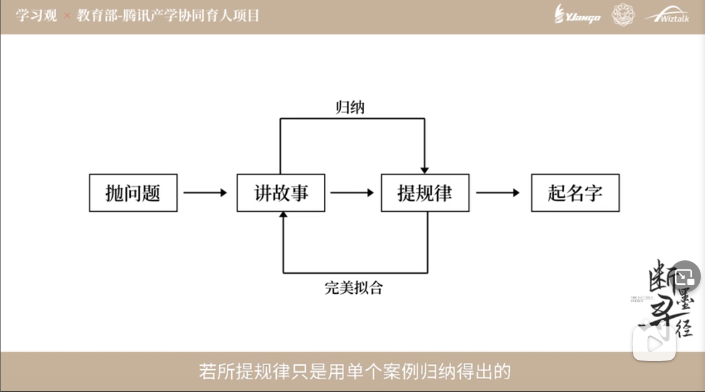
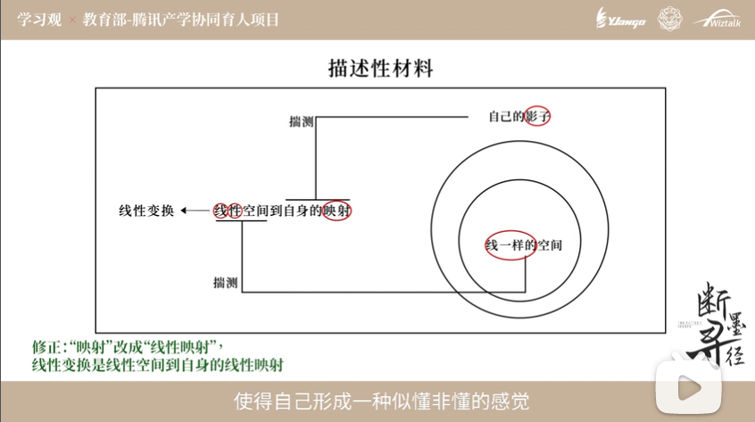
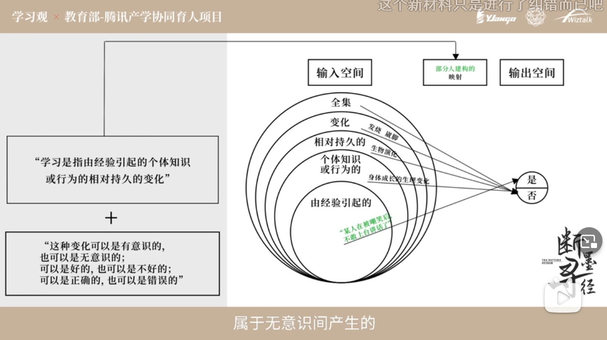
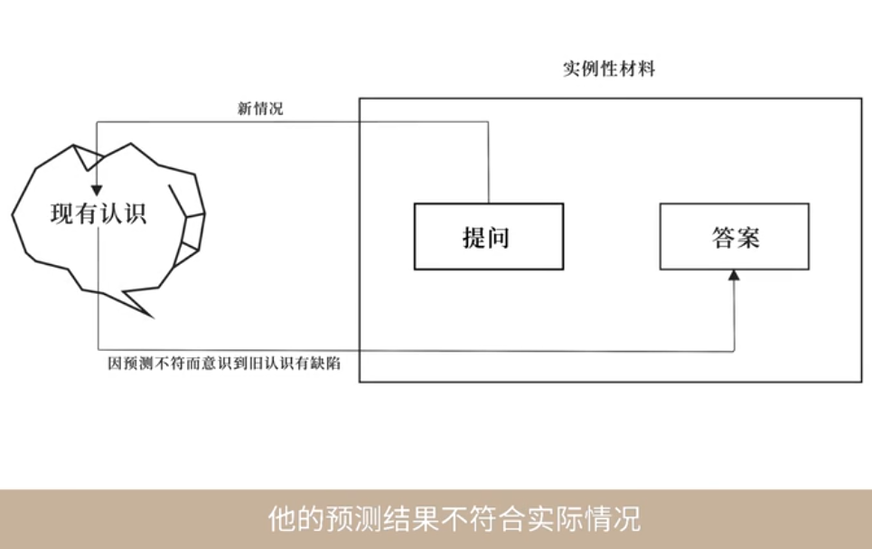
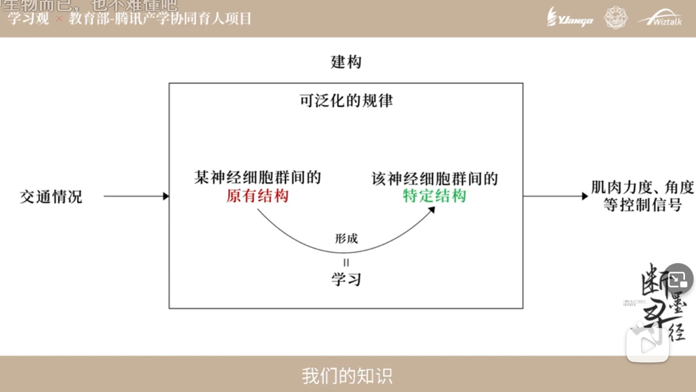
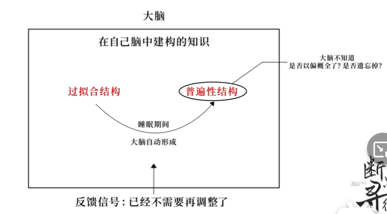
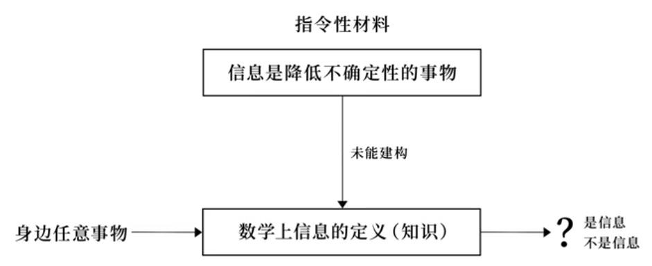
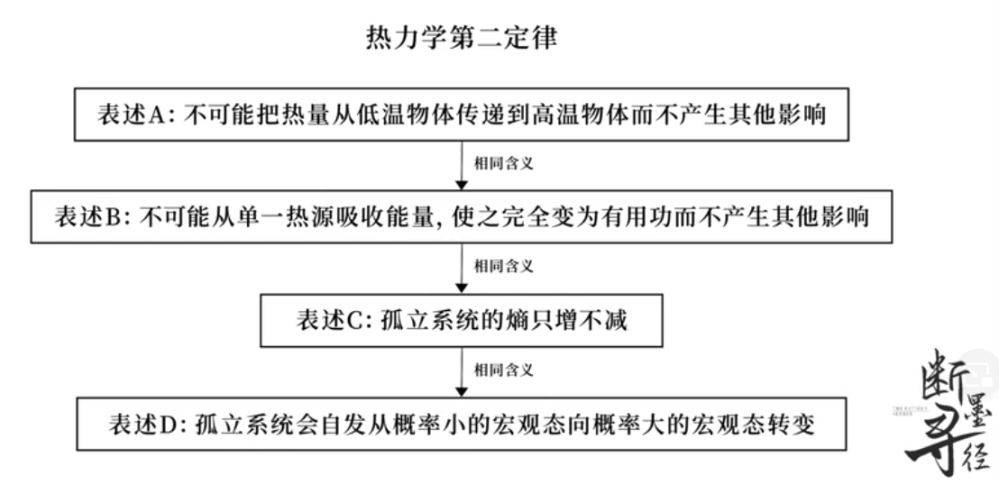

## Intro

问自己几个问题：
- 一个学习方法高效，为什么高效？
- 学会了方法，该什么时候使用，失效的时候，又该怎样调整？

系列目标：
- 学习是什么？
- 讲清楚学习行为的目标，让学生能根据目标设计符合自己的做题方式、学习方式、记笔记方式和听课方式等。

## 01 记忆学习与目标学习
**信息**
- 含义：描述一个情况
- e.g. 2 是偶数
- 需要「记忆」，目标是「重现」
    
**知识**
- 含义：描述同一类问题的所有情况，包括从未提及的新情况
- e.g. 所有能被 2 整除的数都是偶数
- 需要「学习」，目标是「生成」「泛化」

学习与记忆
- 判断一个行为是学习还是记忆，看该行为是否能解决新情况
- 并不是学习比记忆高级，而是二者有不同的目标
- 小时候的学习通常需要记忆，但这种方式在后来的学习中不那么适用。高考实际上是一个在有限时间内，比拼泛化能力的游戏
- **有意义学习**：学习材料 -> 泛化
- **机械记忆**： 学习材料 -> 背诵材料
- 在学习范畴中，**机械记忆**指把本应用于泛化的材料记忆下来，使学习材料失去了其用有的意义的行为
  
## 02 指令学习与归纳学习
- 不同的建构方式（掌握规律的方式）
    - 指令学习
    - 归纳学习
    
#### 指令学习
- 含义：通过概念、规律、共性的**语言**描述学习
- e.g. 看书，记笔记
- 是学校里最常见的，常见得令人觉得除了这种方式都不叫学习。
- 实际上，是人脑**最不擅长**的一种建构方式

#### 归纳学习
- 含义：通过观察多个实际案例，让大脑自动找到不同实例中的共性，用共性推测从未见过的情况怎么处理
- e.g. 如何学会使用遥控器，手机按键的作用
- 出现的时间非常古老，是人和动物共有的学习方式。归纳学习不需要依赖语语言。
- 归纳的过程是无意识的，自动的

##### 为什么人类非常擅长归纳学习，却还需要指令学习？
- 人不可能见过所有情况，容易以偏概全
- 指令学习更精准，全面，只是不容易理解
- 指令学习能够 get rig of 直接经验， 能够学习间接知识

##### 指令学习和归纳学习结合使用
- 「指令学习」大致确定规律
- 「归纳学习」帮助大脑理解和建构规律
- 对于较难的知识，以「归纳学习为主，指令学习为辅」
- 指令学习就像绘画时底稿，防止大脑自动归纳的规律偏离客观规律太远；归纳学习就像填充和上色，有底稿会更轻松
- e.g. 应试教育，做题，理解定义，再做题，再理解定义，反反复复。而不是背定义，背题。

##### 什么是「理解」？
- To understand is to perceive patterns. —— Isaiah Berlin
- 理解即是感知模式。——以赛亚·伯林
- 模式：可重复的共性

## 03 欠拟合和过拟合

#### 拟合
- 「从旧情况建构一个规律，使这个规律能(尽可能地)符合所有旧情况」的过程叫**拟合**
- 旧情况(已见过的情况)也叫**经验**
- 拟合不等于学习，拟合可确保重现，不能确保泛化
#### 欠拟合
- 拟合出来的规律连旧情况都无法满足
- 解决方法：足够多的训练
#### 过拟合
- 拟合出来的规律可以满足旧情况，但无法预测新情况，仅仅是以偏概全的局部规律，损失了通用性
- 解决方式：1. 搜集更多经验；2. 增加规律的通用性（奥卡姆剃刀：如无必要，勿增实体），如果拟合出多个规律，选择最简单的规律，是最通用的
#### 例子：
- 做题求快求多 -> 欠拟合
- 做题求每题都牢 -> 过拟合
- 合适的方法：做完题要总结
#### 双例比较法
- 1 选定知识
- 2 指令学习
- 3 做练习题
- 4 归纳比较：(key)做完两道题后，停下来比较两道题的中该知识点的共性和差异性，同时再去理解知识点的讲解
- 5 测试新题
- 重复 2-5
## 04 可泛化性和有效范围
- 问题：学了很多知识(道理)，却无法应用。（表现：说起来什么都懂，却光说不做）

**原因1：有些道理不是知识，知识必须具有可泛化性**
- 知识付费的“套路”：
    - 
    - 因为规律是根据所讲故事总结的，所以必然完美拟合故事，听起来很有道理
    
**原因2：知识的可泛化范围是有限的**
- 知识 $\neq$ 永恒真理，只能确保在特定条件下泛化
- e.g. 牛一的限定条件是「某物体所受外力为零」。（牛顿第一定律：任何物体都要保持匀速直线运动或静止状态，直到外力迫使它改变运动状态为止。）
- e.g. 经济学的基本假设：理性人假设和完全信息假设
- **知识有使用范围和限定条件**

## 05 有效实例和有效描述
- 问题：看不懂书/学习资料，是智商问题吗？
#### 完整实例和不完整实例
- 有因有果，有问有答，这叫完整实例
- 不完整的实例输入，比如，只做题不看答案，只听一段听不懂的听力，不去看意思
#### 描述性材料作为实例
- 要作为有效实例，就需要了解其中每个词的意思
- 如果描述性材料中的专有名词不理解，那这个材料就是无效的
- 
- 中文的特性容易使人直接揣测词语的意思，形成似懂非懂的状态
- **遇到专有名词，要追溯含义/遇到很多字母的公式，理解每个字母所指代的概念**

## 06 材料瓶颈与模型瓶颈
- 问题：明明都是有效材料，为什么学习却没有提升？
#### 由材料带来的瓶颈
- 瓶颈的出现源于泛化的特性。泛化是通过已见情况预测未见情况。当遇见的材料多了，就更容易遇见重复材料。
- 就像抽卡，持有多了，就更容易抽出重复的。
- 边际效用递减

##### 学习的实际案例
- 「广义上的学习」定义：学习是指由经验引起的个体知识或行为的相对持久的变化。——伍尔克福教育心理学（第12版）
- 学习这一知识点，不是背诵下来，而是利用这句话建构一个映射，来判断某个情况是否属于广义上的学习
- 
- 图：绿色属于无意识不好的变化，根据新材料，仍会归为广义上的学习
- 当一个材料不够时，就需要新的材料

#### 瓶颈的另一成因：固守旧认识
- 对新材料的抗拒带来的瓶颈
- 人的生存依赖于已有的认识，所以必然会保护自己已建构的认识
- 《地穴寓言》，囚徒面对新认知就是愤怒的，认为玷污了现有的“世界”
- 让人接受新认识的解决思路：
    - **用实例材料来让大脑意识到已有的认识是不足的，解除抗拒**
    - 相对来说，大脑对实例性材料没有描述性材料那么抵触。
    - **苏格拉底式提问**抛出新情况，让对方用现有认识预测，再展示他的预测不符合实际情况(辩论中常用)
    - 
## 1-6 总结
- 

## 07 存储位置和存储过程
- 问题：如何顺应大脑的特性学习
#### 知识存储
- 学习与神经细胞间形成的突触有关，但不是突触越多越好
- 大脑建构的规律是由神经细胞所形成的网络实现，网络通过电信号的频率告诉身体怎么做，电信号的频率受神经细胞之间的突触结构所控制，如果突触结构不合适，就无法生成正确的电信号、**总结：在细胞层面，学习相当于让特定的神经细胞形成适合所学任务的正确结构。**
- 
- 形成特定结构需要有效的训练
- 大脑大规模调整结构的时间段正是睡眠期间
- 对于复杂的知识，神经细胞也需要多次迭代来形成一个最合适的(普遍性)结构

## 08 有效训练和精细加工
- 问题：什么是(学习的)有效训练？如何刺激相关神经细胞群？
- 方法
    - 想象和观察：有效
    - 实际执行**并得到结果和反馈**：全面高效，最好的方式(反馈e.g. 对答案)
- 对实例性材料，实际执行并反馈是比较容易的
- 指令性材料: 精细加工
    - 对大脑结构的调整能力并没有实例性材料那么好
    - 尤其是大脑不理解时，遗忘速度非常快
    - **需要自己扩充实例材料**，比如自己提问自己回答，最好能用来解释周围的现象
    - 「知识不是建立在名字上的」——费曼
    - 「先把书读厚，再把书读薄」——华罗庚
        - 读厚：扩充材料
        - 读薄：建构完成 (误区：读薄可不是说划重点，读薄不是行为，而是一种状态)
    - (心理学) **精细加工 Elaboration**：举例，建立联系等做法
## 09 新例预测和表达转述
- 问题：经过了有效训练，保证了充足睡眠，学习过程就结束了吗？
- 学习的最后一步：**成果验证**
    - 
    - 验证的是自己的脑中建构的知识
    - 在细胞层面，「**验证**」相当于给大脑一个反馈信号，告诉大脑不需要再调整结构了
    - 
#### 验证的作用
- 给大脑反馈
- 确保建构知识是正确的
#### 如何验证
- 如果不能解决新问题，说明所建构的知识没有足够的泛化能力
- 1. **新例预测**：用实例性材料验证（比较容易）（下图是“身边任意事物”）
    - 
    - “做题保持手感”
- 2. **转换表述**：指令性材料的验证方法
    - 同义转换：用自己的话说
        - 
- 「以教促学」即是复习和巩固知识的方法
    - 教别人的时候，举个例子、换句话说，其实就是新例预测和转换表述
    - 这就是为什么教别人学得快
    - 以教促学能够
        - 确保成果正确
        - 给大脑发送信号，巩固知识存储
## 10 内容串讲和学习案例
- 断墨取自「断墨残楮」
- 在经验残缺不全，充满未知的条件下，寻找出通用的模式
- 学习即是对抗未知
- 